# C51学习笔记


# STm32学习笔记

## STm32基础知识

### STm32简介：

•STM32是ST公司基于ARM Cortex-M内核开发的32位微控制器
•STM32常应用在嵌入式领域，如智能车、无人机、机器人、无线通信、物联网、工业控制、娱乐电子产品等
•STM32功能强大、性能优异、片上资源丰富、功耗低，是一款经典的嵌入式微控制器


其中的CoreMark是内核跑分的意思

### ARM

•ARM既指ARM公司，也指ARM处理器内核
•ARM公司是全球领先的半导体知识产权（IP）提供商，全世界超过95%的智能手机和平板电脑都采用ARM架构
•ARM公司设计ARM内核，半导体厂商完善内核周边电路并生产芯片


ST公司设计的就是内核之外的存储器和外设


### STm32F103C8T6

•系列：主流系列STM32F1
•内核：ARM Cortex-M3
•主频：72MHz
•RAM：20K（SRAM）RAM为存储内存，实际存储介质为SRAM
•ROM：64K（Flash）ROM程序存储器，实际介质为Flash
•供电：2.0~3.6V（标准3.3V）

​	C51为5V供电，USB也是5V供电，所以在使用STm32的时候要加一个稳压芯片，然后将5V电压降至3.3V才能给STm32供电。

•封装：LQFP48 意思是一共有48个引脚 


### 片上资源/外设

英文名字为Peripheral 外设，STm32主要学习的就是外设，通过程序配置外设，来完成我们想要的功能。


加绿色的是位于Cortex-M3内核中的外设

NVIC：用于管理中断的设备，配置中断的优先级。
SysTick：STm32是可以加入操作系统的，比如FreeRTOS，UCos等，如果用了这些操作系统，就需要SysTick提供定时来进行任务切换的功能，也可以用于Delay()延时函数的实现。
RCC：对时钟进行控制，使能各模块时钟，在STm32中其它外设在上电情况下默认没有时钟的，不给时钟的情况下，操作时钟是无效的，外设也不会工作，这样的目的是降低功耗，所以在操作外设前要先使能时钟，用RCC完成时钟使能。
GPIO：
AFIO：完成复用功能端口的重定义和中断端口的配置。
EXIT：配置好外部中断后，当引脚电平发生变化时，就可以触发中断，让CPU来处理任务。
TIM：定时器分为高级定时器、通用定时器、基本定时器。常用的是通用定时器，这个定时器除了基本的定时工作外，还可以定时中断、测频率、输出PWM波、配置专用编码器接口。
ADC：STm32中内置了12位的AD转换。
DMA：充当CPU的助手，帮助CPU搬运文件。
USART：同步或异步串口，UART是异步串口。
IIC：
SPI：这两个都是通讯协议。
CAN：主要用于汽车领域。
USB：学习这个协议之后可以用于模拟鼠标，模拟U盘。
RTC：完成年月日时分秒计时功能，可以接外部备用电池，这样即使掉电的情况下也可以正常运行。
CRC：数据的一种校验方式，用于判断数据的正确性。
PWR：可以让芯片进入睡眠状态。
BKP：可由备用电池保持数据
IWDG：
WWDG： 这两个在STm32出现死循环的时候可以及时复位芯片。因为电磁干扰。死机或程序设计不合理导致死循环时，看门狗可以及时复位芯片。
STm32F103C8T6没有下面的四个外设
DAC：
SDIO：读取SD卡。
FSMC：扩展内存或配置成其它总线协议，用于某些硬件的操作。
USB OTG：用OTG功能，让USB作为主机去读取其它的USB设备。

### 命名规则


### 系统结构


​	从图上可以看出，从内核Cortex-M3引出了三条总线，分别是ICode指令总线、DCode数据总线，System系统总线。ICode和DCode总线主要是用来连接Flash闪存的，Flash就是用来存储程序的，ICode总线就是用来加载程序指令的，DCode总监是用来加载数据的，比如常量和调试数据这些。除了DCode和ICode内核还引出了System总线，用来连接余下的设备。
​	内核的下方就是DMA外设，DMA就是内核的小秘书，用来搬运数据减轻数据搬运对CPU资源的占用。比如说模数转换可以设置1ms转换一次，如果不能及时从寄存器中搬运出来的话新的数据就会覆盖。外设通过DMA请求线发送DMA请求，DMA通过DMA总线获得总线控制权，然后访问并转运数据，整个过程不用CPU参与，省下了CPU的时间来做其它事情。图上的DMA总线拥有和CPU一样的总线控制权用于访问外设，也可以说是外设都是小弟。
​	图上的SRAM用于存储程序运行时的变量数据。
​	图上右下角就是AHB总线和挂载的外设，AHB是先进高性能总线，用于挂载主要的设备，一般都是最基本或性能比较高的外设，比如复位和时钟控制这些最基本的电路，AHB总线通过桥接器连接到APB先进外设总线。因为AHB和APB的总线协议和总线速度，还有数据传送格式的差异，所以中间需要加两个桥接来完成数据的转换和缓存。通过桥接1连接到APB2总线，通过桥接2连接到APB1总线。性能的话AHB>APB，APB2>APB1。APB2一般和AHB同频都是72MHz，APB1为36MHz，APB2连接的都是重要外设，当然还有一些外设的一号选手，比如说USART1和SPI1这样的外设，而APB2连接的都是一些次要的外设。

### 引脚定义	

引脚示意图的小黑点的左边为1号引脚，然后逆时针排列。


注意：标为红色为电源相关引脚，蓝色为最小系统相关引脚，绿色为IO口、功能口引脚。
类型：
	S代表电源Source，I代表输入Input，O代表输出Output，I/O代表输入输出Input&Output。
IO口电平：引脚可以容忍的电压，标为FT的可以容忍5V电压，没有标注FT的只能容忍3.3V电压。
主功能：主功能是上电后默认的功能，一般和引脚名称相同，如果不同，引脚的实际功能是主功能而不是引脚名称的功能。
默认复用功能：IO口上同时连接的外设功能引脚，在配置IO口时，可以选择是通用IO口还是复用功能。
重定义功能：如果两个功能定义在了一个IO口上，但却要用到两个功能时，可以把其中一个复用功能重映射到其它端口上，但这样做的前提是重映射表里面有对应的端口。

1.备用电池引脚供电引脚，接3V电池给RTC、备份寄存器供电。
2.IO口、侵入检测、RTC。IO口可以根据程序输出或读取高低电平，是最基本也是最常用的功能了。侵入检测的主要作用是防拆，例如一些产品的外壳上有些防拆触点，通过高低电平检测来控制清空内部数据，保障数据安全，街上电路到这个引脚，如果有人拆开设备的话，触点就会断开，这个引脚的高低电平就会发生变化。RTC引脚可以用来输出RTC校准时钟、RTC闹钟脉冲或者秒脉冲。
3.4. 3号和4号引脚为IO口、接32.768MHz晶振
5.6. 5号和6号引脚接系统主晶振，一般为8MHz，芯片内部有锁相环电路，可以对8MHz进行倍频，最终产生72MHz频率作为芯片的主时钟。
7.NRST是系统复位引脚，N代表它是低电平复位。
8.9.是内部模拟部分的电源，比如ADC、RC振荡器。VSS是负极，接GND，VDD是正极，接3.3V。
10-19.为IO口，PA0，也就是10号引脚兼具WKUP功能，可以用于唤醒处于待机状态的STm32。加粗的IO口推荐优先使用，没有加粗的IO口可能要配置之后才能使用。
20.IO口或者BOOT引脚，BOOT引脚是用来配置启动模式的。
21-22.IO口。
23-24.系统的主电源口，同样的VSS为负极，VDD为正极。
25-33.这些都是IO口。
35-36.主电源口。
34、37-40.这些是IO口或者调试端口，默认功能是调试端口，用来调试和下载程序的。STm32支持SWD和JTAG两种调试方式，SWD要两根线：SWDIO-PA13，SWCLK-PA14，ST-Link用的是SWD方式。JTAG要五根线：JTMS、JTCK、JTDI、JTDO、NJTRST。使用SWD方式时PA15、PB3、PB4可以切换为普通IO口使用，但因为其默认功能是调试端口，所以需要在程序中进行配置。
44.BOOT0和BOOT1一样使用来做启动配置的。
47-48.主电源口。
STm32内部采用分区供电的方式，供电口会比较多，在使用时，把VSS都接GND，VDD都接3.3V即可

### 启动配置

​	启动配置的作用就是指定程序开始运行的位置，一般情况下，程序都是在Flash程序存储器开始执行，但是某些情况下也可以让程序在别的地方开始执行，用来完成特定功能。	表格中的X表示无论是高电平还是低电平，1代表的是3.3V高电平。内置SRAM启动模式是调试程序的时候使用的。BOOT引脚的值是在上电一瞬间有效的，后边便无所谓了，例如BOOT1引脚和PB2是同一个引脚，就是在上电一瞬间是BOOT1功能，过后即切换为PB2功能。
​	☆作串口下载用，系统存储器存的即为STm32中的一段BootLoader程序，BootLoader的作用就是接受串口的数据然后刷新到主存中，这样就可以使用串口下载程序了。

### 最小系统电路


​	晶振：20pF的是起振电容，如果要使用RTC功能，则还要接一个32.768kHz晶振在3、4号引脚上，OSC32就是32.768kHz的意思，因为32768是2的15次方，内部的RTC电路经过2的15次方分频，就可以生成1s的时间信号了。
​	复位：低电平复位，按下K1时，NRST接地产生了低电平信号，7号引脚上电时，C3没有充电相当于短路，此时NRST为低电平，上电后C3充满电相当于短路，NRST被电阻R1拉高。其效果就是上电一瞬间，单片机复位完成，一些小的设备用针戳一下就会复位就是这样的原理。
​	STm32及其供电：VBAT备用电池引脚是给RTC和备份寄存器服务的，用到的话就可以接一个纽扣电池，如果用不到的话就悬空或者接上3.3V电源即可。三个供电部分的C4、C5、C6、C7这几个是滤波电容，用于保持供电电压的稳定。从图上可以看到，STm32的供电是分为四个区域单独供电的，但是入门学习阶段可以直接将这四个供电电路接在一起即可。

### 型号分类及缩写


​	这个表主要使用来选择启动文件的，STm32F103C8T6使用的启动文件是.md。
​	STm32的开发方式主要有基于寄存器的方式，基于标准库也就是库函数，这个是ST公司封装好的函数，和基于HAL库的方式，基于寄存器的方式和51单片机的开发方式一样，用程序直接配置寄存器，来达到我们想要的功能，这种方式最底层最直接，效率会高一些。
​	LD-Low Densit、MD-Medium Density、HD-High Density、XL-Extra Density
CL-Connectivity Line(互联型产品)，其中VL后缀代表的是Value Line性价比系列。

### 新建工程步骤

•建立工程文件夹，Keil中新建工程，选择型号
•工程文件夹里建立Start、Library、User等文件夹，复制固件库里面的文件到工程文件夹
•工程里对应建立Start、Library、User等同名称的分组，然后将文件夹内的文件添加到工程分组里
•工程选项，C/C++，Include Paths内声明所有包含头文件的文件夹
•工程选项，C/C++，Define内定义USE_STDPERIPH_DRIVER
•工程选项，Debug，下拉列表选择对应调试器，Settings，Flash Download里勾选Reset and Run

整体的结构：总文件夹--TEST_1-project.μvproj
                                         --TEST_2-project.μvproj
	这里要注意的是.μvproj文件不好改名字，所以可以将存放.μvproj的文件夹的名字用来标识项目的目的，而.μvproj只用一个通用的名字即可。还有就是Keil的文件管理很抽象，新建的工程和你自己创建的文件夹是不会自动同步的，需要自己手动添加组，然后添加文件，最后还要在工程魔法棒里面添加工程的包含目录，不然会找不到头文件，就是相当于C/C++的include path。
	新建main.c文件时，一定要勾选USER文件夹，否则的话会在工程的最外边，默认的，改字体大小的话在扳手工具中点colors&fronts，不想在输入中文的时候有奇怪的？出现的话，就点encoding中的UTF-8即可。其他工程在Define内声明了USE_STDPERIPH_DRIVER还声明了STM32F10X_MD字符串，但Keil是已经自动声明了这个所以不用重复声明。

### 工程架构


STm32的程序就是从启动文件开始执行的
	固件库文件说明：
	htmress 两张图片
	Libraries库函数
	Project示例工程
	Utilities评估程序
	ST公司自己的开发板的程序
	Release_Notes.html 发布页面
	stm32f10x_stdperiph_lib_wm.chm使用手册
启动文件的位置：

```C
STM32F10x_StdPeriph_Lib_V3.5.0\Libraries\CMSIS\CM3\DeviceSupport\ST\STM32F10x\startup\arm
启动文件和前面型号分类是相对应的，对于STm32F103C8T6要选择的就是md.s文件
可以直接全部复制然后放在自己新建的START文件夹中即可
startup_stm32f10x_cl.s
startup_stm32f10x_hd.s
startup_stm32f10x_hd_vl.s
startup_stm32f10x_ld.s
startup_stm32f10x_ld_vl.s
startup_stm32f10x_md.s
startup_stm32f10x_md_vl.s
startup_stm32f10x_xl.s
```
在启动文件中有一个复位中断，在复位中断中就调用了SystemInit和main函数，这个中断就是整个程序的入口。
标准库文件的位置：
```C
STM32F10x_StdPeriph_Lib_V3.5.0\Libraries\CMSIS\CM3\DeviceSupport\ST\STM32F10x
// 一共有三个，把这三个文件放到自己建的START文件夹中
// 外设寄存器描述文件，和C51的REGX52.h一样
stm32f10x.h       
// 用于配置STm32的时钟，STm32主频72MHz就是在这个文件配置的
system_stm32f10x.c
system_stm32f10x.h
```
内核寄存器的描述文件的位置：
```C
STM32F10x_StdPeriph_Lib_V3.5.0\Libraries\CMSIS\CM3\CoreSupport
// 这两个就是内核寄存器描述文件的位置，因为还有一些内核的配置函数，所以有一个.c源文件
// 添加之后文件图标带了一个钥匙，意思就是这是一个只读文件
core_cm3.c
core_cm3.h
```
新建Library文件夹，然后将
```C
STM32F10x_StdPeriph_Lib_V3.5.0\Libraries\STM32F10x_StdPeriph_Driver\inc
STM32F10x_StdPeriph_Lib_V3.5.0\Libraries\STM32F10x_StdPeriph_Driver\src
```
这两个文件夹中的文件都放到Library文件夹中，然后在工程中添加组，然后添加文件，其中的misc.c是内核库函数，其余都是外设库函数。

最后要在示例工程文件夹中的Template中将
```C
STM32F10x_StdPeriph_Lib_V3.5.0\Project\STM32F10x_StdPeriph_Template
// 配置头文件的包含关系
stm32f10x_conf.h
// 用来存放中断函数的
stm32f10x_it.c
stm32f10x_it.h
```
将这三个文件放在USER目录中，再打开stm32f10x.h有一句宏定义，USE_STDPERIPH_DRIVER，C/C++，define中增加这个宏就可以只包含一个库就包含了所有库了。

GPIO简介

•GPIO（General Purpose Input Output）通用输入输出口
•可配置为8种输入输出模式
•引脚电平：0V~3.3V，部分引脚可容忍5V，此处需要注意的是容忍5V的意思是输入电压可以达到5v，但是输出仍然只有3.3V，STm32引脚的最大输出电压就是3.3V。
•输出模式下可控制端口输出高低电平，用以驱动LED、控制蜂鸣器、模拟通信协议输出时序等，例如SPI、IIC通讯协议。
•输入模式下可读取端口的高低电平或电压，用于读取按键输入、外接模块电平信号输入、ADC电压采集、模拟通信协议接收数据等

拓展知识：1.8V、3.3V、5V、12V等常用电压等级是如何确立的？
3.3V是因为当年演进到.35um工艺的时候栅极氧化层厚度减到了7nm左右，能承受的最大源漏电压大概是4V，减去10%安全裕度是3.6V，又因为板级电路的供电网络一般是保证±10%的裕量，所以标准定在了3.6V × 90% = 3.3V。
1.8V同理，.18um节点栅极氧化层厚度进一步降低到了4nm左右，ds耐压极限降低到了大约2.3V，同样的逻辑，先0.9变成2.7，再±10%，定在了1.8V。
早期晶体管电路单管压降0.7v，一个电路里经常多个晶体管串联。比如4管串联，电源至少保证0.7x4=2.8v才能保证电路正常工作。所以早期有3v，5v等标准。后来7805电源IC出来以后，5v成了事实标准。

## GPIO

### GPIO基本结构


在STm32中，所有的外设都是挂载在APB2总线上的
每个GPIO外设总共有16个引脚，编号是从0到15
驱动器是用来增加信号的驱动能力的，寄存器只负责存储数据，如果要进行点灯这样的操作的话，就需要驱动器来增加驱动能力。
寄存器就是一段特殊的存储器，内核可以通过APB2总线对寄存器进行读写，因为STm32是32位的，所以STm32的寄存器也是32位的，但GPIO只有16位，所以GPIO寄存器只有低16位有对应的端口，高16位没有对应的端口，是没有用到的。


### GPIO位结构和模式

	通过配置GPIO的端口配置寄存器，端口可以被配置为以下八种模式。

	从I/O引脚开始看起，输入时电平信号从I/O引脚流入会先经过两个保护二极管，上方二极管正极接VDD也就是3.3V，下方二极管负极接VSS也就是0V，当电压在0-3.3V时上下两个二极管都不导通，如果IO引脚电压大于VDD，则会使得上方二极管导通，电流从VDD流出。如果IO引脚电压小于VSS，则会使得下方二极管导通，电流从VSS流出，从而保护了内部电路不会烧坏。
	输入电流经过保护电路后，向上走会将过两个上拉电阻，上方电阻通过开关接到VDD，下方电阻通过开关接到VSS。如果上面开关导通下面断开，就是上拉输入模式，如果下面开关导通上面断开，就是下拉输入模式，如果两个开关都断开，就是浮空输入模式。在使用浮空输入时端口一定要接上一个连续的驱动源，不能出现引脚悬空的状态。
	这两个电阻的阻值都是比较大的，只是一种弱上拉和弱下拉，目的是尽量不影响正常的输入操作。
	图中的TTL肖特基触发器应该是施密特触发器，其逻辑为：如果输入电压大于某一阈值，输出就会瞬间升为高电平，如果输入电压小于某一阈值，输出就会瞬间降为低电平，用于防止信号失真和硬件消抖。信号经过上拉/下拉电路之后，如果是为了模拟信号采样就会通过触发器前的模拟输入信号线流向ADC上，之所以模拟输入在施密特触发器之前是因为在触发器之后就会变成数字信号了。因此在经过施密特触发器对输入电压进行整形之后就流向了复用功能输入。
	IO控制方法：直接操作寄存器、用来单独控制输出寄存器的某一位而不影响其它位，在消除写1即可将输出的某一位消零，位带，映射地址通过位寻址。
	GPIO输出时：
	一路输入是通过寄存器，另一路是来自其它的片上外设的复用功能输入，输出控制器会控制两个MOS管，用新号控制开关的导通和关闭，开关负责将IO口接到VDD或VSS。推挽输出也叫做强推输出，输出能力强，推完输出模式下P-MOS和N-MOS都有效。数据寄存器为1时上管导通，下管断开，输出接到VDD，输出高电平，为0时上管断开，下管导通输出接到VSS，输出低电平。这种模式下，高低电平均有较强的驱动能力，所以推挽输出模式也叫做强推输出模式。在推挽输出模式下，STm32对IO口有绝对的控制权，高低电平都由STm32说了算。
	如果一个输入什么都不接，那么它的输入就是不确定的，处于一种浮动状态，此时引脚的输入电平极易受外界干扰而变化，就像是一个物体悬浮在太空一样，它的位置是不确定的，受到一点扰动就会发生变化，为了避免引脚悬空导致的输入数据不确定，我们就需要在这里加上，上拉电阻或者下拉电阻来给引脚一个默认电平，就相当于太空中的物体，来到了地球之后，就会因为重力的作用而下坠。上拉和下拉是为了给输入一个默认的输入电平，因为对于一个数字的端口，输入不是高电平就是低电平。

施密特触发器
	施密特触发器是高于上限和低于下限才会有电平的高低变化，所以在输入和输出处有波动的话并不会触发施密特触发器来改变电平，知道下次低于下限时才会触发。
	输出部分：数字部分由输出数据寄存器或片上外设控制，两种控制方式通过数据选择器连接到了输出控制部分，如果选择通过输出数据寄存器进行控制就是普通的IO口输出，写输出数据寄存器的某一位就可以对应操作某个端口了。位设置/清除寄存器可以用来单独操作输出数据寄存器的某一位而不影响其它位，因为输出数据寄存器同时控制16个端口，并且这个寄存器只能整体读写，所以想控制其中一个端口而不影响其他端口的话，就需要一些特殊的操作方式。
	1.限度出这个寄存器，然后用按位与和按位或的方式改变某一位，最后再将更改后的数据写回去，在C语言中就是&=和|=操作。
	2.设置位设置/清除寄存器，对某一位置1的操作，在位设置寄存器的对应位写1即可，其余的位写0，这样它内部的电路就会自动将输出寄存器对应位置为1，而剩下的位则保持不变，如果相对某一位进行清0的操作，就在清除寄存器对应位写1即可，内部电路就会把这一位清0了。
	3.读写STm32中的位带区域，位带的作用和51单片机的位寻址作用差不多，在STm32中，专门分配了一段地址区域，这段地址映射了RAM和外设寄存器所有的位，读写这段地址中的数据，就相当于读写所映射位置中的某一位。
	4.库函数用的方式是读写位设置/清除寄存器的方式
	推挽输出：
	推挽输出也叫做强推输出，输出能力强，推完输出模式下P-MOS和N-MOS都有效。数据寄存器为1时上管导通，下管断开，输出接到VDD，输出高电平，为0时上管断开，下管导通输出接到VSS，输出低电平。这种模式下，高低电平均有较强的驱动能力，所以推挽输出模式也叫做强推输出模式。在推挽输出模式下，STm32对IO口有绝对的控制权，高低电平都由STm32说了算。
	开漏输出：再开漏模式下，P-MOS是无效的，只有N-MOS在工作，数据寄存器为1时下管断开，这时输出相当于断开，也就是高阻模式，数据寄存器为0时，下管导通，输出直接接到VSS，输出低电平，这种模式只有低电平有驱动能力，高电平是没有驱动能力的，因为P-MOS都没有导通根本就驱动不了负载，此时呈现的是高阻态。
	1.开漏模式可以用作通讯协议的驱动方式。比如IIC的通信引脚，就是使用的开漏模式
	2.在多机通讯的情况下，可以避免各个设备的相互干扰，另外开漏模式可以输出5V的电压信号
	3.在IO口接5V的上拉电阻可以输出5V的高电平，当输出低电平时内部N-MOS直接VSS，当输出高电平时，由外部上拉电阻拉高至5V
	关闭模式：
	当引脚配置为输入模式的时候，两个MOS管都无效，也就是输出关闭，端口的信号由外部信号来控制。

```C
// 库函数中GPIO的8种模式定义
GPIO_Mode_AIN            // Analog In 模拟输入
GPIO_Mode_In_Floating    // 浮空输入
GPIO_Mode_IPO            // In Pull Down 下拉输入
GPIO_Mode_IPU            // In Pull Up 上拉输入
GPIO_Mode_OUT_OD         // Out Open Drain 开漏输出
GPIO_Mode_OUT_PP         // Out Push Pull 推挽输出
GPIO_Mode_AF_OD          // Atl Open Drain 复用开漏输出
GPIO_Mode_AF_PP          // Atl Push Pull 复用推挽输出
// 把指定端口设置为高电平
void GPIO_SetBits(GPIO_TypeDef* GPIOx, uint16_t GPIO_Pin);
// 把指定端口设置为低电平
void GPIO_ResetBits(GPIO_TypeDef* GPIOx, uint16_t GPIO_Pin);
// 按位写/清除指定GPIO端口的位
// 前两个参数指定端口，根据第三个参数的值来设置端口
// GPIOPin的选择都可以按照按位或的形式选择多个端口 比如GPIOPin1 | GPIOPin2
void GPIO_WriteBit(GPIO_TypeDef* GPIOx, uint16_t GPIO_Pin, BitAction BitVal);
// 按位写/清除指定GPIO端口，这个是操作一整个16位的端口
// Write函数是写到了ODR寄存器，也就是Output Data Register输出数据寄存器
void GPIO_Write(GPIO_TypeDef* GPIOx, uint16_t PortVal);
// 读取输入数据寄存器的某一端口的输入值，返回端口的高低电平
uint8_t GPIO_ReadInputDataBit(GPIO_TypeDef* GPIOx, uint16_t GPIO_Pin);
// 读取整个输入数据寄存器，返回值的每一位代表一个端口的高低电平
uint16_t GPIO_ReadInputData(GPIO_TypeDef* GPIOx);
// 读取输出数据寄存器的某一位，因此原则上并不是用来读取端口的输入数据的，一般用于输出模式下，用来看自己的输出的是什么
uint8_t GPIO_ReadOutputDataBit(GPIO_TypeDef* GPIOx, uint16_t GPIO_Pin);
// 用于读取整个寄存器的值
uint16_t GPIO_ReadOutputData(GPIO_TypeDef* GPIOx);
```


1
### 浮空/上拉/下拉输入


### 模拟输入

除了在模拟输入模式中会关闭数字的输入功能，其它的七种模式都是开启的


### 开漏/推挽输出

在输出模式下，输入模式也是有效的，在输入模式下，输出模式是无效的，因为一个端口只能有一个输出，但可以有很多个输入，所以当配置成输出模式时，内部也可以顺便输入一下，这是没有什么影响的。


### 复用开漏/推挽输出

用输出数据寄存器可以保证多位数据的同步性，因为是一下子读写整个寄存器


## 硬件电路相关知识

### LED和蜂鸣器介绍

•LED：发光二极管，正向通电点亮，反向通电不亮

|                    图1                     |                             图2                              |
| :----------------------------------------: | :----------------------------------------------------------: |
|  |  |

三角形的顶点指向的方向是负极，对于实物二极管，如果没有修剪引脚的话，小的是正极，大的是负极，长脚正极，短脚负极。

•有源蜂鸣器：内部自带振荡源，将正负极接上直流电压即可持续发声，频率固定


低电平蜂鸣器响，高电平蜂鸣器不响。
•无源蜂鸣器：内部不带振荡源，需要控制器提供振荡脉冲才可发声，调整提供振荡脉冲的频率，可发出不同频率的声音

### 硬件电路


对于STm32来说，推挽输出在高低电平都有着很强的驱动能力，因此这两种接法都是可以的，但在单片机开发中，一般使用高电平若驱动，低电平强驱动的原则，因为这样可以一定程度上避免高低电平打架，如果高电平驱动能力弱就不能用第二种连接方式了。

功率大时，直接用IO口驱动会导致STm32负载过重，这是可以用一个三极管驱动电路来完成驱动的任务。PNP最好接在上边，NPN的三极管最好接在下边，因为三极管的通断是要在发射极和基极直接产生一定的开启电压，如果把负载接在发射极这边，可能会导致三极管不能开启。
三极管：带箭头的是发射极，中间的是基极，下边是集电极。箭头指向外的是NPN型，箭头指向内的是PNP型。PNP型三极管是低电平导通，高电平截止，NPN型三极管是高电平导通，低电平截止。
### 面包板


中间的五个孔都是导通的，上下横排全部导通。
### 按键介绍

•按键：常见的输入设备，按下导通，松手断开

•按键抖动：由于按键内部使用的是机械式弹簧片来进行通断的，所以在按下和松手的瞬间会伴随有一连串的抖动


### 传感器模块简介

•传感器模块：传感器元件（光敏电阻/热敏电阻/红外接收管等）的电阻会随外界模拟量的变化而变化，通过与定值电阻分压即可得到模拟电压输出，再通过电压比较器进行二值化即可得到数字电压输出


光线越强，光敏电阻的阻值越小。温度越高，热敏电阻的阻值越小。红外光线越强，红外接收管的阻值越小。
图上所示的LM393就是传感器的二值化芯片，它使用运算放大器来构建的电压比较器。
强上拉，强下拉，弱上拉，弱下拉，此处的强弱就是阻值大小，阻值越小上下拉的能力越强。N1是一个可变电阻，当N1→∞时，AO此时被上拉至VCC，当N1→0时，AO此时被下拉至0V。AO=N1/(N1+R1)，当N1>>R1时，即相当于VCC。R5是一个上拉电阻，用于保证默认输出为高电平。

### 硬件电路


下接按键，当按键按下时PA0被直接下拉到GND，此时读取PA0口的电压就是低电平，当按键松动时，PA0悬空引脚的电压不确定，则此时必须要求PA0为上拉输入的模式否则就会出现引脚电压不确定的情况。上下指的是接VCC还是GND。


PA0必须配置成下拉输入，一般的单片机不一定有下拉输入模式，所以一般还是配成第一种接法。


PA0可以配置为浮空输入或者上拉输入。可以将上拉和下拉想象成弹簧在拉而电阻越小弹簧的拉力越大，当开关没有按下时，K1相当于电阻其阻值是无穷大，此时电路被上拉至3.3V。当开关按下时，电阻无穷小被直接拉至GND。如果是上拉输入，这是高电平就会更强一些，对应高电平就会更加稳定，但这样的话引脚被强行拉低的时候，损耗也就会大一些。


PA0要配成下拉输入或者浮空输入模式。


## C语言相关知识补充
### C语言数据类型


在51单片机中int是占16位的，而在STm32中int是占32位的，如果要用16位的数据就要用short来表示，stdint里面的关键字都是用typedef重命名的。C语言stdint.h文件和ST变量重命之所以有这些重命名是为了解决51，STm32这些不同位长机器变量的不兼容问题。
这张图片需要注意的就是8位是一个字节。

### C语言宏定义

•关键字：#define
•用途：用一个字符串代替一个数字，便于理解，防止出错；提取程序中经常出现的参数，便于快速修改
•定义宏定义：
 \#define ABC 12345
•引用宏定义：
 int a = ABC; //等效于int a = 12345;
 ### C语言typedef
 关键字：typedef
用途：将一个比较长的变量类型名换个名字，便于使用
定义typedef：
	typedef unsigned char uint8_t;
引用typedef：
	 uint8_t a;	//等效于unsigned char a;

对于变量类型重命名而言，使用typedef更加安全，#define只是无脑改名，而typedef会对命名进行检查，如果不是变量类型名，程序就无法进行编译。
### C语言结构体
关键字：struct
用途：数据打包，不同类型变量的集合
定义结构体变量：
	struct{char x; int y; float z;} StructName;
	因为结构体变量类型较长，所以通常用typedef更改变量类型名
引用结构体成员：
	StructName.x = 'A';
	StructName.y = 66;
	StructName.z = 1.23;
或	pStructName->x = 'A';	//pStructName为结构体的地址	pStructName->y = 66;
	pStructName->z = 1.23;


数组是组合数据类型，但其只能够组合相同类型的，组合不同类型时就需要用到结构体了。为什么会有结构体指针对象这样的操作是因为，实际工作中的结构体一般都是占用存储空间很大的变量，通常用地址传递而不是值传递，可以节省存储空间。

### C语言枚举
关键字：enum
用途：定义一个取值受限制的整型变量，用于限制变量取值范围；宏定义的集合
定义枚举变量：
	enum{FALSE = 0, TRUE = 1} EnumName;
	因为枚举变量类型较长，所以通常用typedef更改变量类型名
引用枚举成员：
	EnumName = FALSE;
	EnumName = TRUE;
如果数是按照顺序累加的，那么后面的赋值就可以省略，宏定义的集合意思是可以使用枚举的值来赋值，可以使程序更加安全，防止了非法值破坏程序，这其实就是有限状态机，FSM。
## 调试方式
串口调试：通过串口通信，将调试信息发送到电脑端，电脑使用串口助手显示调试信息

显示屏调试：直接将显示屏连接到单片机，将调试信息打印在显示屏上

Keil调试模式：借助Keil软件的调试模式，可使用单步运行、设置断点、查看寄存器及变量等功能

在Debug选项中，左边的是电脑模拟STm32右边是使用ST-Link在线仿真
Reset复位
Run全速运行
Stop停止全速运行
Step单步运行
Step-over跳过当前行
Step-out跳出当前函数单步运行
Run-to-cursor-line调到光标指定行单步运行
Serials window串口输出窗口
Analysis windows逻辑分析仪
Peripherals查看外设寄存器

## OLED简介
OLED（Organic Light Emitting Diode）：有机发光二极管
OLED显示屏：性能优异的新型显示屏，具有功耗低、相应速度快、宽视角、轻薄柔韧等特点
0.96寸OLED模块：小巧玲珑、占用接口少、简单易用，是电子设计中非常常见的显示屏模块
供电：3~5.5V，通信协议：I2C/SPI，分辨率：128*64


OLED相当于每个像素都是一个LED，是可以自发光的，不需要LCD补光，因此比较省电。图中双色的OLED只是上面的1/4是黄色的，下面的3/4是蓝色的，而并不是所有的区域都是两种颜色。
### 硬件电路


IIC


SPI

### OLED驱动函数


STm32引脚上电之后，默认是浮空输入的模式，在这个模式下，引脚不会输出电平，所以不会有什么影响。虽然可以用GPIO口来对OLED来进行供电，但是这样做并不符合GPIO的使用规范，负载一定要使用电源来供电。

函数中的前两个参数，第一个是起始行，第二个是起始列。

## 中断系统
中断系统是管理和执行中断的逻辑结构，外部中断是众多能够产生中断的外设之一，对于外部中断来说可以是引脚发生了电平跳变，对于定时器来说，可以是定时的时间到了，对于串口通信来说，可以是接收到了数据。当这些时间发生时，情况比较紧急，比如外部中断来了不处理的话下一个跳变信号就跟着来了，串口接收中断来了，如果不读取接受的数据那么下一个数据过来就会把原来的数据覆盖掉。
中断就相当于定闹钟，如果没有定闹钟就需要不停地看时间，防止睡过头，如果没有中断程序，主程序就只能不断地查询是否有这些事情发生，就不能再干别的事情了。
中断：在主程序运行过程中，出现了特定的中断触发条件（中断源），使得CPU暂停当前正在运行的程序，转而去处理中断程序，处理完成后又返回原来被暂停的位置继续运行
中断优先级：当有多个中断源同时申请中断时，CPU会根据中断源的轻重缓急进行裁决，优先响应更加紧急的中断源。中断优先级是在程序设计的时候，用户自己设置的。
中断嵌套：当一个中断程序正在运行时，又有新的更高优先级的中断源申请中断，CPU再次暂停当前中断程序，转而去处理新的中断程序，处理完成后依次进行返回。


### 中断执行流程


为了程序能够在中断返回后继续原来的工作，在中断执行之前会对程序的现场进行保护，终端执行后会再还原现场。用C语言编程并不用做保护现场的工作，编译器自动帮我们做好了。程序被暂停的地方就叫做断点。

### STm32中断

68个可屏蔽中断通道，包含EXTI、TIM、ADC、USART、SPI、I2C、RTC等多个外设

使用NVIC统一管理中断，每个中断通道都拥有16个可编程的优先等级，可对优先级进行分组，进一步设置抢占优先级和响应优先级

F1系统最多有68个，中断通道就是中断源


灰色的是内核中的中断
Reset 复位中断
当复位事件产生时，程序会自动执行复位中断函数，也就是我们复位后程序开始执行的位置
NMI 不可屏蔽中断，硬件失效、存储管理、总线错误

外设电路检测到有什么异常或者事件，需要提示一下CPU时就可以申请中断，让程序跳到对应的中断函数中执行一次。
EXTI0-EXTI4
EXTI9_5
EXTI15_10

中断的地址是干什么的，因为程序中的中断函数，它的地址是由编译器分配的，是不固定的但中断跳转，由于硬件的限制智能跳到固定的地址执行程序，所以为了让硬件跳转到一个不固定的中断函数里就需要在内存中定义一个地址的列表，列表的地址是固定的，中断发生后就跳转到这个固定位置，然后在这个固定位置由编译器再加上一条跳转到中断函数的代码，这样中断跳转就可以跳到任意位置了，这个中断地址的列表就叫做中断向量表，它就相当于中断的一个跳板。但是C语言编程的话并不需要管这个中断向量表，所以了解即可。
### NVIC基本结构
NVIC-嵌套中断向量控制器，是一个内核外设，是CPU的小助手


### NVIC优先级分组
NVIC的中断优先级由优先级寄存器的4位（0~15）决定，这4位可以进行切分，分为高n位的抢占优先级和低4-n位的响应优先级
抢占优先级高的可以中断嵌套，响应优先级高的可以优先排队，抢占优先级和响应优先级均相同的按中断号排队

每个中断有16个优先级，为了将其分为抢占优先级和响应优先级，就要对其进行分组。相当于插队的优先级，叫响应优先级，即上一个病人看完，下一个即便是后来的也可提前看。情况特别紧急，不等上一个人看完直接冲进去看病，看完了再接着看刚才没看完的，这种优先级叫做抢占优先级，即中断嵌套，抢占优先级高的可以进行嵌套，值越小，优先级越高。即表中的优先级编号，数值小的优先级别越高。因此STm32的中断不存在先来后到的排队方式，在任何时间都是优先级高的优先响应。

分组方式就相当于叫号规则，分法只有5种，抢占多一些还是响应多一些可以由用户自己决定。
### EXIT简介
EXTI（Extern Interrupt）外部中断
EXTI可以监测指定GPIO口的电平信号，当其指定的GPIO口产生电平变化时，EXTI将立即向NVIC发出中断申请，经过NVIC裁决后即可中断CPU主程序，使CPU执行EXTI对应的中断程序
支持的触发方式：上升沿/下降沿/双边沿/软件触发
支持的GPIO口：所有GPIO口，但相同的Pin不能同时触发中断，就是GPIOA_Pin1和 GPIOB_Pin1，不能同时用，因为同一个引脚用的是同一个中断通道。
通道数：16个GPIO_Pin，外加PVD输出、RTC闹钟、USB唤醒、以太网唤醒。加起来一共是20个线路，16个GPIO是主功能，后面的都是来蹭网的，因为外部中断有个功能，就是从低功耗模式下的停止模式唤醒STm32.
触发响应方式：中断响应/事件响应

申请中断让CPU执行中断函数，事件响应是STm32对外部中断增加的一种额外的功能，当外部中断检测到引脚电平变化时，正常的流程是选择触发中断，在STm32中也可以选择触发一个中断，那中断信号就不会通往CPU了而是通向其它外设，用来触发其它外设的操作，比如ADC转换，DMA等外设间的联合工作。
PVD电源电压检测，当电源从电压过低恢复时，就需要PVD借助一下外部中断退出停止模式。对于RTC闹钟来说，有时候为了省电，RTC定一个闹钟之后，STm32会进入停止模式等到闹钟响的时候再唤醒。


上升沿：电平从低电平变到高电平的瞬间。
下降沿：电平从高电平变到低电平的瞬间。
双边沿：上升沿和下降沿。
软件触发：引脚啥事没有，程序里执行一句话就可以触发中断。
### EXIT基本结构


其中EXTI和NVIC不用开时钟，GPIO和AFIO用开时钟，配置STm32的中断就是把从GPIOx到NVIC所涉及的寄存器全部打通。配置流程如下：1.打开RCC时钟(其中EXTI和NVIC不用开时钟，GPIO、AFIO需要打开时钟)。2.配置GPIO为输出模式。3.配置AFIO选择我们用的这一路GPIO连接到后面的EXTI。4.配置EXTI选择边沿触发方式，比如上升沿、下降沿、双边沿，选择触发响应方式，可选择中断响应、事件响应。5.配置NVIC给中断选择一个合适的优先级，最后通过NVIC外部中断信号就可以进入CPU了，这样CPU才能收到中断信号，才能跳转到中断函数里执行中断函数。

3×16通道只能选16个，因此相同的pin不能用，因为只会在3个同pin引脚中选择一个接到后面的通道中去。

本来有20路输出的，但有复用，其中9-5会触发相同的中断函数，15-10也会触发相同的中断函数，在编程时，我们在这两个中断函数需要再根据标志位来区分到底是哪个中断进来的，因为不同的中断其中断标志位还是不一样的。其余的9个通过事件响应通往其他外设。
### AFIO复用IO口
AFIO主要用于引脚复用功能的选择和重定义，数据选择器的作用，图中像一个梯形的

在STM32中，AFIO主要完成两个任务：复用功能引脚重映射、中断引脚选择


```C
// ST公司并没有给AFIO外设单独库文件，是和GPIO放在一起的
// 用来复位AFIO，将AFIO外设的配置全部清除
void GPIO_AFIODeInit(void);
// 用来锁定GPIO配置的，调用这个函数，参数指定某个引脚，那么这个引脚的参数就会被锁定，防止被意外更改
void GPIO_PinLockConfig(GPIO_TypeDef* GPIOx, uint16_t GPIO_Pin);
// 这两个函数是用来配置AFIO事件输出功能的
void GPIO_EventOutputConfig(uint8_t GPIO_PortSource, uint8_t GPIO_PinSource);
void GPIO_EventOutputCmd(FunctionalState NewState);
// 引脚重映射，第一个参数是重映射的方式，第二个参数是新的状态
void GPIO_PinRemapConfig(uint32_t GPIO_Remap, FunctionalState NewState);
// 调用这个函数，可以配置AFIO的数据选择器，来选择我们想要的中断引脚
void GPIO_EXTILineConfig(uint8_t GPIO_PortSource, uint8_t GPIO_PinSource);
// 和以太网有关，STm32F103C8T6没有以太网相关的外设，用不到
void GPIO_ETH_MediaInterfaceConfig(uint32_t GPIO_ETH_MediaInterface);
```

### EXTI框图


触发信号器通过或门之后就兵分两路，上面一路是触发中断的，下面一路是触发中断事件的，触发中断首先置一个挂起寄存器，这相当于是一个中断标志位了，可以读取这个寄存器判断是哪个通道触发的中断，如果中断挂起寄存器置1，它就会继续向左走，和中断屏蔽寄存器共同进入一个与门然后是到NVIC中断控制器。

触发事件，脉冲发生器用于给一个电平脉冲，用来触发其它外设的动作。

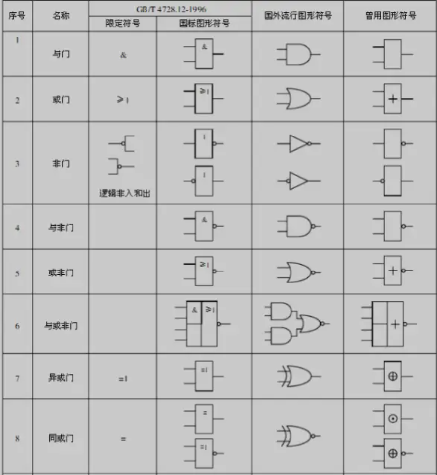
```C
// EXTI库函数
// 清除EXTI的配置，恢复成上电默认的状态
// 因为EXTI只有一个，所以不用指定是哪个EXTI
void EXTI_DeInit(void);
// 根据结构体参数的参数配置EXTI外设
void EXTI_Init(EXTI_InitTypeDef* EXTI_InitStruct);
// 可以把参数传递的结构体变量赋一个默认值
void EXTI_StructInit(EXTI_InitTypeDef* EXTI_InitStruct);
// 用于软件触发外部中断，调用这个函数，参数会给一个指定的中断线，就能软件触发这个外部中断
void EXTI_GenerateSWInterrupt(uint32_t EXTI_Line);
// 1 获取指定的标志位是否置1
FlagStatus EXTI_GetFlagStatus(uint32_t EXTI_Line);
// 2 对置1的标志位进行清除，有的标志位比较紧急，在置标志位后会触发中断
void EXTI_ClearFlag(uint32_t EXTI_Line);
// 3 在中断函数中如果想查看和清除标志位就可以用下面的函数
// 获取中断标志位是否置1
ITStatus EXTI_GetITStatus(uint32_t EXTI_Line);
// 4 清除中断挂起状态位
void EXTI_ClearITPendingBit(uint32_t EXTI_Line);
```

总结：如果想在主程序中查看和清除标志位，就用1、2，如果想在中断函数中查看和清除标志位，用3、4，本质上这4个函数都是对状态寄存器进行读写的，只是3/4函数只能读写与中断有关的标志位，并且对中断是否允许做出了判断。而1、2只是一般的读写标志，没有额外的处理，能不能触发中断的标志位都能读取，所以建议在主程序中用上面两个，中断程序用下面两个，但如果非要在中断中用下面两个也是没有问题的，只不过是库函数针对这两种场景区分了这两类读写函数。
```C
// EXTI的结构体参数
// 相当于选择GPIO的线路
EXTI.line 
// 赋值是Enable、Disable，是否开启
EXTI.lineCmd
// 选择中断模式
// EXTI_Mode_Interrupt 中断模式
// EXTI_Mode_Event 事件模式
EXTI.Mode
// 具体的参数是：
// EXTI_Trigger_Rising 上升沿触发
// EXTI_Trigger_Falling 下降沿触发
// EXTI_Trigger_Rising_Falling 双边沿触发
EXTI.Trigger
```
NVIC在misc.h文件中 
pre-emption 抢占 subpriority 响应优先级
```C
// 用来中断分组的，参数是中断分组的方式
void NVIC_PriorityGroupConfig(uint32_t NVIC_PriorityGroup);
// 根据结构体参数初始化NVIC
void NVIC_Init(NVIC_InitTypeDef* NVIC_InitStruct);
// 设置中断向量表
void NVIC_SetVectorTable(uint32_t NVIC_VectTab, uint32_t Offset);
// 系统低功耗配置
void NVIC_SystemLPConfig(uint8_t LowPowerMode, FunctionalState NewState);
void SysTick_CLKSourceConfig(uint32_t SysTick_CLKSource);


```
在配置中断之前，现制定一个中断的分组，然后使用NVIC_Init初始化一下NVIC就可以了。
```C
typedef struct
{
  // 指定中断通道，名称可以认为是用处
  uint8_t NVIC_IRQChannel;    
  // 指定中断通道是使能还是失能
  uint8_t NVIC_IRQChannel;  
  // 优先级是在多个中断源同时申请，产生拥挤时才有作用，只有一个中断时就随便了
  // 抢占优先级
  uint8_t NVIC_IRQChannelPreemptionPriority;  
  // 响应优先级
  uint8_t NVIC_IRQChannelSubPriority;         
  FunctionalState NVIC_IRQChannelCmd;         
} NVIC_InitTypeDef;
```
中断不多，很难导致中断冲突，对优先级分组来说，就随意了，分组方式整个芯片中只能用一种，因此按理说整个工程只用执行一次，因此如果在模式中进行分组要确保每个模块的分组都是同一个，相互之间不能产生冲突。

中断函数
在STm32中，中断函数的名字都是固定的，每个终端通道都有相对应的中断函数，具体名称可以在启动文件中找到：
```C
// 中断函数的书写格式如下
void NAME(void)
{
	statement;
}
```
中断函数都是无参无返回值的，函数名字不要写错了，如果写错的话就无法进入正确的中断函数中了，最好直接从启动文件复制过来，这样就绝对不会出问题了。在中断函数中，一般都是先进性一个中断标志位判断，确保是我们想要的中断源触发的这个函数，因为只要中断标志位置1了，程序就会跳转到中断函数中，不清除中断标志位，那它就会一直申请中断，程序就会不断响应中断、执行中断函数，那程序就会卡死在中断函数里面了。中断函数不用声明也不需要调用，它是自动执行的。

用的光电对射开关，如果下降沿触发是遮挡物离开时加1，如果是上升沿触发则是进入时加1，双边沿触发的话进入和出去都会触发中断。
```C
void WWDG_IRQHandler(void) {} // 窗口看门狗中断
void PVD_IRQHandler(void) {} // 电源电压检测中断
void TAMPER_IRQHandler(void) {} // 备份寄存器（篡改检测）中断
void RTC_IRQHandler(void) {} // 实时时钟中断
void FLASH_IRQHandler(void) {} // Flash 操作完成中断
void RCC_IRQHandler(void) {} // 时钟控制器 RCC 中断
void EXTI0_IRQHandler(void) {} // 外部中断线0
void EXTI1_IRQHandler(void) {} // 外部中断线1
void EXTI2_IRQHandler(void) {} // 外部中断线2
void EXTI3_IRQHandler(void) {} // 外部中断线3
void EXTI4_IRQHandler(void) {} // 外部中断线4
void DMA1_Channel1_IRQHandler(void) {} // DMA1 通道1 中断
void DMA1_Channel2_IRQHandler(void) {} // DMA1 通道2 中断
void DMA1_Channel3_IRQHandler(void) {} // DMA1 通道3 中断
void DMA1_Channel4_IRQHandler(void) {} // DMA1 通道4 中断
void DMA1_Channel5_IRQHandler(void) {} // DMA1 通道5 中断
void DMA1_Channel6_IRQHandler(void) {} // DMA1 通道6 中断
void DMA1_Channel7_IRQHandler(void) {} // DMA1 通道7 中断
void ADC1_2_IRQHandler(void) {} // ADC1 和 ADC2 的转换完成中断
void USB_HP_CAN1_TX_IRQHandler(void) {} // USB 高优先级或 CAN1 TX 中断
void USB_LP_CAN1_RX0_IRQHandler(void) {} // USB 低优先级或 CAN1 RX0 中断
void CAN1_RX1_IRQHandler(void) {} // CAN1 接收 FIFO1 中断
void CAN1_SCE_IRQHandler(void) {} // CAN1 状态变化错误中断
void EXTI9_5_IRQHandler(void) {} // 外部中断线[9:5]
void TIM1_BRK_IRQHandler(void) {} // TIM1 中断：刹车事件
void TIM1_UP_IRQHandler(void) {} // TIM1 中断：更新事件
void TIM1_TRG_COM_IRQHandler(void) {} // TIM1 中断：触发和通信事件
void TIM1_CC_IRQHandler(void) {} // TIM1 中断：捕获比较事件
void TIM2_IRQHandler(void) {} // 定时器2 更新中断
void TIM3_IRQHandler(void) {} // 定时器3 更新中断
void TIM4_IRQHandler(void) {} // 定时器4 更新中断
void I2C1_EV_IRQHandler(void) {} // I2C1 事件中断（传输、接收等）
void I2C1_ER_IRQHandler(void) {} // I2C1 错误中断
void I2C2_EV_IRQHandler(void) {} // I2C2 事件中断
void I2C2_ER_IRQHandler(void) {} // I2C2 错误中断
void SPI1_IRQHandler(void) {} // SPI1 中断
void SPI2_IRQHandler(void) {} // SPI2 中断
void USART1_IRQHandler(void) {} // USART1 中断
void USART2_IRQHandler(void) {} // USART2 中断
void USART3_IRQHandler(void) {} // USART3 中断
void EXTI15_10_IRQHandler(void) {} // 外部中断线[15:10]
void RTCAlarm_IRQHandler(void) {} // RTC 闹钟中断
void USBWakeUp_IRQHandler(void) {} // USB 唤醒中断
```
中断函数的使用建议：
1.中断函数中不要执行耗时过长的代码，要简短迅速，不要刚一进入中断就延时多少毫秒。
2.最好不要在中断函数中和主函数调用同一个函数或者操作同一个硬件，如果在主函数中调用OLED显示驱动函数，又在中断中调用OLED显示驱动函数，就会出现显示错误，比如说显示一半或者说显示乱码等情况。虽然中断有保护和恢复现场的功能，但这只能保证CPU程序正常返回不出问题，对外部硬件并没有在进入中断的时候进行现场保护。
### 旋转编码器简介

•旋转编码器：用来测量位置、速度或旋转方向的装置，当其旋转轴旋转时，其输出端可以输出与旋转速度和方向对应的方波信号，读取方波信号的频率和相位信息即可得知旋转轴的速度和方向
•类型：机械触点式/霍尔传感器式/光栅式

对于STm32来说，想要获取的信号如果是外部驱动的变化很快的突发信号，比如说编码器、遥控器这些可能很久都不会使用，但是使用的时候又需要迅速响应。要处理这样的信号可以有两种实现方式：1.主程序循环读取引脚的高低电平2.定时器中断读取引脚的高低电平。很显然最好是使用中断的方式，但是按键不要用外部中断来实现，因为不好处理按键抖动和松手检测。

方波的个数代表转过的角度，方波的频率代表转速，因为只有一路输出，因此正转和反转没有办法区分。还有的是一个输出方波信号，一个输出高低电平代表方向。


机械触点式编码器，因为是机械触电，所以不适用于转速过高的场景。霍尔传感器的非接触形式的编码器可以用来测电机转速。  相位相差九十度的波形就是正交波形，输出正交波形编码器可以测方向。


### 硬件电路


当触电断开时，P点上拉为VCC，输出到A为VCC导通时的P点，下拉至GND因此A点输出位GND。

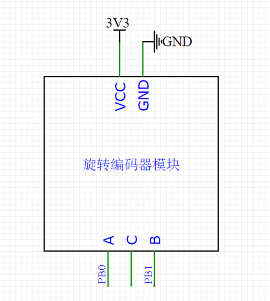

对于旋转编码器，在中断函数中初始化PB0和PB1，两个GPIO的外部中断，当然只初始化一个外部中断也是可以的，完成功能的，因为对编码器而言，在上升沿和下降沿时刻可以检测随便一个引脚的高低电平。如果A相引脚触发中断，这样存在的小问题是，正转的情况A相刚开始转就会进入中断，反转A相迟滞，那么编码器已经转到位了，A相才进入中断。因此设计为双中断，只有在B相下降沿和A相低电平的的时候才判断为正转，只有在 A相下降沿和B相低电平时才判断为反转，这样就能保证正转和反转都是转到位了才执行计数变量加减的操作。

## TIM 定时器
### TIM定时器简介

•TIM（Timer）定时器。这是最基本的功能，定一个时间，然后定时器每隔这个时间产生一个中断，来实现每隔一个固定时间执行一段程序的目的。
•定时器可以对输入的时钟进行计数，并在计数值达到设定值时触发中断。当这个计数器的输入是一个准确可靠的基准时钟时，那么在对这个基准时钟计数的时候，实际上就是计时的过程。
•16位计数器、预分频器、自动重装寄存器的时基单元，在72MHz计数时钟下可以实现最大59.65s的定时。STm32的时钟频率是72MHz，如果计72个数，那么时间就是72/72M=1us，如果计72000个数就是72000/72M=1ms，也就是1kHz。
•不仅具备基本的定时中断功能，而且还包含内外时钟源选择、输入捕获、输出比较、编码器接口、主从触发模式等多种功能
•根据复杂度和应用场景分为了高级定时器、通用定时器、基本定时器三种类型


定时器的本质就是一个计数器。
定时器输出比较，常用于产生PWM波形，驱动电机等设备。定时器输入捕获功能，实现测量方波频率。定时器编码器接口，能更加方便地读取正交编码器的输出波形。

计数器：用来执行计数定时的一个寄存器，每来一个时钟，计数器加1。
预分频器：可以对计数器的时钟进行分频，让这个计数更加灵活。
自动重装寄存器：计数的目标值，就是我想计多少个时钟脉冲申请中断。

这三个构成了定时器最核心的部分，我们把这一块电路成为时基单元，时基单元中的寄存器都是16位的，2的16次方是65536，如果预分频器和自动重装寄存器都设置为最大，那定时器最大定时时间就是59.65s，计算方法是72M/65536/65536=1/59.65，得到定时中断的频率，然后取倒数就是最大的定时时间。如果觉得这个定时时间不够长的话，STm32的定时器还支持级联模式，也就是一个定时器的输出当做另一个定时器的输入，这样对打定时时间是59.65s×65536×65536 大概是八千多年，再级联一个的话，大概是34万亿年。
### 定时器类型


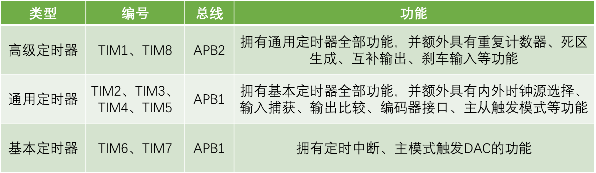

主从触发模式，它能让内部的硬件在不受程序的控制下实现自动运行，把这个掌握好就可以在某些情况下极大地减轻CPU负担。


没有基本定时器。不同的型号定时器的数量是不同的，在操作这个外设之前，一定要查看一下它是不是有这个外设操作到了不存在的外设，那样是不会运行的。资源一共是1个高级定时器，3个通用定时器。

初始化定时器的步骤
1.RCC开启时钟
打开时钟后，定时器的基准时钟和整个外设的工作时钟就都同时打开了。
2.选择时基单元的时钟源
对定时中断，我们选择的是内部时钟源。
3.配置时基单元
包括预分频器、自动重装器、计数模式等，这些参数用一个结构体就可以配置好。
4.配置输出中断控制
允许更新中断输出到NVIC。
5.配置NVIC
在NVIC中打开定时器中断的通道并分配一个优先级。
6.运行控制
整个模块配置完成后，我们还要使能一下计数器，要不然计数器是不会运行的，当定时器使能后，计数器就会开始计数了，当计数器更新时，触发中断。最后再写一个定时器中断函数，这样这个中断函数每隔一段时间就可以重新执行一次了。

TIM库函数
```C
// 恢复缺省配置
void TIM_DeInit(TIM_TypeDef* TIMx);
// 配置时基单元，TIMx选择定时器，结构体包含时基单元参数
void TIM_TimeBaseInit(TIM_TypeDef* TIMx, TIM_TimeBaseInitTypeDef* TIM_TimeBaseInitStruct);
void TIM_OC1Init(TIM_TypeDef* TIMx, TIM_OCInitTypeDef* TIM_OCInitStruct);
void TIM_OC2Init(TIM_TypeDef* TIMx, TIM_OCInitTypeDef* TIM_OCInitStruct);
void TIM_OC3Init(TIM_TypeDef* TIMx, TIM_OCInitTypeDef* TIM_OCInitStruct);
void TIM_OC4Init(TIM_TypeDef* TIMx, TIM_OCInitTypeDef* TIM_OCInitStruct);
void TIM_ICInit(TIM_TypeDef* TIMx, TIM_ICInitTypeDef* TIM_ICInitStruct);
void TIM_PWMIConfig(TIM_TypeDef* TIMx, TIM_ICInitTypeDef* TIM_ICInitStruct);
void TIM_BDTRConfig(TIM_TypeDef* TIMx, TIM_BDTRInitTypeDef *TIM_BDTRInitStruct);
// 结构体初始化函数
void TIM_TimeBaseStructInit(TIM_TimeBaseInitTypeDef* TIM_TimeBaseInitStruct);
void TIM_OCStructInit(TIM_OCInitTypeDef* TIM_OCInitStruct);
void TIM_ICStructInit(TIM_ICInitTypeDef* TIM_ICInitStruct);
void TIM_BDTRStructInit(TIM_BDTRInitTypeDef* TIM_BDTRInitStruct);
// 对应的是运行控制，TIMx选择定时器，NewState选择使能还是失能
void TIM_Cmd(TIM_TypeDef* TIMx, FunctionalState NewState);
void TIM_CtrlPWMOutputs(TIM_TypeDef* TIMx, FunctionalState NewState);
// 使能中断输出信号，TIMx选择定时器，TIM_IT选择要配置哪个中断输出，NewState选择使能还是失能
void TIM_ITConfig(TIM_TypeDef* TIMx, uint16_t TIM_IT, FunctionalState NewState);
void TIM_GenerateEvent(TIM_TypeDef* TIMx, uint16_t TIM_EventSource);
void TIM_DMAConfig(TIM_TypeDef* TIMx, uint16_t TIM_DMABase, uint16_t TIM_DMABurstLength);
void TIM_DMACmd(TIM_TypeDef* TIMx, uint16_t TIM_DMASource, FunctionalState NewState);
// 选择内部时钟
void TIM_InternalClockConfig(TIM_TypeDef* TIMx);
// 选择ITRx其它定时器的时钟，TIMx选择定时器，TIM_InputTriggerSource选择要接入哪个其它的定时器
void TIM_ITRxExternalClockConfig(TIM_TypeDef* TIMx, uint16_t TIM_InputTriggerSource);
// 选择TIx捕获通道的时钟
void TIM_TIxExternalClockConfig(TIM_TypeDef* TIMx, uint16_t TIM_TIxExternalCLKSource,uint16_t TIM_ICPolarity, uint16_t ICFilter);
void TIM_ETRClockMode1Config(TIM_TypeDef* TIMx, uint16_t TIM_ExtTRGPrescaler, uint16_t TIM_ExtTRGPolarity,uint16_t ExtTRGFilter);
void TIM_ETRClockMode2Config(TIM_TypeDef* TIMx, uint16_t TIM_ExtTRGPrescaler, uint16_t TIM_ExtTRGPolarity, uint16_t ExtTRGFilter);
void TIM_ETRConfig(TIM_TypeDef* TIMx, uint16_t TIM_ExtTRGPrescaler, uint16_t TIM_ExtTRGPolarity,
                   uint16_t ExtTRGFilter);
void TIM_PrescalerConfig(TIM_TypeDef* TIMx, uint16_t Prescaler, uint16_t TIM_PSCReloadMode);
void TIM_CounterModeConfig(TIM_TypeDef* TIMx, uint16_t TIM_CounterMode);
void TIM_SelectInputTrigger(TIM_TypeDef* TIMx, uint16_t TIM_InputTriggerSource);
void TIM_EncoderInterfaceConfig(TIM_TypeDef* TIMx, uint16_t TIM_EncoderMode,
                                uint16_t TIM_IC1Polarity, uint16_t TIM_IC2Polarity);
void TIM_ForcedOC1Config(TIM_TypeDef* TIMx, uint16_t TIM_ForcedAction);
void TIM_ForcedOC2Config(TIM_TypeDef* TIMx, uint16_t TIM_ForcedAction);
void TIM_ForcedOC3Config(TIM_TypeDef* TIMx, uint16_t TIM_ForcedAction);
void TIM_ForcedOC4Config(TIM_TypeDef* TIMx, uint16_t TIM_ForcedAction);
void TIM_ARRPreloadConfig(TIM_TypeDef* TIMx, FunctionalState NewState);
void TIM_SelectCOM(TIM_TypeDef* TIMx, FunctionalState NewState);
void TIM_SelectCCDMA(TIM_TypeDef* TIMx, FunctionalState NewState);
void TIM_CCPreloadControl(TIM_TypeDef* TIMx, FunctionalState NewState);
void TIM_OC1PreloadConfig(TIM_TypeDef* TIMx, uint16_t TIM_OCPreload);
void TIM_OC2PreloadConfig(TIM_TypeDef* TIMx, uint16_t TIM_OCPreload);
void TIM_OC3PreloadConfig(TIM_TypeDef* TIMx, uint16_t TIM_OCPreload);
void TIM_OC4PreloadConfig(TIM_TypeDef* TIMx, uint16_t TIM_OCPreload);
void TIM_OC1FastConfig(TIM_TypeDef* TIMx, uint16_t TIM_OCFast);
void TIM_OC2FastConfig(TIM_TypeDef* TIMx, uint16_t TIM_OCFast);
void TIM_OC3FastConfig(TIM_TypeDef* TIMx, uint16_t TIM_OCFast);
void TIM_OC4FastConfig(TIM_TypeDef* TIMx, uint16_t TIM_OCFast);
void TIM_ClearOC1Ref(TIM_TypeDef* TIMx, uint16_t TIM_OCClear);
void TIM_ClearOC2Ref(TIM_TypeDef* TIMx, uint16_t TIM_OCClear);
void TIM_ClearOC3Ref(TIM_TypeDef* TIMx, uint16_t TIM_OCClear);
void TIM_ClearOC4Ref(TIM_TypeDef* TIMx, uint16_t TIM_OCClear);
void TIM_OC1PolarityConfig(TIM_TypeDef* TIMx, uint16_t TIM_OCPolarity);
void TIM_OC1NPolarityConfig(TIM_TypeDef* TIMx, uint16_t TIM_OCNPolarity);
void TIM_OC2PolarityConfig(TIM_TypeDef* TIMx, uint16_t TIM_OCPolarity);
void TIM_OC2NPolarityConfig(TIM_TypeDef* TIMx, uint16_t TIM_OCNPolarity);
void TIM_OC3PolarityConfig(TIM_TypeDef* TIMx, uint16_t TIM_OCPolarity);
void TIM_OC3NPolarityConfig(TIM_TypeDef* TIMx, uint16_t TIM_OCNPolarity);
void TIM_OC4PolarityConfig(TIM_TypeDef* TIMx, uint16_t TIM_OCPolarity);
void TIM_CCxCmd(TIM_TypeDef* TIMx, uint16_t TIM_Channel, uint16_t TIM_CCx);
void TIM_CCxNCmd(TIM_TypeDef* TIMx, uint16_t TIM_Channel, uint16_t TIM_CCxN);
void TIM_SelectOCxM(TIM_TypeDef* TIMx, uint16_t TIM_Channel, uint16_t TIM_OCMode);
void TIM_UpdateDisableConfig(TIM_TypeDef* TIMx, FunctionalState NewState);
void TIM_UpdateRequestConfig(TIM_TypeDef* TIMx, uint16_t TIM_UpdateSource);
void TIM_SelectHallSensor(TIM_TypeDef* TIMx, FunctionalState NewState);
void TIM_SelectOnePulseMode(TIM_TypeDef* TIMx, uint16_t TIM_OPMode);
void TIM_SelectOutputTrigger(TIM_TypeDef* TIMx, uint16_t TIM_TRGOSource);
void TIM_SelectSlaveMode(TIM_TypeDef* TIMx, uint16_t TIM_SlaveMode);
void TIM_SelectMasterSlaveMode(TIM_TypeDef* TIMx, uint16_t TIM_MasterSlaveMode);
void TIM_SetCounter(TIM_TypeDef* TIMx, uint16_t Counter);
void TIM_SetAutoreload(TIM_TypeDef* TIMx, uint16_t Autoreload);
void TIM_SetCompare1(TIM_TypeDef* TIMx, uint16_t Compare1);
void TIM_SetCompare2(TIM_TypeDef* TIMx, uint16_t Compare2);
void TIM_SetCompare3(TIM_TypeDef* TIMx, uint16_t Compare3);
void TIM_SetCompare4(TIM_TypeDef* TIMx, uint16_t Compare4);
void TIM_SetIC1Prescaler(TIM_TypeDef* TIMx, uint16_t TIM_ICPSC);
void TIM_SetIC2Prescaler(TIM_TypeDef* TIMx, uint16_t TIM_ICPSC);
void TIM_SetIC3Prescaler(TIM_TypeDef* TIMx, uint16_t TIM_ICPSC);
void TIM_SetIC4Prescaler(TIM_TypeDef* TIMx, uint16_t TIM_ICPSC);
void TIM_SetClockDivision(TIM_TypeDef* TIMx, uint16_t TIM_CKD);
uint16_t TIM_GetCapture1(TIM_TypeDef* TIMx);
uint16_t TIM_GetCapture2(TIM_TypeDef* TIMx);
uint16_t TIM_GetCapture3(TIM_TypeDef* TIMx);
uint16_t TIM_GetCapture4(TIM_TypeDef* TIMx);
uint16_t TIM_GetCounter(TIM_TypeDef* TIMx);
uint16_t TIM_GetPrescaler(TIM_TypeDef* TIMx);
FlagStatus TIM_GetFlagStatus(TIM_TypeDef* TIMx, uint16_t TIM_FLAG);
void TIM_ClearFlag(TIM_TypeDef* TIMx, uint16_t TIM_FLAG);
ITStatus TIM_GetITStatus(TIM_TypeDef* TIMx, uint16_t TIM_IT);
void TIM_ClearITPendingBit(TIM_TypeDef* TIMx, uint16_t TIM_IT);

```
### 高级定时器

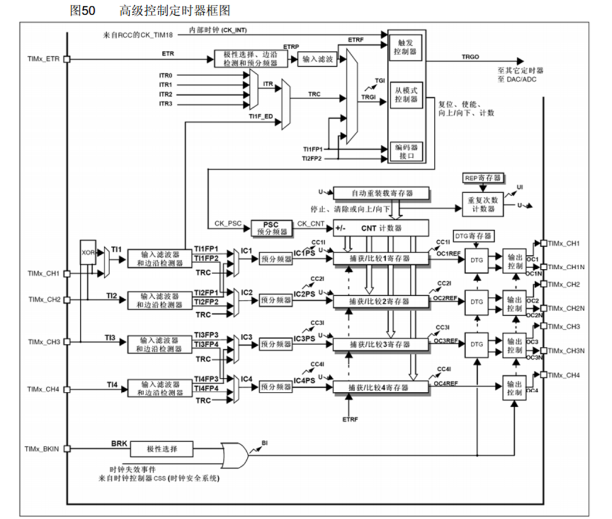

### 通用定时器

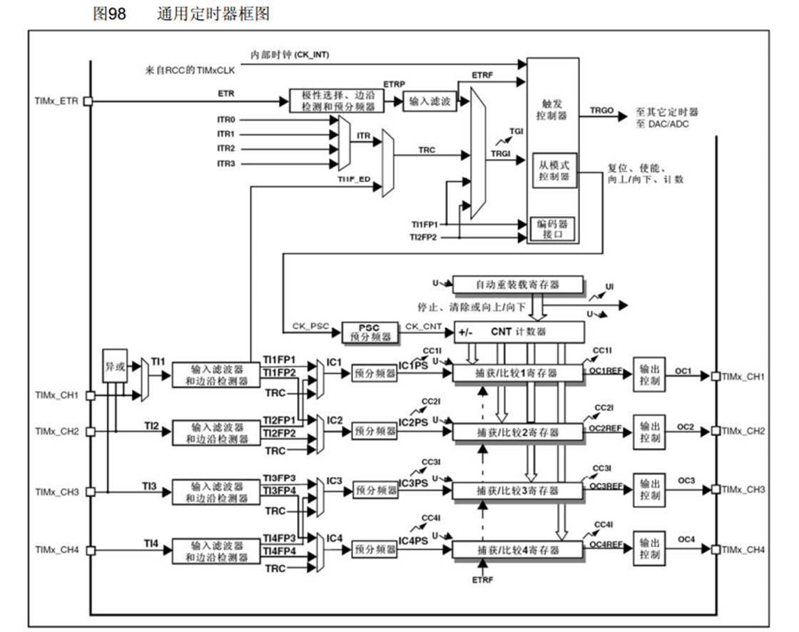

### 基本定时器

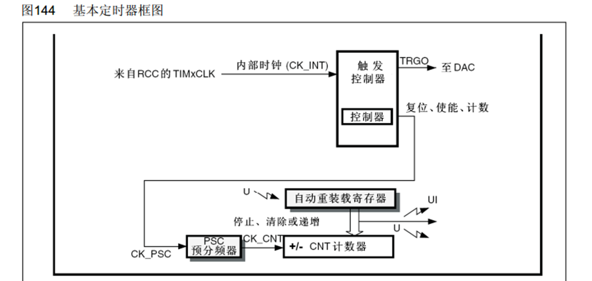

### 定时中断基本结构


### 预分频器时序

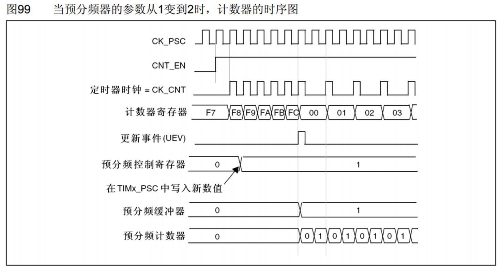

### 计数器时序

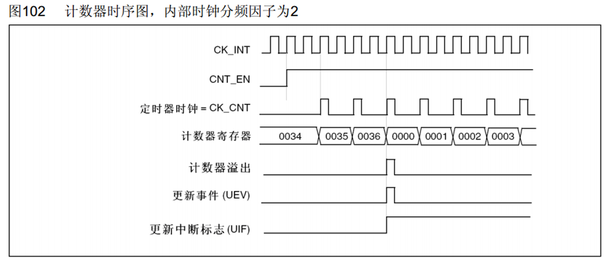

### 计数器无预装时序

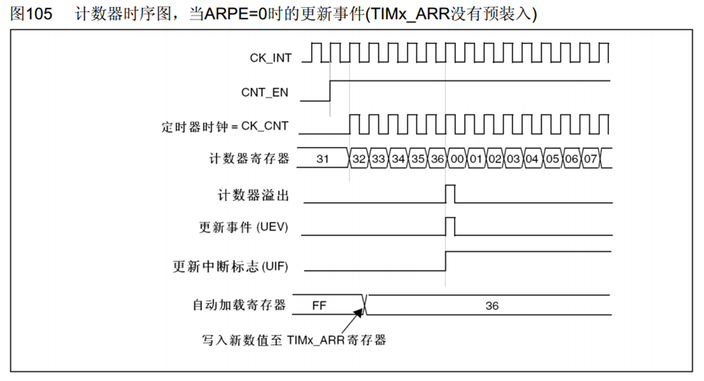

### 计数器有预装时序

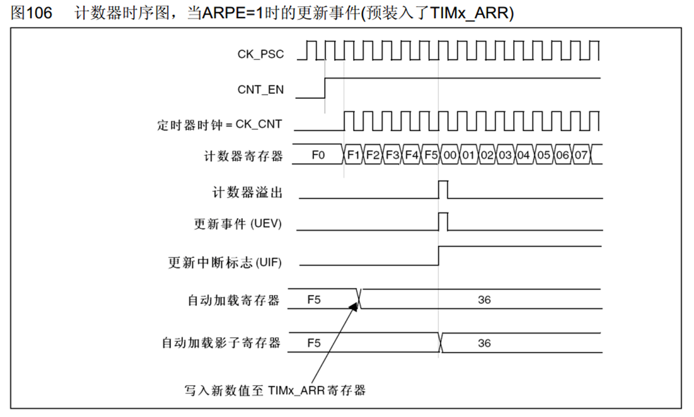

### RCC时钟树

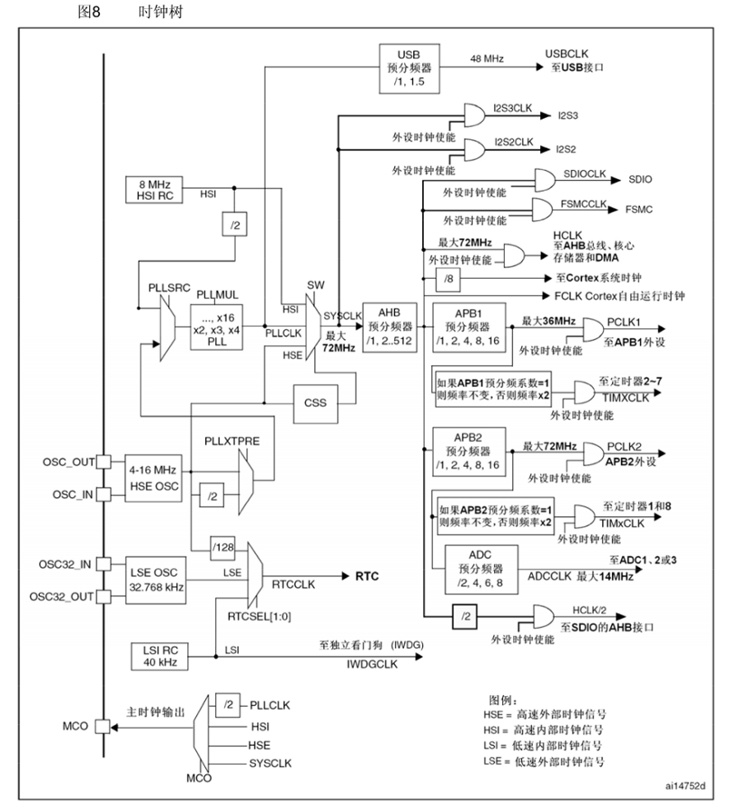

### 输出比较简介
OC（Output Compare）输出比较
输出比较可以通过比较CNT与CCR寄存器值的关系，来对输出电平进行置1、置0或翻转的操作，用于输出一定频率和占空比的PWM波形
每个高级定时器和通用定时器都拥有4个输出比较通道
高级定时器的前3个通道额外拥有死区生成和互补输出的功能

### PWM简介
PWM（Pulse Width Modulation）脉冲宽度调制
在具有惯性的系统中，可以通过对一系列脉冲的宽度进行调制，来等效地获得所需要的模拟参量，常应用于电机控速等领域
PWM参数：
频率 = 1 / TS            占空比 = TON / TS           分辨率 = 占空比变化步距

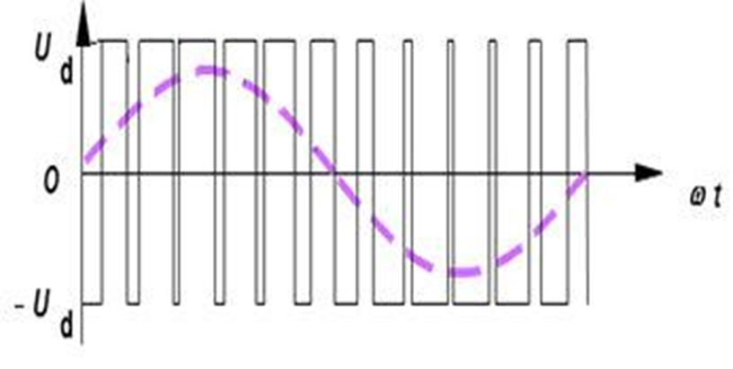

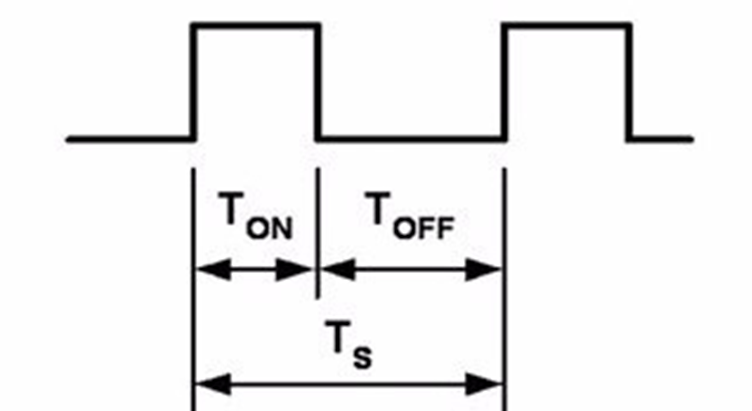

### 输出比较通道(高级)

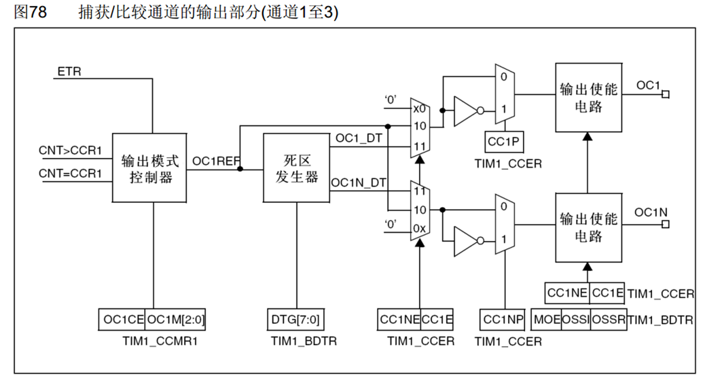

### 输出比较通道(通用)

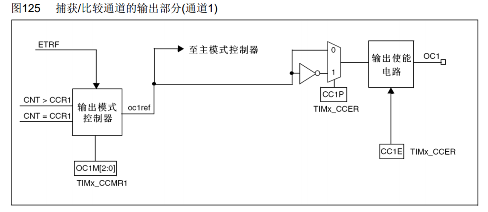

### 输出比较模式

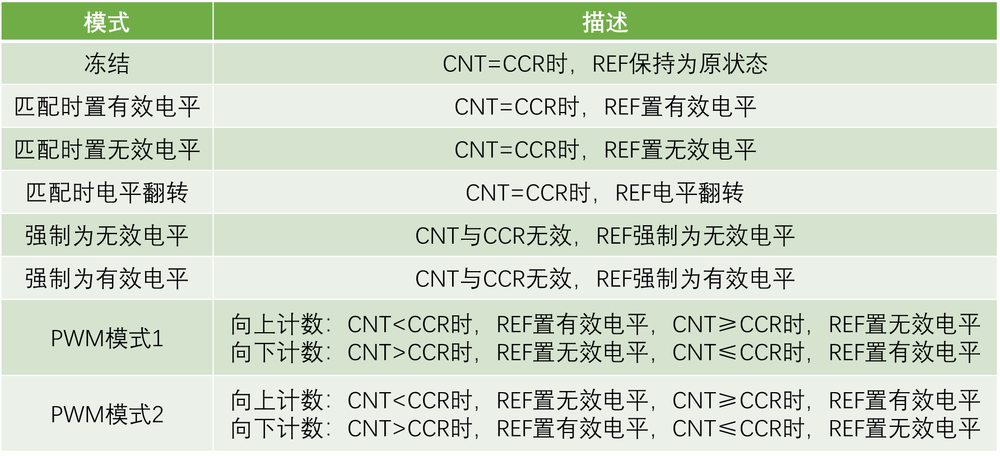

### PWM基本结构

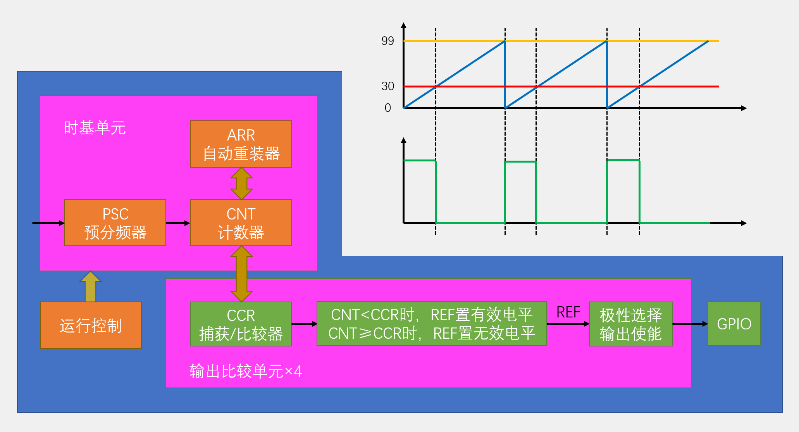

### 参数计算

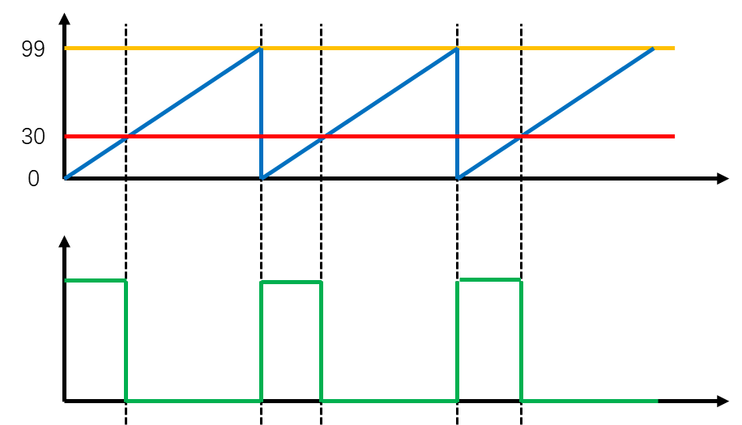
PWM频率：	Freq = CK_PSC / (PSC + 1) / (ARR + 1)
PWM占空比：	Duty = CCR / (ARR + 1)
PWM分辨率：	Reso = 1 / (ARR + 1)


### 舵机介绍
### 硬件电路
### 直流电机及驱动简介
### 硬件电路
### 输入捕获简介
### 频率测量
### 输入捕获通道
### 主从触发模式
### 输入捕获基本结构
### PWMI基本结构
