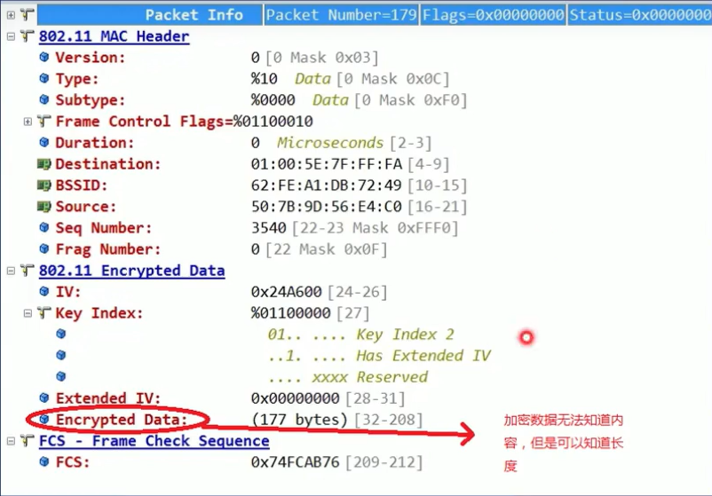
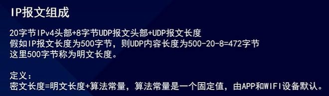
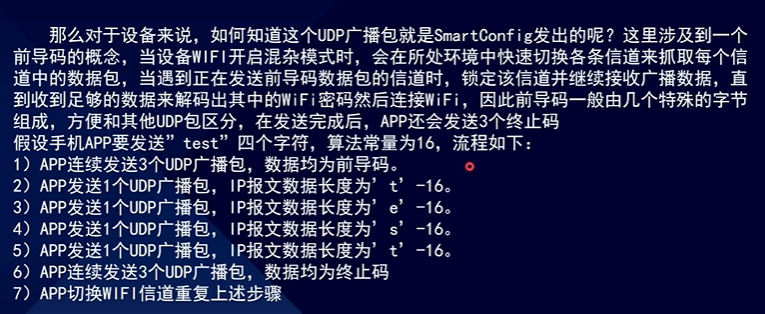
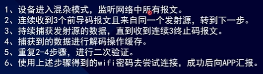

# ESP32-IDF

## WSL2搭建ESP-IDF开发环境

### WSL环境搭建

#### 1.安装

1. 管理员运行powershell

2. 启用“适用于Linux的Windows子系统”可选功能

   ```powershell
   dism.exe /online /enable-feature /featurename:Microsoft-Windows-Subsystem-Linux /all
   ```

3. 启用虚拟机可选组件

   ```
   dism.exe /online /enable-feature /featurename:VirtualMachinePlatform /all /norestart
   ```

   

4. 重启电脑重新以管理员运行powershell

   ```
   wsl --set-default-version 2
   ```

   

5. 打开Microsoft Store，选择偏好的Linux分发版获取

6. 安装完成电机启动，在powershell里面执行wsl.exe

7. 设置初始用户名和密码

#### 2.更换源

1. 备份文件

   ```bash
   sudo mv /etc/apt/sources.list /etc/apt/sources.list_bak
   ```

   

2. 新建文件并选择一家写入文件

   ```bash
    sudo vim /etc/apt/sources.list
   ```

   

3. 或选择一键指令配置

   ```bash
   sudo sed -i -r 's#http://(archive|security).ubuntu.com#https://mirrors.aliyun.com#g' /etc/apt/sources.list
   ```

   

4. 获取&更新

   ```bash
   sudo apt-get update
   sudo apt-get upgrade
   ```

   

清华源

```powershell
# 默认注释了源码镜像以提高 apt update 速度，如有需要可自行取消注释
deb https://mirrors.tuna.tsinghua.edu.cn/ubuntu/ jammy main restricted universe multiverse
# deb-src https://mirrors.tuna.tsinghua.edu.cn/ubuntu/ jammy main restricted universe multiverse
deb https://mirrors.tuna.tsinghua.edu.cn/ubuntu/ jammy-updates main restricted universe multiverse
# deb-src https://mirrors.tuna.tsinghua.edu.cn/ubuntu/ jammy-updates main restricted universe multiverse
deb https://mirrors.tuna.tsinghua.edu.cn/ubuntu/ jammy-backports main restricted universe multiverse
# deb-src https://mirrors.tuna.tsinghua.edu.cn/ubuntu/ jammy-backports main restricted universe multiverse
deb https://mirrors.tuna.tsinghua.edu.cn/ubuntu/ jammy-security main restricted universe multiverse
# deb-src https://mirrors.tuna.tsinghua.edu.cn/ubuntu/ jammy-security main restricted universe multiverse

# 预发布软件源，不建议启用
# deb https://mirrors.tuna.tsinghua.edu.cn/ubuntu/ jammy-proposed main restricted universe multiverse
# deb-src https://mirrors.tuna.tsinghua.edu.cn/ubuntu/ jammy-proposed main restricted universe multiverse

```

阿里源

```bash
deb http://mirrors.aliyun.com/ubuntu/ jammy main restricted universe multiverse
deb-src http://mirrors.aliyun.com/ubuntu/ jammy main restricted universe multiverse
deb http://mirrors.aliyun.com/ubuntu/ jammy-security main restricted universe multiverse
deb-src http://mirrors.aliyun.com/ubuntu/ jammy-security main restricted universe multiverse
deb http://mirrors.aliyun.com/ubuntu/ jammy-updates main restricted universe multiverse
deb-src http://mirrors.aliyun.com/ubuntu/ jammy-updates main restricted universe multiverse
deb http://mirrors.aliyun.com/ubuntu/ jammy-proposed main restricted universe multiverse
deb-src http://mirrors.aliyun.com/ubuntu/ jammy-proposed main restricted universe multiverse
deb http://mirrors.aliyun.com/ubuntu/ jammy-backports main restricted universe multiverse
deb-src http://mirrors.aliyun.com/ubuntu/ jammy-backports main restricted universe multiverse

```

中科大源

```bash
deb https://mirrors.ustc.edu.cn/ubuntu/ jammy main restricted universe multiverse
deb-src https://mirrors.ustc.edu.cn/ubuntu/ jammy main restricted universe multiverse
deb https://mirrors.ustc.edu.cn/ubuntu/ jammy-updates main restricted universe multiverse
deb-src https://mirrors.ustc.edu.cn/ubuntu/ jammy-updates main restricted universe multiverse
deb https://mirrors.ustc.edu.cn/ubuntu/ jammy-backports main restricted universe multiverse
deb-src https://mirrors.ustc.edu.cn/ubuntu/ jammy-backports main restricted universe multiverse
deb https://mirrors.ustc.edu.cn/ubuntu/ jammy-security main restricted universe multiverse
deb-src https://mirrors.ustc.edu.cn/ubuntu/ jammy-security main restricted universe multiverse
deb https://mirrors.ustc.edu.cn/ubuntu/ jammy-proposed main restricted universe multiverse
deb-src https://mirrors.ustc.edu.cn/ubuntu/ jammy-proposed main restricted universe multiverse

```

网易163源

```bash
deb http://mirrors.163.com/ubuntu/ jammy main restricted universe multiverse
deb http://mirrors.163.com/ubuntu/ jammy-security main restricted universe multiverse
deb http://mirrors.163.com/ubuntu/ jammy-updates main restricted universe multiverse
deb http://mirrors.163.com/ubuntu/ jammy-proposed main restricted universe multiverse
deb http://mirrors.163.com/ubuntu/ jammy-backports main restricted universe multiverse
deb-src http://mirrors.163.com/ubuntu/ jammy main restricted universe multiverse
deb-src http://mirrors.163.com/ubuntu/ jammy-security main restricted universe multiverse
deb-src http://mirrors.163.com/ubuntu/ jammy-updates main restricted universe multiverse
deb-src http://mirrors.163.com/ubuntu/ jammy-proposed main restricted universe multiverse
deb-src http://mirrors.163.com/ubuntu/ jammy-backports main restricted universe multiverse

```


#### 3.ssh配置

```bash
sudo apt remove openssh-server
sudo apt install openssh-server
sudo vim /etc/ssh/sshd_config 

#找到以下配置并更改
Port 22222                   # 设置端口为22222
ListenAddress 0.0.0.0		
PermitRootLogin yes         # 允许root远程登录
PasswordAuthentication yes  # 密码验证登录

#windows自启动&服务启动
#wsl2下
sudo vim /etc/init.wsl
    #内容如下
    #! /bin/sh
    /etc/init.d/ssh start
#配置权限
sudo chmod +x /etc/init.wsl

#windows下创建 wsl-start.vbs文件添加内容如下
    Set ws = WScript.CreateObject("WScript.Shell")        
    ws.run "wsl -d ubuntu -u root /etc/init.wsl"
    
#Win+R  shell:startup 将上面vbs文件放入打开的文件夹内

```

### ESP-IDF

#### 1.环境安装

```bash
#编译 ESP-IDF 需要以下软件包
sudo apt-get install git wget flex bison gperf python3 python3-venv python3-setuptools cmake ninja-build ccache libffi-dev libssl-dev dfu-util libusb-1.0-0
```


#### 2.获取ESP-IDF

```bash
#用户目录下创建esp文件夹，从git仓库拉取V5.0版本至此目录下
mkdir -p ~/esp
cd ~/esp
git clone -b release/v5.0 --recursive https://github.com/espressif/esp-idf.git
```


#### 3.设置工具

```bash
#进入idf文件夹，设置对应工具
cd ~/esp/esp-idf

#配置esp32项目开发
./install.sh esp32

#配置esp32&esp32s2项目开发
./install.sh esp32,esp32s2

#配置所有项目开发
./install.sh all
```


#### 4.设置环境变量

```bash
# 注意设置环境变量后才可以正常使用idf开发
. $HOME/esp/esp-idf/export.sh
```

#### 5.hello world工程示例

工程示例，从/esp-idf中的example目录下将get-started/hello工程复制到本地的~/esp目录下，进入hello_world目录，设置esp32s3为目标芯片，然后运行工程配置工具menuconfig，使用idf.py set-target esp32s3设置目标芯片时，此操作将清除并初始化项目之前的编译和配置(如果有的话)，也可以直接将目标配置为环境变量。

```bash
cd ~/esp/hello_world
idf.py set-target esp32S3
idf.py menuconfig

# 编译
idf.py build

# 下载运行
idf.py -p PORT [-b BAUD] flash

# 监视输出
idf.py -p PORT monitor
# “Ctrl+]”  退出
```


### 常用工具

#### Windows usbipd命令

​	因为wsl2无法直接使用Windows下的串口，借助开源usbipd-win项目来实现串口烧录。

##### usbipd介绍

​	usbipd是一个用于管理USB/IP(USB over IP)服务的命令行工具，可以在Windows下使用。USB/IP是一种协议，允许通过网络共享USB设备。usbipd工具允许用户在Windows上共享USB设备，使其他计算机能够通过网络访问这些设备。

##### Windows下安装

​	仓库下载安装或者通过powershell的Windows程序包管理器程序(winget)来安装

```powershell
#使用 winget 工具安装和管理应用程序安装  取消--interactive可能导致立即重启
winget install --interactive --exact dorssel.usbipd-win
```

##### wsl2下安装

https://github.com/dorssel/usbipd-win/wiki/WSL-support 参考链接

在wsl2下面需要下列命令

```powershell
sudo apt install linux-tools-virtual hwdata
sudo update-alternatives --install /usr/local/bin/usbip usbip `ls /usr/lib/linux-tools/*/usbip | tail -n1` 20
```

##### 具体使用

```powershell
#管理员打开Powershell，否则会提示没有权限
wsl -l -v
	#我的结果如下：
  	NAME            STATE           VERSION
	* Ubuntu-22.04    Running         2

#列出所有连接到 Windows 的 USB 设备
usbipd list
	#我的结果如下：
Connected:
BUSID  VID:PID    DEVICE                                                        STATE
1-1    1a86:7523  USB-SERIAL CH340 (COM8)                                       Not shared
1-3    046d:c53f  LIGHTSPEED Receiver, USB 输入设备                             Not shared
1-6    0408:4035  ACER HD User Facing, APP Mode                                 Not shared
1-10   8087:0026  英特尔(R) 无线 Bluetooth(R)                                   Not shared

Persisted:
GUID                                  DEVICE
#选择WSL的设备总线ID，然后运行此命令。WSL会提示你输入密码以运行sudo命令。要附加的 Linux 发行版必须是默认分发版

#绑定ID
usbipd bind --busid 4-4
#创建映射
usbipd attach -b 4-4 -w
	# WSL2下使用 sudo /dev/tty* 在绑定前后查询，查看新增设备名
	# 有些为 /dev/ttyUSB0 我的为 /dev/ttyACM0

#WSL2下设置设备读写权限
sudo chmod a+rw /dev/ttyACM0

#解绑映射 注意不解绑可能导致windows下无法使用此COM口
usbipd detach -b 4-4

```


##### 基本命令参数

```powershell
usbipd list
```

**描述**：列出当前系统上所有可用的USB设备

**示例**：

```powershell
PS C:\Users\57117> usbipd list
Connected:
BUSID  VID:PID    DEVICE                                                        STATE
1-1    1a86:7523  USB-SERIAL CH340 (COM8)                                       Not shared
1-3    046d:c53f  LIGHTSPEED Receiver, USB 输入设备                             Not shared
1-6    0408:4035  ACER HD User Facing, APP Mode                                 Not shared
1-10   8087:0026  英特尔(R) 无线 Bluetooth(R)                                   Not shared

Persisted:
GUID                                  DEVICE
```

​	使用usbipd

```powershell
usbipd unbind --guid [GUID]
```

## ESP32-IDF 学习笔记

```c++
Helloworld
	main // 主要工程源码目录，必须存在
		main.c // 工程入口源码文件，必须存在
		CMakeList.txt // 用于指示CMake构建系统，对main目录进行构建
    CMakeList.txt // 用于指示CMake构建系统，Helloworld工程进行构建
    componets // 自己编写的一些公共代码，非必须
    sdkconfig // 工程组件的配置文件，必须存在
    build // 执行编译后，生成的bin和中金文件存放，自动生成
```

​	在使用idf.py build编译后，编译器会根据代码区分出指令总线和数据总线，指令总线部分是可以执行的，比如说定义的函数；数据总线部分不可执行，只能通过字节操作访问，比如说全局变量。

**1.DRAM（数据 RAM）：**属于数据总线，存放非常量静态数据（如 .data 段和 .bss 段，通常是数值为0的全局变量）由链接器放入内部 SRAM 作为数据存储，也可以配置放入外部 RAM。也就是static变量或者说初始化为0的全局变量，它们就是存放在这里。
**2."noinit" DRAM：** 属于数据总线，未初始化的全局变量数据，链接器接管放入内部 SRAM 作为数据存储，也可配置放入外部 RAM。在这个部分的值，启动的时候是不会被初始化的。
**3.IRAM（指令 RAM）：** 属于指令总线，ESP-IDF 将内部 SRAM0（包含3个存储块：SRAM0、SRAM1和SRAM2）的一部分区域（SRAM0 和 SRAM1）分配为指令 RAM。一般来说，编写的中断程序就是放在这个IRAM中的，另外在应用程序用可以通过使用 IRAM_ATTR宏在源代码中指定哪些代码需要放入 IRAM 中。
**4.IROM（代码从 flash 中运行）：**指令总线，如果一个函数必须从 flash 中加载，它将被存储在 flash 中，或者存储在 RTC 存储器中。如果一个函数没有显式地声明放在IRAM或者RTC存储器中，则它会放在Flash中。
**5.DROM（数据存储在 flash 中）：** 数据总线，用于存储仅读取的数据，就是程序中的常量用const修饰的变量。
**6.RTC Slow memory（RTC 慢速存储器）：** 数据总线，RTC_NOINIT_ATTR 属性宏可以将某些数据存入 RTC Slow memory。存储器中的值在深度睡眠模式中值保持不变。
**7.RTC Fast memory（RTC 快速存储器）：** 具有双重作用，既可以用作指令存储器，也可以当做数据存储器，RTC Fast memory 也可以在深度睡眠模式下保持数据，并且能够快速存取。从深度睡眠模式唤醒后必须要运行的代码就是要放在RTC存储器中的。

**ESP32的启动流程：**
	刚才介绍的所有区域都可以被称为段，app_main()是ESP32的应用入口，但是在启动和到达应用入口中间还有很多的工作，具体而言如下所示：
	1.一级引导程序，固化在ROM中，不可修改，它是负责加载二级引导程序至RAM中运行，并检查GPIO0引脚，选择程序模式，当芯片上电检测到GPIO0引脚是低电平的话，就会进入下载模式，否则就会继续执行二级引导程序。
	2.二级引导程序，也就是bootloader程序，从0x8000处读取分区表，处理各种段，比如说会将IRAM内容拷贝到内存SRAM中，最后加载应用程序。
	3.应用程序，硬件外设和基本C语言运行环境的初始化，最后执行app_main()函数。

### FreeRTOS

```C++
// 没有OS的支持就是这种情况
while(1)
{
    taskA();
    taskB();
    taskC();
    taskD();
}

// 有OS的支持就是 RTOS
while(1)
{
    taskA();
} 

while(1)
{
    taskB();
}

while(1)
{
    taskC();
}
```


#### 任务创建

​	在RTOS系统中每个模块相当于都是独立的工作的，通过时间片的方式，每个模块都可以得到执行的机会，任务运行的基本单位是Tick，也可以叫做系统时钟节拍，在ESP-IDF中一个系统节拍是1ms。使用FreeRTOS的实时应用程序可以被构建为一组独立的任务。每个任务在自己的上下文中执行，不依赖于其他任务或RTOS调度器本身。任务分为四个状态：运行、准备就绪、阻塞、挂起。

**运行：**当任务实际执行时，它被称为处于运行状态。 任务当前正在使用处理器。 如果运行
RTOS 的处理器只有一个内核， 那么在任何给定时间内都只能有一个任务处于运行状态。
**准备就绪：**准备就绪任务指那些能够执行（它们不处于阻塞或挂起状态），但目前没有执行的任务，因为同等或更高优先级的不同任务已经处于运行状态。
**阻塞：**如果任务当前正在等待时间或外部事件，则该任务被认为处于阻塞状态。例如，如果一
个任务调用 vTaskDelay()，它将被阻塞（被置于阻塞状态），直到延迟结束-一个时间事件。任务也可以通过阻塞来等待队列、信号量、事件组、通知或信号量事件。处于阻塞状态的任务通常有一个"超时"期， 超时后任务将被超时，并被解除阻塞，即使该任务所等待的事件没有发生。“阻塞”状态下的任务不使用任何处理时间，不能被选择进入运行状态。
**挂起：**与“阻塞”状态下的任务一样， “挂起”状态下的任务不能 被选择进入运行状态，但处于挂起状态的任务没有超时。相反，任务只有在分别通过 vTaskSuspend() 和 xTaskResume()API 调用明确命令时 才会进入或退出挂起状态。

**优先级：**每个任务均被分配了从 0 到 ( configMAX_PRIORITIES - 1 ) 的优先级，其中的configMAX_PRIORITIES 在 FreeRTOSConfig.h 中定义，低优先级数字表示低优先级任务。 空闲任务的优先级为零。

```C++
// 这个函数是原生FreeRTOS中没有的函数，是乐鑫公司自己实现的函数，因为原生的FreeRTOS并没有支持多核CPU情况。但是原生的xTaskCreate()也是在IDF中被支持的，但实质上就是将xTaskCreatePinnedToCore()封装成了xTaskCreate()，并且内核指定为了NO_AFFINITY，来保持的函数接口不变。
BaseType_t xTaskCreatePinnedToCore(
    TaskFunction_t pvTaskCode,          // 任务函数指针，原型是 void fun(void *param)
    const char * constpcName,           // 任务名称，打印调试时可能会用到
    const uint32_t usStackDepth,        // 任务堆栈空间大小（字节），和原生FreeRTOS的单位不同，一般最小就是2048字节
    void * constpvParameters,          // 任务参数
    UBaseType_t uxPriority,             // 任务优先级，数值越大，优先级越高，0到(configMAX_PRIORITIES - 1)这个宏定义的默认值就是25，也就是最高优先级就是24
    TaskHandle_t * constpvCreatedTask, // 返回创建的任务句柄，有了这个句柄就可以对任务进行挂起、恢复、删除操作，如果不需要的话直接置为NULL即可
    const BaseType_t xCoreID           // 指定任务在哪个核心上运行，可以选择0或者1
);

// 如果创建成功，则返回 pdPASS，否则返回相关错误码


// 自己指定栈内存区的版本
TaskHandle_t xTaskCreateStaticPinnedToCore(
    TaskFunction_t pvTaskCode,          // 任务函数指针
    const char * constpcName,           // 任务名称
    const uint32_t ulStackDepth,        // 任务堆栈大小
    void * constpvParameters,           // 任务参数
    UBaseType_t uxPriority,             // 任务优先级
    StackType_t * constpxStackBuffer,   // 指向堆栈内存区域的指针
    StaticTask_t * constpxTaskBuffer,   // 指向任务控制块内存区域的指针
    const BaseType_t xCoreID            // 指定任务在哪个核心上运行
);

// 延时xTickToDelay个周期
// 当程序调用这个函数的时候，立刻会进入阻塞状态，但不意味着经过这么个周期之后可以立刻得到执行
// 也就是说这个函数只是用来保证一个最小等待时间，
void vTaskDelay(const TickType_t xTickToDelay);

//用于表示精确的接触阻塞时间
void vTaskGetTickCount(
    Ticktype_t *pxPreviousWakeTime, // 保存上一次任务解除阻塞的时间
    const TickType_t xTimeIncrement // 表示经过xTimeIncrement的时候任务会解除阻塞
);

// 程序示例
cnt = xTaskGetTickCount(); // 获取当前系统的节拍数
while(1)
{
 	vTaskDelayUntil(&cnt, 100);   
}
```


IDF创建工程

```
idf.py create-project [PROJECT-NAME]

idf.py flash monitor 命令是可以连着使用的
```

创建完成之后就是一个CMakeList.txt和一个main文件夹，然后就可以执行idf.py build来构建工程了。创建完工程之后就要ctrl+shift+p 点一下 ESP-IDF ADD vscode configuration folder这样就可以将ESP-IDF的头文件路径什么的都包含到这个工程中了。


第一个程序

```C++
#include <stdio.h>
#include "freertos/FreeRTOS.h"
#include "freertos/task.h" // 创建任务就需要包含这个头文件
#include "esp_log.h"

void taskA(void *param)
{
    while(1)
    {
        // 前一个参数是一个标记，目的是方便查找某些打印日志，实际的打印内容就是后面的参数
        ESP_LOGI("main", "Hello world");
        // 使用演示函数来定时打印串口信息，但是这个函数延时的不是毫秒而是系统节拍
        // 因此FreeRTOS提供了一个宏pdMS_TO_TICKS，将毫秒时间转化为具体的时间节拍数
        vTaskDelay(pdMS_TO_TICKS(500));
    }
}

void app_main(void)
{
    // 在app_main函数中创建任务
    // 参数分别为：函数名，任务名字，堆栈空间大小，任务参数，优先级，任务句柄，分配到哪个核心运行
    // 一般来说1核心就是应用核，0核心就是系统核心
    xTaskCreatePinnedToCore(taskA, "HelloWorld", 2048, NULL, 3, NULL, 1);
}
```

### 任务间的同步

​	RTOS中的同步，是指不同任务之间或者任务与外部事件之间的协同工作方式，确保多个并发执行的任务按照预期的顺序或时机执行，它涉及到线程或任务间的通信和协调机制，目的是为了避免数据竞争、解决竞态条件、并确保系统的正确行为。其中队列就是FreeRTOS中一种常见的同步方式。

​	互斥是指某一资源同时只允许一个访问者对其进行访问，具有唯一性和排它性。比如说要使用串口通信，任务A想要使用串口就需要获得一个互斥锁，当任务A获得互斥锁而使用串口后，其他任务也要使用串口通信就会被阻塞，直到任务A完成后释放互斥锁，其他任务获得为止。


```C++
// 队列相关的函数
// 创建一个队列，成功返回队列句柄
QueueHandle_t xQueueCreate(
    UBaseType_t uxQueueLength,     // 队列容量
    UBaseType_t uxItemSize         // 每个队列项所占内存的大小（单位：字节）
);
// 向队列头部发送一个消息
BaseType_t xQueueSend(
    QueueHandle_t xQueue,          // 队列句柄
    const void * pvItemToQueue,    // 要发送的消息指针
    TickType_t xTicksToWait        // 等待时间，队列满的时候要等待才行
);
// 向队列尾部发送一个消息
BaseType_t xQueueSendToBack(
    QueueHandle_t xQueue,          // 队列句柄
    const void * pvItemToQueue,    // 要发送的消息指针
    TickType_t xTicksToWait        // 等待时间
);
// 从队列接收一条消息
BaseType_t xQueueReceive(
    QueueHandle_t xQueue,          // 队列句柄
    void * pvBuffer,               // 指向接收消息缓冲区的指针
    TickType_t xTicksToWait        // 等待时间
);
// xQueueSend 的中断版本（在中断函数中使用）
BaseType_t xQueueSendFromISR(
    QueueHandle_t xQueue,                  // 队列句柄
    const void * pvItemToQueue,            // 要发送的消息指针
    BaseType_t * pxHigherPriorityTaskWoken // 如果发送导致任务解除阻塞，且该任务优先级高于当前任务，则设置为 pdTRUE
);

// 注：如果 *pxHigherPriorityTaskWoken 被设置为 pdTRUE，
// 应在中断退出前调用 portYIELD_FROM_ISR() 以触发上下文切换

```

示例代码

```c++
#include <stdio.h>
#include <string.h>
#include "freertos/FreeRTOS.h"
#include "freertos/task.h" // 创建任务就需要包含这个头文件
#include "freertos/queue.h"
#include "esp_log.h"

QueueHandle_t queue_handle = NULL;

// 但是在实现链表的时候还是需要struct 
typedef struct
{
    /* data */
    int value;
}queue_data_t;

void taskA(void *param)
{
    // 从队列里面接收数据，并打印
    queue_data_t data;
    while(1)
    {
        // 这三个参数分别是队列句柄，缓冲区，等待时间
        if(pdTRUE == xQueueReceive(queue_handle, &data, 100))
        {
            ESP_LOGI("queue", "receive queue value:%d", data.value);
        }
    }
}

void taskB(void *param)
{
    queue_data_t data;
    memset(&data, 0, sizeof(queue_data_t));
    // 每隔1秒向队列里面发送数据
    while(1)
    {
        xQueueSend(queue_handle, &data, 100);
        // 进行1s的延时
        vTaskDelay(pdMS_TO_TICKS(1000));
        data.value ++;
    }
}

void app_main(void)
{
    queue_handle = xQueueCreate(10, sizeof(queue_data_t));
    xTaskCreatePinnedToCore(taskA, "taskA", 2048, NULL, 3, NULL, 1);
    xTaskCreatePinnedToCore(taskB, "taskB", 2048, NULL, 3, NULL, 1);
}
```


#### 信号量


信号量相当于NONOS程序中的全局标志位，就类似于所列举的例子，雨伞池里面一共有六把雨伞，每当有一个人取走一把雨伞，池里面的雨伞就会减一，直到所有的雨伞被取走了，后需要用雨伞的人就只能等待，直到有人归还雨伞。信号量分为二进制信号量、计数信号量、互斥信号量。二进制信号量就是最大计数值就是1，也就是雨伞池里面的雨伞最多就是1 。

```C++
// 创建二值信号量，成功则返回信号量句柄（二值信号量最大只有1个）
SemaphoreHandle_t xSemaphoreCreateBinary(void);

// 创建计数信号量，成功则返回信号量句柄
SemaphoreHandle_t xSemaphoreCreateCounting(
    UBaseType_t uxMaxCount,     // 最大信号量数
    UBaseType_t uxInitialCount  // 初始信号量数
);

// 获取一个信号量，如果获得成功，则返回 pdTRUE
BaseType_t xSemaphoreTake(
    SemaphoreHandle_t xSemaphore, // 信号量句柄
    TickType_t xTicksToWait       // 等待时间（tick 数）
);

// 释放一个信号量
BaseType_t xSemaphoreGive(
    SemaphoreHandle_t xSemaphore  // 信号量句柄
);

// 删除信号量（释放资源）
void vSemaphoreDelete(
    SemaphoreHandle_t xSemaphore  // 信号量句柄
);

```

信号量示例代码

这个代码使用了一个dht的温度传感器

```C++
#include <stdio.h>
#include "freertos/FreeRTOS.h"
#include "freertos/task.h" // 创建任务就需要包含这个头文件
#include "freertos/semphr.h"
#include "dht11.h"
#include "driver/gpio.h"
#include "esp_log.h"

SemaphoreHandle_t dht11_mutex;

void taskA(void *param)
{
    int temp, humidity;
    while(1)
    {
        xSemaphoreTake(dht11_mutex, portMAX_DELAY);
        vTaskDelay(pdMS_TO_TICKS(500));
        if(DHT11_StartGet(&temp, &humidity))
        {
            ESP_LOGI("dht11", "taskA-->temp:%d,humidity:%d%%", temp / 10, humidity);
        }
        xSemaphoreGive(dht11_mutex);
        vTaskDelay(pdMS_TO_TICKS(1000));
    }
}

void taskB(void *param)
{
    int temp, humidity;
    while(1)
    {
        xSemaphoreTake(dht11_mutex, portMAX_DELAY);
        vTaskDelay(pdMS_TO_TICKS(500));
        if(DHT11_StartGet(&temp, &humidity))
        {
            ESP_LOGI("dht11", "taskA-->temp:%d,humidity:%d%%", temp / 10, humidity);
        }
        xSemaphoreGive(dht11_mutex);
        vTaskDelay(pdMS_TO_TICKS(1000));
    }
}

void app_main(void)
{
    dht11_mutex = xSemaphoreCreateMutex();
    DHT11_Init(GPIO_NUM_25);
    xTaskCreatePinnedToCore(taskA, "taskA", 2048, NULL, 3, NULL, 1);
    xTaskCreatePinnedToCore(taskB, "taskB", 2048, NULL, 3, NULL, 1);
}
```


#### 互斥锁

互斥锁与二进制信号量极为相似，但互斥锁实现了优先级继承

```C++
// 创建一个互斥锁
SemaphoreHandle_t xSemaphoreCreateMutex(void);
```

​	优先级继承是为了解决优先级翻转问题，比如说有三个任务A、B、C，任务优先级A>B>C，但是任务C正在使用临界资源，当任务A就绪之后调度器切换到任务A，当任务A运行一段时间之后需要使用临界资源，但此时任务C并没有释放临界资源，此时任务A就会阻塞，任务B就绪之后调度器就会将任务B切换出来运行，当任务C释放临界资源的时候，任务A才能继续运行，因此虽然任务A的优先级大于任务B，但是任务B在没有与任务A有资源冲突的情况下，任务B反而能够运行，产生了优先级翻转。要解决的话就是使用优先级继承，让任务C暂时继承任务A的优先级，这样任务B就无法抢占任务A了。


### 事件组


事件位：用于指示事件是否发生，事件位通常称为事件标志。
事件组：就是一组事件位，事件组中的事件位通过位编号来引用。
	所谓事件就是发生了某件事，用于通知对此事件感兴趣的用户，freeRTOS中的事件组包含了一组事件位，每一位都可以单独设置为0或者1，0就是发生，1就是不发生。当一个任务设置了一个事件，如果有任务正在等待相应的事件，那么等待该事件的任务就会停止等待并返回事件编号。事件组可以等待多个事件中的任意一个或全部，提供了更灵活的同步方式。


```C++
// 创建一个事件组，返回事件组句柄；失败返回 NULL
EventGroupHandle_t xEventGroupCreate(void);

// 等待事件组中某个（或某些）标志位，用返回值确定哪些位已被设置
EventBits_t xEventGroupWaitBits(
    const EventGroupHandle_t xEventGroup,     // 事件组句柄
    const EventBits_t uxBitsToWaitFor,        // 要等待的位（例如 (1 << 0) | (1 << 1)）
    const BaseType_t xClearOnExit,            // 是否自动清除满足条件的位（pdTRUE/pdFALSE）
    const BaseType_t xWaitForAllBits,         // 是否所有等待位都必须满足才返回
    TickType_t xTicksToWait                   // 最大阻塞等待时间（tick）
);

// 设置事件组中的一个或多个标志位
EventBits_t xEventGroupSetBits(
    EventGroupHandle_t xEventGroup,           // 事件组句柄
    const EventBits_t uxBitsToSet             // 要设置的标志位
);

// 清除事件组中的一个或多个标志位
EventBits_t xEventGroupClearBits(
    EventGroupHandle_t xEventGroup,           // 事件组句柄
    const EventBits_t uxBitsToClear           // 要清除的标志位
);

```

### 事件组示例程序


```C++
#include <stdio.h>
#include "freertos/FreeRTOS.h"
#include "freertos/event_groups.h"
#include "freertos/task.h" // 创建任务就需要包含这个头文件
#include "esp_log.h"

#define NUM0_BIT BIT0
#define NUM1_BIT BIT1

static EventGroupHandle_t test_event;

void taskA(void *param)
{
    // 定时设置不同的事件位
    while(1)
    {
        xEventGroupSetBits(test_event, NUM0_BIT);
        vTaskDelay(pdMS_TO_TICKS(1000));
        xEventGroupSetBits(test_event, NUM1_BIT);
        vTaskDelay(pdMS_TO_TICKS(1000));
    }
}

void taskB(void *param)
{
    // 等待事件位
    EventBits_t ev;
    while(1)
    {
        ev = xEventGroupWaitBits(test_event, NUM0_BIT | NUM1_BIT, pdTRUE, pdFALSE, pdMS_TO_TICKS(5000));
        // 第0位是有事件的
        if(ev & NUM0_BIT)
        {
            ESP_LOGI("ev", "GET BIT0 EVENT!");
        }
        // 第1位是有事件的
        if(ev & NUM1_BIT)
        {
            ESP_LOGI("ev", "GET BIT1 EVNET!");
        }
    }
}

void app_main(void)
{
    test_event = xEventGroupCreate();
    xTaskCreatePinnedToCore(taskA, "taskA", 2048, NULL, 3, NULL, 1);
    xTaskCreatePinnedToCore(taskB, "taskB", 2048, NULL, 3, NULL, 1);
} 
```


### 直达任务通知

​	定义：每个RTOS任务都有一个任务通知数组。每条任务通知都有“挂起”或“非挂起”的通知状态，以及一个32位通知值。直达任务通知是直接发送至任务的事件，而不是通过中间对象（如队列、事件组或信号量）间接发送任务的事件。向任务发送“直达任务通知”会将目标任务通知设为“挂起”状态，（此挂起不是挂起任务，而是任务通知的挂起通知状态，表示任务收到了来自某个任务的通知）。


```C++
// === 基本任务通知发送 ===
// 将通知直接发送给任务，ulValue 是通知值，eAction 决定如何处理通知值
BaseType_t xTaskNotify(
    TaskHandle_t xTaskToNotify,   // 被通知的任务句柄
    uint32_t ulValue,             // 通知携带的值
    eNotifyAction eAction         // 执行的操作（见枚举）
);

// 枚举：通知动作类型
typedef enum {
    eNoAction = 0,                // 不更改通知值，只解除阻塞
    eSetBits,                     // 将 ulValue 的位设置到通知值（OR 操作）
    eIncrement,                   // 将通知值加一（适用于计数信号量用途）
    eSetValueWithOverwrite,       // 用 ulValue 覆盖通知值（允许覆盖）
    eSetValueWithoutOverwrite     // 用 ulValue 设置通知值，若通知未处理则失败
} eNotifyAction;

// === 基本任务通知接收 ===
// 等待任务通知，并返回通知值，可选择进入/退出函数时清除位
BaseType_t xTaskNotifyWait(
    uint32_t ulBitsToClearOnEntry,     // 进入函数时清除的通知位
    uint32_t ulBitsToClearOnExit,      // 退出函数时清除的通知位
    uint32_t *pulNotificationValue,    // 输出通知值的指针（可为 NULL）
    TickType_t xTicksToWait            // 最大等待时间（tick）
);

// === 计数型通知（类似二值/计数信号量） ===
// 给目标任务发送“+1”的通知，默认 eIncrement 动作
BaseType_t xTaskNotifyGive(
    TaskHandle_t xTaskToNotify         // 被通知的任务
);

// 接收通知值（自减），如果当前为 0，则阻塞等待，返回前会自动 -1
uint32_t ulTaskNotifyTake(
    BaseType_t xClearCountOnExit,     // 是否清零通知值（pdTRUE）或减1（pdFALSE）
    TickType_t xTicksToWait           // 等待时间
);

// === 中断中使用版本（FromISR 后缀） ===
// 在中断中发送通知
BaseType_t xTaskNotifyFromISR(
    TaskHandle_t xTaskToNotify,
    uint32_t ulValue,
    eNotifyAction eAction,
    BaseType_t *pxHigherPriorityTaskWoken // 若唤醒高优先级任务，需手动切换上下文
);

// 在中断中执行“+1”型通知（用于 xTaskNotifyGive 的中断版）
BaseType_t xTaskNotifyGiveFromISR(
    TaskHandle_t xTaskToNotify,
    BaseType_t *pxHigherPriorityTaskWoken
);

```

直达任务通知示例代码

```c++
#include <stdio.h>
#include "freertos/FreeRTOS.h"
#include "freertos/event_groups.h"
#include "freertos/task.h" // 创建任务就需要包含这个头文件
#include "esp_log.h"


static TaskHandle_t taskA_handle;
static TaskHandle_t taskB_handle;

void taskA(void *param)
{
    // 定时发送一个任务通知值
    uint32_t value = 0;
    vTaskDelay(pdMS_TO_TICKS(200));
    while(1)
    {
        xTaskNotify(taskB_handle, value, eSetValueWithoutOverwrite);
        vTaskDelay(pdMS_TO_TICKS(1000));
        value ++;
    }
}

void taskB(void *param)
{
    // 接收任务通知并打印
    uint32_t value;
    while(1)
    {
        // 第一个参数是进入的时候清除哪些位，第二个参数是退出的时候清除哪些位，第三个是直达通知的值，第四个是等待时间
        // ULONG_MAX就是全部
        xTaskNotifyWait(0x00, ULONG_MAX, &value, portMAX_DELAY);
        ESP_LOGI("ev", "notify wait value:%lu", value);
    }
}

void app_main(void)
{
    // 这个程序如果不加延时函数的话会崩溃掉，因为创建完任务A之后任务A就会直接运行，这样就会向任务B发送任务通知
    // 但是此时任务B还没有创建成功，因此访问的任务句柄就是一个无效的句柄，因此就会崩溃掉了
    // 解决的方式就是在任务A中加一个阻塞延时函数，等待任务B创建完成
    xTaskCreatePinnedToCore(taskA, "taskA", 2048, NULL, 3, &taskA_handle, 1);
    xTaskCreatePinnedToCore(taskB, "taskB", 2048, NULL, 3, &taskB_handle, 1);
} 
```

#### 原生的FreeRTOS和IDF版本的FreeRTOS的区别

1. 优先级问题，多核情况并不使用，因为有多个任务可同时运行
2. ESP-IDF自动创建空闲、定时器、app_main、IPC、ESP定时器。空闲任务在每个核心上面都会创建一个，它的优先级是0，第二个是ESP32定时器任务，优先级是1，第三个app_main应用入口，第四个IPC任务，每个核心都会创建一个，用于处理多核协调，优先级是24也就是最高优先级，最后一个是ESP定时器任务，负责定时器的回调，优先级是22 。
3. ESP-IDF不适用原生FreeRTOS的内存堆管理，实现了自己的堆
4. 创建任务使用xTaskCreatePinnedToCore()
5. 删除任务避免删除另外一个核的人物
6. 临界区使用自旋锁确保同步，因为在ESP32双核系统中，仅仅禁用中断并不能构成临界区，因为存在其它核心意味着共享资源仍然可以同时访问，因此需要采取自旋锁的方式来保护临界区资源。
7. 如果任务重用到浮点运算，则创建任务的时候必须指定具体运行在哪个核上，不能由系统自动安排，这是由ESP32的FPU寄存器的特性决定的。

总的来说，建议如下：

1. 程序应用开发创建任务指定内核，建议不要使用tskNO_AFFINITY
2. 通常，负责处理无线网络的任务(例如WiFi或蓝牙)，将被固定到CPU0(因此名称PRO_CPU)，而处理应用程序其余部分的任务将被固定到CPU1(因此名称为APP_CPU)

# ESP32-外设

## GPIO驱动LED

高低电平跳变代码

```C++
#include "stdio.h"
#include "freertos/FreeRTOS.h"
#include "freertos/task.h"
#include "driver/gpio.h"

#define LED_GPIO GPIO_NUM_27

void led_run_task(void *param)
{
    int gpio_level = 0;
    while(1)
    {
        gpio_level = gpio_level ? 0 : 1;
        gpio_set_level(LED_GPIO, gpio_level);
        vTaskDelay(pdMS_TO_TICKS(500));
    }
}

void app_main(void)
{
    gpio_config_t led_cfg = {
        // 这个按位掩码用于指定GPIO，因为是可以
        .pin_bit_mask = (1 << LED_GPIO),
        // 是否使能上拉
        .pull_up_en = GPIO_PULLUP_DISABLE,
        .pull_down_en = GPIO_PULLDOWN_DISABLE,
        .mode = GPIO_MODE_OUTPUT,
        .intr_type = GPIO_INTR_DISABLE,
    };
    gpio_config(&led_cfg);

    xTaskCreatePinnedToCore(led_run_task, "LED_RUN", 2048, NULL, 3, NULL, 1);
} 
```


PWM示例代码

```C++
#include "stdio.h"
#include "freertos/FreeRTOS.h"
#include "freertos/task.h"
#include "driver/gpio.h"
#include "driver/ledc.h"

#define LED_GPIO GPIO_NUM_27
#define FULL_EV_BIT0 BIT0
#define EMPTY_EV_BIT1 BIT1


static EventGroupHandle_t ledc_event_handle;
// 加了IRAM_ATTR的宏就是在内存中执行的，所以效率会很高
bool IRAM_ATTR ledc_finish_cb(const ledc_cb_param_t *param, void *user_arg)
{
    BaseType_t taskWoken;
    // 首先判断占空比的状态
    if(param->duty)
    {
        xEventGroupSetBitsFromISR(ledc_event_handle, FULL_EV_BIT0, &taskWoken);
    }
    else
    {
        xEventGroupSetBitsFromISR(ledc_event_handle, EMPTY_EV_BIT1, &taskWoken);
    }
    return taskWoken;
}

void led_run_task(void *param)
{
    EventBits_t ev;
    while(1)
    {
        ev = xEventGroupWaitBits(ledc_event_handle, FULL_EV_BIT0 | EMPTY_EV_BIT1, pdTRUE, pdFALSE, pdMS_TO_TICKS(5000));
        if(ev & FULL_EV_BIT0)
        {
            // 开启渐变呼吸灯模式，这个函数的意思就是从零开始用2000毫秒的事件来进行渐变
            ledc_set_fade_with_time(LEDC_LOW_SPEED_MODE, LEDC_CHANNEL_0, 0, 2000);
            // 启动渐变
            ledc_fade_start(LEDC_LOW_SPEED_MODE, LEDC_CHANNEL_0, LEDC_FADE_NO_WAIT);
        }
        if(ev & EMPTY_EV_BIT1)
        {
            // 开启渐变呼吸灯模式，这个函数的意思就是从零开始用2000毫秒的事件来进行渐变
            ledc_set_fade_with_time(LEDC_LOW_SPEED_MODE, LEDC_CHANNEL_0, 8191, 2000);
            // 启动渐变
            ledc_fade_start(LEDC_LOW_SPEED_MODE, LEDC_CHANNEL_0, LEDC_FADE_NO_WAIT);
        }
        ledc_cbs_t cbs = 
        {
            .fade_cb = ledc_finish_cb,
        };
        ledc_cb_register(LEDC_LOW_SPEED_MODE, LEDC_CHANNEL_0, &cbs, NULL);
    }
}

void app_main(void)
{
    gpio_config_t led_cfg = {
        // 这个按位掩码用于指定GPIO，因为是可以
        .pin_bit_mask = (1 << LED_GPIO),
        // 是否使能上拉
        .pull_up_en = GPIO_PULLUP_DISABLE,
        .pull_down_en = GPIO_PULLDOWN_DISABLE,
        .mode = GPIO_MODE_OUTPUT,
        .intr_type = GPIO_INTR_DISABLE,
    };
    gpio_config(&led_cfg);

    // 还需要初始化一下定时器
    ledc_timer_config_t ledc_timer = {
        .speed_mode = LEDC_LOW_SPEED_MODE,
        .timer_num = LEDC_TIMER_0,
        .clk_cfg = LEDC_AUTO_CLK,
        .freq_hz = 5000,
        // 分辨率，就是将一个周期划分为多少份来进行控制
        .duty_resolution = LEDC_TIMER_13_BIT,
    };
    ledc_timer_config(&ledc_timer);

    // 初始化LEDC通道
    ledc_channel_config_t ledc_channel = {
        .speed_mode = LEDC_LOW_SPEED_MODE,
        .channel = LEDC_CHANNEL_0,
        .timer_sel = LEDC_TIMER_0,
        .gpio_num = LED_GPIO,
        // 占空比，在这里先设置为0，也就是不亮的状态
        .duty = 0,
        .intr_type = LEDC_INTR_DISABLE,
    };
    ledc_channel_config(&ledc_channel);

    // 因为用到了PWM模块，所以需要调用接口开启PWM模块
    ledc_fade_func_install(0);
    // 开启渐变呼吸灯模式，这个函数的意思就是从零开始用2000毫秒的事件来进行渐变
    ledc_set_fade_with_time(LEDC_LOW_SPEED_MODE, LEDC_CHANNEL_0, 8191, 2000);
    // 启动渐变
    ledc_fade_start(LEDC_LOW_SPEED_MODE, LEDC_CHANNEL_0, LEDC_FADE_NO_WAIT);

    // 这里创建了一个事件组
    ledc_event_handle = xEventGroupCreate();

    // 设置回调函数
    ledc_cbs_t cbs = 
    {
        .fade_cb = ledc_finish_cb,
    };
    ledc_cb_register(LEDC_LOW_SPEED_MODE, LEDC_CHANNEL_0, &cbs, NULL);

    xTaskCreatePinnedToCore(led_run_task, "LED_RUN", 2048, NULL, 3, NULL, 1);
} 
```


### RMT


### ADC


挂载的意思就是把硬盘磁盘SD卡连接到文件系统的目录，这样我们才能在文件系统中访问这些存储设备，而挂载点实际就是文件系统的一个目录入口，这里SD卡的挂在目录就是/sdcard，挂在成功就意味着我们可以使用标准的C文件操作接口。

GPIO交换矩阵

GPIO34 35 36 39这几个引脚只能作为输入，如果作为输出的话IDF编译不能用


ESP32的程序编译完成后会分成几个部分，最少是三个bin文件，一个是bootloader，一个是app，还有一个是partition分区bin文件，这个分区bin文件是由分区表文件生成的。


类型分区中app一般是应用程序，data一般用于表示存储数据，

encrypted表示将这个分区进行加密，readonly表示只允许对这个分区进行读操作，

nvs表示非易失性存储区，就是掉电之后数据依然能保存，在ESP32中专门预留了一块区域用于保存几个特定的信息，第一个就是存每台设备的WiFi物理层的校准数据，第二个是存WiFi数据，比如说ESP-IDF帮我们保存的SSID和密码，第三个就是存我们应用自己的数据了。offset的位置是空的并非没有指定存取区域，而是在ESP-IDF中还默认有个bootloader的程序，这个程序在分区表中的起始地址是0x1000，分区表本身也需要存储，存储地址是0x8000，大小是0x1000，也就是除开bootloader和分区表本身，nvs真正可以用的区域是从0x9000开始的，也就是上面第一行的真实存储地址就是0x9000，分区大小是0x6000。phy表示用于分区存储WiFi的物理层数据，这样可以保证每个设备可以单独配置WiFi的物理层，但是在默认情况下是不启用的，IDF直接将PHY初始化数据编译至应用程序中，从而节省分区表空间，所以在应用开发中并不会用到。

factory就是默认的程序分区，上电后程序会从这里启动，需要注意的是如果存在SubType = ota的分区，那么bootloader会先检查这个ota分区里面的内容，再决定启用哪个app分区里面的程序。除此之外app分区的偏移地址必须与0x10000也就是64kb对齐。


如果有ota功能的话，otadata是用于存储当前所选的ota应用程序的信息，这个分区的大小需要设置为0x2000，ota_0就是ota 的应用程序分区，启动加载器将根据这个ota数据分区中的数据，来决定启动哪个ota应用程序分区中的程序，在使用ota功能的时候要至少拥有两个ota应用程序分区，

### ESP32的NVS

应用nvs时，一般用于存储一些配置数据，状态数据，一般不会存储大量的数据，在嵌入式系统中nvs主要是在flash上进行键值对的存储。要把东西存到Flash中，按照底层的操作习惯需要先指定一个地址，然后对这个地址执行擦除操作才能写入，读取的时候也需要根据这个地址，指定读取长度，如果存的项比较多，在代码中又比较分散，这样对Flash的地址就很难管理了，因为很难知道我们要存的内容与其他地址有没有冲突，会不会被误擦除。nvs就是帮我们做了检查判断这些的操作，不需要我们指定地址操作，相当于是个轻量型的文件系统。在nvs中存一个值的话不需要指定地址，但需要指定一个键就称之为key然后在这个索引下存我们的值也就是value


对nvs的操作还需要指定一个命名空间，这样的目的是考虑到了在不同的功能模块中，键名是有可能取到一样的


### ESP32的WiFi工作模式

#### STA模式

这种模式是ESP32最常用的模式，ESP32可以连接到任意已经存在的WiFi网络，从而允许ESP32与网络上的其他设备进行通信，类似于一台普通的WiFi客户端设备

#### AP模式

在这种模式下ESP32创建自己的WiFi网络，成为一个小型的WiFi路由器，它可以接受其他WiFi终端设备连接，这种模式多用于设备配网，

#### STA+AP模式

在这种模式下，ESP32同时工作在STA和AP两种模式下，既可以连接到已有的WiFi网络，也可以提供WiFi热点，这时候ESP32就是充当一个网桥或中继器的角色。


在使用WiFi的时候需要使用到nvs，是因为默认状态下当我们使用一组SSID和密码连接成功后，IDF的会帮我们把这组SSID和密码保存到nvs中，下次系统启动的时候，启动STA模式并且启动连接后，就会用这组SSID和密码进行连接，因此就需要初始化一下nvs。


```C++
//WIFI STA初始化
esp_err_t wifi_sta_init(void)
{   
    //用于初始化tcpip协议栈，IDF中使用的是LWIP
    ESP_ERROR_CHECK(esp_netif_init());  
    //创建一个默认系统事件调度循环，因为WiFi连接过程中会出现各种事件，这些事件都是通过回调函数来通知
    //之后可以注册回调函数来处理系统的一些事件
    ESP_ERROR_CHECK(esp_event_loop_create_default());     
    //使用默认配置创建STA对象
    esp_netif_create_default_wifi_sta();    

    //初始化WIFI
    //先是定义一个WiFi初始化配置结构体，然后设置到这个WiFi初始化函数去
    //这个步骤会设置WiFi的缓冲区数量，加密功能等，这里直接按照默认设置即可
    wifi_init_config_t cfg = WIFI_INIT_CONFIG_DEFAULT();
    ESP_ERROR_CHECK(esp_wifi_init(&cfg));
    
    //注册事件
    ESP_ERROR_CHECK(esp_event_handler_register(WIFI_EVENT,ESP_EVENT_ANY_ID,&event_handler,NULL));
    ESP_ERROR_CHECK(esp_event_handler_register(IP_EVENT,IP_EVENT_STA_GOT_IP,&event_handler,NULL));

    //WIFI配置
    wifi_config_t wifi_config = 
    { 
        .sta = 
        { 
            .ssid = DEFAULT_WIFI_SSID,              //WIFI的SSID
            .password = DEFAULT_WIFI_PASSWORD,      //WIFI密码
	        .threshold.authmode = WIFI_AUTH_WPA2_PSK,   //加密方式
            
            .pmf_cfg = 
            {
                // 是否启用保护管理帧
                .capable = true,
                // 是否只和启用保护管理帧的设备连接
                .required = false
            },
        },
    };
    
    //启动WIFI
    ESP_ERROR_CHECK(esp_wifi_set_mode(WIFI_MODE_STA) );         //设置工作模式为STA
    ESP_ERROR_CHECK(esp_wifi_set_config(WIFI_IF_STA, &wifi_config) );   //设置wifi配置
    ESP_ERROR_CHECK(esp_wifi_start() );                         //启动WIFI
    
    ESP_LOGI(TAG, "wifi_init_sta finished.");
    return ESP_OK;
}
```

### SmartConfig

smartconfig操作过程相对简单，工作原理是首先让芯片处于混杂模式下，监听网络中的所有报文，手机App将SSID和密码编码到UDP报文中，通过广播报或组播报文形式发送，智能硬件接收到UDP报文后，解码得到正确的SSID和密码，然后主动连接到指定的路由完成连接。

具体接收报文的过程：在802.11无线协议中，Mac帧的数据是加密的，没有连上热点的设备，无法读取这部分的内容，具体的帧格式如下所示：



如果手机发送的报文是UDP广播包，那么这部分加密报文就是IP报文，虽然我们没有办法知道里面的确切内容，但是我们可以知道这部分内容的长度，smartconfig就是在长度上做文章的








### MQTT协议

​	MQTT协议（Message Queuing Telemetry Transport，消息队列遥测传输协议）是一种基于发布订阅（piblish/subscribe）模式的“轻量级”通讯协议，该协议构建于TCP/IP协议上，由IBM在1999年发布。MQTT最大优点在于，可以以极少的代码和有限的带宽，为远程设备提供实时可靠谱的消息服务。

1.MQTT基本格式


DUP是重复分发标志，为0时表示这个报文是第一次发送，为1时表示这个报文是重发报文，QoS表示的是通讯质量，QoS等于0时表示最多只能接收一次，QoS等于1时表示接收方最少接收到一次，QoS等于2时接收方智能收到一次，RETAIN如果为1则MQTT服务器将会为该主题保存该RETAIN消息，到新的订阅者订阅该主题时服务器会将这个消息立即发送给新的订阅者，


MQTT可变包头与载荷

不一定每个报文都有，内容根据报文类型不同而不同


协议名长度高字节固定为0，低字节要么是4要么是6，协议名有两个选择，要么是MQTT要么是MQlsdp，3.1.1版本以后就是MQTT了，协议等级漏了一个5，也就是3/4/5,5的话就表示MQTT5.0，4表示MQTT3.1.1,3表示MQTT3.1，保持连接就是保活事件，一般是30-1200秒，连接标志是重点，用于指示载荷，payload由哪些内容组成，连接标志对应的位为1，也就是下面的八个位都为1，那么在载荷payload中就会包含相应的内容，如果连接标志包含所有的内容，载荷payload必须按客户端标示符。

遗嘱就是当服务器检测到客户端非正常断开连接时，就会向客户端遗嘱主题中发布相应的遗嘱消息，假设不使用遗嘱工鞥，那么载荷payload内容就是如这个图所示


而CONNECT ACK这个连接确认标志如果为1，说明服务器使用已存在的会话，与客户端恢复通讯，也就是说服务器不会清除这个客户端之前持久化会话所保存的数据，


服务质量要求最大等级，比如说有个客户端要向主题发布一条消息，那么他这个发布报指定的QoS等级就不能高于这里的QoS。


### JSON


