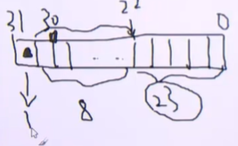
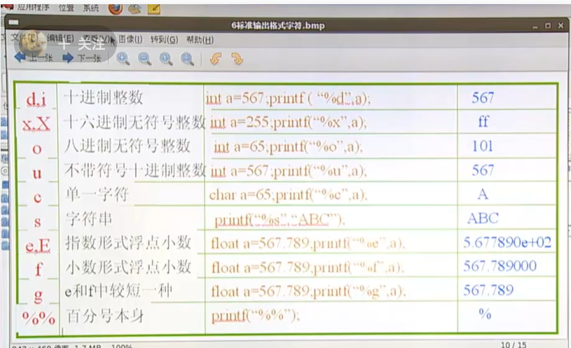
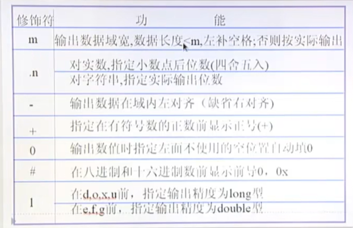

# C-Linux学习笔记

吕聪 2025年3月2日08:37:24

## 一、基本概念

## C语言背景知识

C语言发展史:
	1960   原型A语言->ALGOL语言
	1963   CPL语言
	1967   BCPL语言
	1970   B语言
	1973   C语言

C语言特点:
	1、基础性语言
	2、语法简洁，紧凑，方便，灵活
	3、运算符，数据结构丰富
	4、结构化，模块化编程思想
	5、移植性好，执行效率高
	6、允许直接对硬件操作(最重要的特性）

C语言学习建议:
	1、概念的正确性
	2、动手能力，能够耐得住寂寞，没有程序员是培训出来的
	3、阅读优秀的程序段
	4、大量练习、面试题

C语言课程讲解思路:
	1、基本概念
	2、数据类型，运算符和表达式是如何生成的
	3、输入输出专题
	4、流程控制
	5、数组
	6、指针
	7、函数
	8、构造类型
	9、动态内存管理
	10、调试工具和调试技巧(GDB,make) GDB主要是用来已经明确了错误的位置，然后进行调试的时候，效率很高 
	11、常用库函数
	

### 平台介绍

​	B站老师所用的平台：64位的redhat6,vim,gccc(make)。
​	个人平台：使用Win11和WSL2作为学习平台。

### 用GCC编译Hello World

​	一个hello.c编译为可执行文件的全过程为：

```
.c源文件 -> 预处理 -> 编译 -> 汇编 -> 链接 -> 可执行文件
```

​	编译时使用的编译器就是gcc，一般情况下并不会直接使用gcc，但gcc有一个比较常用的点在于可以直接打印出当前出错的行号。

```c
gcc -E hello.c
```
​	所有带有#的都是在预处理阶段处理掉的 比如说#include ，#define等等，因此可以看到预处理之后，gcc就将头文件给包含了进来。因为shell命令是默认输出到终端的，但生成的文件还需要进行下一步的编译操作，因此就需要将输出重定向到一个新的.i文件中去，所使用的命令如下所示。

```c
gcc -E hello.c > hello.i
```
​	然后就会生成一个新的hello.i文件。
```c
gcc -S hello.i 
```
​	这一条命令不需要指定重定向的文件名字，gcc会自动创建一个新的hello.s文件，这就是一个汇编文件，最后执行汇编操作。
```c
gcc -c hello.s 
```
​	就可以得到最后的可执行文件，可能教程中的gcc编译器的版本较早，当前的gcc编译器版本需要指定生成的.o文件才行。
```c
gcc -c hello.s -o hello.o
```
​	这样才会生成.o的目标文件，最后再进行链接操作就可以生成可执行文件。
```c
gcc hello.o -o hello
```
​	然后就可以在目录中看到一个绿色的可执行文件了，使用 ./hello 就可以执行当前目录下的hello可执行文件，当然并不是每次都需要这样进行操作的，懒狗的方式就是直接：
```c
gcc hello.c 
```
​	运行这条命令的时候，gcc会默认将刚才的流程全部走一遍，在运行的过程中并没有任何步骤上的优化，并且在运行之后会默认生成一个a.out的文件。当然也可以指定可执行文件的文件名是什么。

```c
gcc hello.c -o myhello
```
这条命令相当于直接执行的刚才所有操作中的最后一步。
```c
gcc hello.c -Wall
```
​	这个选项的意思就是 all warnings ，这一条命令的作用就是输出所有的错误也就是warning，warning的含义就是这个显示的东西并不影响程序的运行，或者说是可执行文件的生成。但是gcc说话比较圆滑，所以说存在两种情况，一种就是gcc显示的错误就是单纯的错误，另一种就是真正的error了。程序在编译的过程中除非是你能够明确地知道并能够解释出这个警告出现的具体的原因，并且知道这个警告对程序的运行并没有什么影响，在这种情况下才可以不去管它，否则的话最好是把程序调试到没有任何警告为止。
​	比如说定义了一个int i变量但是没有使用，这种警告就是没有影响的警告，因为一个进程在运行的时候就已经会占用非常多的内存空间了，当然了说完全没有影响也不对，只能说这是一个几乎可以忽略不计的警告，但最好还是一个警告都不要出现，可能会有未定义的行为出现。
​	在找不到函数原型的情况下，编译器会默认把函数的返回值当作是 int 整形，所以没有包括头文件的时候就有可能出现函数的返回值不匹配的这种警告的出现，这就是最底层的原理，在IDE环境下编程的时候，IDE或许会直接提示我们没有包含某一个库，但上面所说的调试技巧是在无法安装IDE的终端产生的有限提示，因此这是有必要进行学习的。	 

### main函数的多种写法

​	C语言一开始的时候就没有void类型，所以当时的编译器就认为main函数返回的是int类型，但是后来增加了void类型之后，就认为main函数是特殊的，因为main函数作为进程的入口、出口、程序是不需要返回值的，其中的argc、argv是命令行的参数，所以如果不需要命令行传入参数的话，就将参数写成void，具体怎么样要看代码的运行环境。

```c
	void main(void)
	void main(int argc, char **argv) // 其中argv也可以写作 char *argv[]
	int main(int argc, char **argv);
	int main(void);
```
### make:

​	make相比于gcc的好处在于不会出现文件覆盖，比如说使用gcc用Tab自动补全的时候，gcc hello.c -o hello.c的时候源文件就会被直接覆盖掉，但是make后面直接跟的就是一个target目标文件，然后make会根据这个目标文件的名字去找相应的后缀是.c的源文件，然后自动调用cc hello.c -o hello 这样的一条命令，所以这个时候再使用自动补全的话，也不会出现源文件被覆盖的情况，因为这个时候相当于make去找的是hello.c.c这样的一个源文件，所以并不能找到这样的一个源文件，因此命令也就不会被执行了。
​	cc 是编译器的参数 默认是gcc

### vim:

​	vim的配置文件和常用的快捷方式。
​	一定要有意识地去使用vi和vim的快捷方式，但是不要刻意去记忆，在使用过程中继续记忆。
​	vim的配置文件在vimrc中 /etc/vimrc 中
​	最好的是将vimrc拷贝到家目录中

```bash
cp /etc/vimrc ~/.vimrc
```

​	etc目录下的vimrc是针对所有的用户有效，而家目录里面的文件是只对自己有效，并且设置成隐藏的就不会误操作了。代码对其的操作就是，先用ESC退出编辑模式，然后按下V进入可视化模式，选择代码之后按下等号就会自动对齐了。
​	因为vimrc是在vim启动的时候运行的，所以重新启动vimrc即可重新导入新的配置,使用vim进行补全的操作就是用ctrl+P即可，然后如果想看某一个函数的手册的话，将光标放在想要查找的函数名字上面之后shift+K即可直接跳转到这个函数的man手册中，然后想要回到vim界面的话，就直接按两下Q键即可，非常方便。


## 

### 怎么写好代码

以helloworld程序为例对写程序的思路提出如下要求:
	1）头文件包含的重要性
	在c中，如果没有出现函数原型，就默认函数的返回值是int

```c
#include <stdio.h>

int main()
{
<<<<<<< HEAD
    int *num = malloc(sizeof(int));
    *num = 100;

    printf("%d\n",*num);
=======

    int *num = (int *)malloc(sizeof(int));

>>>>>>> d8201497ccb6ce60411ef4f1d6347921a54e7c22
>>>>>>> return 0;
>>>>>>> }
```

```c
hello.c: 在函数‘main’中:
hello.c:5:23: 警告：隐式声明函数‘malloc’ [-Wimplicit-function-declaration]
    5 |     int *num = (int *)malloc(sizeof(int));
          |                       ^~~~~~
          hello.c:5:23: 警告：隐式声明与内建函数‘malloc’不兼容
```

- 正确写法

```c
#include <stdio.h>
#include <stdlib.h>
int main()
{
    int *num = (int *)malloc(sizeof(int));
    return 0;
}
```

​	2）以函数为单位来进行程序的编写
​	涉及到多线程的内容时，其实main()就是线程的入口，比如说要写一个能够加减乘除的功能，如果说是都写在一个函数里面的话，在以后调用的时候会产生不必要的系统开销，但是携程加减乘除四个小的函数的话，就能够增加函数的复用性，减小了未来的工作量。至于说为什么要将函数打散或者是聚合在一起，还是看未来是否会调用这个功能或者说是函数，如果这么一段的代码在有可能需要调用的话，最好还是写开，但如果未来在编程的时候不太可能会用得到的话，将函数的代码都写在一起也能够增加代码的可维护性。	
​	3）声明部分+实现部分
​	在程序前方，头文件和函数的真正具体实现部分中间就是整个程序的声明部分，而在一个函数的上方就是一个函数的声明部分。
​	4)return 0和exit(0)的区别
​	return 0的意思是结束当前函数，而exit(0)的意思是结束当前进程，一般情况下来说，在单线程单进程中这两者几乎是没有什么区别的，需要注意的是return 0返回的是父进程也就是给父进程看的，不能说给Shell看的，在当前所学习的内容中，这个父进程就是Shell，并非完全是课本上面所说的操作系统，但并非所有程序的父进程都是Shell，这一点需要注意。具体的使用的话，可以用 echo $? 这个命令，它输出的是上一条命令的执行状态，如果 return 0 成功运行的话，那么很显然在终端上出现的就是 0 ,这个和Shell脚本的真假刚好是对立的，所以在这一点需要注意。其次需要注意的就是，假如说 hello.c 没有return 0 的语句的话，这个程序并不是会默认返回 0 的， 正常情况下返回为 0 ，然后在出错的情况下返回为非零值，这个只是程序员约定俗成的一个观念，并不是实际的情况，就这个程序本身而言，假如说没有return 语句的话，那么返回的应该是13，因为算上字母 空格 和换行符一共有13个，这个就是printf的返回值。
​	5）适当地多用空格和空行
​	6）适当地在程序中多用注释
​	如果是注释掉函数的话，可以用#if 0 然后 在函数的末尾 #endif 这样的形式注释掉函数，会显得更加专业一点。
2.算法：解决问题的方法。
​	方法是不需要考虑成本和开销的，只是去思考问题解决的步骤。
​	（流程图，NS图，有限状态机-FSM）
3.程序：用某种语言实现算法
4.进程：一个程序开始运行的时候叫做进程
5.防止写越界，防止内存泄漏，谁打开谁关闭，谁申请谁释放。如果能够做到这几点就是很好的程序员了。


## 二、数据类型 运算符 表达式

- 基本类型
  - 数值类型
    - 整形
      - 短整型 short 
      - 整型 int
      - 长整型 long
    - 浮点型
      - 单精度型 float
      - 双精度型 double
  - 字符类型
    - 字符类型 char
- 构造类型
  - 数组 (和很多初学者想的不一样，数组其实就已经是构造类型了)
  - 结构体 struct
  - 共用体 union
  - 枚举类型 enum
- 指针类型
- 空类型 void (经典C中并没有void类型，是后来的标准中加入的)

​	需要注意的是，数据类型所占字节数随机器硬件不同而不同，本人所使用的系统基本数据类型的具体定义如下，在 **Ubuntu 20.04 (64位)** 下，C语言的基本数据类型的范围通常遵循 **LP64** 模型，也就是：

|   数据类型    | 字节数（sizeof） |                             范围                             |
| :-----------: | :--------------: | :----------------------------------------------------------: |
|    char    |      1 byte      |           -128 到 127（有符号）0 到 255（无符号）            |
|    short    |     2 bytes      |       -32,768 到 32,767（有符号）0 到 65,535（无符号）       |
|     int     |     4 bytes      | -2,147,483,648 到 2,147,483,647（有符号）0 到 4,294,967,295（无符号） |
|    long     |     8 bytes      | -9,223,372,036,854,775,808 到 9,223,372,036,854,775,807（有符号）0 到 18,446,744,073,709,551,615（无符号） |
|  long long  |     8 bytes      |               同 `long`（在 LP64 架构下相同）                |
|    float    |     4 bytes      |           约 ±3.4E-38 到 ±3.4E+38，6~7 位有效数字            |
|   double    |     8 bytes      |         约 ±1.7E-308 到 ±1.7E+308，15~16 位有效数字          |
| long double | 16 bytes（通常） |        约 ±3.4E-4932 到 ±1.1E+4932，18~19 位有效数字         |


对于数据类型需要思考的问题：
	1）所占字节数
	2）存储区别
	3）不同类型的数据间如何进行转换
	4）特殊性：布尔类型bool，这个代表一个逻辑值，逻辑真和逻辑假。float类型，本质上就是一个数值范围，因为就像一个只有厘米刻度的尺子要取到1.5cm的话就非常容易取到1.5000001或者1.499999这样的数据，这就是浮点数的精确度的一个问题，本质上来源于2进制对于小数的模拟只是一个近似，因为在小数点后都是2的幂运算。char类型的符号是未定义的行为。不同形式的0值：0，‘0’，“0”，‘\0'。数据类型与后续代码中所使用的输入输出要相匹配，比如说定一个一系列的无符号数做一些的图像处理，但是后边IO的时候忘记掉了，printf的时候使用了%d这样的一个有符号数来打印无符号数就会导致数据截半变成负数。

在标准C中对于任何一种数据类型所占的字节大小或者叫所占的位数，都没有严格意义上的规定，标准C中只规定int类型所占字长为一个机器字长，而short int类型要小于等于int类型，long int类型要大于等于int类型，char类型要小于int类型，float类型和double类型要大于int类型，仅仅是一个范围上的规定。实型数据其实也有正负之分，只不过这种正负之分体现在定义上。在C语言程序中不能识别二进制，八进制、十进制、十六进制都可以识别。

​	正数的补码就是其二进制码本身，负数的补码就是它的绝对值的二进制码取反再加一，二进制的获取就是除2取余倒序排列。

基本的进制转换

```C
254 -> unsigned int -> 32bit -> 4byte
    -> int -> 32bit
// 整形数的本身都是通过补码来进行存储的
-254 -> 254 -> 1111 1110 取反 + 1
// unsigned int 和 int的区别就是最高位代表的是符号位还是正常的有效数值，如果是无符号数的话最高位是零还是一并不代表符号，如果是有符号数为0的时候代表的是正数，为1的时候代表的是负数。
// 转化为八进制就可以3个一组，转化为16进制就可以4个一组
(254)10 = (1111 1110)2 = (376)8 = (FE)16

// 写成这种写法什么都不带就是十进制形式
254
// 二进制可以写在程序里面但是不能赋值给变量
B11111110(c不认识这个表示)
// 0开头就是八进制
0376
// 0x开头就是十六进制
0xFE
    
// float浮点类型的表示方式，只需要在意精度和指数部分是多少，double比float多出来的32为都是放在了精度部分，因此能够表示的数据范围更大。
3.14
0.314 * 10^1
```





ASII码表

| 十进制 | 十六进制  | 字符 | 控制符 | 描述         |
| ------ | --------- | ---- | ------ | ------------ |
| 0      | 0x00      | NUL  | NUL    | 空字符       |
| 1      | 0x01      | SOH  | SOH    | 标题开始     |
| 2      | 0x02      | STX  | STX    | 正文开始     |
| 3      | 0x03      | ETX  | ETX    | 正文结束     |
| 4      | 0x04      | EOT  | EOT    | 传输结束     |
| 5      | 0x05      | ENQ  | ENQ    | 询问         |
| 6      | 0x06      | ACK  | ACK    | 确认         |
| 7      | 0x07      | BEL  | BEL    | 响铃         |
| 8      | 0x08      | BS   | BS     | 退格         |
| 9      | 0x09      | TAB  | HT     | 水平制表符   |
| 10     | 0x0A      | LF   | NL     | 换行         |
| 11     | 0x0B      | VT   | VT     | 垂直制表符   |
| 12     | 0x0C      | FF   | NP     | 换页         |
| 13     | 0x0D      | CR   | CR     | 回车         |
| 14     | 0x0E      | SO   | SO     | 移出         |
| 15     | 0x0F      | SI   | SI     | 移入         |
| 16     | 0x10      | DLE  | DLE    | 数据链路转义 |
| 17     | 0x11      | DC1  | XON    | 设备控制1    |
| 18     | 0x12      | DC2  | XOFF   | 设备控制2    |
| 19     | 0x13      | DC3  | DC3    | 设备控制3    |
| 20     | 0x14      | DC4  | DC4    | 设备控制4    |
| 21     | 0x15      | NAK  | NAK    | 否定确认     |
| 22     | 0x16      | SYN  | SYN    | 同步空闲     |
| 23     | 0x17      | ETB  | ETB    | 块结束       |
| 24     | 0x18      | CAN  | CAN    | 取消         |
| 25     | 0x19      | EM   | EM     | 媒介结束     |
| 26     | 0x1A      | SUB  | SUB    | 替换         |
| 27     | 0x1B      | ESC  | ESC    | 转义         |
| 28     | 0x1C      | FS   | FS     | 文件分隔符   |
| 29     | 0x1D      | GS   | GS     | 群组分隔符   |
| 30     | 0x1E      | RS   | RS     | 记录分隔符   |
| 31     | 0x1F      | US   | US     | 单元分隔符   |
| 32     | 0x20      | 空格 |        | 空格         |
| 33     | 0x21      | !    |        | 感叹号       |
| 34     | 0x22      | "    |        | 双引号       |
| 35     | 0x23      | #    |        | 井号         |
| 36     | 0x24      | $    |        | 美元符号     |
| 37     | 0x25      | %    |        | 百分号       |
| 38     | 0x26      | &    |        | 与符号       |
| 39     | 0x27      | '    |        | 单引号       |
| 40     | 0x28      | (    |        | 左括号       |
| 41     | 0x29      | )    |        | 右括号       |
| 42     | 0x2A      | *    |        | 星号         |
| 43     | 0x2B      | +    |        | 加号         |
| 44     | 0x2C      | ,    |        | 逗号         |
| 45     | 0x2D      | -    |        | 减号         |
| 46     | 0x2E      | .    |        | 句点         |
| 47     | 0x2F      | /    |        | 斜杠         |
| 48-57  | 0x30-0x39 | 0-9  |        | 数字 0 到 9  |
| 58     | 0x3A      | :    |        | 冒号         |
| 59     | 0x3B      | ;    |        | 分号         |
| 60     | 0x3C      | <    |        | 小于号       |
| 61     | 0x3D      | =    |        | 等号         |
| 62     | 0x3E      | >    |        | 大于号       |
| 63     | 0x3F      | ?    |        | 问号         |
| 64     | 0x40      | @    |        | ＠符号       |
| 65-90  | 0x41-0x5A | A-Z  |        | 大写字母     |
| 91     | 0x5B      | [    |        | 左方括号     |
| 92     | 0x5C      | \    |        | 反斜杠       |
| 93     | 0x5D      | ]    |        | 右方括号     |
| 94     | 0x5E      | ^    |        | 脱字符       |
| 95     | 0x5F      | _    |        | 下划线       |
| 96     | 0x60      | `    |        | 反引号       |
| 97-122 | 0x61-0x7A | a-z  |        | 小写字母     |
| 123    | 0x7B      | {    |        | 左大括号     |
| 124    | 0x7C      |      |        |              |
| 125    | 0x7D      | }    |        | 右大括号     |
| 126    | 0x7E      | ~    |        | 波浪号       |
| 127    | 0x7F      | DEL  | DEL    | 删除         |

char类型在C语言中的符号问题是未定义的行为。

需要记住几个特殊的，比如0，A，a的这几个。

类型转换

大的往小的转换就会造成精度丢失

隐式转换，显示转换

``` c
int i;
float f;
doubel d;
char ch;

ch + i -> i
f -d -> d

(ch + i) - (float -double) -> double
   int   -       double   这就是隐式转换
后边再讲强制类型转换符
```

#### bool

``` c
#incldue <stdio.h>
#include <stdlib.h>
#include <stdbool.h> // 布尔值的标准库

int main() {
  bool a = false;
  printf("a = %d\n", a);
  exit(0);
}
```

#### 浮点型的失真问题

``` c++
// flow类型没有办法直接界定0的这个范围，因此可以让这个数和零相减的绝对值小于一个很小的数字来判断是不是0，归根结底在于flow类型没有办法直接和一个数进行比较，因为没有办法和一个不准确的数字进行比较。
int func(float f) {
  if (f < 0) {
    return -1;
  } else if (fabs(f-0) <= 1e-6) {
    return 0;
  } else {
  return 1;
  }
}
```

####  char

**在iso c中 `char`有无符号是未定义行为**

#### 0

``` c++
0(整形) '0'(字符常量) "0"(字符串常量) '\0'(字符常量)
```

#### 输入输出

数据类型要和后续代码中所使用的输入输出要相匹配(小心自相矛盾)

``` c++
#include <stdlib.h>
#include <stdio.h>

int main() {
  unsigned int a;
  a = 1 << 31;
  printf("%d", a);
}

```

正确

``` c++
#include <stdlib.h>
#include <stdio.h>

int main() {
  unsigned int a;
  a = 1 << 31;
  printf("%ud", a);
}

```

### 常量与变量

#### 常量

在程序执行过程中值不会发生变化的量，数组名就是一个很典型的常量，当数组被定义之后GCC编译器就会

分类：整形常量、实型常量、字符常量、字符串常量、标识常量。

- 整形常量： 1，790,76,52
- 实型常量： 3.14，5.26
- 字符常量： 由单引号引起来的单个的字符或转义字符，'\t' '\n' '\0' '\015'(8进制) '\x7f' '\018'(错误的表示！！八进制数中没有8，f)
- 字符串常量：由双引号引起来的一个或多个的字符组成的序列， ""空串占一个字节，尾零 "a" "abXYZ" "abc\n\021\010"(a b c \n \021 \0 1 8)
- 标识常量 ：#define，直跟的是宏名，宏名后面的是宏体。宏定义是在预处理阶段用宏体完整替换宏名，并不做语法检查，因此也可以定义一个表达式。宏定义的一个很重要的作用就是批量管理使用到的常量。处理在程序的预处理阶段，占编译时间，一改全改，不检查语法，只是单纯的宏体与宏名之间的替换。
常量一定不会在赋值的左边。
##### 宏的用法

``` c++
// 使用gcc -E define.c > define.i可以查看
#include <stdlib.h>
#include <stdio.h>

#define PI 3.1415926
#define ADD 2+3 // 会出现优先级问题
// 正确写法
//#define ADD (2+3)
int main() {
  printf("%f\n", PI);
  printf("%d\n", ADD * ADD);
}

```

``` c++
# 6 "pi.c"
int main() {
  printf("%f\n", 3.1415926);
  printf("%d\n", 2+3 * 2+3);
}
```
```C++
#include <stdlib.h>
#include <stdio.h>
// 带参数的宏的使用
#define MAX(a,b) (a > b ? a : b)

int main()
{
	int i = 5, j = 3;
    // 较大的那个会自增两次
	printf("i = %D\tj = %d\n", i , j);
	printf("%d\n", MAX(i++, j++));
	printf("i = %D\tj = %d\n", i , j);
	
	exit(0);
}
```
带参数的宏和函数的区别在于是，#占用的是编译时间而函数占用的是程序运行时间，函数是要在调用的位置对当前的执行现场进行一个压栈保存，然后跳转到需要执行的函数入口地址去执行，会有一个压栈、去到别的地址执行，回来弹栈，恢复现场等过程，这些占用的是系统运行时间。那该怎么使用呢？相比于完成一样功能的函数来讲的话，宏定义的使用是非常危险的，但是非常节省程序的运行时间，如果能够节省非常多的时间就用宏，函数的话一般就是在应用层面，系统层面的开发的时候使用函数，因为对于应用层来说最主要的是性能但是在内核层面的情况下，最主要的是性能，内核能够提速1s的话，反应到用户层面的感受是不一样的。要求稳定用函数，要求效率和性能使用宏。
```C++
#include <stdlib.h>
#include <stdio.h>
// 带参数的宏的使用
#define MAX(a,b) (a > b ? a : b)

#if 0
int max(int a, int b)
{
	return a > b ? a : b; 
}
#endif

int main()
{
	int i = 5, j = 3;
    // 较大的那个会自增两次
	printf("i = %D\tj = %d\n", i , j);
	printf("%d\n", MAX(i++, j++));
	printf("i = %D\tj = %d\n", i , j);
	
	exit(0);
}
```
``` c++
// 解决自增两次的问题，创建两个变量在临时存储，这样就只会存储i++，这样的话i就是只会自增一次了，使用反斜线就可以在下一样书写表达式了。
#include <stdlib.h>
#include <stdio.h>
// 带参数的宏的使用
// #define MAX(a,b) (a > b ? a : b)
#define MAX(a,b) ({int A=a,B=b; ((A) > (B) ? (A) : (B));})

int main() {
  int a = 3, b = 5;
  printf("%d\n",MAX(a++, b++));
  printf("%d\n",MAX(a++, b++));
}

```

``` c++
#include <stdlib.h>
#include <stdio.h>
// 因为刚才的代码只能适用于int类型，因此就可以使用typeof()获取到a 的类型之后，就可以根据传入的数据的类型来定义新的变量了。
#define MAX(a,b) ({typeof(a) A=a,B=b; ((A) > (B) ? (A) : (B));})

int main() {
  int a = 3, b = 5;
  printf("%d\n",MAX(a++, b++));
  printf("%d\n",MAX(a++, b++));
}

```

在程序的预处理阶段，占编译时间，不占运行时间(没有函数调用的消耗)，但不检查语法(比较危险)

#### 变量

变量：用来保存一些特定内容，并且在程序执行过程中随时会发生变化的量。
定义：[存储类型] 数据类型 标识符 = 值
            TYPE     NAME  = VALUE

给某一个内存空间取的名字就是这个NAME，这个NAME本质上是对地址的抽象，就像是送快递只会送到什么街道，不会直接送到经纬度位置，但地名本质上就是对经纬度的一个抽象表达。

标识符：由字母，数字，下划线组成且不能以数字开头的一个标识序列。写标识符的时候尽量做到见名知意，
数据类型：基本数据类型+构造类型
值：注意匹配。
存储类型：涉及到的关键字auto static register extern(说明型)
前面没有指定存储类型就是因为没有指定的情况下默认就是auto类型。

- auto：默认，自动分配空间，自动回收空间，这个类型在栈上。

- register：建议型关键字，只是建议编译器把这个变量放到寄存器中，但是GCC不一定放进去。寄存器类型，寄存器运算很快因为其位于CPU中，相对于普通的寻址取数运算放回的操作，寄存器类型直接就是取CPU内部的数据，拉进了取数的距离。使用这个存储类型的时候需要满足条件，只能定义局部变量，不能定义全局变量，并且大小有限制，只能定义32位大小的数据类型，比如double就不可以。因为寄存器没有地址，所以一个register类型的变量无法打印出地址查看或使用。
- extern：说明型，说明我定义的变量不在这里，需要去其它的地方找，意味着不能改变被说明的量的值或类型，可以用来扩展外部变量的作用域
- static：静态型，自动初始化为0值或空值，并且static变量的值有继承性。另外常用来修饰一个变量或者函数(防止当前函数对外扩展，简单来说就是限制了全局变量的作用域仅在当前的文件中相当于变相提供接口来进行调用但是不直接展示这个函数，将函数隐藏了起来)。这个就是相当于申请了一段固定的内存地址，此后在程序运行的整个周期，该变量所对应的内存地址都不会被修改。静态变量和全局变量的区别仅在于作用域，可以认为static就是一个受限制的全局变量。
  变量的生命周期和作用范围
  - 全局变量和局部变量，全局变量的作用范围从变量定义开始到程序结束，局部变量的作用范围是从定义开始到块作用域结束。
  - 局部变量和局部变量
  - 参考表格，存储类型比较


### 变量存储类型

| 变量类型 | 局部变量          |  局部变量                  |         局部变量           |             外部变量       | 外部变量          |
|:--------:|:-----------------:|:------------------:|:------------------:|:------------------:|:-----------------:|
| 存储类别 | auto              | register           | 局部 static        | 外部 static        | 外部              |
| 存储方式 | 动态              | 动态               | 静态               | 静态               | 静态              |
| 存储位置 | 动态区            | 寄存器             | 静态存储区         | 静态存储区         | 静态存储区        |
| 生命周期 | 函数调用时开始至结束 | 函数调用时开始至结束 | 程序整个运行期间 | 程序整个运行期间 | 程序整个运行期间 |
| 作用域   | 定义变量的函数或复合语句内 | 定义变量的函数或复合语句内 | 定义变量的函数或复合语句内 | 本文件             | 其他文件          |
| 赋初值   |每次函数调用时|每次函数调用时|编译时赋初值，只赋一次|编译时赋初值，只赋一次|编译时赋初值，只赋一次|
| 未赋初值 | 不确定            | 不确定             | 自动赋初值0或空字符 |  自动赋初值0或空字符    | 自动赋初值0或空字符 |

---

### 补充说明：

- 局部变量默认为 `auto` 类型  
- `register` 类型变量个数有限，且不能为 `long`、`double`、`float` 类型  
- 局部 `static` 变量具有全局生命周期和局部可见性 
- 外部 `static` 变量具有可继承性，文件内可见性（不能被其他文件访问）  
- `extern` 不是变量定义，可扩展外部变量作用域  

``` c++
#include <stdlib.h>
#include <stdio.h>

void func() {
  static int x = 1;
  x++;
  printf("%p->%d\n", &x, x);
}

int main() {
  func();
  func();
  func();
}

2
3
4
```
作用域永远是内部的屏蔽外部的。
```C++
#include <stdio.h>
#include <stdlib.h>

int i = 100;
int main()
{
	int i = 3;
	{
		int i = 5;
		printf("%d", i);
	}
	printf("%d", i);
	
	exit(0)
}
```
当前模块对全局变量的修改会影响到其它模块对该变量的使用。
```C++
int i = 0;

void print_star(void)
{
	for(i = 0;i < 5;i ++)
		printf("*");
    printf("\n");
    // 自动匹配当前语句匹配的函数名
    printf("[%s]i = %d\n", __FUNCTION__, i);
}
int main()
{
	for(i = 0;i < 5;i ++)
		printf_star();
    printf("[%s]i = %d\n", __FUNCTION__, i);
    exit(0);
}
```


vim * -p
vim * -p 是一个使用Vim编辑器的命令，其中的*是一个通配符，代表当前目录下所有的文件。具体地说，命令vim * -p会打开当前目录下所有的文件，并将它们显示在Vim中的不同标签页上，这样你可以在这些文件之间轻松切换和编辑。
对函数修饰static就是限制了其只能在当前文件中被调用，在别的文件中就是不可见的，防止函数对外扩展。
``` c++
// main.c
#include <stdio.h>
#include <stdlib.h>

#include "proj.h"

int i = 10;

int main() 
{
  	printf("[%s]%d\n", __FUNCTION__, i);
	exit(0);
}
```
``` c++
// proj.c
#include <stdio.h>
#include <stdlib.h>

#include "proj.h"

extern int i; // 不定义 而是引用了其他地方的i，使用extern 的时候不能给变量赋初始值就是因为extern不能修改变量的值。甚至于使用extern的时候可以不说明变量的类型，这就是告诉编译器我要用到某一个变量，但是可读性就实在是太差了。
int func() 
{
  	printf("[%s]%d\n", __FUNCTION__, i);
    exit(0);
}
// 注意这里的主调函数call_func()要在被调函数func()之下。因为此时的func()只能在当前的文件中使用，而call_func()没有用static来进行修饰，所以能够被main.c进行调用，进而也就调用了func()，此时func()就相当于被隐藏了起来。
void call_func()
{
	func();
	exit(0);
}
```
``` c++
#ifndef PROJ_H__
#define PROJ_H__

static void func();

#endif
```
## 运算符和表达式

### 表达式

表达式和语句的区别，没有加分号的就是表达式，加了分号之后就称作其整体为语句。变量和运算符组成的内容就叫做表达式。
	运算符部分：

1. 每个运算符所需要的参与运算的操作数个数。
2. 结合性
3. 优先级
4. 运算符的特殊用法：%的左右两边必须都是整数。自增自减运算，运算符在前就先进行计算，再取变量值使用，变量在前就先取变量值使用，再进行计算。=和==，逻辑运算符的短路特性。
```C++
int i = 1;
i++ --> 表达式的值为1，i值为2 
++i --> 表达式的值为2，i值为2

int i = 1, j = 10, value;
value = i++ + ++j;// 结果是12

int i = 1, j = 10, value;
value = --i + j++;// 结果是10
```
5. 位运算的重要意义

### C 语言运算符分类

| 运算符类别   | 运算符                           |
| ------------ | -------------------------------- |
| 算术运算符   | `+` `-` `*` `/` `%` `++` `--`    |
| 关系运算符   | `<` `<=` `==` `>` `>=` `!=`      |
| 逻辑运算符   | `!` `&&` `||`                    |
| 位运算符     | `<<` `>>` `|` `&` `~` `^`            |
| 赋值运算符   | `=` 及其扩展（如 `+=`、`-=` 等） |
| 条件运算符   | `?:`                             |
| 逗号运算符   | `,`(逗号运算表达式的值就是最后一个表达式的值)        |
| 指针运算符   | `*` `&`                          |
| 求字节数     | `sizeof`                         |
| 强制类型转换 | `(类型)`                         |
| 分量运算符   | `.` `->`                         |
| 下标运算符   | `[]`                             |
| 其它         | `()`                             |

### 运算符优先级表（从高到低）

| 优先级 | 运算符                                | 结合性   |
| ------ | ------------------------------------- | -------- |
| 1      | `()` `[]` `.` `->`                    | 从左到右 |
| 2      | `!` `+`（正） `-`（负） `~` `++` `--` | 从右到左 |
| 3      | `*` `/` `%`                           | 从左到右 |
| 4      | `+` `-`                               | 从左到右 |
| 5      | `<<` `>>`                             | 从左到右 |
| 6      | `<` `<=` `>` `>=` `instanceof`        | 从左到右 |
| 7      | `==` `!=`                             | 从左到右 |
| 8      | `&`（按位与）                         | 从左到右 |
| 9      | `^`（按位异或）                       | 从左到右 |
| 10     | `|`（按位或）                         | 从左到右 |
| 11     | `&&`                                  | 从左到右 |
| 12     | `||`                                  | 从左到右 |
| 13     | `?:`                                  | 从右到左 |
| 14     | `= += -= *= /= %= &= |= ^= <<= >>=`   | 从右到左 |
### 逻辑运算符 真值表

#### `&&` 运算符（与运算符）

| op1 | op2 | op1 && op2 |
|-----|-----|-----------|
|  0  |  0  |     0     |
|  0  |  1  |     0     |
|  1  |  0  |     0     |
|  1  |  1  |     1     |

#### `||` 运算符（或运算符）

| op1 | op2 | op1  \|\|  op2 |
|-----|-----|-----------|
|  0  |  0  |     0     |
|  0  |  1  |     1     |
|  1  |  0  |     1     |
|  1  |  1  |     1     |

#### 逻辑运算符的短路性

``` c++
#include <stdio.h>
#include <stdlib.h>

int main() {
  int a = 1, b = 2, c = 3, d = 4;
  int m = 1, n = 1;
  // 当运算符的左边为假的时候，右边的语句是不会再进行计算的，所以此时的n值为1
  	(m = a > b) && (n = c > d);
	(m = a > b) || (n = c > d);
  
  	printf("m = %d\n n = %d\n", m, n); // m : 0 n : 1
    
    
    
    int a = 9;
    a -= a *= a += 3;//答案是0，记住是从右往左算的，这时重点
    a+= 3 -> 9
        a*=9->81
        a-=81=0
        
    op1 ? op2 : op3
	// 如果op1值为真就取op2的值，否则取op3的值
}
```

#### sizeof

sizeof不是一个函数，是一个运算符

``` c++
#include <stdio.h>
#include <stdlib.h>

int main() {
  printf("%lu, %lu, %lu, %lu, %lu, %lu, %lu\n",
         sizeof(int),sizeof(short), sizeof(long),
         sizeof(double), sizeof(float), sizeof(char), sizeof(void*));
}

4, 2, 8, 8, 4, 1, 8

```

#### 强制类型转换

强制类型转换的转换是一个中间过程，相当于其只是生成了一个中间变量进行赋值操作，然后再舍弃掉，并不会修改掉原来变量的值，本质上只是把一个值当作一个值来对待了，对原来的值并没有任何影响。

#### 位运算

- | 按位或
- & 按位与
- ^ 按位异或
- ~ 按位取反

> 需要掌握的操作

将操作数中的第n位置1 其他位不变 num = num | 1 << n;
将操作数中的第n位置0 其他位不变 num = num & ~(1<<n);
测试第n位: if(num & (1<<n))
从一个指定宽度的数中取出某几位：(result) = (num >> pos) & ((1 << len) - 1);

左移一位就是右补零，右移一位就是左边补零，左移右移就相当于乘二除以二的操作。

按位或的计算原则是统一为二者有一位为真就为真，如果两者都为假才为假。

异或是相同为零，不同为1
```C++
# 假设 a = 5 (0b0101), b = 3 (0b0011)

# 按位或 |
  0101
| 0011
---------
= 0111  -> 7

# 按位与 &
  0101
& 0011
---------
= 0001  -> 1

# 按位异或 ^
  0101
^ 0011
---------
= 0110  -> 6

# 按位取反 ~a
~ 0101
---------
= 1010 (在补码中为 -6)
      
# 将 num 的第 n 位（n = 1）设置为 1
# 原 num = 0100 (即 4)
# 1 << 1 = 0010
  0100
| 0010
---------
= 0110  -> 6

# 将 num 的第 n 位（n = 2）清零（设置为 0）
# 原 num = 0111 (即 7)
# ~(1 << 2) = ~0100 = 1011
  0111
& 1011
---------
= 0011  -> 3
```

## 三、输入输出

input & output --> I/O

IO分为标准IO和文件IO，输入输出是任何系统都非常重要的功能

基本函数介绍

1.格式化输入输出函数：scanf、printf

int printf (const char *format,  ...);一般而言是很少能见到使用char来进行传参的函数，因为其数据大小比较窄，所以一般都是使用int来进行传参的，包括getchar和puchar都是使用int来进行传参的。
format ：“%[修饰符] 格式字符” 参照图片

int scanf (const char *format,  ...); 省略的就是地址表项
format：抑制符*，抑制输入就相当于是吃掉多少内容，接收输入但是不赋给任何变量

%s的使用是很危险的，因为不知道存储空间的大小，scanf放在循环结构中要注意能否接收到正常有效的内容

还需要注意的就是字面量123等数值一定要使用变量传参，不然没有单位的数值没有意义，谁也不知道这是几进制的数据。是在需要使用的时候就是在后面加上L这样的修饰符，例如
5*1024*1024*1024
5*1024LL 后面加上LL
#define SEC_YEAR  （60LL*60LL*24LL*365LL）、

调试技巧
```C++
// 后面的两个宏能够显示所在的函数和行号
printf("[%s:%d]",__FUNCTION__,__LINE__);
```
函数名相同参数类型或者数量不同的叫做函数重载，这种是在CPP的环境中的叫法，在C语言的环境中就是变参函数来实现的。如何区别就是加多参数，报语法错误的话就是定参函数重载，如果只是隐含的警告就是变参函数。

修饰符是可以省略的，但是格式字符是不可以省略掉的

2.字符输入输出函数：getchar，putchar
3.字符串输入输出函数：gets(!)，puts

gets这个函数非常危险是因为它并不对缓冲区溢出做任何的检查，因此标准库不允许使用gets，转而使用fgets，但是这也是治标不治本的行为，fgets虽然更加安全了但是只能保证不会出错而不能保证获取到我们需要的字符串，有一个方言getline可以完整拿进来一个字符串，它使用动态内存来实现的，所以不管字符串有多大都可以实现字符串的读取，这个不是c89也不是c99。

- printf
- 



#### 变长参数 

``` c++
int main() {
  int i = 123;
  printf("%4d\n", i);
  
  float f = 1.23455;
  printf("%.3f\n", f);
  
  char* s= "helloworld";
  printf("%10.5s\n", s);
}
```

#### 刷新缓冲区

现在用到的终端设备，默认是全缓冲模式，因为涉及到终端设备所以变成了行缓冲模式

printf是遇到\n或者缓冲区满了才自动刷新缓冲区的，所以说\n其实就是在强制刷新缓冲区，没有这个就会把before放在缓冲区中，要么等程序结束，要么等强制刷新函数，要么就是等缓冲区满了自动刷新。

`stdout` 默认是**全缓冲模式**，**但是**如果它连接的是“终端”（如控制台/屏幕），标准库会自动将它切换为**行缓冲模式**。

如果你把 `printf()` 输出到一个文件中，它是**全缓冲**；

如果你把 `printf()` 输出到终端，它就是**行缓冲**；

但如果你没写换行符 `\n`，行缓冲也不会触发输出！


``` c++
int main() {
  printf("[%s:%d] before while().", __FUNCTION__, __LINE__);
  while(1);
  printf("[%s:%d] after while().", __FUNCTION__, __LINE__);
}
```

流程是这样的：

1. `printf()` 把内容写入 `stdout` 缓冲区。
2. 由于没有 `\n`，**行缓冲没被触发**。
3. `while(1);` 死循环，程序**永远不会刷新缓冲区**。
4. 所以你**看不到输出**。

正确写法

``` c++
#include <stdlib.h>
#include <stdio.h>

int main() {
  printf("[%s:%d] before while().]\n", __FUNCTION__, __LINE__);
  // 或者
  //printf("[%s:%d] before while().", __FUNCTION__, __LINE__);
  //fflush(stdout); 
  while(1);
  printf("[%s:%d] after while().", __FUNCTION__, __LINE__);
}

```

- scanf

``` c++
int main() {
  int i;
    // 一般不会在scanf中输入什么提示符，因为你输入什么就要原样输入
    // 其次就是中间不要有分隔符，否则就会导致字符串被切断的现象发生
  scanf("%d", &i);
  printf("%d\n", i);
}
```

> scanf 在使用 `%s` 的时候要特别小心

``` c++
#include <stdio.h>
#include <stdlib.h>

int main() {
  char S[3];

  scanf("%s", S); // 如果输入 abcdef
  printf("%s", S); // 可能会出现段错误，不会报错但是会溢出，是一种典型的缓冲区溢出攻击
}

```

> scanf 在循环中使用的时候要特别小心

``` c++
// 当输入a的时候，a并不会匹配%d，因为a是一个char类型，就会重复使用输入缓冲区内容，也就是上一次输入的内容
// 因此将scanf放在循环中一定要对scanf进行返回值的校验
int main() 
{
  int ret = 0;
  int d = 0;
  
  while(1) 
  {
    ret = scanf("%d, d);
    if (ret == -1) 
    {
      perror("Error");
      break;
    }
    printf("&d\n", d);
  }
  exit(0);
}
```

> 处理换行连续输入的问题可以通过使用抑制符和getchar来吃掉换行符

``` c++
int main() {
  int i = 0;
  char c = 0;
  
  scanf("%d", &i);
  scanf("%*c%c", &c);
  // 或者
  //getchar();
  //scanf("%c", &c);
  printf("i = %d, c = %c", i, c);
}
```

输入输出部分练习题

一个水分子的质量大约是3.0e-23g，一夸脱水大约有950g，编写一程序，要求从终端输入水的夸脱数，然后显示这么多夸脱水中包含有大概多少水分子。

``` c++
#include <stdio.h>
#include <stdlib.h>

#define WEIGHT 3.0e-23
#define QUART 950

// 使用static来修饰就是禁止了water函数的外部扩展性。
static void water (void)
{
    float num;
    float sum;
    
    // 注意一定要加上换行符，否则程序会不正常运行
    printf("Please input for num:\n");
    scanf("%f", &num);
    // 报错
    if (num <= 0)
    {
        fprintf(stderr, "Input error!\n");
        exit(1);
    }
    
    // 注意这里其实是进行了一个隐式类型转换，QUART其实是一个整型常量
    sum = num * QUART / WEIGHT;
    // 因为数字会很大，可以来使用科学计数法来输出
    printf("total is %e\n", sum);
    
    // 如果遇到非常严格的编译器，可能会让你返回一个值
    return ;
}

int main()
{
    water();
    exit(0);
}
```

从终端输入三角形的三边长，求面积

s = 1/2 x (a+b+c)

area = sqrt(s x (s-a) x (s -b) x (s - c))

这个叫做海伦公式

给定三角形三边长 \(a\)、\(b\)、\(c\)，海伦公式先计算半周长：
$$
s = \frac{a+b+c}{2}
$$
然后三角形面积为：
$$
\text{area} = \sqrt{s(s-a)(s-b)(s-c)}
$$


``` c++
#include <stdio.h>
#include <stdlib.h>
// 使用sqrt的时候需要加上 -lm的链接参数
// 可以直接在makefile文件中加上 CFLAGS+=-lm，意思就是在命令行中直接加上-lm
// -lm 告诉链接器把 libm（math library）也一起链接进可执行文件。
#include <math.h>

static void area(void)
{
    // 可以给出的边长不是整数
	float a, b, c;
    float s, area;
    printf("Please input:");
    // 不在缓冲区中可以不对返回值进行校验。
    // 但是在循环中就需要校验返回值否则就会导致输入数据无法取出而导致死循环。
    scanf("%f%f%f",&a, &b, &c);
    // 对是否能构成三角形来进行判断，EINVAL是设定好的宏值
    if (a + b <= c || b + c <= a || a + c <= b)
    {
        fprintf(stderr, "EINVAL\n");
        exit(1);
    }
    
    // 输出就是零的原因就是1/2被转化为了0
    s = 1/2.0 * (a + b + c);
    area = sqrt(s * (s - a) * (s - b) * (s - c));
    
    printf("area = %f\n", area);
}

int main()
{
    area();
 	exit(0);   
}
```

从终端输入a,b,c的值，求方程的根

例如：求ax^2 + bx + c = 0,设bxb -4ac > 0
x1 = （-b+sqrt(bxb - 4ac)）/ 2a
x2 = （-b-sqrt(bxb - 4ac)）/ 2a

```c++
#include <stdio.h>
#include <stdlib.h>
#include <math.h>

static void root()
{
	float a, b, c;
    float dis, p, q, x1, x2;
    printf("Please input:");
    scanf("%f%f%f",&a,&b,&c);
    // 比较长的公式最好不要一次性写出来，这样也不便于测试
    if(((b *b) - (4 * a * c)) <= 0)
    {
        fprintf(stderr, "EINVAL\n");
        exit(1);
    }
    dis = (b *b) - (4 * a * c);
    p = -b / 2 * a;
    q = sqrt(disc) / 2 * a;
    
    x1 = p + q;
    x2 = p - q;
    
    printf("x1 = %f\nx2 = %f\n", x1, x2);
    return ;
}

int main(void)
{
    root();
    
    // 正常返回的时候用
    exit(0);
}
```


# 流程控制

C语言的三大结构

顺序、选择、循环

NS图 流程图 linux下的工具有DIA，dia最强力的点在于可以使用文本语言进行保存

简单结构与复杂结构：区别在于一个程序的自然流程是什么，如果一个程序的自然流程是结构化的，它的结构就叫做简单结构，如果一个程序的自然流程是非结构化的，那么它就是复杂结构。自然流程就是人类天生的解决问题的流程就是自然流程，或者说就是能够使用顺序选择循环来实现的流程就是自然流程。

顺序：语句主句执行
选择：出现了一种以上的情况
循环：在某个条件成立的情况下，重复执行某个动作

关键字：
选择：**if、else、switch-case**
循环：**While、do-while、for、if-goto**
辅助控制：**continue、break**

详解：**if-else**
格式：**if（exp）cmd；** 或者 **if(exp) cmd1; else cmd2;**
if只与和它最近的else相匹配

```C++
#include <stdio.h>
#include <stdlib.h>

int main()
{
    int a = 9, b = 10;
    if(b ++ < a)
    {
        printf("1\n");
    }
    else
    {
        printf("0\n");
    }
    printf("a = %d, b = %d\n",a ,b);
    printf("%d\n",(++ b < a, ++a, b++));
    
    if(a == b)
        if(b == c)
            printf("a == b == c\n");
    // 这里需要注意的也就是else和最近的if匹配
    else
        printf("a != C\n");
    
    
    exit(0);
}
```

成绩分类函数

```c++
#include <stdio.h>
#include <stdlib.h>

/*
* score [90-100] A
*		[80-90)	 B
*		[70-80)  C
*		[60-70)  D
*		[0-60)   E
*
*/
int main()
{
    int score;
    
    printf("Enter a score:[0,100]");
    scanf("%d", &score);
    if(score < 0 || score > 100)
    {
        fprintf(stderr, "Input error!\n");
        exit(1);
    }
    if(score <= 100 && score >= 90)
    {
        
    }
    exit(0);
}

```


# 数组

构造类型 连续存放

## 一维数组

[存储类型] 数据类型 标识符[下标]

### 初始化

- static

``` c++
static int a[10];
```

- {}

``` c++
int a[3] = {1, 2, 3};
```

### 元素引用

- arr[i]
- arr+i

#### 数组名

一个**常量**

``` c++
#include <stdio.h>
#include <stdlib.h>

int main() {
  int arr[3] = {1, 2, 3};
  printf("%ld\n", sizeof(arr));
  // 下面这句是错的
  arr = {4, 5, 6};
  for (int i = 0;i < sizeof(arr)/sizeof(int);i++) {
    printf("%d", *(arr+i));
  }
}

```


### 数组越界

c对数组不进行越界检查，需要格外小心

### 练习

``` c++
#include <stdio.h>
#include <stdlib.h>

int main() {
  int fib[10] = {1, 1};

  for (int i = 2;i < 10;i++) {
    fib[i] = fib[i-1]+ fib[i-2];
  }
  for (int i = 0;i < 10;i++) {
    printf("%d ", fib[i]);
  }
}

```


``` c++
#include <stdio.h>
#include <stdlib.h>

int main() {
  int arr[] = {2, 3, 5, 4, 6, 7, 1, 9};
  for (int i = 0;i < sizeof(arr)/sizeof(int);i++) {
    for (int j = 0;j < sizeof(arr)/sizeof(int)-1-i;j++) {
      if(arr[j] > arr[j+1]) {
        int tmp = arr[j];
        arr[j] = arr[j+1];
        arr[j+1] = tmp;
      }
    }
  }
  for (int i = 0;i < sizeof(arr)/sizeof(int);i++) {
    printf("%d ", arr[i]);
  }
}

```

``` c++
#include <stdio.h>
#include <stdlib.h>

int main() {
  int arr[] = {3, 2, 5, 4, 9, 7, 1, 6};
  for (int i = 0;i < sizeof(arr)/sizeof(int);i++) {
    int m = i;
    for (int j = i+1;j < sizeof(arr)/sizeof(int);j++) {
      if(arr[j] < arr[m]) {
        m = j;
      }
    }
    if (m != i) {
      int tmp = arr[i];
      arr[i] = arr[m];
      arr[m] = tmp;
    }
  }
  for (int i = 0; i < sizeof(arr) / sizeof(int); i++) {
    printf("%d ", arr[i]);
  }
}

```


## 二维数组

[存储类型] 数据类型 标识符[行下标][列下标]

``` c++
int main() {
  int a[M][N] = {1, 2, 3, 4, 5};
  int b[][N] = {1, 2, 3, 4, 5};
  int c[M][] = {1, 2, 3, 4, 5}; // 错误
  for (int i = 0;i < M;i++) {
    for (int j = 0;j < N;j++) {
      printf("%d ", *(a+i+j*));
    }
  }
}
```

#### 深入理解二维数组

a[2][3] = b[3] + c[3]
a[0] = b[0]
a[1] = c[0]


## 字符数组

### 定义以及初始化

[存储类型] char 标识符[]

**注意部分初始化的时候，剩余部分会自动初始化为'\0'**

### IO

scanf 无法获取带有分隔符的字符串(`\t`, `\n`, ` `)


### 常用函数

- strlen & sizeof
- strcpy & strncpy
- strcat & strncat
- strcmp & strncmp

> 单词统计

``` c++
#include <stdio.h>
#include <stdlib.h>
#include <string.h>

#define STRSIZE 1024

int main() {
  char str[STRSIZE] = {};
  fgets(str, STRSIZE, stdin);
  int count= 0, flag = 0;

  for (int i = 0;str[i] != '\0';i++){
    if (str[i] == ' ') {
      flag = 0;
    } else if(!flag) {
      count++;
      flag = 1;
    }
  }
  printf("%d\n", count);
}

```

# 指针

64位环境 指针类型占用8个字节
32位环境 指针类型占用4个字节

## 变量与地址

变量对某块内存的抽象表示
指针 == 地址 变量名 == 抽象出来的某块空间的别名

## 指针与指针变量

``` c++
int i = 1;
int *p = &i;
int ** q = &p;


```

## 直接访问与间接访问

``` c++
i = 1;
&i = 0x2000;
p = 0x2000;
&p = 0x3000;
*p = 1;
q = 0x3000;
&q = 0x4000;
*q = 0x2000;
**q = 1;
```

## 空指针与野指针


## 空类型

``` c++
char *s = "hello";
void *i = s;
```

## 定义与初始化的写法


## 指针运算

& * 关系运算 ++ --

## 指针与数组

### 指针与一维数组

``` c++
#include <stdlib.h>
#include <stdio.h>

int main () {
  int a[3] = {1, 2, 3};
  // a是常量 p是变量
  int *p = a;

  for (int i = 0;i < sizeof(a)/sizeof(*a);i++) {
    printf("%p -> %d\n", p+i, *(p+i));
  }
}

```

**`p++` != `p+1`**

``` c++
#include <stdlib.h>
#include <stdio.h>

int main () {
  int a[3];
  int *p = a;

  for (int i = 0;i < sizeof(a)/sizeof(*a);i++) {
    scanf("%d", p++);
  }

  for (int i = 0;i < sizeof(a)/sizeof(*a);i++) {
    printf("%d\n", *(p++));
  }
}

```

### 指针与二维数组

``` c++
#include <stdlib.h>
#include <stdio.h>

int main() {
  int a[2][3] = {{1, 2, 3},{ 4, 5, 6}};
  int (*p)[3] = a;

  for (int i = 0;i < sizeof(a)/sizeof(*a);i++) {
    for (int j = 0;j < sizeof(*a)/sizeof(**a);j++) {
      printf("%d ", *(*(p+i)+j));
    }
  }
}

```

``` c++
#include <stdlib.h>
#include <stdio.h>

int main() {
  int a[2][3] = {{1, 2, 3},{ 4, 5, 6}};
  int *p = &a[0][0];

  for (int i = 0;i < sizeof(a)/sizeof(*a);i++) {
    for (int j = 0;j < sizeof(*a)/sizeof(**a);j++) {
      printf("%d ",*(p+(i * sizeof(*a)/sizeof(**a))+j));
    }
  }
}

```

## const与指针

``` c++
const float pi = 3.14; // 常量化变量
```

> 先看到指针就是指针 先看到常量就是常量

- 常量指针 指向的内存不能通过这个指针修改

``` c++
const int* p;

int const *p;

char *strcpy(char *restrict dest, const char *src); // src是源字符串 不应该被修改
```

- 指针常量 指向的位置不能变 可以通过这个指针修改内存的值

``` c++
int *const p;

const int *const p;
```


## 指针数组与数组指针

### 指针数组

``` c++
int *arr[3]
```

指针数组排序

``` c++
#include <stdio.h>
#include <stdlib.h>
#include <string.h>

int main() {
  char *name[5] = {"golang", "java", "c", "dart", "erlang"};

  int k;
  char *tmp;
  for (int i = 0;i < (sizeof(name)/sizeof(*name))-1;i++) {
    k = i;
    for (int j = i+1;j < (sizeof(name)/sizeof(*name));j++) {
      if (strcmp(name[k], name[j]) > 0) {
        k = j;
      }
    }
    if (k != i) {
      tmp = name[i];
      name[i] = name[k];
      name[k] = tmp;
    }
  }

  for (int i = 0;i < (sizeof(name)/sizeof(*name));i++) {
    printf("%s\n", *(name+i));
  }
}

```

### 数组指针

``` c++
int a[2][3] = {{1, 2, 3},{ 4, 5, 6}};
int (*p)[3] = a;
```

``` c++
#include <stdlib.h>
#include <stdio.h>

int main() {
  int a[2][3] = {{1, 2, 3},{ 4, 5, 6}};
  int (*p)[3] = a;

  for (int i = 0;i < sizeof(a)/sizeof(*a);i++) {
    for (int j = 0;j < sizeof(*a)/sizeof(**a);j++) {
      printf("%d ", *(*(p+i)+j));
    }
  }
}

```

## 多级指针

没啥好说的

# 函数

## 函数的定义

``` c++
#include <stdlib.h>
#include <stdio.h>

int main() {
  exit(printf("Hello!\n"));
}

```

## 函数的传参

- 值传递
- 地址传递
- 全局变量

## 函数的调用

- 嵌套

``` c++
#include <stdlib.h>
#include <stdio.h>

int max(int a, int b, int c) {
  int tmp = a > b ? a : b;
  return tmp > c ? tmp : c;
}

int min(int a, int b, int c) {
  int tmp = a < b ? a : b;
  return tmp < c ? tmp : c;
}

int dist(int a, int b, int c) {
  return max(a, b, c) - min(a, b, c);
}

int main() {
  printf("%d\n", dist(8, 5, 10));
}

```

- 递归

``` c++
#include <stdio.h>
#include <stdlib.h>

int func(int n) {
  if (n < 0) {
    return -1;
  }
  if (n == 1 || n == 2) {
    return 1;
  }
  return func(n-1) + func(n-2);
}

int main() {
  int n;
  scanf("%d", &n);
  printf("fib %d = %d", n, func(n));
  exit(0);
}

```


``` c++
#include <stdio.h>
#include <stdlib.h>

int func(int n) {
  if (n < 0) {
    return -1;
  }
  if (n == 0 || n == -1) {
    return 1;
  }
  return n * func(n - 1);
}

int main() {
  int n;
  scanf("%d", &n);
  printf("%d! = %d", n, func(n));
  exit(0);
}

```

## 函数与数组

``` c++
#include <stdlib.h>
#include <stdio.h>

// 注意这里的int *arr 的大小是8个字节 是一个普通的指针不是数组 所以一定要传大小
void printarr(int *arr, int size) {
  for (int i = 0;i < size;i++) {
    printf("%d ", *(arr+i));
  }
  printf("\n");
}

int main() {
  int arr[] = {1, 2, 3, 4, 5};
  printarr(arr, sizeof(arr)/sizeof(*arr));
}

```

``` c++
#include <stdlib.h>
#include <stdio.h>

void printarr(int *arr, int size) {
  for (int i = 0;i < size;i++) {
    printf("%d ", *(arr+i));
  }
  printf("\n");
}

void printarr2(int (*p)[3], int m , int n) {
  for (int i = 0;i < m;i++) {
    for (int j =0;j < n;j++) {
      printf("%4d ", *(*(p+i)+j));
    }
    printf("\n");
  }
}

int main() {
  int arr[][3] = {1, 2, 3, 4, 5, 6};
  printarr2(arr, 2, 3);
}

```

## 函数的指针

- 指针函数

``` c++
#include <stdio.h>
#include <stdlib.h>

#define M 2
#define N 3

int *findnum(int (*p)[N], int num) {
  if (num > M - 1) {
    return NULL;
  }
  return *(p + num);
}

int main() {
  int arr[M][N] = {{1, 2, 3},{ 4, 5, 6}};

  int *res = findnum(arr, 1);

  for (int i = 0; i < N; i++) {
    printf("%d ", *(res + i));
  }
}

```

- 函数指针
  `类型 (*指针名)(形参)`

- 函数指针数组
  `类型 (*数组名[下标]) (形参)`

指向指针函数的函数指针数组

``` c++
int *(*funcp[N])(int)
```

实际例子

``` c++
int pthread_create(pthread_t *restrict thread,
                          const pthread_attr_t *restrict attr,
                          void *(*start_routine)(void *),
                          void *restrict arg);
```

# 构造类型

## 结构体

### 产生及意义

描述复杂的数据类型

### 类型描述

``` c++
struct node_st{
  type1 name1;
  type2 name2;
  ...
};
```

### 嵌套定义

``` c++
struct day {
  int H;
  int M;
  int S;
};

struct student_st{
  char *name;
  struct day day;
};
```

### 定义变量 初始化以及成员引用

- 结构体 .
- 结构体指针 ->

``` c++
struct A {
  int i;
  char c;
  float f;
};

int main() {
  // TYPE NAME = VALUE;
  struct A a = {123, 'A', 2.22}; // 初始化
  struct A a_ = { .c = 'A', .f = 2.22}; // 部分初始化
  struct A *ap = { .c = 'A', .f = 2.22}; // 部分初始化
  
  printf("%d %c %.2f\n",a.i, a.c, a.f); // 成员引用
  // 123 A 2.22
  printf("%d %c %.2f\n",a_.i, a_.c, a_.f); // 成员引用
  // 0 A 2.22
  printf("%d %c %.2f\n",ap->i, ap->c, ap->f); // 成员引用
  // 0 A 2.22
}
```

### 占用内存空间大小

`addr % sizeof(type)` 不能整除的话就要继续往下偏移

``` c++
#include <stdio.h>
#include <stdlib.h>

struct A {
  int i;
  char c;
  float f;
};

// 可以使用下面的方法取消对齐 常用于网络通信
struct B {
  int i;
  char c;
  float f;
}__attribute__((packed));

int main() {
  struct A a;
  struct B b;

  printf("A = %ld\n", sizeof(a));
  printf("B = %ld\n", sizeof(b));
}

```

## 共用体

### 产生及意义

N选一 多个成员共用一块空间 取最大的成员的类型大小作为共用体的类型大小

### 类型描述

``` c++
union test_un{
  int i;
  float f;
  double d;
  char ch;
};
```

### 嵌套定义

同结构体 可以互相嵌套

###  定义变量 初始化以及成员引用

成员引用：

- u.成员名
- up->成员名

> 32位的无符号数的高16位和低16位相加

``` c++
#include <stdlib.h>
#include <stdio.h>
#include <stdint.h>

int main() {
  uint32_t i = 0x11223344;
  printf("%x\n", (i>>16)+(i&0xFFFF));
}
```

另一种写法

``` c++
#include <stdlib.h>
#include <stdio.h>
#include <stdint.h>

union {
  struct {
    uint16_t i;
    uint16_t j;
  }x;
  uint32_t y;
}u;

int main() {
  uint32_t i = 0x11223344;
  printf("%x\n", (i>>16)+(i&0xFFFF));

  u.y = 0x11223344;
  printf("%x\n", u.x.i + u.x.j);
}

```

## 枚举

``` c++
enum 标识符{
  成员1;
  ...
};
```

``` c++
enum dar {
  MON = 1,
  TUS,
  WEB,
  THR,
  FRI,
  SAT,
  SUN,
};

int main() {
  enum day a = FRI;
  
  printf("%d\n", a);
}
```

``` c++
enum status {
  RUNNING = 1,
  STOP,
  PAUSE,
};

struct job {
  int id;
  int state;
  time_t start, end;
};

int main() {
  struct job_st job1;
  
  switch(jobs.state) {
    case RUNNING:
      // TODO
      break;
    case STOP:
      // TODO
      break;
    case PAUSE:
      // TODO
      break;
    default:
      // TODO
      abort();
  }
}

```

## typedef

`typedef type typename`

``` c++
typedef int INT

int main() {
  INT i = 9;
}
```

> typedef 和 define 的区别

``` c++
#define IP int *
type int *IP;

int main() {
  // 宏
  IP p, q;
  int *p, q; // 一个int * 一个int
  
  // typedef
  IP p, q;
  int *p, *q; // 两个int *
}
```

> 数组

``` c++
typedef int ARR[6]; // int [6] 改名为 ARR

ARR a; // int a[6];
```

> 结构体

``` c++
typedef struct {
  int i;
  float f;
}NODE, *NODEP;
```

> 函数

``` c++
typedef int *FUNC(int)
```

> 函数指针

``` c++
typedef int* (*FUNCP)(int)
```

# 动态内存管理

- malloc
- calloc
- realloc
- free
  **谁申请谁释放**

``` c++
#include <stdlib.h>
#include <stdio.h>

int main() {
  int *ip = malloc(sizeof(int));

  *ip = 1;

  printf("%d\n", *ip);
  free(ip);
}

```

> 动态数组

``` c++
#include <stdlib.h>
#include <stdio.h>

int main() {
  int *p;
  int num = 5;
  p = malloc(num * sizeof(int));

  for (int i = 0;i < num;i++) {
    scanf("%d", p+i);
  }
  for (int i = 0;i < num; i++) {
    printf("%d ", *(p+i));
  }

  printf("\n");
  exit(0);
}

```

> 内存申请与函数传值

``` c++
#include <stddef.h>
#include <stdlib.h>
#include <stdio.h>

void func1(void *p, size_t size) {

  if(p == NULL) {
    return;
  }
  p = malloc(size);
}

void func2(int **p, size_t size) {

  if(*p == NULL) {
    return;
  }
  *p = malloc(size);
}

void *func3(void *p, size_t size) {
  if(p == NULL) {
    return NULL;
  }
  p = malloc(size);
  return p;
}

int main() {
  int num = 100;
  int *p = NULL;

  func1(p, num); // 内存会泄露

  func2(&p, num); // 传递二级指针

  p = func3(p, num); // 将申请的内存返回

  free(p);
  exit(0);
}

```


### free的理解

``` c++
#include <stddef.h>
#include <stdlib.h>
#include <stdio.h>

void func2(int **p, size_t size) {

  if(*p == NULL) {
    return;
  }
  *p = malloc(size);
}

int main() {
  int num = 100;
  int *p = NULL;

  func2(&p, num); // 传递二级指针

  free(p);
  // p = NULL;
  
  *p = 123;
  printf("%d\n", *p); // 这个指针已经是野指针了 
  
  exit(0);
}
```

- free代表着变量p不再拥有原来指向内存空间的引用权限
- free后最好马上将指针置NULL

# Makefile

工程管理 依赖管理

- makefile(用户自定义 更高优先级)
- Makefile(默认)

``` makefile
mytool:main.o tool1.o tool2.o
  gcc main.o tool1.o tool2.o -o mytool

main.o:main.c
  gcc main.c -c -Wall -g -o main.o
tool1.o:tool1.c
  gcc tool1.c -c -Wall -g -o tool1.o
tool2.o:tool2.c
  gcc tool2.c -c -Wall -g -o tool2.o
  
```


``` makefile
OBJS=main.o tool1.o tool2.o
CC=gcc

mytool:$(OBJS)
  $(CC) $(OBJS) -o mytool

main.o:main.c
  $(CC) main.c -c -Wall -g -o main.o
tool1.o:tool1.c
  $(CC) tool1.c -c -Wall -g -o tool1.o
tool2.o:tool2.c
  $(CC) tool2.c -c -Wall -g -o tool2.o
 
clean:
  $(RM) $(OBJS) mytool -r
```

> $^ 表示在上一句依赖关系中被依赖的所有文件
> $@ 表示在上一句依赖关系中依赖项的目标文件

``` makefile
CFLAGS=-Wall -g -c
OBJS=main.o tool1.o tool2.o
CC=gcc

mytool:$(OBJS)
  $(CC) $^ -o $@

main.o:main.c
  $(CC) $^ $(CFLAGS) -o $@
tool1.o:tool1.c
  $(CC) $^ $(CFLAGS) -o $@
tool2.o:tool2.c
  $(CC) $^ $(CFLAGS) -o $@
 
clean:
  $(RM) $(OBJS) mytool -r
```

> % 表示同一个名字

``` makefile
CFLAGS=-Wall -g -c
OBJS=main.o tool1.o tool2.o
CC=gcc

mytool:$(OBJS)
  $(CC) $^ -o $@

%.o:%.c
  $(CC) $^ $(CFLAGS) -o $@
 
clean:
  $(RM) $(OBJS) mytool -r
```


