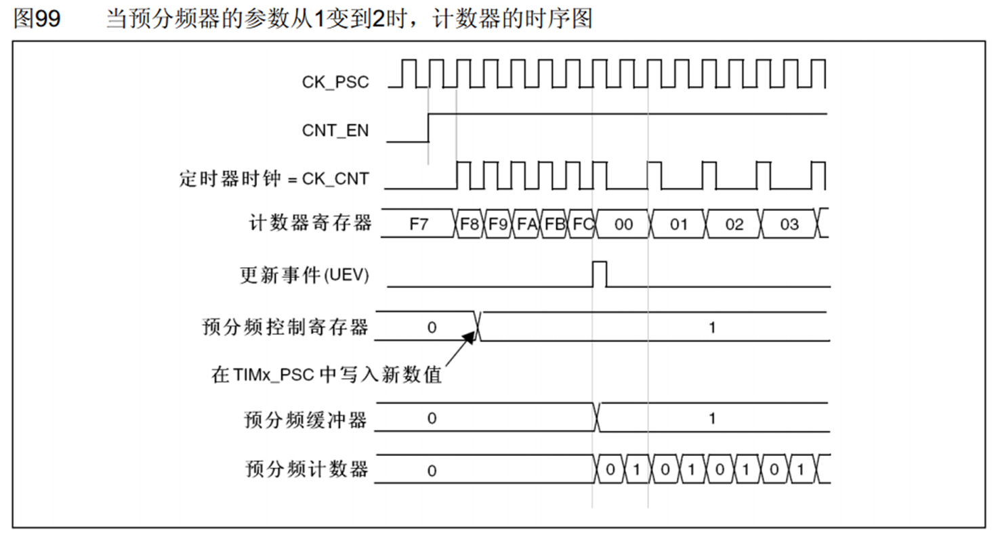
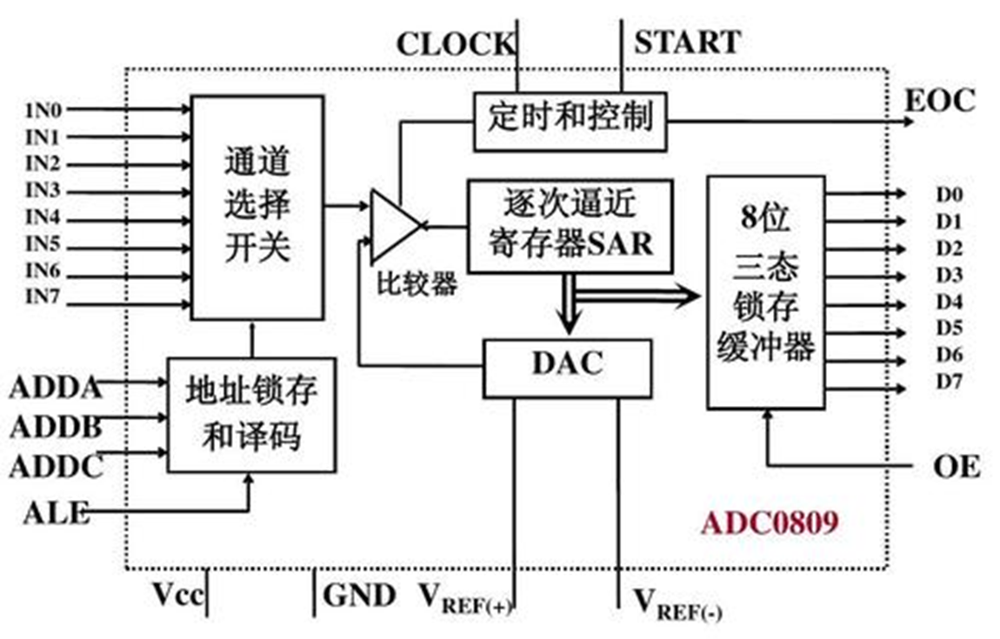
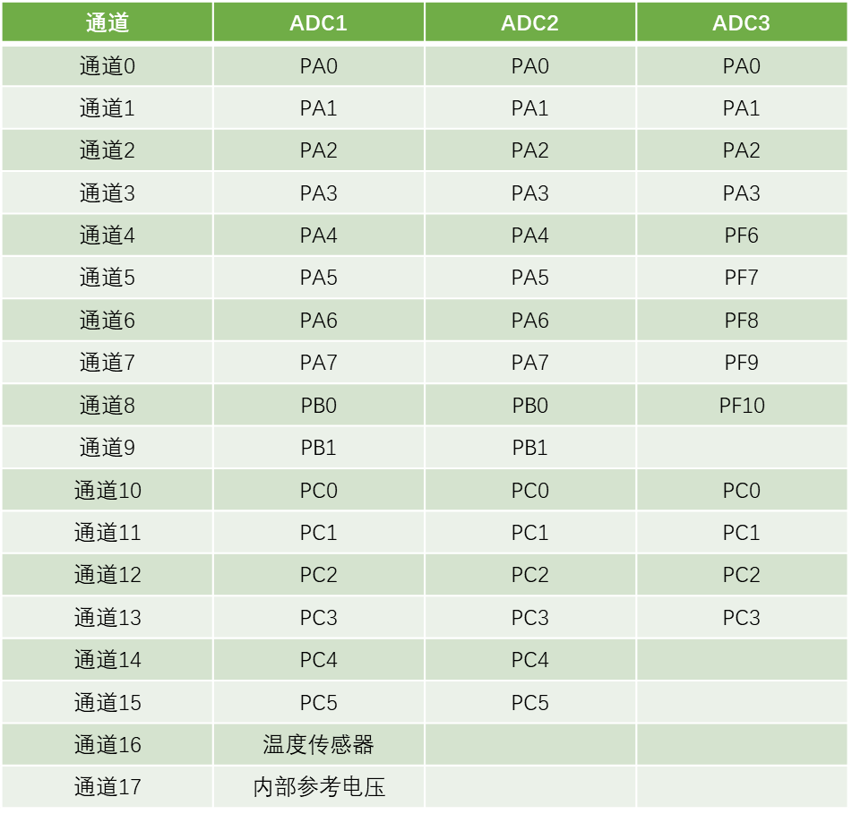
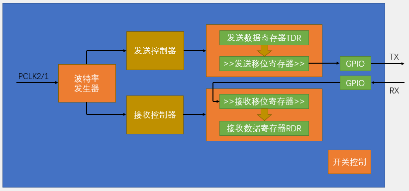
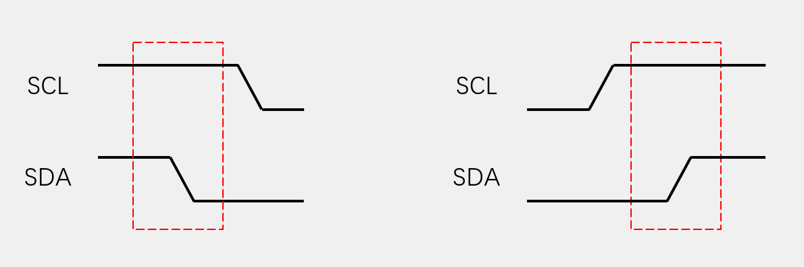
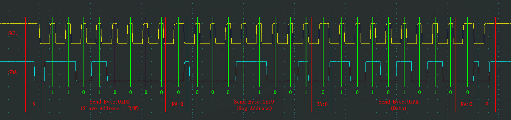
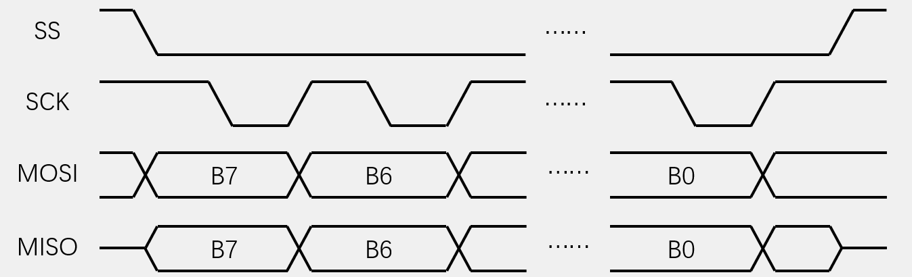
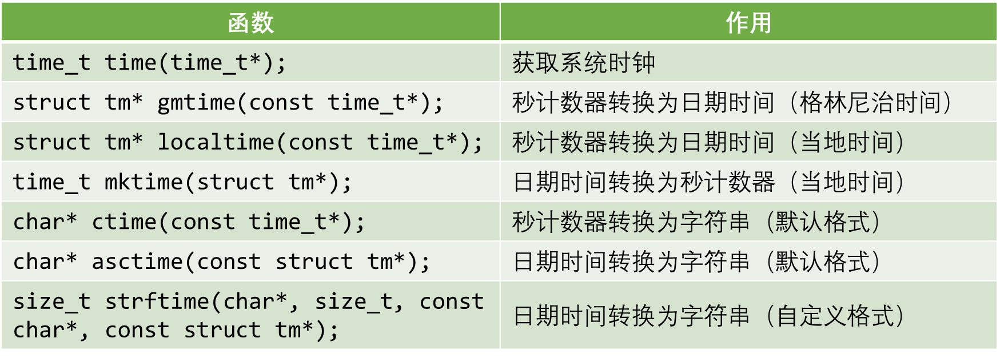

# STm32学习笔记

## STm32基础知识

### STm32简介：

•STM32是ST公司基于ARM Cortex-M内核开发的32位微控制器
•STM32常应用在嵌入式领域，如智能车、无人机、机器人、无线通信、物联网、工业控制、娱乐电子产品等
•STM32功能强大、性能优异、片上资源丰富、功耗低，是一款经典的嵌入式微控制器
•图中的CoreMark是内核跑分的意思


<center>图1：STm32产品线</center>


### ARM

•ARM既指ARM公司，也指ARM处理器内核
•ARM公司是全球领先的半导体知识产权（IP）提供商，全世界超过95%的智能手机和平板电脑都采用ARM架构
•ARM公司设计ARM内核，半导体厂商完善内核周边电路并生产芯片。对于STm32来说，ST公司设计的就是内核之外的存储器和外设，比如说计数器、定时器等，以PC机来举例说明，ARM就相当于英特尔或者AMD，ST公司就是负责拿着这个设计好的CPU来添加上主板、内存等设备来构成一个整机卖给客户。严格来说PC整机应该对应的是片上SoC，STm32对应的应该算是PLC，这两者的区别简单来说主要是能不能运行类Linux的操作系统，从硬件上虽然可以说二者的硬件规格不同，SoC拥有更多的功能模块，但是存在


<center>图2：STm32简易结构图</center>


<center>图3：ARM核心产品线</center>

### STm32F103C8T6

•系列：STm32F1系列
•内核：ARM Cortex-M3
•主频：72MHz
•RAM：20K（SRAM）RAM为存储内存，实际存储介质为SRAM
•ROM：64K（Flash）ROM程序存储器，实际介质为Flash
•供电：2.0~3.6V（标准3.3V）。这里需要注意的是，C51和USB都是5V供电，所以在使用STm32的时候要加一个稳压芯片，将5V电压降至3.3V才能给STm32供电。
•封装：LQFP48 意思是一共有48个引脚 

**拓展知识**：1.8V、3.3V、5V、12V等常用电压等级是如何确立的？
	早期晶体管电路单管压降0.7V，一个电路里经常多个晶体管串联。比如4管串联，电源至少保证0.7x4=2.8V才能保证电路正常工作。所以早期有3V，5V等标准。后来7805电源IC出来以后，5V成了事实标准。3.3V是因为当年演进到.35μm工艺的时候栅极氧化层厚度减到了7nm左右，能承受的最大源漏电压大概是4V，减去10%安全裕度是3.6V，又因为板级电路的供电网络一般是保证±10%的裕量，所以标准定在了3.6V × 90% = 3.3V。1.8V同理，.18um节点栅极氧化层厚度进一步降低到了4nm左右，ds耐压极限降低到了大约2.3V，同样的逻辑，先0.9变成2.7，再±10%，定在了1.8V。


<center>图3：STm32F103C8T6实物图</center>

### 片上资源/外设


<center>图3：STm32外设汇总表</center>

​	外设的英文名字为Peripheral ，学习STm32主要学习的就是通过程序配置STm32的外设，来实现我们想要的功能。在汇总表中加绿色的是位于Cortex-M3内核中的外设，之所以要区分是内核中的外设还是内核之外的外设，是为了在不同的库函数中查找相应外设的函数。

​	**NVIC**：用于管理中断的设备，配置中断的优先级。
​	**SysTick**：STm32是可以加入操作系统的，比如FreeRTOS，UCos等，如果用了这些操作系统，就需要SysTick提供定时来进行任务切换的功能，也可以用于Delay()延时函数的实现。
​	**RCC**：对时钟进行控制，使能各模块时钟，在STm32中其它外设在上电情况下默认没有时钟的，不给时钟的情况下，操作时钟是无效的，外设也不会工作，这样的目的是降低功耗，所以在操作外设前要先使能时钟，用RCC完成时钟使能。
​	**GPIO**：
​	**AFIO**：完成复用功能端口的重定义和中断端口的配置。
​	**EXIT**：配置好外部中断后，当引脚电平发生变化时，就可以触发中断，让CPU来处理任务。
​	**TIM**：定时器分为高级定时器、通用定时器、基本定时器。常用的是通用定时器，这个定时器除了基本的定时工作外，还可以定时中断、测频率、输出PWM波、配置专用编码器接口。
​	**ADC**：STm32中内置了12位的AD转换。
​	**DMA**：充当CPU的助手，帮助CPU搬运文件。
​	**USART**：同步或异步串口，UART是异步串口。
​	**IIC**：
​	**SPI**：这两个都是通讯协议。
​	**CAN**：主要用于汽车领域。
​	**USB**：学习这个协议之后可以用于模拟鼠标，模拟U盘。
​	**RTC**：完成年月日时分秒计时功能，可以接外部备用电池，这样即使掉电的情况下也可以正常运行。
​	**CRC**：数据的一种校验方式，用于判断数据的正确性。
​	**PWR**：可以让芯片进入睡眠状态。
​	**BKP**：可由备用电池保持数据
​	**IWDG**：独立看门狗，可以使用后备电源供电，在程序运行出错的时候进行复位。
​	**WWDG**： 这两个在STm32出现死循环的时候可以及时复位芯片。因为电磁干扰。死机或程序设计不合理导致死循环时，看门狗可以及时复位芯片。

**STm32F103C8T6没有下面的四个外设**
	**DAC**：数模转换器，用于将数字信号转化为模拟信号。
	**SDIO**：读取SD卡。
	**FSMC**：扩展内存或配置成其它总线协议，用于某些硬件的操作。
	**USB OTG**：用OTG功能，让USB作为主机去读取其它的USB设备。

### 命名规则


<center>图3：STm32命名规则</center>

### 系统结构

​	从STm32F103系统结构示意图可以看出，内核Cortex-M3引出了三条总线，分别是ICode指令总线、DCode数据总线、System系统总线。其中ICode总线和DCode总线主要是用来通过Flash接口连接Flash闪存的，Flash是一种掉电不丢失的非易失性存储介质，STm32的程序就是存储在内部Flash中，而程序运行时产生的变量数据存放在SRAM中。ICode总线是用来加载程序指令的，DCode总线用来加载数据，比如常量和调试数据等。除了DCode总线和ICode总线，内核还引出了System总线，用来连接余下的设备。

​	Cortex-M3下方就是DMA外设，DMA可以当做内核的小秘书，其作用是搬运数据来减轻重复性数据搬运工作对CPU资源的占用。比如说模数转换设置为1ms转换一次，如果不能及时将转换后的数字信号数据从数模转换寄存器中搬运出来的话，新转换完成的信号数据就会被覆盖。外设通过DMA请求线向DMA发送DMA请求，DMA通过DMA总线获得总线控制权，然后访问外设并转运数据，整个过程不用CPU参与，省下了CPU的时间来做其它事情。图中的DMA总线拥有和CPU一样的总线控制权用于访问外设。

​	图中的右下角就是AHB总线和AHB总线所挂载的外设，**AHB(Advanced High-performance Bus)**是先进高性能总线，用于挂载主要的设备，一般都是最基本或性能比较高的外设，比如复位和时钟控制这些最基本的电路，AHB总线通过桥接器连接到**APB(Advanced Peripheral Bus )**先进外设总线，APB总线又分为APB1总线和APB2总线。因为AHB总线和APB总线的总线协议、总线速度、数据传送格式的差异，所以二者相连时中间需要加桥接来完成数据的转换和缓存。AHB通过桥接1连接到APB2总线，通过桥接2连接到APB1总线。性能的话AHB>APB，APB2>APB1。APB2一般和AHB同频都是72MHz，APB1为36MHz，APB2连接的都是重要外设，以及一些外设的一号选手，比如说USART1和SPI1，而APB2连接的都是一些次要的外设。


<center>图3：STm32F103系统结构示意图</center>

​	

### 引脚定义	

引脚示意图的小黑点左边就是1号引脚，然后引脚标号从小到大按逆时针排列。


<center>图3：STm32 引脚示意图</center>

​	表格中标为红色为电源相关引脚，蓝色为最小系统相关引脚，绿色为IO口、功能口引脚。
​	**类型：**S代表电源(Source)，I代表输入(Input)，O代表输出(Output)，I/O代表输入输出(Input&Output)。
​	**IO口电平：**引脚可以容忍的电压，标为FT的可以容忍5V电压，没有标注FT的只能容忍3.3V电压。
​	**主功能：**主功能是上电后默认的功能，一般和引脚名称相同，如果不同，引脚的实际功能是主功能而不是引脚名称的功能。
​	**默认复用功能：**IO口上同时连接的外设功能引脚，在配置IO口时，可以选择是通用IO口还是复用功能。
​	**重定义功能：**如果两个功能定义在了一个IO口上，但却要用到两个功能时，可以把其中一个复用功能重映射到其它端口上，但这样做的前提是重映射表里面有对应的端口。


**STm32F103C8T6具体引脚定义**

​	**Pin1：**备用电池引脚供电引脚，接3V电池给RTC、备份寄存器供电。
​	**Pin2：**IO口、侵入检测、RTC。IO口可以根据程序输出或读取高低电平，是最基本也是最常用的功能了。侵入检测的主要作用是防拆，例如一些产品的外壳上有些防拆触点，通过高低电平检测来控制清空内部数据，保障数据安全，街上电路到这个引脚，如果有人拆开设备的话，触点就会断开，这个引脚的高低电平就会发生变化。RTC引脚可以用来输出RTC校准时钟、RTC闹钟脉冲或者秒脉冲。
​	**Pin3、Pin4：** 3号和4号引脚为IO口、接32.768MHz晶振
​	**Pin5、Pin6：**5号和6号引脚接系统主晶振，一般为8MHz，芯片内部有锁相环电路，可以对8MHz进行倍频，最终产生72MHz频率作为芯片的主时钟。
​	**Pin7：**NRST是系统复位引脚，N代表它是低电平复位。
​	**Pin8、Pin9：**是内部模拟部分的电源，比如ADC、RC振荡器。VSS是负极，接GND，VDD是正极，接3.3V。
​	**Pin10-Pin19：**为IO口，PA0，也就是10号引脚兼具WKUP功能，可以用于唤醒处于待机状态的STm32。加粗的IO口推荐优先使用，没有加粗的IO口可能要配置之后才能使用。
​	**Pin20：**IO口或者BOOT引脚，BOOT引脚是用来配置启动模式的。
​	**Pin21-Pin22：**IO口。
​	**Pin23-Pin24：**系统的主电源口，同样的VSS为负极，VDD为正极。
​	**Pin25-Pin33：**这些都是IO口。
​	**Pin35-Pin36：**主电源口。
​	**Pin34、Pin37-Pin40：**这些是IO口或者调试端口，默认功能是调试端口，用来调试和下载程序的。STm32支持SWD和JTAG两种调试方式，SWD要两根线：SWDIO-PA13，SWCLK-PA14，ST-Link用的是SWD方式。JTAG要五根线：JTMS、JTCK、JTDI、JTDO、NJTRST。使用SWD方式时PA15、PB3、PB4可以切换为普通IO口使用，但因为其默认功能是调试端口，所以需要在程序中进行配置。
​	**Pin44：**BOOT0和BOOT1一样使用来做启动配置的。
​	**Pin47-Pin48：**主电源口。STm32内部采用分区供电的方式，供电口会比较多，在使用时，把VSS都接GND，VDD都接3.3V即可

### 启动配置

​	启动配置的作用就是指定程序开始运行的位置，一般情况下，程序都是在Flash程序存储器开始执行的，但是在某些情况下也可以让程序在别的地方开始执行，用来完成特定功能。


<center>图3：STm32产品线</center>

表格中的X表示无论是高电平还是低电平，1代表的是3.3V高电平。内置SRAM启动模式是调试程序的时候使用的。BOOT引脚的值是在上电一瞬间有效的，后边便无所谓了，例如BOOT1引脚和PB2是同一个引脚，就是在上电一瞬间是BOOT1功能，过后即切换为PB2功能。
​	☆作串口下载用，系统存储器存的即为STm32中的一段BootLoader程序，BootLoader的作用就是接受串口的数据然后刷新到主存中，这样就可以使用串口下载程序了。

### 最小系统电路


<center>图3：STm32产品线</center>
​	晶振：20pF的是起振电容，如果要使用RTC功能，则还要接一个32.768kHz晶振在3、4号引脚上，OSC32就是32.768kHz的意思，因为32768是2的15次方，内部的RTC电路经过2的15次方分频，就可以生成1s的时间信号了。
​	复位：低电平复位，按下K1时，NRST接地产生了低电平信号，7号引脚上电时，C3没有充电相当于短路，此时NRST为低电平，上电后C3充满电相当于短路，NRST被电阻R1拉高。其效果就是上电一瞬间，单片机复位完成，一些小的设备用针戳一下就会复位就是这样的原理。
​	STm32及其供电：VBAT备用电池引脚是给RTC和备份寄存器服务的，用到的话就可以接一个纽扣电池，如果用不到的话就悬空或者接上3.3V电源即可。三个供电部分的C4、C5、C6、C7这几个是滤波电容，用于保持供电电压的稳定。从图上可以看到，STm32的供电是分为四个区域单独供电的，但是入门学习阶段可以直接将这四个供电电路接在一起即可。

### 型号分类及缩写


<center>图3：STm32产品线</center>
​	这个表主要使用来选择启动文件的，STm32F103C8T6使用的启动文件是.md。
​	STm32的开发方式主要有基于寄存器的方式，基于标准库也就是库函数，这个是ST公司封装好的函数，和基于HAL库的方式，基于寄存器的方式和51单片机的开发方式一样，用程序直接配置寄存器，来达到我们想要的功能，这种方式最底层最直接，效率会高一些。
​	LD-Low Densit、MD-Medium Density、HD-High Density、XL-Extra Density
CL-Connectivity Line(互联型产品)，其中VL后缀代表的是Value Line性价比系列。

### 新建工程步骤

•建立工程文件夹，Keil中新建工程，选择型号
•工程文件夹里建立Start、Library、User等文件夹，复制固件库里面的文件到工程文件夹
•工程里对应建立Start、Library、User等同名称的分组，然后将文件夹内的文件添加到工程分组里
•工程选项，C/C++，Include Paths内声明所有包含头文件的文件夹
•工程选项，C/C++，Define内定义USE_STDPERIPH_DRIVER
•工程选项，Debug，下拉列表选择对应调试器，Settings，Flash Download里勾选Reset and Run

整体的结构：总文件夹--TEST_1-project.μvproj
                                         --TEST_2-project.μvproj
	这里要注意的是.μvproj文件不好改名字，所以可以将存放.μvproj的文件夹的名字用来标识项目的目的，而.μvproj只用一个通用的名字即可。还有就是Keil的文件管理很抽象，新建的工程和你自己创建的文件夹是不会自动同步的，需要自己手动添加组，然后添加文件，最后还要在工程魔法棒里面添加工程的包含目录，不然会找不到头文件，就是相当于C/C++的include path。
	新建main.c文件时，一定要勾选USER文件夹，否则的话会在工程的最外边，默认的，改字体大小的话在扳手工具中点colors&fronts，不想在输入中文的时候有奇怪的？出现的话，就点encoding中的UTF-8即可。其他工程在Define内声明了USE_STDPERIPH_DRIVER还声明了STM32F10X_MD字符串，但Keil是已经自动声明了这个所以不用重复声明。

### Keil工程架构


<center>图3：STm32产品线</center>
STm32的程序就是从启动文件开始执行的
	固件库文件说明：
	htmress 两张图片
	Libraries库函数
	Project示例工程
	Utilities评估程序
	ST公司自己的开发板的程序
	Release_Notes.html 发布页面
	stm32f10x_stdperiph_lib_wm.chm使用手册
启动文件的位置：

```C
STM32F10x_StdPeriph_Lib_V3.5.0\Libraries\CMSIS\CM3\DeviceSupport\ST\STM32F10x\startup\arm
启动文件和前面型号分类是相对应的，对于STm32F103C8T6要选择的就是md.s文件
可以直接全部复制然后放在自己新建的START文件夹中即可
startup_stm32f10x_cl.s
startup_stm32f10x_hd.s
startup_stm32f10x_hd_vl.s
startup_stm32f10x_ld.s
startup_stm32f10x_ld_vl.s
startup_stm32f10x_md.s
startup_stm32f10x_md_vl.s
startup_stm32f10x_xl.s
```
在启动文件中有一个复位中断，在复位中断中就调用了SystemInit和main函数，这个中断就是整个程序的入口。
标准库文件的位置：
```C
STM32F10x_StdPeriph_Lib_V3.5.0\Libraries\CMSIS\CM3\DeviceSupport\ST\STM32F10x
// 一共有三个，把这三个文件放到自己建的START文件夹中
// 外设寄存器描述文件，和C51的REGX52.h一样
stm32f10x.h       
// 用于配置STm32的时钟，STm32主频72MHz就是在这个文件配置的
system_stm32f10x.c
system_stm32f10x.h
```
内核寄存器的描述文件的位置：
```C
STM32F10x_StdPeriph_Lib_V3.5.0\Libraries\CMSIS\CM3\CoreSupport
// 这两个就是内核寄存器描述文件的位置，因为还有一些内核的配置函数，所以有一个.c源文件
// 添加之后文件图标带了一个钥匙，意思就是这是一个只读文件
core_cm3.c
core_cm3.h
```
新建Library文件夹，然后将
```C
STM32F10x_StdPeriph_Lib_V3.5.0\Libraries\STM32F10x_StdPeriph_Driver\inc
STM32F10x_StdPeriph_Lib_V3.5.0\Libraries\STM32F10x_StdPeriph_Driver\src
```
这两个文件夹中的文件都放到Library文件夹中，然后在工程中添加组，然后添加文件，其中的misc.c是内核库函数，其余都是外设库函数。

最后要在示例工程文件夹中的Template中将
```C
STM32F10x_StdPeriph_Lib_V3.5.0\Project\STM32F10x_StdPeriph_Template
// 配置头文件的包含关系
stm32f10x_conf.h
// 用来存放中断函数的
stm32f10x_it.c
stm32f10x_it.h
```
将这三个文件放在USER目录中，再打开stm32f10x.h有一句宏定义，USE_STDPERIPH_DRIVER，C/C++，define中增加这个宏就可以只包含一个库就包含了所有库了。

GPIO简介

•GPIO（General Purpose Input Output）通用输入输出口
•可配置为8种输入输出模式
•引脚电平：0V~3.3V，部分引脚可容忍5V，此处需要注意的是容忍5V的意思是输入电压可以达到5v，但是输出仍然只有3.3V，STm32引脚的最大输出电压就是3.3V。
•输出模式下可控制端口输出高低电平，用以驱动LED、控制蜂鸣器、模拟通信协议输出时序等，例如SPI、IIC通讯协议。
•输入模式下可读取端口的高低电平或电压，用于读取按键输入、外接模块电平信号输入、ADC电压采集、模拟通信协议接收数据等


## GPIO

### GPIO基本结构


<center>图3：STm32产品线</center>
在STm32中，所有的外设都是挂载在APB2总线上的
每个GPIO外设总共有16个引脚，编号是从0到15
驱动器是用来增加信号的驱动能力的，寄存器只负责存储数据，如果要进行点灯这样的操作的话，就需要驱动器来增加驱动能力。
寄存器就是一段特殊的存储器，内核可以通过APB2总线对寄存器进行读写，因为STm32是32位的，所以STm32的寄存器也是32位的，但GPIO只有16位，所以GPIO寄存器只有低16位有对应的端口，高16位没有对应的端口，是没有用到的。


### GPIO位结构和模式

<center>图3：STm32产品线</center>
	通过配置GPIO的端口配置寄存器，端口可以被配置为以下八种模式。

<center>图3：STm32产品线</center>
	从I/O引脚开始看起，输入时电平信号从I/O引脚流入会先经过两个保护二极管，上方二极管正极接VDD也就是3.3V，下方二极管负极接VSS也就是0V，当电压在0-3.3V时上下两个二极管都不导通，如果IO引脚电压大于VDD，则会使得上方二极管导通，电流从VDD流出。如果IO引脚电压小于VSS，则会使得下方二极管导通，电流从VSS流出，从而保护了内部电路不会烧坏。
	输入电流经过保护电路后，向上走会将过两个上拉电阻，上方电阻通过开关接到VDD，下方电阻通过开关接到VSS。如果上面开关导通下面断开，就是上拉输入模式，如果下面开关导通上面断开，就是下拉输入模式，如果两个开关都断开，就是浮空输入模式。在使用浮空输入时端口一定要接上一个连续的驱动源，不能出现引脚悬空的状态。
	这两个电阻的阻值都是比较大的，只是一种弱上拉和弱下拉，目的是尽量不影响正常的输入操作。
	图中的TTL肖特基触发器应该是施密特触发器，其逻辑为：如果输入电压大于某一阈值，输出就会瞬间升为高电平，如果输入电压小于某一阈值，输出就会瞬间降为低电平，用于防止信号失真和硬件消抖。信号经过上拉/下拉电路之后，如果是为了模拟信号采样就会通过触发器前的模拟输入信号线流向ADC上，之所以模拟输入在施密特触发器之前是因为在触发器之后就会变成数字信号了。因此在经过施密特触发器对输入电压进行整形之后就流向了复用功能输入。
	IO控制方法：直接操作寄存器、用来单独控制输出寄存器的某一位而不影响其它位，在消除写1即可将输出的某一位消零，位带，映射地址通过位寻址。
	GPIO输出时：
	一路输入是通过寄存器，另一路是来自其它的片上外设的复用功能输入，输出控制器会控制两个MOS管，用新号控制开关的导通和关闭，开关负责将IO口接到VDD或VSS。推挽输出也叫做强推输出，输出能力强，推完输出模式下P-MOS和N-MOS都有效。数据寄存器为1时上管导通，下管断开，输出接到VDD，输出高电平，为0时上管断开，下管导通输出接到VSS，输出低电平。这种模式下，高低电平均有较强的驱动能力，所以推挽输出模式也叫做强推输出模式。在推挽输出模式下，STm32对IO口有绝对的控制权，高低电平都由STm32说了算。
	如果一个输入什么都不接，那么它的输入就是不确定的，处于一种浮动状态，此时引脚的输入电平极易受外界干扰而变化，就像是一个物体悬浮在太空一样，它的位置是不确定的，受到一点扰动就会发生变化，为了避免引脚悬空导致的输入数据不确定，我们就需要在这里加上，上拉电阻或者下拉电阻来给引脚一个默认电平，就相当于太空中的物体，来到了地球之后，就会因为重力的作用而下坠。上拉和下拉是为了给输入一个默认的输入电平，因为对于一个数字的端口，输入不是高电平就是低电平。

施密特触发器
	施密特触发器是高于上限和低于下限才会有电平的高低变化，所以在输入和输出处有波动的话并不会触发施密特触发器来改变电平，知道下次低于下限时才会触发。
	输出部分：数字部分由输出数据寄存器或片上外设控制，两种控制方式通过数据选择器连接到了输出控制部分，如果选择通过输出数据寄存器进行控制就是普通的IO口输出，写输出数据寄存器的某一位就可以对应操作某个端口了。位设置/清除寄存器可以用来单独操作输出数据寄存器的某一位而不影响其它位，因为输出数据寄存器同时控制16个端口，并且这个寄存器只能整体读写，所以想控制其中一个端口而不影响其他端口的话，就需要一些特殊的操作方式。
	1.限度出这个寄存器，然后用按位与和按位或的方式改变某一位，最后再将更改后的数据写回去，在C语言中就是&=和|=操作。
	2.设置位设置/清除寄存器，对某一位置1的操作，在位设置寄存器的对应位写1即可，其余的位写0，这样它内部的电路就会自动将输出寄存器对应位置为1，而剩下的位则保持不变，如果相对某一位进行清0的操作，就在清除寄存器对应位写1即可，内部电路就会把这一位清0了。
	3.读写STm32中的位带区域，位带的作用和51单片机的位寻址作用差不多，在STm32中，专门分配了一段地址区域，这段地址映射了RAM和外设寄存器所有的位，读写这段地址中的数据，就相当于读写所映射位置中的某一位。
	4.库函数用的方式是读写位设置/清除寄存器的方式
	推挽输出：
	推挽输出也叫做强推输出，输出能力强，推完输出模式下P-MOS和N-MOS都有效。数据寄存器为1时上管导通，下管断开，输出接到VDD，输出高电平，为0时上管断开，下管导通输出接到VSS，输出低电平。这种模式下，高低电平均有较强的驱动能力，所以推挽输出模式也叫做强推输出模式。在推挽输出模式下，STm32对IO口有绝对的控制权，高低电平都由STm32说了算。
	开漏输出：再开漏模式下，P-MOS是无效的，只有N-MOS在工作，数据寄存器为1时下管断开，这时输出相当于断开，也就是高阻模式，数据寄存器为0时，下管导通，输出直接接到VSS，输出低电平，这种模式只有低电平有驱动能力，高电平是没有驱动能力的，因为P-MOS都没有导通根本就驱动不了负载，此时呈现的是高阻态。
	1.开漏模式可以用作通讯协议的驱动方式。比如IIC的通信引脚，就是使用的开漏模式
	2.在多机通讯的情况下，可以避免各个设备的相互干扰，另外开漏模式可以输出5V的电压信号
	3.在IO口接5V的上拉电阻可以输出5V的高电平，当输出低电平时内部N-MOS直接VSS，当输出高电平时，由外部上拉电阻拉高至5V
	关闭模式：
	当引脚配置为输入模式的时候，两个MOS管都无效，也就是输出关闭，端口的信号由外部信号来控制。

```C
// 库函数中GPIO的8种模式定义
GPIO_Mode_AIN            // Analog In 模拟输入
GPIO_Mode_In_Floating    // 浮空输入
GPIO_Mode_IPO            // In Pull Down 下拉输入
GPIO_Mode_IPU            // In Pull Up 上拉输入
GPIO_Mode_OUT_OD         // Out Open Drain 开漏输出
GPIO_Mode_OUT_PP         // Out Push Pull 推挽输出
GPIO_Mode_AF_OD          // Atl Open Drain 复用开漏输出
GPIO_Mode_AF_PP          // Atl Push Pull 复用推挽输出
// 把指定端口设置为高电平
void GPIO_SetBits(GPIO_TypeDef* GPIOx, uint16_t GPIO_Pin);
// 把指定端口设置为低电平
void GPIO_ResetBits(GPIO_TypeDef* GPIOx, uint16_t GPIO_Pin);
// 按位写/清除指定GPIO端口的位
// 前两个参数指定端口，根据第三个参数的值来设置端口
// GPIOPin的选择都可以按照按位或的形式选择多个端口 比如GPIOPin1 | GPIOPin2
void GPIO_WriteBit(GPIO_TypeDef* GPIOx, uint16_t GPIO_Pin, BitAction BitVal);
// 按位写/清除指定GPIO端口，这个是操作一整个16位的端口
// Write函数是写到了ODR寄存器，也就是Output Data Register输出数据寄存器
void GPIO_Write(GPIO_TypeDef* GPIOx, uint16_t PortVal);
// 读取输入数据寄存器的某一端口的输入值，返回端口的高低电平
uint8_t GPIO_ReadInputDataBit(GPIO_TypeDef* GPIOx, uint16_t GPIO_Pin);
// 读取整个输入数据寄存器，返回值的每一位代表一个端口的高低电平
uint16_t GPIO_ReadInputData(GPIO_TypeDef* GPIOx);
// 读取输出数据寄存器的某一位，因此原则上并不是用来读取端口的输入数据的，一般用于输出模式下，用来看自己的输出的是什么
uint8_t GPIO_ReadOutputDataBit(GPIO_TypeDef* GPIOx, uint16_t GPIO_Pin);
// 用于读取整个寄存器的值
uint16_t GPIO_ReadOutputData(GPIO_TypeDef* GPIOx);
```


1
### 浮空/上拉/下拉输入


<center>图3：STm32产品线</center>
### 模拟输入

除了在模拟输入模式中会关闭数字的输入功能，其它的七种模式都是开启的


<center>图3：STm32产品线</center>
### 开漏/推挽输出

在输出模式下，输入模式也是有效的，在输入模式下，输出模式是无效的，因为一个端口只能有一个输出，但可以有很多个输入，所以当配置成输出模式时，内部也可以顺便输入一下，这是没有什么影响的。


<center>图3：STm32产品线</center>


### 复用开漏/推挽输出

用输出数据寄存器可以保证多位数据的同步性，因为是一下子读写整个寄存器


<center>图3：STm32产品线</center>


## 硬件电路相关知识

### LED和蜂鸣器介绍

•LED：发光二极管，正向通电点亮，反向通电不亮

|                    图1                     |                             图2                              |
| :----------------------------------------: | :----------------------------------------------------------: |
|  |  |
<center>图3：STm32产品线</center>
三角形的顶点指向的方向是负极，对于实物二极管，如果没有修剪引脚的话，小的是正极，大的是负极，长脚正极，短脚负极。

•有源蜂鸣器：内部自带振荡源，将正负极接上直流电压即可持续发声，频率固定


<center>图3：STm32产品线</center>


<center>图3：STm32产品线</center>
低电平蜂鸣器响，高电平蜂鸣器不响。
•无源蜂鸣器：内部不带振荡源，需要控制器提供振荡脉冲才可发声，调整提供振荡脉冲的频率，可发出不同频率的声音

### 硬件电路


<center>图3：STm32产品线</center>
对于STm32来说，推挽输出在高低电平都有着很强的驱动能力，因此这两种接法都是可以的，但在单片机开发中，一般使用高电平若驱动，低电平强驱动的原则，因为这样可以一定程度上避免高低电平打架，如果高电平驱动能力弱就不能用第二种连接方式了。

功率大时，直接用IO口驱动会导致STm32负载过重，这是可以用一个三极管驱动电路来完成驱动的任务。PNP最好接在上边，NPN的三极管最好接在下边，因为三极管的通断是要在发射极和基极直接产生一定的开启电压，如果把负载接在发射极这边，可能会导致三极管不能开启。
三极管：带箭头的是发射极，中间的是基极，下边是集电极。箭头指向外的是NPN型，箭头指向内的是PNP型。PNP型三极管是低电平导通，高电平截止，NPN型三极管是高电平导通，低电平截止。
### 面包板


<center>图3：STm32产品线</center>
中间的五个孔都是导通的，上下横排全部导通。
### 按键介绍

•按键：常见的输入设备，按下导通，松手断开

•按键抖动：由于按键内部使用的是机械式弹簧片来进行通断的，所以在按下和松手的瞬间会伴随有一连串的抖动


<center>图3：STm32产品线</center>

<center>图3：STm32产品线</center>
### 传感器模块简介

•传感器模块：传感器元件（光敏电阻/热敏电阻/红外接收管等）的电阻会随外界模拟量的变化而变化，通过与定值电阻分压即可得到模拟电压输出，再通过电压比较器进行二值化即可得到数字电压输出


<center>图3：STm32产品线</center>

<center>图3：STm32产品线</center>
光线越强，光敏电阻的阻值越小。温度越高，热敏电阻的阻值越小。红外光线越强，红外接收管的阻值越小。
图上所示的LM393就是传感器的二值化芯片，它使用运算放大器来构建的电压比较器。
强上拉，强下拉，弱上拉，弱下拉，此处的强弱就是阻值大小，阻值越小上下拉的能力越强。N1是一个可变电阻，当N1→∞时，AO此时被上拉至VCC，当N1→0时，AO此时被下拉至0V。AO=N1/(N1+R1)，当N1>>R1时，即相当于VCC。R5是一个上拉电阻，用于保证默认输出为高电平。

### 硬件电路


<center>图3：STm32产品线</center>
下接按键，当按键按下时PA0被直接下拉到GND，此时读取PA0口的电压就是低电平，当按键松动时，PA0悬空引脚的电压不确定，则此时必须要求PA0为上拉输入的模式否则就会出现引脚电压不确定的情况。上下指的是接VCC还是GND。


<center>图3：STm32产品线</center>
PA0必须配置成下拉输入，一般的单片机不一定有下拉输入模式，所以一般还是配成第一种接法。


<center>图3：STm32产品线</center>
PA0可以配置为浮空输入或者上拉输入。可以将上拉和下拉想象成弹簧在拉而电阻越小弹簧的拉力越大，当开关没有按下时，K1相当于电阻其阻值是无穷大，此时电路被上拉至3.3V。当开关按下时，电阻无穷小被直接拉至GND。如果是上拉输入，这是高电平就会更强一些，对应高电平就会更加稳定，但这样的话引脚被强行拉低的时候，损耗也就会大一些。


<center>图3：STm32产品线</center>
PA0要配成下拉输入或者浮空输入模式。


<center>图3：STm32产品线</center>
## C语言相关知识补充
### C语言数据类型


<center>图3：STm32产品线</center>
在51单片机中int是占16位的，而在STm32中int是占32位的，如果要用16位的数据就要用short来表示，stdint里面的关键字都是用typedef重命名的。C语言stdint.h文件和ST变量重命之所以有这些重命名是为了解决51，STm32这些不同位长机器变量的不兼容问题。
这张图片需要注意的就是8位是一个字节。

### C语言宏定义

•关键字：#define
•用途：用一个字符串代替一个数字，便于理解，防止出错；提取程序中经常出现的参数，便于快速修改
•定义宏定义：
 \#define ABC 12345
•引用宏定义：
 int a = ABC; //等效于int a = 12345;
 ### C语言typedef
 关键字：typedef
用途：将一个比较长的变量类型名换个名字，便于使用
定义typedef：
	typedef unsigned char uint8_t;
引用typedef：
	 uint8_t a;	//等效于unsigned char a;

对于变量类型重命名而言，使用typedef更加安全，#define只是无脑改名，而typedef会对命名进行检查，如果不是变量类型名，程序就无法进行编译。
### C语言结构体
关键字：struct
用途：数据打包，不同类型变量的集合
定义结构体变量：
	struct{char x; int y; float z;} StructName;
	因为结构体变量类型较长，所以通常用typedef更改变量类型名
引用结构体成员：
	StructName.x = 'A';
	StructName.y = 66;
	StructName.z = 1.23;
或	pStructName->x = 'A';	//pStructName为结构体的地址	pStructName->y = 66;
	pStructName->z = 1.23;


数组是组合数据类型，但其只能够组合相同类型的，组合不同类型时就需要用到结构体了。为什么会有结构体指针对象这样的操作是因为，实际工作中的结构体一般都是占用存储空间很大的变量，通常用地址传递而不是值传递，可以节省存储空间。

### C语言枚举
关键字：enum
用途：定义一个取值受限制的整型变量，用于限制变量取值范围；宏定义的集合
定义枚举变量：
	enum{FALSE = 0, TRUE = 1} EnumName;
	因为枚举变量类型较长，所以通常用typedef更改变量类型名
引用枚举成员：
	EnumName = FALSE;
	EnumName = TRUE;
如果数是按照顺序累加的，那么后面的赋值就可以省略，宏定义的集合意思是可以使用枚举的值来赋值，可以使程序更加安全，防止了非法值破坏程序，这其实就是有限状态机，FSM。
## 调试方式
串口调试：通过串口通信，将调试信息发送到电脑端，电脑使用串口助手显示调试信息

显示屏调试：直接将显示屏连接到单片机，将调试信息打印在显示屏上

Keil调试模式：借助Keil软件的调试模式，可使用单步运行、设置断点、查看寄存器及变量等功能

在Debug选项中，左边的是电脑模拟STm32右边是使用ST-Link在线仿真
Reset复位
Run全速运行
Stop停止全速运行
Step单步运行
Step-over跳过当前行
Step-out跳出当前函数单步运行
Run-to-cursor-line调到光标指定行单步运行
Serials window串口输出窗口
Analysis windows逻辑分析仪
Peripherals查看外设寄存器

## OLED简介
OLED（Organic Light Emitting Diode）：有机发光二极管
OLED显示屏：性能优异的新型显示屏，具有功耗低、相应速度快、宽视角、轻薄柔韧等特点
0.96寸OLED模块：小巧玲珑、占用接口少、简单易用，是电子设计中非常常见的显示屏模块
供电：3~5.5V，通信协议：I2C/SPI，分辨率：128*64


<center>图3：STm32产品线</center>
OLED相当于每个像素都是一个LED，是可以自发光的，不需要LCD补光，因此比较省电。图中双色的OLED只是上面的1/4是黄色的，下面的3/4是蓝色的，而并不是所有的区域都是两种颜色。
### 硬件电路


<center>图3：STm32产品线</center>
IIC


<center>图3：STm32产品线</center>
SPI

### OLED驱动函数


<center>图3：STm32产品线</center>

<center>图3：STm32产品线</center>
STm32引脚上电之后，默认是浮空输入的模式，在这个模式下，引脚不会输出电平，所以不会有什么影响。虽然可以用GPIO口来对OLED来进行供电，但是这样做并不符合GPIO的使用规范，负载一定要使用电源来供电。

函数中的前两个参数，第一个是起始行，第二个是起始列。

## 中断系统
中断系统是管理和执行中断的逻辑结构，外部中断是众多能够产生中断的外设之一，对于外部中断来说可以是引脚发生了电平跳变，对于定时器来说，可以是定时的时间到了，对于串口通信来说，可以是接收到了数据。当这些时间发生时，情况比较紧急，比如外部中断来了不处理的话下一个跳变信号就跟着来了，串口接收中断来了，如果不读取接受的数据那么下一个数据过来就会把原来的数据覆盖掉。
中断就相当于定闹钟，如果没有定闹钟就需要不停地看时间，防止睡过头，如果没有中断程序，主程序就只能不断地查询是否有这些事情发生，就不能再干别的事情了。
中断：在主程序运行过程中，出现了特定的中断触发条件（中断源），使得CPU暂停当前正在运行的程序，转而去处理中断程序，处理完成后又返回原来被暂停的位置继续运行
中断优先级：当有多个中断源同时申请中断时，CPU会根据中断源的轻重缓急进行裁决，优先响应更加紧急的中断源。中断优先级是在程序设计的时候，用户自己设置的。
中断嵌套：当一个中断程序正在运行时，又有新的更高优先级的中断源申请中断，CPU再次暂停当前中断程序，转而去处理新的中断程序，处理完成后依次进行返回。


### 中断执行流程


<center>图3：STm32产品线</center>
为了程序能够在中断返回后继续原来的工作，在中断执行之前会对程序的现场进行保护，终端执行后会再还原现场。用C语言编程并不用做保护现场的工作，编译器自动帮我们做好了。程序被暂停的地方就叫做断点。

### STm32中断

68个可屏蔽中断通道，包含EXTI、TIM、ADC、USART、SPI、I2C、RTC等多个外设

使用NVIC统一管理中断，每个中断通道都拥有16个可编程的优先等级，可对优先级进行分组，进一步设置抢占优先级和响应优先级

F1系统最多有68个，中断通道就是中断源


<center>图3：STm32产品线</center>


灰色的是内核中的中断
Reset 复位中断
当复位事件产生时，程序会自动执行复位中断函数，也就是我们复位后程序开始执行的位置
NMI 不可屏蔽中断，硬件失效、存储管理、总线错误

外设电路检测到有什么异常或者事件，需要提示一下CPU时就可以申请中断，让程序跳到对应的中断函数中执行一次。
EXTI0-EXTI4
EXTI9_5
EXTI15_10

中断的地址是干什么的，因为程序中的中断函数，它的地址是由编译器分配的，是不固定的但中断跳转，由于硬件的限制智能跳到固定的地址执行程序，所以为了让硬件跳转到一个不固定的中断函数里就需要在内存中定义一个地址的列表，列表的地址是固定的，中断发生后就跳转到这个固定位置，然后在这个固定位置由编译器再加上一条跳转到中断函数的代码，这样中断跳转就可以跳到任意位置了，这个中断地址的列表就叫做中断向量表，它就相当于中断的一个跳板。但是C语言编程的话并不需要管这个中断向量表，所以了解即可。
### NVIC基本结构
NVIC-嵌套中断向量控制器，是一个内核外设，是CPU的小助手


### NVIC优先级分组
NVIC的中断优先级由优先级寄存器的4位（0~15）决定，这4位可以进行切分，分为高n位的抢占优先级和低4-n位的响应优先级
抢占优先级高的可以中断嵌套，响应优先级高的可以优先排队，抢占优先级和响应优先级均相同的按中断号排队

每个中断有16个优先级，为了将其分为抢占优先级和响应优先级，就要对其进行分组。相当于插队的优先级，叫响应优先级，即上一个病人看完，下一个即便是后来的也可提前看。情况特别紧急，不等上一个人看完直接冲进去看病，看完了再接着看刚才没看完的，这种优先级叫做抢占优先级，即中断嵌套，抢占优先级高的可以进行嵌套，值越小，优先级越高。即表中的优先级编号，数值小的优先级别越高。因此STm32的中断不存在先来后到的排队方式，在任何时间都是优先级高的优先响应。

分组方式就相当于叫号规则，分法只有5种，抢占多一些还是响应多一些可以由用户自己决定。
### EXIT简介
EXTI（Extern Interrupt）外部中断
EXTI可以监测指定GPIO口的电平信号，当其指定的GPIO口产生电平变化时，EXTI将立即向NVIC发出中断申请，经过NVIC裁决后即可中断CPU主程序，使CPU执行EXTI对应的中断程序
支持的触发方式：上升沿/下降沿/双边沿/软件触发
支持的GPIO口：所有GPIO口，但相同的Pin不能同时触发中断，就是GPIOA_Pin1和 GPIOB_Pin1，不能同时用，因为同一个引脚用的是同一个中断通道。
通道数：16个GPIO_Pin，外加PVD输出、RTC闹钟、USB唤醒、以太网唤醒。加起来一共是20个线路，16个GPIO是主功能，后面的都是来蹭网的，因为外部中断有个功能，就是从低功耗模式下的停止模式唤醒STm32.
触发响应方式：中断响应/事件响应

申请中断让CPU执行中断函数，事件响应是STm32对外部中断增加的一种额外的功能，当外部中断检测到引脚电平变化时，正常的流程是选择触发中断，在STm32中也可以选择触发一个中断，那中断信号就不会通往CPU了而是通向其它外设，用来触发其它外设的操作，比如ADC转换，DMA等外设间的联合工作。
PVD电源电压检测，当电源从电压过低恢复时，就需要PVD借助一下外部中断退出停止模式。对于RTC闹钟来说，有时候为了省电，RTC定一个闹钟之后，STm32会进入停止模式等到闹钟响的时候再唤醒。


上升沿：电平从低电平变到高电平的瞬间。
下降沿：电平从高电平变到低电平的瞬间。
双边沿：上升沿和下降沿。
软件触发：引脚啥事没有，程序里执行一句话就可以触发中断。
### EXIT基本结构


其中EXTI和NVIC不用开时钟，GPIO和AFIO用开时钟，配置STm32的中断就是把从GPIOx到NVIC所涉及的寄存器全部打通。配置流程如下：1.打开RCC时钟(其中EXTI和NVIC不用开时钟，GPIO、AFIO需要打开时钟)。2.配置GPIO为输出模式。3.配置AFIO选择我们用的这一路GPIO连接到后面的EXTI。4.配置EXTI选择边沿触发方式，比如上升沿、下降沿、双边沿，选择触发响应方式，可选择中断响应、事件响应。5.配置NVIC给中断选择一个合适的优先级，最后通过NVIC外部中断信号就可以进入CPU了，这样CPU才能收到中断信号，才能跳转到中断函数里执行中断函数。

3×16通道只能选16个，因此相同的pin不能用，因为只会在3个同pin引脚中选择一个接到后面的通道中去。

本来有20路输出的，但有复用，其中9-5会触发相同的中断函数，15-10也会触发相同的中断函数，在编程时，我们在这两个中断函数需要再根据标志位来区分到底是哪个中断进来的，因为不同的中断其中断标志位还是不一样的。其余的9个通过事件响应通往其他外设。
### AFIO复用IO口
AFIO主要用于引脚复用功能的选择和重定义，数据选择器的作用，图中像一个梯形的

在STM32中，AFIO主要完成两个任务：复用功能引脚重映射、中断引脚选择


```C
// ST公司并没有给AFIO外设单独库文件，是和GPIO放在一起的
// 用来复位AFIO，将AFIO外设的配置全部清除
void GPIO_AFIODeInit(void);
// 用来锁定GPIO配置的，调用这个函数，参数指定某个引脚，那么这个引脚的参数就会被锁定，防止被意外更改
void GPIO_PinLockConfig(GPIO_TypeDef* GPIOx, uint16_t GPIO_Pin);
// 这两个函数是用来配置AFIO事件输出功能的
void GPIO_EventOutputConfig(uint8_t GPIO_PortSource, uint8_t GPIO_PinSource);
void GPIO_EventOutputCmd(FunctionalState NewState);
// 引脚重映射，第一个参数是重映射的方式，第二个参数是新的状态
void GPIO_PinRemapConfig(uint32_t GPIO_Remap, FunctionalState NewState);
// 调用这个函数，可以配置AFIO的数据选择器，来选择我们想要的中断引脚
void GPIO_EXTILineConfig(uint8_t GPIO_PortSource, uint8_t GPIO_PinSource);
// 和以太网有关，STm32F103C8T6没有以太网相关的外设，用不到
void GPIO_ETH_MediaInterfaceConfig(uint32_t GPIO_ETH_MediaInterface);
```

### EXTI框图


触发信号器通过或门之后就兵分两路，上面一路是触发中断的，下面一路是触发中断事件的，触发中断首先置一个挂起寄存器，这相当于是一个中断标志位了，可以读取这个寄存器判断是哪个通道触发的中断，如果中断挂起寄存器置1，它就会继续向左走，和中断屏蔽寄存器共同进入一个与门然后是到NVIC中断控制器。

触发事件，脉冲发生器用于给一个电平脉冲，用来触发其它外设的动作。


```C
// EXTI库函数
// 清除EXTI的配置，恢复成上电默认的状态
// 因为EXTI只有一个，所以不用指定是哪个EXTI
void EXTI_DeInit(void);
// 根据结构体参数的参数配置EXTI外设
void EXTI_Init(EXTI_InitTypeDef* EXTI_InitStruct);
// 可以把参数传递的结构体变量赋一个默认值
void EXTI_StructInit(EXTI_InitTypeDef* EXTI_InitStruct);
// 用于软件触发外部中断，调用这个函数，参数会给一个指定的中断线，就能软件触发这个外部中断
void EXTI_GenerateSWInterrupt(uint32_t EXTI_Line);
// 1 获取指定的标志位是否置1
FlagStatus EXTI_GetFlagStatus(uint32_t EXTI_Line);
// 2 对置1的标志位进行清除，有的标志位比较紧急，在置标志位后会触发中断
void EXTI_ClearFlag(uint32_t EXTI_Line);
// 3 在中断函数中如果想查看和清除标志位就可以用下面的函数
// 获取中断标志位是否置1
ITStatus EXTI_GetITStatus(uint32_t EXTI_Line);
// 4 清除中断挂起状态位
void EXTI_ClearITPendingBit(uint32_t EXTI_Line);
```

总结：如果想在主程序中查看和清除标志位，就用1、2，如果想在中断函数中查看和清除标志位，用3、4，本质上这4个函数都是对状态寄存器进行读写的，只是3/4函数只能读写与中断有关的标志位，并且对中断是否允许做出了判断。而1、2只是一般的读写标志，没有额外的处理，能不能触发中断的标志位都能读取，所以建议在主程序中用上面两个，中断程序用下面两个，但如果非要在中断中用下面两个也是没有问题的，只不过是库函数针对这两种场景区分了这两类读写函数。
```C
// EXTI的结构体参数
// 相当于选择GPIO的线路
EXTI.line 
// 赋值是Enable、Disable，是否开启
EXTI.lineCmd
// 选择中断模式
// EXTI_Mode_Interrupt 中断模式
// EXTI_Mode_Event 事件模式
EXTI.Mode
// 具体的参数是：
// EXTI_Trigger_Rising 上升沿触发
// EXTI_Trigger_Falling 下降沿触发
// EXTI_Trigger_Rising_Falling 双边沿触发
EXTI.Trigger
```
NVIC在misc.h文件中 
pre-emption 抢占 subpriority 响应优先级
```C
// 用来中断分组的，参数是中断分组的方式
void NVIC_PriorityGroupConfig(uint32_t NVIC_PriorityGroup);
// 根据结构体参数初始化NVIC
void NVIC_Init(NVIC_InitTypeDef* NVIC_InitStruct);
// 设置中断向量表
void NVIC_SetVectorTable(uint32_t NVIC_VectTab, uint32_t Offset);
// 系统低功耗配置
void NVIC_SystemLPConfig(uint8_t LowPowerMode, FunctionalState NewState);
void SysTick_CLKSourceConfig(uint32_t SysTick_CLKSource);


```
在配置中断之前，现制定一个中断的分组，然后使用NVIC_Init初始化一下NVIC就可以了。
```C
typedef struct
{
  // 指定中断通道，名称可以认为是用处
  uint8_t NVIC_IRQChannel;    
  // 指定中断通道是使能还是失能
  uint8_t NVIC_IRQChannel;  
  // 优先级是在多个中断源同时申请，产生拥挤时才有作用，只有一个中断时就随便了
  // 抢占优先级
  uint8_t NVIC_IRQChannelPreemptionPriority;  
  // 响应优先级
  uint8_t NVIC_IRQChannelSubPriority;         
  FunctionalState NVIC_IRQChannelCmd;         
} NVIC_InitTypeDef;
```
中断不多，很难导致中断冲突，对优先级分组来说，就随意了，分组方式整个芯片中只能用一种，因此按理说整个工程只用执行一次，因此如果在模式中进行分组要确保每个模块的分组都是同一个，相互之间不能产生冲突。

中断函数
在STm32中，中断函数的名字都是固定的，每个终端通道都有相对应的中断函数，具体名称可以在启动文件中找到：
```C
// 中断函数的书写格式如下
void NAME(void)
{
	statement;
}
```
中断函数都是无参无返回值的，函数名字不要写错了，如果写错的话就无法进入正确的中断函数中了，最好直接从启动文件复制过来，这样就绝对不会出问题了。在中断函数中，一般都是先进性一个中断标志位判断，确保是我们想要的中断源触发的这个函数，因为只要中断标志位置1了，程序就会跳转到中断函数中，不清除中断标志位，那它就会一直申请中断，程序就会不断响应中断、执行中断函数，那程序就会卡死在中断函数里面了。中断函数不用声明也不需要调用，它是自动执行的。

用的光电对射开关，如果下降沿触发是遮挡物离开时加1，如果是上升沿触发则是进入时加1，双边沿触发的话进入和出去都会触发中断。
```C
void WWDG_IRQHandler(void) {} // 窗口看门狗中断
void PVD_IRQHandler(void) {} // 电源电压检测中断
void TAMPER_IRQHandler(void) {} // 备份寄存器（篡改检测）中断
void RTC_IRQHandler(void) {} // 实时时钟中断
void FLASH_IRQHandler(void) {} // Flash 操作完成中断
void RCC_IRQHandler(void) {} // 时钟控制器 RCC 中断
void EXTI0_IRQHandler(void) {} // 外部中断线0
void EXTI1_IRQHandler(void) {} // 外部中断线1
void EXTI2_IRQHandler(void) {} // 外部中断线2
void EXTI3_IRQHandler(void) {} // 外部中断线3
void EXTI4_IRQHandler(void) {} // 外部中断线4
void DMA1_Channel1_IRQHandler(void) {} // DMA1 通道1 中断
void DMA1_Channel2_IRQHandler(void) {} // DMA1 通道2 中断
void DMA1_Channel3_IRQHandler(void) {} // DMA1 通道3 中断
void DMA1_Channel4_IRQHandler(void) {} // DMA1 通道4 中断
void DMA1_Channel5_IRQHandler(void) {} // DMA1 通道5 中断
void DMA1_Channel6_IRQHandler(void) {} // DMA1 通道6 中断
void DMA1_Channel7_IRQHandler(void) {} // DMA1 通道7 中断
void ADC1_2_IRQHandler(void) {} // ADC1 和 ADC2 的转换完成中断
void USB_HP_CAN1_TX_IRQHandler(void) {} // USB 高优先级或 CAN1 TX 中断
void USB_LP_CAN1_RX0_IRQHandler(void) {} // USB 低优先级或 CAN1 RX0 中断
void CAN1_RX1_IRQHandler(void) {} // CAN1 接收 FIFO1 中断
void CAN1_SCE_IRQHandler(void) {} // CAN1 状态变化错误中断
void EXTI9_5_IRQHandler(void) {} // 外部中断线[9:5]
void TIM1_BRK_IRQHandler(void) {} // TIM1 中断：刹车事件
void TIM1_UP_IRQHandler(void) {} // TIM1 中断：更新事件
void TIM1_TRG_COM_IRQHandler(void) {} // TIM1 中断：触发和通信事件
void TIM1_CC_IRQHandler(void) {} // TIM1 中断：捕获比较事件
void TIM2_IRQHandler(void) {} // 定时器2 更新中断
void TIM3_IRQHandler(void) {} // 定时器3 更新中断
void TIM4_IRQHandler(void) {} // 定时器4 更新中断
void I2C1_EV_IRQHandler(void) {} // I2C1 事件中断（传输、接收等）
void I2C1_ER_IRQHandler(void) {} // I2C1 错误中断
void I2C2_EV_IRQHandler(void) {} // I2C2 事件中断
void I2C2_ER_IRQHandler(void) {} // I2C2 错误中断
void SPI1_IRQHandler(void) {} // SPI1 中断
void SPI2_IRQHandler(void) {} // SPI2 中断
void USART1_IRQHandler(void) {} // USART1 中断
void USART2_IRQHandler(void) {} // USART2 中断
void USART3_IRQHandler(void) {} // USART3 中断
void EXTI15_10_IRQHandler(void) {} // 外部中断线[15:10]
void RTCAlarm_IRQHandler(void) {} // RTC 闹钟中断
void USBWakeUp_IRQHandler(void) {} // USB 唤醒中断
```
中断函数的使用建议：
1.中断函数中不要执行耗时过长的代码，要简短迅速，不要刚一进入中断就延时多少毫秒。
2.最好不要在中断函数中和主函数调用同一个函数或者操作同一个硬件，如果在主函数中调用OLED显示驱动函数，又在中断中调用OLED显示驱动函数，就会出现显示错误，比如说显示一半或者说显示乱码等情况。虽然中断有保护和恢复现场的功能，但这只能保证CPU程序正常返回不出问题，对外部硬件并没有在进入中断的时候进行现场保护。
### 旋转编码器简介

•旋转编码器：用来测量位置、速度或旋转方向的装置，当其旋转轴旋转时，其输出端可以输出与旋转速度和方向对应的方波信号，读取方波信号的频率和相位信息即可得知旋转轴的速度和方向
•类型：机械触点式/霍尔传感器式/光栅式

对于STm32来说，想要获取的信号如果是外部驱动的变化很快的突发信号，比如说编码器、遥控器这些可能很久都不会使用，但是使用的时候又需要迅速响应。要处理这样的信号可以有两种实现方式：1.主程序循环读取引脚的高低电平2.定时器中断读取引脚的高低电平。很显然最好是使用中断的方式，但是按键不要用外部中断来实现，因为不好处理按键抖动和松手检测。

方波的个数代表转过的角度，方波的频率代表转速，因为只有一路输出，因此正转和反转没有办法区分。还有的是一个输出方波信号，一个输出高低电平代表方向。


机械触点式编码器，因为是机械触电，所以不适用于转速过高的场景。霍尔传感器的非接触形式的编码器可以用来测电机转速。  相位相差九十度的波形就是正交波形，输出正交波形编码器可以测方向。


### 硬件电路


当触电断开时，P点上拉为VCC，输出到A为VCC导通时的P点，下拉至GND因此A点输出位GND。


对于旋转编码器，在中断函数中初始化PB0和PB1，两个GPIO的外部中断，当然只初始化一个外部中断也是可以的，完成功能的，因为对编码器而言，在上升沿和下降沿时刻可以检测随便一个引脚的高低电平。如果A相引脚触发中断，这样存在的小问题是，正转的情况A相刚开始转就会进入中断，反转A相迟滞，那么编码器已经转到位了，A相才进入中断。因此设计为双中断，只有在B相下降沿和A相低电平的的时候才判断为正转，只有在 A相下降沿和B相低电平时才判断为反转，这样就能保证正转和反转都是转到位了才执行计数变量加减的操作。

## TIM 定时器
### TIM定时器简介

•TIM（Timer）定时器。这是最基本的功能，定一个时间，然后定时器每隔这个时间产生一个中断，来实现每隔一个固定时间执行一段程序的目的。
•定时器可以对输入的时钟进行计数，并在计数值达到设定值时触发中断。当这个计数器的输入是一个准确可靠的基准时钟时，那么在对这个基准时钟计数的时候，实际上就是计时的过程。
•16位计数器、预分频器、自动重装寄存器的时基单元，在72MHz计数时钟下可以实现最大59.65s的定时。STm32的时钟频率是72MHz，如果计72个数，那么时间就是72/72M=1us，如果计72000个数就是72000/72M=1ms，也就是1kHz。
•不仅具备基本的定时中断功能，而且还包含内外时钟源选择、输入捕获、输出比较、编码器接口、主从触发模式等多种功能
•根据复杂度和应用场景分为了高级定时器、通用定时器、基本定时器三种类型


定时器的本质就是一个计数器。
定时器输出比较，常用于产生PWM波形，驱动电机等设备。定时器输入捕获功能，实现测量方波频率。定时器编码器接口，能更加方便地读取正交编码器的输出波形。

计数器：用来执行计数定时的一个寄存器，每来一个时钟，计数器加1。
预分频器：可以对计数器的时钟进行分频，让这个计数更加灵活。
自动重装寄存器：计数的目标值，就是我想计多少个时钟脉冲申请中断。

这三个构成了定时器最核心的部分，我们把这一块电路成为时基单元，时基单元中的寄存器都是16位的，2的16次方是65536，如果预分频器和自动重装寄存器都设置为最大，那定时器最大定时时间就是59.65s，计算方法是72M/65536/65536=1/59.65，得到定时中断的频率，然后取倒数就是最大的定时时间。如果觉得这个定时时间不够长的话，STm32的定时器还支持级联模式，也就是一个定时器的输出当做另一个定时器的输入，这样对打定时时间是59.65s×65536×65536 大概是八千多年，再级联一个的话，大概是34万亿年。
### 定时器类型


主从触发模式，它能让内部的硬件在不受程序的控制下实现自动运行，把这个掌握好就可以在某些情况下极大地减轻CPU负担。


没有基本定时器。不同的型号定时器的数量是不同的，在操作这个外设之前，一定要查看一下它是不是有这个外设操作到了不存在的外设，那样是不会运行的。资源一共是1个高级定时器，3个通用定时器。

初始化定时器的步骤
1.RCC开启时钟
打开时钟后，定时器的基准时钟和整个外设的工作时钟就都同时打开了。
2.选择时基单元的时钟源
对定时中断，我们选择的是内部时钟源。
3.配置时基单元
包括预分频器、自动重装器、计数模式等，这些参数用一个结构体就可以配置好。
4.配置输出中断控制
允许更新中断输出到NVIC。
5.配置NVIC
在NVIC中打开定时器中断的通道并分配一个优先级。
6.运行控制
整个模块配置完成后，我们还要使能一下计数器，要不然计数器是不会运行的，当定时器使能后，计数器就会开始计数了，当计数器更新时，触发中断。最后再写一个定时器中断函数，这样这个中断函数每隔一段时间就可以重新执行一次了。

TIM库函数
```C
// 恢复缺省配置
void TIM_DeInit(TIM_TypeDef* TIMx);
// 配置时基单元，TIMx选择定时器，结构体包含时基单元参数
void TIM_TimeBaseInit(TIM_TypeDef* TIMx, 
                      TIM_TimeBaseInitTypeDef* TIM_TimeBaseInitStruct);
// 这四个函数就是用来配置输出比较模块的，OC就是OutputCompare输出比较，因为输出比较有4路，所以刚好对应四个配置函数。TIMx选择定时器，TIM_TimeBaseInitStruct输出比较的参数，这个结构体的成员很多，有些是高级定时器才用到的。
// 这里有一个需要注意的问题就是，因为次使用到的是通用定时器而不是高级定时器，因此有一些变量是不用赋值的，因为此时的结构体是局部变量，没有赋初始值时，其值是不确定的，可能会导致问题。比如当想把高级定时器当做通用定时器用时，把TIM2改成TIM1，这样之前的结构体用不到的成员现在要用了，然而这些没有赋值，那就会导致高级定时器输出PWM有奇怪的问题，比如江科协本人遇到的就是将初始化函数在第一行正常，前面有其它的代码就会导致PWM无法正常输出，有3路无法正常输出。原因在于前面有代码的话，栈被用过有参留值使得TIM1配置错误，因此最好的方法就是先调用结构体初始化函数，给结构体一个初始值然后再局部修改值。
void TIM_OC1Init(TIM_TypeDef* TIMx, TIM_OCInitTypeDef* TIM_OCInitStruct);
void TIM_OC2Init(TIM_TypeDef* TIMx, TIM_OCInitTypeDef* TIM_OCInitStruct);
void TIM_OC3Init(TIM_TypeDef* TIMx, TIM_OCInitTypeDef* TIM_OCInitStruct);
void TIM_OC4Init(TIM_TypeDef* TIMx, TIM_OCInitTypeDef* TIM_OCInitStruct);
// ICInit不像是OCInit一样，ICInit是四个通道共用一个函数的，在结构体里会额外有一个参数，可以用来选择是配置哪个通道，因为会有交叉通道的配置，所以函数合在一起会更方便一点。
// 结构体的成员TIM_Channel通道，TIM_ICFilter用来配置输入捕获的滤波器，如果信号有噪声和毛刺，就可以增大滤波器的参数，可以有效避免干扰。注意滤波器和分频器的区别，虽然它们都是计次的东西，但是滤波器计次并不会改变信号原有的频率，一般滤波器的采样频率都会远高于信号频率，所以它只会滤除高频噪声，使信号更加平滑。二分频器就是对信号本身进行计次，会改变频率。TIM_ICPolarity极性选择，对应的就是边沿检测、极性选择的部分了，选择是上升沿触发还是下降沿触发。TIM_ICPresclar分频器，就是触发信号分频器，不分频的话就是每次触发都有效，2分频就是隔一次有效一次 TIM_ICSelection，选择触发信号从哪个引脚输入，这个函数是用来配置数据选择器的，可以选择直连通道，或者是交叉通道。当然也可以看出这个通道只支持通道1和通道2的配置并不支持通道3和通道4的配置。
void TIM_ICInit(TIM_TypeDef* TIMx, TIM_ICInitTypeDef* TIM_ICInitStruct);
// 用于初始化输入捕获单元，只不过上一个函数只是单一地配置一个通道，这个函数可以快速配置两个通道，将外设电路配置成PWMI模式。使用这个函数，只需要传入一个通道的函数就可以了，它会自动把剩下的一个通道初始化成相反的配置。比如传入通道1、直连、上升沿，那函数就会顺带配置通道2,、交叉、下降沿。如果传入通道2直连上升沿，就会顺带配置通道1、交叉、下降沿。
void TIM_PWMIConfig(TIM_TypeDef* TIMx, TIM_ICInitTypeDef* TIM_ICInitStruct);
void TIM_BDTRConfig(TIM_TypeDef* TIMx, TIM_BDTRInitTypeDef *TIM_BDTRInitStruct);
// 结构体初始化函数
void TIM_TimeBaseStructInit(TIM_ TimeBaseInitTypeDef* TIM_TimeBaseInitStruct);
// 给输出结构体一个默认值
void TIM_OCStructInit(TIM_OCInitTypeDef* TIM_OCInitStruct);
// 给输入捕获结构体一个初始值
void 
TIM_ICStructInit(TIM_ICInitTypeDef* TIM_ICInitStruct);
void TIM_BDTRStructInit(TIM_BDTRInitTypeDef* TIM_BDTRInitStruct);
// 对应的是运行控制，TIMx选择定时器，NewState选择使能还是失能
void TIM_Cmd(TIM_TypeDef* TIMx, FunctionalState NewState);
// 仅高级定时器使用，在使用高级定时器，输出PWM时需要调用这个函数使能主输出，否则PWM将不能正常输出
void TIM_CtrlPWMOutputs(TIM_TypeDef* TIMx, FunctionalState NewState);
// 使能中断输出信号，TIMx选择定时器，TIM_IT选择要配置哪个中断输出，NewState选择使能还是失能
void TIM_ITConfig(TIM_TypeDef* TIMx, uint16_t TIM_IT, FunctionalState NewState);
void TIM_GenerateEvent(TIM_TypeDef* TIMx, uint16_t TIM_EventSource);
void TIM_DMAConfig(TIM_TypeDef* TIMx, uint16_t TIM_DMABase, uint16_t TIM_DMABurstLength);
void TIM_DMACmd(TIM_TypeDef* TIMx, uint16_t TIM_DMASource, FunctionalState NewState);
// 选择内部时钟
void TIM_InternalClockConfig(TIM_TypeDef* TIMx);
// 选择ITRx其它定时器的时钟，TIMx选择定时器，TIM_InputTriggerSource选择要接入哪个其它的定时器
void TIM_ITRxExternalClockConfig(TIM_TypeDef* TIMx, uint16_t TIM_InputTriggerSource);
// 选择TIx捕获通道的时钟，TIM_TIxExternalCLKSource选择TIx具体的某个引脚，TIM_ICPolarity、ICFilter输入极性和滤波器。
void TIM_TIxExternalClockConfig(TIM_TypeDef* TIMx, uint16_t TIM_TIxExternalCLKSource,uint16_t TIM_ICPolarity, uint16_t ICFilter);
// 选择ETR通过外部时钟模式1输入的时钟，TIM_ExtTRGPrescaler外部触发预分频器，这里可以对ETR外部时钟提前做一个分频。
void TIM_ETRClockMode1Config(TIM_TypeDef* TIMx, uint16_t TIM_ExtTRGPrescaler, 
                             uint16_t TIM_ExtTRGPolarity,uint16_t ExtTRGFilter);
// 选择ETR通过外部时钟模式2输入的时钟，对于ETR输入的外部时钟，9、10两个函数是等效的，如果不需要触发输入的功能，那两个函数可以互换。
void TIM_ETRClockMode2Config(TIM_TypeDef* TIMx, uint16_t TIM_ExtTRGPrescaler, 
                             uint16_t TIM_ExtTRGPolarity, uint16_t ExtTRGFilter);
// 这个不是用来选择时钟的，就是单独用来配置ETR引脚的预分频器，极性滤波器参数。
void TIM_ETRConfig(TIM_TypeDef* TIMx, uint16_t TIM_ExtTRGPrescaler, 
                   uint16_t TIM_ExtTRGPolarity,uint16_t ExtTRGFilter);
// 单独写预分频值，TIM_PSCReloadMode等更新事件还是立即生效
// 单独写入PSCD额函数，因为还有一个TIM_PSCReloadMode重装模式的参数，所以并不叫SetPrecaler而叫PrescalerConfig，update在更新事件重装，immediate立即重装。立刻生效可能会在值被改变的瞬间产生切断波形的情况。
void TIM_PrescalerConfig(TIM_TypeDef* TIMx, uint16_t Prescaler, 
                         uint16_t TIM_PSCReloadMode);
// 计数器模式
void TIM_CounterModeConfig(TIM_TypeDef* TIMx, uint16_t TIM_CounterMode);
// 选择输入触发源TRGI
void TIM_SelectInputTrigger(TIM_TypeDef* TIMx, uint16_t TIM_InputTriggerSource);
// 定时器编码器接口配置，第一个参数选择定时器，第二个参数选择编码器模式，后面两个参数分别选择通道1和通道2的电平极性。上拉输入下拉输入如何选择是看外部的输入电平的默认状态，如果外部默认高电平的话就上拉输入，保持一致防止高低电平打架。一般来说，默认高电平是一个习惯的用法，所以一般上拉输入用的比较多。如果不确定外部模块输出的默认状态，或者外部信号输出功率非常小，这时就尽量选择浮空输入，这样就没有上拉电阻和下拉电阻去影响外部信号，但是缺点就是当引脚悬空的时候，没有默认电平了，输入就会受噪声干扰，来回不停地跳变。
void TIM_EncoderInterfaceConfig(TIM_TypeDef* TIMx, uint16_t TIM_EncoderMode,
                                uint16_t TIM_IC1Polarity, uint16_t TIM_IC2Polarity);
// 这4个函数是用来配置强输出模式的，如果在运行中想要暂停输出波形，并且强制输出高电平或低电平，可以用这个函数但用的不多，因为强制输出高电平和设置100%占空比一样，强制输出低电平和设置0%占空比也是一样的。
void TIM_ForcedOC1Config(TIM_TypeDef* TIMx, uint16_t TIM_ForcedAction);
void TIM_ForcedOC2Config(TIM_TypeDef* TIMx, uint16_t TIM_ForcedAction);
void TIM_ForcedOC3Config(TIM_TypeDef* TIMx, uint16_t TIM_ForcedAction);
void TIM_ForcedOC4Config(TIM_TypeDef* TIMx, uint16_t TIM_ForcedAction);
// 自动重装器功能配置
void TIM_ARRPreloadConfig(TIM_TypeDef* TIMx, FunctionalState NewState);
void TIM_SelectCOM(TIM_TypeDef* TIMx, FunctionalState NewState);
void TIM_SelectCCDMA(TIM_TypeDef* TIMx, FunctionalState NewState);
// 这4个函数是用来配置CCR寄存器的预装功能的，这个预装功能就是影子寄存器，就是写入的值不会立即生效，而是在更新事件后才会生效。
void TIM_CCPreloadControl(TIM_TypeDef* TIMx, FunctionalState NewState);
void TIM_OC1PreloadConfig(TIM_TypeDef* TIMx, uint16_t TIM_OCPreload);
void TIM_OC2PreloadConfig(TIM_TypeDef* TIMx, uint16_t TIM_OCPreload);
void TIM_OC3PreloadConfig(TIM_TypeDef* TIMx, uint16_t TIM_OCPreload);
void TIM_OC4PreloadConfig(TIM_TypeDef* TIMx, uint16_t TIM_OCPreload);
// 这4个函数是用来配置快速使能的，这个功能在手册中，单脉冲模式有介绍。
void TIM_OC1FastConfig(TIM_TypeDef* TIMx, uint16_t TIM_OCFast);
void TIM_OC2FastConfig(TIM_TypeDef* TIMx, uint16_t TIM_OCFast);
void TIM_OC3FastConfig(TIM_TypeDef* TIMx, uint16_t TIM_OCFast);
void TIM_OC4FastConfig(TIM_TypeDef* TIMx, uint16_t TIM_OCFast);
// 这个功能在手册里，外部事件时清除REF信号
void TIM_ClearOC1Ref(TIM_TypeDef* TIMx, uint16_t TIM_OCClear);
void TIM_ClearOC2Ref(TIM_TypeDef* TIMx, uint16_t TIM_OCClear);
void TIM_ClearOC3Ref(TIM_TypeDef* TIMx, uint16_t TIM_OCClear);
void TIM_ClearOC4Ref(TIM_TypeDef* TIMx, uint16_t TIM_OCClear);
// 这些用来单独设置输出比较的极性，带N的就是高级定时器里的互补通道的配置
void TIM_OC1PolarityConfig(TIM_TypeDef* TIMx, uint16_t TIM_OCPolarity);
void TIM_OC1NPolarityConfig(TIM_TypeDef* TIMx, uint16_t TIM_OCNPolarity);
void TIM_OC2PolarityConfig(TIM_TypeDef* TIMx, uint16_t TIM_OCPolarity);
void TIM_OC2NPolarityConfig(TIM_TypeDef* TIMx, uint16_t TIM_OCNPolarity);
void TIM_OC3PolarityConfig(TIM_TypeDef* TIMx, uint16_t TIM_OCPolarity);
void TIM_OC3NPolarityConfig(TIM_TypeDef* TIMx, uint16_t TIM_OCNPolarity);
// OC4没有互补通道，所以就没有OC4N的函数
// 在函数这里可以设置极性，在结构体函数初始化的地方也可以设置极性，这两个地方设置极性的作用是一样的，只不过用结构体是一体初始化的，在这里是一个单独的函数进行修改的，一般来说，结构体里的参数都会有一个单独的函数进行修改。
void TIM_OC4PolarityConfig(TIM_TypeDef* TIMx, uint16_t TIM_OCPolarity);
// 用来单独修改输出使能参数的
void TIM_CCxCmd(TIM_TypeDef* TIMx, uint16_t TIM_Channel, uint16_t TIM_CCx);
void TIM_CCxNCmd(TIM_TypeDef* TIMx, uint16_t TIM_Channel, uint16_t TIM_CCxN);
// 选择输出比较模式，用来单独更改输出比较模式的函数
void TIM_SelectOCxM(TIM_TypeDef* TIMx, uint16_t TIM_Channel, uint16_t TIM_OCMode);
void TIM_UpdateDisableConfig(TIM_TypeDef* TIMx, FunctionalState NewState);
void TIM_UpdateRequestConfig(TIM_TypeDef* TIMx, uint16_t TIM_UpdateSource);
void TIM_SelectHallSensor(TIM_TypeDef* TIMx, FunctionalState NewState);
void TIM_SelectOnePulseMode(TIM_TypeDef* TIMx, uint16_t TIM_OPMode);
// 选择输出触发源TRGO
void TIM_SelectOutputTrigger(TIM_TypeDef* TIMx, uint16_t TIM_TRGOSource);
// 选择从模式
void TIM_SelectSlaveMode(TIM_TypeDef* TIMx, uint16_t TIM_SlaveMode);
void TIM_SelectMasterSlaveMode(TIM_TypeDef* TIMx, uint16_t TIM_MasterSlaveMode);
// 给计数器写入一个值，如果想手动给一个计数值，就用这个函数。
void TIM_SetCounter(TIM_TypeDef* TIMx, uint16_t Counter);
// 给自动重装器写入一个值，如果想手动给自动重装值就用这个。
void TIM_SetAutoreload(TIM_TypeDef* TIMx, uint16_t Autoreload);
// 这4个函数是用来单独设置CCR寄存器值的函数，在运行的时候更改占空比，就用到这四个函数
void TIM_SetCompare1(TIM_TypeDef* TIMx, uint16_t Compare1);
void TIM_SetCompare2(TIM_TypeDef* TIMx, uint16_t Compare2);
void TIM_SetCompare3(TIM_TypeDef* TIMx, uint16_t Compare3);
void TIM_SetCompare4(TIM_TypeDef* TIMx, uint16_t Compare4);
// 分别配置通道1-4的分频器，这个参数结构体里也可以配置，是一样的效果
void TIM_SetIC1Prescaler(TIM_TypeDef* TIMx, uint16_t TIM_ICPSC);
void TIM_SetIC2Prescaler(TIM_TypeDef* TIMx, uint16_t TIM_ICPSC);
void TIM_SetIC3Prescaler(TIM_TypeDef* TIMx, uint16_t TIM_ICPSC);
void TIM_SetIC4Prescaler(TIM_TypeDef* TIMx, uint16_t TIM_ICPSC);
void TIM_SetClockDivision(TIM_TypeDef* TIMx, uint16_t TIM_CKD);
// 分别读取4个通道的CCR，这4个函数和尚敏的SetCompare1-4是对应的，读写的都是CCR寄存器，输出比较模式下，CCR是只写的，要用SetCompare写入，输入捕获模式下，CCR是只读的，要用GetCapture读出
uint16_t TIM_GetCapture1(TIM_TypeDef* TIMx);
uint16_t TIM_GetCapture2(TIM_TypeDef* TIMx);
uint16_t TIM_GetCapture3(TIM_TypeDef* TIMx);
uint16_t TIM_GetCapture4(TIM_TypeDef* TIMx);
// 获取当前计数器的值，如果想看当前计数器计到哪里了，就可以调用一下这个函数。
uint16_t TIM_GetCounter(TIM_TypeDef* TIMx);
// 获取当前预分频的值
uint16_t TIM_GetPrescaler(TIM_TypeDef* TIMx);
FlagStatus TIM_GetFlagStatus(TIM_TypeDef* TIMx, uint16_t TIM_FLAG);
void TIM_ClearFlag(TIM_TypeDef* TIMx, uint16_t TIM_FLAG);
ITStatus TIM_GetITStatus(TIM_TypeDef* TIMx, uint16_t TIM_IT);
void TIM_ClearITPendingBit(TIM_TypeDef* TIMx, uint16_t TIM_IT);

```
```C
// 结构体成员
TIM_OCMode
	TIM_OCMode_Timing         // 冻结模式      
    TIM_OCMode_Active         // 相等时置有效电平        
    TIM_OCMode_Inactive       // 相等时置无效电平       
    TIM_OCMode_Toggle         // 相等时电平翻转        
    TIM_OCMode_PWM1           // PWM模式1        
    TIM_OCMode_PWM2           // PWM模式2     
// 下面还有
    TIM_ForcedAction_Active  // 强制输出的两种，这两个参数无法在初始化的时候使用
    TIM_ForcedAction_InActive
TIM_OCPolarity
	High高极性，就是极性不翻转，REF波形直接输出，或者说是有效电平是高电平，REF有效时输出高电平，这两个都是一个意思。
	Low低极性，就是REF电平取反，或者说有效电平为低电平
TIM_OutputState
	Disable 失能
	Enable 使能
TIM_Pulse
	在0x0000和0xFFFF之间就是CCR的值
```

程序设计的具体步骤
1.启动时钟
2.选择时基单元的时钟，上电后默认就是内部时钟，其实不写也行。
3.配置时基单元
结构体成员Clockvision 指定时钟分频
CounterMode计数器模式Period周期ARR自动重装器的值Prescaler预分频器的值RepetionCounter重复计数器的值，这个需要高级定时器才能用到。需要注意的是都在0-65535时间范围之内，不要超过范围。并没有CNT的参数，如果需要的话可以使用SetCounter和GetCounter操作。

在定时器的外部信号输入引脚一般都会有滤波器，它可以绿掉信号的抖动干扰，具体工作方式就是在一个固定的时钟频率下采样，如果连续N个采样点都为相同的电平，那就代表输入信号稳定了，就把这个采样值输出出去，如果N个采样值不全都相同，那就说明信号有抖动，这时就保持上一次的输出，或直接输出低电平也行，这样就能保证输出信号在一定程度上的滤波，这里采样频率f和采样点数N都是滤波器的参数，频率越低采样点越多，那滤波效果就越好，不过相应信号延迟就越大，这个采样频率f可直接由内部时钟直接而来也可由内部时钟加一个时钟分频而来，具体分频多少就是ClockDivison决定。这个参数和时基单元关系不大，随便配置一个即可。

定时一秒钟例子：
PSC给7200，ARR给10000，然后两个参数都再减1，因为预分频器和计数器都有1个数的偏差，所以要再减一个1，注意PSC和ARR的取值都在0-65535之间，不要超过范围，并且PSC和ARR的取值并不唯一，可以预分频器给少一点，自动重装器给多一点，这样就是以比较多的频率计比较多的数，也可以预分频给多点，自动重装给少点，这样就是以比较低的频率计比较少的数，两种方法都可以达到目标定时时间。

4.使能更新中断，就是开启更新中断到NVIC的通路。
extern就是告诉编译器，我现在由Num这个变量，但是它在别的文件定义了，以至于在哪里就你自己去找吧。
对于定时中断而言，中断函数就可以放在使用它的地方。
代码在一开始时复位直接从1开始，意味着代码在一开始时就进入了一次中断，具体原因是因为TimeBaseInit函数中手动产生了一个更新事件用来重新装载值，这样预分频器的值就有效了，但副作用是更新事件和更新中断是同时发生的，更新中断会置更新中断标志位，之后一旦初始化完了，更新中断就会立刻进入，这就是刚一上电就立刻进入中断的原因。解决方法就是在TimeBaseInit后开启中断前手动调用TIM_ClearFlag。
浮空输入一旦悬空，电平就会跳个没完，上拉输入即可，如果外部输入信号功率很小，内部上拉电阻可能会影响到这个输入信号，这时可用浮空输入方式影响外部输入电平信号。

TIM2和GPIO的对应关系
引脚定义表的默认复用功能就是片上外设的端口和GPIO的连接关系
PA0有TIM2_CH1_ETR
也就是说TIM2的CH1和ETR都是共用了GPIOA的Pin0引脚，也就是TIM2的引脚复用在了PA0引脚上，如果使用TIM2的OC1也就是CH1通道输出PWM波，那它就只能在PA0输出。引脚的对应关系是定死的，不能随意更改，不过虽然是定死的，STm32还是给了一次更改的机会，这就是重定义或重映射。比如既要用USART2的Tx引脚，又要用TIM2的CH3通道，那就可以在重映射引脚中找TIM2，CH3的重映射引脚来避免引脚冲突，如果重映射列表找不到，那外设复用的GPIO就不能挪位置，这就是重映射的功能，配置重映射是用AFIO来完成的。
此时的GPIO模式选择的是复用推挽输出，GPIO_Mode_AF_PP，对于普通的开漏/推挽输出，引脚的控制权来自于输出数据寄存器的，那如果想让定时器来控制引脚，那就需要使用复用开漏/推挽输出模式在这里输出数据寄存器将被断开，输出控制权将转移给片上外设，此处的片上外设连接的即是TIM2的CH1通道。所以只有把引脚设置为复用推挽输出，引脚的控制权才能交给片上外设，PWM波形才能通过引脚输出。

复用引脚的步骤
1.开启AFIO时钟，AFIO是APB2的设备
2.GPIO_PinRemapConfig，引脚重映射配置，GPIO PA15 上电后默认是调试端口，要想重映射还需要关闭调试的功能，解除的具体方法也是使用GPIO_PinRemapConfig函数，但需要注意的是其余的端口还是调试端口
函数的参数是：
```C
// SWJ就是SWD-JTAG两种调试方式
// 解除JTRS引脚复用，也就是PB4变为正常GPIO
GPIO_Remap_SWJ_NoJTRST
// 解除JTAG调试端口的复用，也就是PA15，PB3，PB4这三个端口变成普通的GPIO，上面的PA13和PA14仍为SWD端口。
GPIO_Remap_SWJ_JTAGDisable
// 解除JTAG-SWD调试端口的所有引脚，也就是PA13，PA14，PA15，PB3，PB4全部都变成了普通端口，但是需要特别注意的是，一旦调用参数下载程序后调试端口就没有了，ST-Link就下载不进去程序了，这时候就只能用串口下载一个新的没有解除调试端口的程序，这样才能把调试端口弄回来
GPIO_Remap_SWJ_Disable 
```
如果想重映射定时器或者其他外设的引脚，就开启AFIO的时钟，并用AFIO重映射外设复用的引脚，如果重映射的引脚正好是调试端口，就还需要加上GPIO解除调试端口
1.打开AFIO时钟
2.重映射GPIO端口
3.解除调试端口
```C
void GPIO_PinRemapConfig(uint32_t GPIO_Remap, FunctionalState NewState);
void GPIO_EXTILineConfig(uint8_t GPIO_PortSource, 
uint8_t GPIO_PinSource);
void GPIO_ETH_MediaInterfaceConfig(uint32_t GPIO_ETH_MediaInterface);
```
### 高级定时器


输入滤波和边沿检测电路就会检测到上升沿让输入捕获电路产生动作。

刹车输入功能，这个是为了给电机驱动提供安全保障的，如果外部引脚BKIN(Break In)产生了刹车信号，或者内部时钟失效，产生了故障那么控制电路就会自动切断电机的输出防止意外发生。CSS监测到时钟失效就会通过或门，将信号反映到输出比较，让输出控制的电机立刻停止。

和通用定时器不一样的地方：
1.在申请中断的地方增加了一个重复次数计数器，有了之后就可以实现每隔几个计数周期才发生一次更新和更新中断，原来的结构是每隔计数周期完成后就都会发生更新，相当于对输出的更新信号又做了一次分频，对于高级定时器，我们之前的最大定时时间59秒多这里就还需要×65536，提升了定时时间。
2.DTG(Dead Time Generate)死区生成电路
输出电路由一个变成了两个互补的输出，可以输出一对互补的PWM波，这些电路是为了驱动三相无刷电机的，四周飞行器、电动车后轮、电钻等都有可能是这个三项无刷电机，因为三相无刷电机驱动电路一般需要三个桥臂，每个桥臂要用2个大功率开关管来控制，总共要6个大功率开关管来控制，所以输出PWM引脚的前三路就变成了互补输出，而第四路却没有什么变化，因为三相电机只需要三路就够了，为了防止互补输出的PWM驱动桥臂时由于器件的不理想，在切换开关的瞬间造成短路的直通现象，所以就在前面加上了死区生成电路，在开关切换的瞬间，产生一定时长的死区，让桥臂的上下管关断，防止直通现象。
### **通用定时器**


4个通道，对应的也是CH1到CH4引脚，可以用于测输入方波的频率。带阴影的都是有影子寄存器的。定时器主输出模式，把内部事件映射至TRGO引脚，用于触发其它定时器DAC、ADC。定时器的编码器接口可以读取正交编码器输出波形，并且影子寄存器用或者不用是可以自己设置的。输出比较电路，一共有四个通道，分别对应CH1到CH4的引脚，可以用于输出PWM波形，驱动电机。
对于基本定时器而言，只能选择内部时钟，也就是系统频率72MHz，对于通用定时器，时钟源不仅可以选择内部的72Mhz时钟，还可以选择外部时钟，第一个外部时钟就是来自TIMx_ETR引脚上的外部时钟，ETR(External)引脚的位置，参考引脚定义表。因此就可以在TIM2的ETR引脚，也就是PA0上接一个外部方波时钟，然后配置一个内部的极性选择、边沿选择和预分频电路，再配置一下输入滤波电路，这两块电路可以对外部始终进行一定的整形，因为是外部电路时钟，因此难免会有一些毛刺，最后滤波后的信号兵分两路，上面一路ETRF进入触发控制器，紧接着就可以选择作为时基单元的时钟了。如果想在ETR外部引脚提供时钟或者想对ETR时钟进行计数，把定时器当作计数器来用的话，就可以配置这一路电路，在STm32中这一路叫做外部时钟模式2。
除了外部ETR引脚可以提供时钟外，下面还有一路可以提供时钟，就是TRGI(Trigger In)这路主要用作触发输入来使用的，它可以出发定时器的从模式，当TRGI当作外部时钟来使用的时候，这一路叫做外部时钟模式1。通过这一路的外部时钟有1.ETR引脚信号，ETR引脚既可以通过上面一路进来，也可以通过下面的一路来当作时钟，两种情况对于时钟输入而言是等价的，只是通过TRGI会占用触发输入的通道。2.ITR信号，这一部分的时钟信号是来自其它定时器的，从图上可以看出，通向其它定时器的时候，就接到了其它定时器的ITR引脚上来了，ITR0-ITR3分别来自其它4个定时器的TRGO输出，具体连接方式看手册，这就是定时器级联。比如初始化TIM3主模式把更新事件映射到TRGO上，再初始化TIM2选择ITR2对应的TIM3的TRGO，后面再选择时钟模式为外部时钟模式1，这样TIM3的更新事件就可驱动TIM2的时基单元，实现了定时器的级联。
对于通用定时器而言，计数器的计数模式不只向上计数这一种，还支持向下计数模式和中央对齐模式，向下计数模式就是从重装值开始向下自减，减到0之后回到重装值同时申请中断，中央对齐模式，从0开始，先向上自增计到重装值申请中断，然后再向下自减到0，再申请中断。
还可以通过TIF_ED，它连接的是输入捕获单元的CH1引脚，也就是从CH1引脚获得时钟，这里后缀加一个ED(Edge)就是边沿的意思，也就是从这一路输入的时钟，上升沿和下降沿都有效。最后，这个时钟还能通过TI1FP1和TI2FP2获得，其中TI1FP1连接到了CH1引脚时钟，TI2Fp2连接到CH2引脚的时钟。总结：外部时钟模式1的输入可以是ETR引脚，其它定时器，CH1引脚边沿，CH1引脚，CH2引脚。一般情况下外部时钟通过ETR引脚即可，下面设置这么复杂不仅仅是为了扩大时钟输入的范围，更多还是为了某些特殊场景设计的。

三输入异或门的输入接在了通道1、2、3端口，异或门的执行逻辑是当三个输入引脚的任何一个有电平翻转时，输出引脚就产生一次电平翻转。之后输出通过数据选择器，到达输入捕获通道1，数据选择器如果选择上面的一个那输入捕获通道1的输入就是3个引脚的异或值，如果选择下面一个那异或门就没有用，4个通道各用各的引脚。设计这个异或门，其实还是为了三相无刷电机服务的，无刷电机有三个霍尔传感器，检测转子的位置，可以根据转子的位置进行换相，有了这个异或门就可以在前三个通道上接上无刷电机的霍尔传感器，然后定时器就作为无刷电机的接口定时器去驱动换相电路工作。


中间的寄存器是输入捕获和输出比较电路共用的，因为输入捕获和输出比较不能同时使用，所以这里的寄存器是共用的，引脚也是共用的。当使用输入捕获时，它就是捕获寄存器，当使用输出比较时它就是比较寄存器，这块电路会比较CNT和CCR的值，CNT计数自增，CCR使我们给定的一个值，当CNT大于CCR、小于CCR、或者等于CCR时，这里输出就会对应的置1置0置1置0，这样就可以输出一个电平不断跳变的PWM波形了。

输入滤波器可以对输入信号进行滤波，避免一些高频的毛刺信号误触发边沿检测，这就和外部中断那里是一样的，可以选择高电平触发或者低电平触发，当出现指定的电平时，边沿检测电路就会触发后续电路执行动作，另外这里是设计了两套滤波和边沿检测电路，第一套电路经过滤波和极性选择得到。TI1FP1(TI1 Filter Polarity1)输入给通道1的后续电路，第二套电路，经过过另一个滤波和极性选择电路得到TI1FP2(TI1 Filter Polarity2)输入给通道2的后续电路。同理TI2信号进来也经过两套滤波和极性选择，得到TI2FP1和TI2FP2，其中的TI2FP1输出给上面，TI2FP2输出给下面。在这里两个信号进来可以选择各走各的，也可以选择进行一个交叉，让CH2引脚输入给通道1，或者CH1引脚输入给通道2。这里进行交叉连接的目的，江科大认为：1.可以灵活切换后续捕获电路的输入，2.可以把一个引脚的输入同时映射到两个捕获单元，第一个捕获通道，使用上升沿触发，用来捕获周期，第二个捕获通道，使用下降沿触发，用来捕获占空比。两个通道同时对一个引脚进行捕获，就可以同时测量频率和占空比，这就是PWMI模式。另外这里的TRC信号也可以选择作为捕获部分的输入，这样设计也是为了无刷电机的驱动。
经过输入滤波器和边沿检测电路之后就到了预分频器，在预分频器可以对信号进行分频，分频之后的触发信号就可以触发捕获电路进行工作了，每来一个触发信号，CNT的值就会向CCR转运一次，转运一次会发生一个捕获事件，这个时间会在状态寄存器置标志位，同时也可以产生中断，如果需要捕获的瞬间处理一些中断额话就可以开启这个捕获中断。比如可以置上升沿触发捕获，每来一个上升沿CNT转运到CCR一次，又因为CNT计数器是由内部标准时钟驱动的，所以CNT的数值其实就可以用来记录两个上升沿之间的时间间隔，这个时间间隔就是周期再取个倒数，就是测周法测量的频率大小。
### 基本定时器


基本定时器只能选择内部时钟，可以直接认为接的就是内部时钟CK_INT，CK_INT的来源是RCC，TIMxCLK，频率值一般都是72MHz。

预分频器之前连接的就是基准计数时钟的输入，预分频器写0就是不分频，写1就是2分频，写2就是3分频，以此类推，实际分频系数=预分频器+1。预分频器是16位的，最大值可以写65535也就是65536分频，预分频器就是对输入的基准频率进行一个分频的操作。
计数器对预分频后的计数时钟进行计数，计数时钟每来一个上升沿的值就加1，因为计数器是16位的，所以可以从0加到65535，如果再加的话，计数器就会从0重新开始。计数器的值在计时过程中会不断自增运行到目标值时，产生中断，那就完成了定时任务。
自动重装寄存器也是16位的，它存在就是我们写入的目标值，在运行过程中，计数值不断自增，自动重装是固定的目标，当计数值等于自动重装值时，也就是计时时间到了，此时就会产生信号并且清零计数器，计数器自动开始下一次计数计时。
这里图上画的向上的折线箭头，表示这里会产生中断信号，像这种计数值等于自动重装值产生的中断，我们一般把它叫做“更新中断”，这个更新中断之后就会通往NVIC，我们再配置好NVIC的定时器通道，那定时器的更新中断就能得到CPU的响应了。向下的箭头代表的是会产生一个事件，这里对应的事件就叫做更新事件，更新事件不会触发中断，但可以触发内部其它电路工作。


主模式触发DAC用途：在使用DAC的时候，可能用DAC输出一段波形，那就需要每隔一段时间来触发一次DAC，让它输出下一个电压点，如果用正常的思路来实现的话，就是先设置一个定时器产生中断，每隔一段时间中断程序中调用代码手动触发一次DAC转换，然后DAC输出，这样没问题但会使主程序频繁处于被中断的状态，会影响主程序运行和其它中断的响应。使用主模式可以把定时器更新事件映射到触发输出TRGO(Trigger Out)的位置，然后TRGO直接接到DAC的触发转换引脚上 ，这样就不用通过中断来出发转换了。整个过程不需要软件的参与，实现了硬件的自动化，这就是主模式的作用。
### 定时中断基本结构


定时中断，时钟源选择。为时基单元提供时钟的部分
ARR(AutoReloadRegister)
PSC(Prescaler)
CNT(Counter)
计时时间到，产生更新中断后的信号去向。
如果是高级定时器的话，还会多一个重复计数器。

控制寄存器的一些位比如启动停止，向上或向下计数等等，操作这些寄存器就能控制时基单元的运行了。中断信号先在状态寄存器里置一个中断标志位，这个标志位会通过中断输出控制，到NVIC申请中断，之所以需要中断控制，是因为更新触发信号，输入捕获，输出比较，匹配时也会申请中断，所以这些中断都要经过中断输出控制，如果需要这个中断就允许，如果不需要就禁止，中断输出控制就是中断输出的允许位。
### 预分频器时序


开始时，计数器未使能计数器时钟不运行，使能后前半段预分频器系数为1，计数器的时钟等于预分频器前的时钟，后半段预分频器的系数变为2了，计数器的时钟也变为了预分频前时钟的一半了。在计数器时钟的驱动下，下面的计数器寄存器也随着时钟的上升沿不断自增，在中间的这个位置FC之后，计数器变为0了可以推断出ARR自动重装值就是FC，当计数值计数到和重装值相等，并且下一个时钟来临时计数值才清零，同时下面产生一个更新事件。
预分频寄存器的一种缓冲机制，预分频寄存器实际上有两个，一个是预分频寄存器，供我们读写，它并不直接决定分频系数，预分频缓冲寄存器或者说影子寄存器，缓冲寄存器和影子寄存器实际上就是一种说法。因此缓冲寄存器才是真正起作用的寄存器，比如说在某个时刻，把预分频寄存器从0改到1，如果在此时立刻改变时钟的分频系数，那么就会导致在一个计数周期内，前半部分和后半部分的频率不一样，这虽然并不会有什么问题但是STm32的定时器比较严谨，设计了缓冲寄存器，当我们在计数一半的时候改变了分频值，这个变化并不会立刻生效，而是会等到本次计数周期结束时，产生了更新事件预分频器寄存器的值才会被传递到缓冲寄存器里面去才会生效，所以即使在计数中途改变了预分频的值，计数频率仍然会保持为原来的频率，直到本轮计数完成，在下一轮计数时，改变后的分频值才会起作用。
预分频器内部也是靠计数来分频的，当预分频器为0时，计数器就一直为0直接输出原频率，当预分频器为1时，计数器就0,1,0,1这样计数，再回到0的时候，输出一个脉冲，这样输出频率就是输入频率的二分频，预分频器的值和实际的分频器之间有一个数的偏移。

CK_PSC预分频器输入时钟，选内部时钟的话就是72MHz
CNT_EN计数器使能，高电平计数器正常工作，低电平计数器停止
CK_CNT计数器时钟，既是预分频器的时钟输出，也是计数器的时钟输入
### 计数器时序


CK_INT内部时钟72MHz
CNT_EN时钟使能，高电平启动
CK_CNT分频系数为2，所以频率为内部时钟除以2，计数器时钟每隔上升沿自增，增加到0036溢出。
当增加到0036时，发生溢出，计到36之后，再来一个上升沿，计数器清零，计数器溢出产生一个更新事件脉冲，另外还会置一个更新中断标志位UIF，这个标志位只要置1了就会去申请中断，中断响应后，需要在中断程序中手动清零，这就是计数器工作流程。

•计数器溢出频率：
	CK_CNT_OV = CK_CNT / (ARR + 1) = CK_PSC / (PSC + 1) / (ARR + 1)
72MHz/(PSC + 1)/(ARR + 1)就能得到溢出频率，如果想算溢出时间，那就再取个倒数就可以了。
### 计数器无预装时序
就是没有缓冲寄存器的情况

计数器正在进行自增时修改自动加载寄存器，也就是自动重装寄存器，由FF改成了36，那计数的目标值就由FF改成了36，所以这里计到36以后就直接更新进入下一轮计数。
### 计数器有预装时序
就是有缓冲寄存器的情况，通过设置ARPE位就可以选择是否开启。

在这个例子也可以看出，如果在这里不使用影子寄存器的话，F5改到36立刻生效，但此时计数值已经到了F1，超过了36，F1只能增加，但它的目标值却是36，比它还小，这样F1就只能一直加，一直加到FFFF再回到0，再加到36，才能产生更新，这样就会造成一些小问题，但是如果不介意这些问题的话就不用管这些细节了。在计数的中途，我突然把计数目标由F5改成了36，可以看到下面有影子寄存器，这个影子寄存器才是真正起作用的，它还是F5，所以现在计数器的目标值还是计到F5，产生更新事件同时被更改的36才被传递到影子寄存器，在下一个计数周期这个更改的36才有效。所以可以看出，引入影子寄存器的目的实际上是为了同步，就是让值变化和更新事件同步发生，防止在运行途中更改造成错误。
### RCC时钟树
	时钟是所有外设运行的基础，也是最先需要配置的东西，程序中主函数之前还会执行SystemInit函数，它就是用来配置这个时钟树的。这个时钟树就是STm32中用来产生和配置时钟，并且把配置好的时钟信号送到各个外设的系统。这个从这个图中的AHB预分频寄存器可以将RCC时钟树分为左右两个部分，左边就是时钟产生电路，右边就是时钟分配电路。在SystemInit中，STm32会先启动内部时钟，选择内部8MHz为系统时钟，暂时以内部8MHz的时钟运行，然后再启动外部时钟，配置外部时钟进入PLL锁相环进行倍频，8M×9=72MHz，等锁相环稳定输出后，选择锁相环输出为系统时钟，这样就把8MHz切换为了72MHz。这种运行方式可能会出现的问题是，当外部晶振出现问题之后，可能会导致程序的时钟慢了大概十倍，比如定了一个1s中断，结果10s后才进入中断，问题就在于外部晶振出现问题，无法切换到72MHz，就会以内部的8MHz运行。
	在时钟产生电路中，有4个震荡源。1.HSI-RC内部8MHz告诉RC振荡器。2.HSE-OSC外部4-16MHz告诉石英晶体振荡器。3.LSE-OSC外部32.768kHz低速晶振，一般是给RTC提供时钟的。4.LSI-RC内部40kHz低速RC振荡器，可以给看门狗单独提供时钟。CSS(ClockSecuritySystem)时钟安全控制系统，可以监测外部时钟的运行状态，一旦外部时钟失效，自动把外部时钟切换为内部时钟，保证系统时钟运行，防止系统卡死造成事故。
	上面这两个高速晶振是用来提供系统时钟的，AHB，APB2，APB1的时钟都是来源于这两个高速晶振，内部和外部都有8MHz晶振，这两个都是可以用的，但外部的石英振荡器比内部的RC振荡器更加稳定，因此一般都用外部晶振，如果系统很简单而且不需要那么精确的时钟，那也是可以使用内部RC振荡器的，这样就可以省下外部晶振的电路了。

	首先系统时钟进入AHB总线，AHB总线有个预分频器，在SystemInit里配置的分配系数为1，那AHB始终就是72MHz，然后进入APB1总线，这里配置的分频系数是2，所以APB1总线的时钟是72MHz/2 = 36MHz。
	之前说通用定时器和基本定时器都是接在APB1上的，而APB1上的时钟是36MHz，按理说它们的时钟应该是36MHz，但之前在说定时器时都是说所有定时器的时钟都是72MHz，原因在于，APB1预分频器系数等于1，则频率不变，否则×2，这路是单独为定时器2-7开通的。结论：无论是高级定时器、通用定时器、还是基本定时器，它们的内部基准时钟都是72MHz。
	其中外设时钟使能就是程序中写RCC_APB2/ PeriphClockCmd作用的地方。


### 输出比较简介
CC：Capture Compare
IC：Input Capture
CCR：Capture/Compare Register
OC（Output Compare）输出比较
输出比较可以通过比较CNT与CCR寄存器值的关系，来对输出电平进行置1、置0或翻转的操作，用于输出一定频率和占空比的PWM波形。CNT就是时基单元里的计数器，CCR就是捕获/比较寄存器。
每个高级定时器和通用定时器都拥有4个输出比较通道
高级定时器的前3个通道额外拥有死区生成和互补输出的功能

### PWM简介
PWM的本质是用PWM波形来等效实现一个模拟信号的输出
PWM（Pulse Width Modulation）脉冲宽度调制
在具有惯性的系统中，可以通过对一系列脉冲的宽度进行调制，来等效地获得所需要的模拟参量，常应用于电机控速等领域
PWM参数：
频率 = 1 / TS            占空比 = TON / TS           分辨率 = 占空比变化步距
TON 高电平时间 TS周期时间
需要注意的是，PWM必须应用在惯性系统，LED在熄灭时，由于余晖和人眼视觉停留现象，LED不会立马熄灭，而是有一定的惯性过渡时间再熄灭，电机也是，当电机断电时，并不会立刻停下来，而是有一定惯性，过会儿才停止。

高低电平跳变的数字信号可以等效为中间这个虚线所表示的模拟量的，ON的多，等效信号上移，OFF的多，等效信号下移。
PWM频率越快，等效模拟的信号就越平稳，不过同时性能开销就会越大，一般来说频率都在几千-几十千Hz，这个频率已经足够快了。占空比决定了等效出来的模拟电压的大小，占空比越大，模拟电压越趋近高电平，反之越趋近低电平，其对应关系是线性的。
数字输出端口控制LED，按理说LED只能有完全亮和完全灭两种状态，通过PWM波不断让LED点亮熄灭点亮熄灭，当这个点亮熄灭的频率足够大时，LED就不会闪烁了，而是呈现一个中等亮度，当我们调控点亮熄灭的比例时，就能让LED呈现出不同的亮度级别，电机用同样的方式就可以控制电机转速。PWM的秘诀就是天下武功唯快不破，只要我闪得足够快，你就发现不了我是闪着的还是一个平稳的亮度。
### 输出比较通道(高级)


右边的电路一般是接两个大功率的MOS管，构成最基本的推挽电路，上管导通，下管断开，输出高电平，下管道通上管断开，输出就是低电平，如果上下管都导通，那就是电源短路，这样是不允许的。如果上下管都断开，那输出就是高阻态。如果有两个这样的推挽电路，那就构成了H桥电路，就可以控制直流电机正反转了，如果有3个这样的推挽电路，就可以用于驱动三相无刷电机了。
这个电路如果直接用单片机来进行控制的话，就需要两个控制极，并且这两个控制极的电平是相反的，也就是互补的，因为上管道通下管就必须断开，下管导通上管就必须断开。所以OC1和OCIN就是两个互补的输出端口，在切换上下管导通状态时，如果在上管关断的瞬间下管就立刻开启，那可能会因为器件的不理想，上管还没有完全关断，下管就已经导通了，出现了短暂的上下管同时导通的现象。这会导致功率损耗，引起器件发热，为了避免这个问题，就有了死区生成电路，它会在上管关闭的时候延迟一小段时间再导通下管，下管关闭的时候延时一段时间再导通上管，这样就可以避免上下管同时导通的现象了，这就是死区生成和互补输出的用途。
### 输出比较通道(通用)


输出模式控制器的左边就是CNT计数器和CCR1第一路的捕获/比较寄存器，它俩进行比较，当CNT>CCR1或CNT=CCR1时，就会给输出模式控制器传一个信号，而后输出模式控制器就会改变它输出OCR1REF的高低电平。REF信号就是OCR1REF的高低电平，REF(reference)是参考信号，ETRF是定时器的小功能。从OCR1REF出来后信号可以向上走至主模式控制器，就可以将REF映射到主模式TRGO输出，但REF主要是去到极性选择器。给TIMx_CCER寄存器写0信号就会往上走，就是电平信号不翻转，进来啥样出去还是啥样，写1信号往下走，经过非门取反后，信号翻转，这就是极性选择电路，即要高电平还是低电平。最后的电路输出口OC1就是CH1通道。
### 输出比较模式
可以认为这个表格就是在描述输出模式控制器。

用处在于正在输出PWM波的时候想暂停一会儿，就可以设置成这个模式，一旦切换为冻结模式输出就暂停了，并且高低电平也为维持暂停时刻状态，保持不变。
匹配时电平翻转模式：可以方便输出一个频率可用，占空比始终为50%的PWM波形，比如设置CCR为0时，那CNT每次更新清0时，就会产生一次CNT=CCR事件，这就会导致输出电平翻转一次，每更新两次，输出为一个周期，并且高电平和低电平时间始终相等，也就是占空比始终为50%，当改变定时器更新频率时，输出波形的频率也会随之改变，输出波形的频率=更新频率/2。
有效电平和无效电平一般是高级定时器里面的说法，是和关断刹车这些功能配合表述的，它说的比较严谨，可以直接理解为置有效电平就是置高电平，置无效电平就是置低电平。这两个模式都是一次性的，如果想输出一次性的信号，可以参考这两个模式。

强制为无效电平和强制为有效电平，这两个模式和冻结模式也差不多，如果想暂停输出，并且在暂停期间保持低电平或者高电平时可以用这两个模式。
PWM模式1和PWM模式2：可以用于输出频率和占空比都可调的PWM波形，PWM模式2实际上就是PWM模式1的取反，输出模式控制器和极性控制器都可以控制PWM输出的极性，所以使用PWM模式1的正极性和PWM模式2的反极性最终的输出结果都是一样的，因此在实际使用过程中，仅使用PWM模式1即可。
### PWM基本结构
输出PWM的基本结构，蓝色线是CNT的值，黄色线是ARR的值，红色线是CCR的值。CNT<CCR置高电平，CNT≥CCR置低电平，CNT溢出清零后CNT<CCR。

输出PWM不需要使用中断，配置好时基单元后，CNT就可以开始不断地自增运行了。  文字被擦除了，显示不全。

输出PWM的步骤
1.RCC开启时钟，把我们要用的TIM外设和GPIO外设的时钟打开。
2.配置时基单元，包括这前面的时钟源选择。
3.配置输出比较单元，包括CCR的值，输出比较模块，极性选择，输出使能这些参数，在库函数里也是用结构体统一来配置的。
4.配置GPIO，把PWM对应的GPIO口，初始化为复用推挽输出，GPIO和PWM的对应关系看引脚对应表。
5.运行控制，启动定时器。
### 参数计算
在实际使用中，可以先根据分辨率的要求，先确定ARR，比如分辨率1%，则ARR给100-1这样PSC决定频率，CCR决定占空比，如果要更高的分辨率，0.1%那ARR先固定1000-1这样频率就是72M/预分频器数值/1000占空比就是CCR/1000
当ARR=100-1时，CCR的值本身就是占空比，用起来很直观。PSC和ARR都可以调节频率，但是占空比=CCR/(ARR+1)所以通过调节ARR还会同事影响到占空比，而通过PSC调节频率，不会影响占空比，显然比较方便。

在等于30的瞬间，就已经跳变为低电平了，所以CNT从0到29是高电平，总共是30个数的时间，因为占空比就是30/100=30%。PWM周期，对应的是计数器的一个溢出更新周期，所以PWM的频率等于计数器的更新频率。
PWM频率：	Freq = CK_PSC / (PSC + 1) / (ARR + 1)
PWM占空比：	Duty = CCR / (ARR + 1)由上图可以看书CCR的值应该设置在0到ARR+1这个范围内，CCR=ARR+1时，占空比就正好是100%，如果CCR再大一些，那占空比就始终是100%，没有意义，所以CCR的变化范围取决于ARR的值，ARR越大，CCR的范围就越大，对应的分辨率就越大。
PWM分辨率：	Reso = 1 / (ARR + 1)此时分辨率的定义是占空比最小的变化步距，因此这个值是越小越好，也可以把CCR的范围定义成分辨率，那就是值越大越好，总之就是占空比的变化越细腻越好。

### 舵机介绍
舵机并不是一种单独的电机，它的内部是由直流电机驱动的，其内部有控制电路板，是一个电机的控制系统，大概的执行逻辑是PWM信号输入到控制板，给控制板一个指定的目标角度，然后电位器检测输出轴当前的角度，如果大于目标角度，电机就会反转，如果小于目标角度，电机就会正转，最终使输出轴固定在制定角度，这就是舵机内部的工作流程。


舵机是一种根据输入PWM信号占空比来控制输出角度的装置
输入PWM信号要求：周期为20ms，高电平宽度为0.5ms~2.5ms


3根输入线，两根式电源线VCC和GND，具体的型号是SG90，PWM的确也可以作为常用的通讯协议，因为他只用一根信号线。中间的角度是线性对应的，这里的PWM波形，其实是当作通讯协议来使用的，和之前所说的用PWM等效模拟输出关系不大。
### 硬件电路
舵机使用的是PA1引脚的通道2，一个定时器有4个通道，同一个定时器的不同通道输出PWM它们因为是通道间共用一个计数器的，所以他们的频率是一样的，他们的占空比由各自的CCR决定，所以占空比可以各自设定，还有就是它们的相位，由于计数器更新，所有PWM同时跳变，他们的相位是同步的，这就是同一个定时器不同通道输出PWM的特点。如果驱动多个舵机或直流电机，那使用一个通道的不同PWM即可。
舵机的对应关系的角度换算
0°-500ms
180°-2500ms
pwm=angle/180×(2500-500)+500

这个+5V是要接到ST-Link的5V端口上，因为STm32的输出电压只有3.3V，而且输出功率不大，所以是没有办法带得动电机的。一般点击都是大功率设备，它的驱动电源也必须是一个大功率的输出设备，如果能单独供电最好，如果不能也要看电源的功率能否达标，如果单独供电的话，供电的负极要和STm32共地，然后正极接在5V供电引脚上。因为舵机内部是有驱动电路的，所以单片机的引脚可以直接接到这里来，PWM只是一个通讯线，是不需要特别大功率的。
### 直流电机及驱动简介
因为电机也是磁铁和线圈，所以在PWM的驱动下会发出蜂鸣器的声音，解决的方法是加大PWM频率，人耳听力频率是20Hz-20kHz，因此PWM频率加大到20kHz以上即可。

直流电机是一种将电能转换为机械能的装置，有两个电极，当电极正接时，电机正转，当电极反接时，电机反转
直流电机属于大功率器件，GPIO口无法直接驱动，需要配合电机驱动电路来操作，当前市面上有很多的驱动电路可以选择，还有一些用分离元件MOS管搭建的电路，功率可以更大。常见的型号有TB6612，DRV8833，L9110，L298N等。
TB6612是一款双路H桥型的直流电机驱动芯片，可以驱动两个直流电机并且控制其转速和方向


这个直流电机是一个单独的电机，里面没有驱动电路，因此需要外挂一个驱动电路来控制，这个电机的型号叫作130电机。
TB6612，芯片中有两路驱动电路，可以独立地控制两个电机，又因为它是H桥型电路，里面一路有4个开关管，所以就可以控制正反转。有些芯片如ULN2003它里面一路就只有一个开关管，因此只能控制电机往一个方向转。可以看到外围电路仅需3个滤波电容，芯片的集成度很高。
H桥电路的基本结构，它是由两路推挽电路组成的，O1和O2接电机，右上和左下导通，电流从左上方流到右下方，右上和左下导通，电流从右上方流到左下方，H桥可以控制电流经过，所以它就能控制电机正反装。

### 硬件电路
PWMA引脚要接到PWM信号输出端口，其它两个引脚可以任意接两个普通的GPIO口，那这三个引脚给一个低功率的控制信号，驱动电路就会从VM汲取电流来输出到电机，这样就能完成从低功率的控制信号控制大功率设备的目的了。VM是电机电源的正极和舵机的要求一样，要接一个可以输出大电流的电源。STBY(StandBy)引脚，这个是待机控制引脚，如果接GND，芯片就不工作，处于待机状态，如果接逻辑电源VCC，芯片就正常工作，这个引脚如果不需要待机模式的话，可以直接接VCC3.3V，如果需要的话，可以任意接一个GPIO给高低电平就可以控制了。
在板子内部这三个GND都是连通的，但这三个代表的地并不是一样的，其实分为了功率地、模拟地、数字地，普通应用简单练手都连起来用就可以了。

驱动电压输入端：5V的电机就接5V，7.2V就接7.2V，电压和电机额定电压保持一致。
逻辑电平输入端：这个要和控制器的电源保持一致，STm32是3.3V器件，就接3.3V，C51时5V器件就接5V，这个引脚并不用大功率，可以和控制器共用一个电源。

如果PWM是一个不断翻转的电平信号，那电机就会迅速地反转停止反转停止，如果PWM的频率足够快，那电机就可以连续稳定地反转了，并且速度取决于PWM信号占空比，IN1给低电平，IN2给高电平，PWM高转低不转。这里的PWM就是我们之前讲的使用PWM来等效模拟一个模拟量的功能了。
IN1和IN2全部都接高电平，两个输出都为低电平，这样两个输出没有电压差，电机是不会转的。如果IN1和IN2全部都接低电平，输出直接关闭，这样电机也是不会转的，全高或全低，电机都不会转。IN1高电平IN2低电平，电机处于反转状态，转和不转取决于PWM，如果PWM给高电平，那输出就是一高一低，有电压差了电机就可以转，这时定义的是反转。如果PWM给低电平，那输出两个低电平，电机还是不转。IN1高电平，IN2低电平这样电机就是正转状态，具体转动情况取决于PWM信号，PWM高，正转，PWM低，停止，如果PWM频率足够快，那电机就可以连续稳定地正转了，并且速度取决于PWM信号的占空比。

### 输入捕获简介
IC（Input Capture）输入捕获
输入捕获模式下，当通道输入引脚出现指定电平跳变(上升沿或者下降沿)时，当前CNT的值将被锁存到CCR中，也就是把当前CNT的值读出来写入到CCR中，可用于测量PWM波形的频率、占空比、脉冲间隔、电平持续时间等参数。脉冲间隔和频率就是一个意思，电平持续时间和占空比差不多。
每个高级定时器和通用定时器都拥有4个输入捕获通道
可配置为PWMI模式，同时测量频率和占空比，这个PWMI模式就是PWM的输入模式，是专门测量PWM频率和占空比设计的。
可配合主从触发模式，实现硬件全自动测量，把主从触发模式和PWM2模式结合起来，测量频率和占空比就是硬件全自动执行，软件不需要进行任何干预，也不需要进入中断，需要测量的时候，直接读取CCR寄存器就行了。

输出比较：引脚是输出端口，根据CNT和CCR的关系大小来执行输出动作。
输入捕获：引脚是输入端口，接收到输入信号，执行CNT锁存到CCR的动作。

### 频率测量
这是一个频率逐渐降低的方波波形，越往左频率越高，越往右频率越低，这里信号都是只有高低电平的数字信号，对于STm32测频率而言，它也是只能测量数字信号的，如果需要测量正弦波，那还需要搭建一个信号预处理电路，最简单的就是用运放搭建一个比较器，把正弦波转化为数字信号，再输入给STm32即可。

假设要测量这一块信号的频率，那么就可以定一个闸门时间T，一般是1s，在1s时间内对信号的上升沿进行计次，从0开始计每来一个上升沿，计次+1，每来一个上升沿，计次+1，每来一个上升沿，其实就是来了一个周期的信号，因此在一个周期内来了多少个上升沿，就是多少信号就是多少Hz。频率的定义就是在1s内出现了多少个重复的周期，那频率就是多少Hz，所以在1s的时间闸门时间内对上升沿计次，计次多少，频率值就是多少Hz。
这种直接按频率定义来进行测量的方法就是测频法，另外这个闸门时间也可以是2s，那么计次数除2就是频率也可以是0.5s计次，那么计次数×2就是频率。
当待测信号频率小于中界频率时，测周法误差更小，选用测周法更合适当待测信号频率大于中界频率时，测频发误差更小，选用测频法误差更小，选用测频法更合适。

测周法：捕获信号的两个上升沿，然后测量一下这之间持续的时间，但是实际上并没有一个精度无穷大的秒表来测量时间，测量时间的方法，实际上也是定时器计次。我们使用已知标准频率的计次时钟来驱动计数器，从一个上升沿开始计，计数器从零开始一直计到下一个上升沿，计一个数的时间是1/fc，计N个数时间就是N/fc，周期也就是N/fc，取到数就是fc/N。
测频法和测周法的区别：测频法适合测量高频信号，测周法适合测量低频信号，在闸门时间内，最好要多出现一些上升沿计次数量多一些，这样有助于减小误差，假如定了1s的闸门时间，结果信号频率特别低，1s的时间才只有寥寥无几的上升沿，甚至1个上升沿都没有，那总不能认为频率是0吧，计次N很少时，误差会很大，所以测频法要求信号频率要稍微高一点。测周法就要求信号频率低一些，低频信号周期比较长，计次就会比较多有助于减小误差，否则的话，比如标准频率fc为1MHz，待测信号比较高，比如待测信号500kHz，现在一个周期只能计一两个数，如果待测信号再高一些，甚至一个数也计不到，那总不能认为频率无穷大吧，所以测周法需要待测信号频率低一些，还有就是测频法结果更新慢一些数值相对稳定，测周法更新的快，数据跳变也非常快。
如果测量的信号电压非常高，那还要考虑一下隔离的问题，比如用一些隔离放大器，电压互感等元件，隔离高压端和低压端保证电路的安全，总之经过处理，给STm32的信号必须是由高低电平构成的数字信号，高电平3.3V，低电平0V。

测频法：在闸门时间T内，对上升沿计次，得到N，则频率
𝑓_𝑥=𝑁 / 𝑇
测周法：两个上升沿内，以标准频率fc计次，得到N ，则频率
𝑓_𝑥=𝑓_𝑐  / 𝑁
中界频率：测频法与测周法误差相等的频率点
𝑓_𝑚=√(𝑓_𝑐  / 𝑇)

测频法和测周法的区别：测评法 测量的是在闸门时间内的多个周期，所以它自带一个均值滤波，如果在闸门时间内波形频率有变化，那得到的其实是这一段时间的平均频率，如果闸门时间选为1s，那么每间隔1s才能得到一次结果，所以测频法结果更新慢，数值比较平滑。而测周法，它只测量一个周期就能出一次结果，所以出结果的速度取决于待测信号的频率，一般而言，待测信号都是几百几千Hz，所以一般情况下，测周法结果更新更快，但是由于它只测量一个周期，所以结果值会受噪声影响，波动比较大，这就是这两种方法的基本特征。

那具体而言，频率多高算高，多低算低呢？这就涉及中界频率的概念，中界频率就是测频法和测周法误差相等的频率点，之前说测频法计次和测周法计次，这个计数要大一些N越大，相对误差越小，因为在这些方法中，计次可能会存在正负1误差，比如测频法在闸门时间内并不是每个周期信号都是完整的，比如在最后时间内，可能有一个周期刚好出现一半闸门闸门时间就到了，那这只有半个周期，只能舍弃掉或当作一整个周期来看，因为计数只有整数不可能计数0.5个数，那在这个过程就会出现多计一个数或者少计一个数的情况。测周法也有，标准频率fc计次，在最后时刻，有可能一个数刚好数一般，计时就结束了，那这半个数也只能舍弃掉或者按一整个数来算了，这里也会出现正负1误差，因此正负1误差是这两种方法固有的误差，要想减小正负1误差的影响，就只能尽量多的计数，当计次N比较大的时候，对N的影响就会减小。就想去超市买一瓶水，本来两块钱商家搞错了卖3块钱，这就是黑心商家对吧，但是去买电脑本来5000商家搞错了卖5001，那也就无所谓了是吧。因此当有一个频率，测频法和测周法的计次N相同就说明误差相同，此时这个频率就是中界频率。具体公式就是联立测频法和测周法的方程组。

测频法的实现方式：之前实现过代码，对射式红外传感器计次，定时器外部时钟改动一下这些代码就是测频法，比如对射式红外传感器计次每来一个上升沿+1那我们再用一个定时器，定1个1s的定时中断，在中断里每隔1s取一下计数值，同时清零计次，为下一次做准备，这样每次读取的计次值就直接是频率。对应定时器外部时钟的代码也是如此，每隔1s取一下计次就能实现测频法测量频率的功能。
### 输入捕获通道


TI1也就是CH1引脚，FDTS就是滤波器，是采样时钟来源。这里实际应该还有一套一样的电路，得到TI1FP2触发信号，连通到通道2的后续电路，同样通道2有TI2FP1连通到通道1的后续电路，通道2也还有TI2FP2连通到通道2的后续电路，一共有4种连接方式。CCMR1寄存器的ICF位可以控制滤波器的参数，简单来说这个滤波器的工作原理就是以采样频率对输入信号进行采样，当连续N个值都为高电平，输出才为高电平，连续N个值都是低电平，输出才为低电平，如果信号出现高频率抖动，导致连续N个采样值不全都一样，那输出就不会变化，这样就可以达到滤波的效果，采样频越低，采样个数N越大，滤波效果就越好，在实际应用中，如果波形的噪声很大，就可以把参数调大一点，这样就可以过滤噪声了。TI1F就是滤波之后的电路。边沿检测器就是捕获上升沿或下降沿，用CCER寄存器的CC1P位就可以选择极性了。最终得到的就是TI1FP1触发信号，通过数据选择器进入通道1后续的捕获电路。CC1S位可以对数据选择器进行选择，ICPS位可以配置这里的分频器，可以选择不分频、2分频、4分频、8分频。CC1E位，控制输出使能或失能，如果使能了输出，输入端产生指定边沿信号，经过层层电路，就可以让CNT的值转运到CCR里面来，又因为每捕获一次CNT的值，都要把CNT清零一下，以便下一次捕获，在这里硬件电路就可以在捕获之后自动完成CNT的清零工作。

自动清零CNT的值：这个TI1FP1信号和TI1的边沿信号都可以通向从模式控制器，比如TI1FP1信号的上升沿触发捕获，那通过这里TI1FP1还可以同时触发从模式，这个从模式就有电路，可以自动完成CNT清零。

第一步：RCC开启时钟，把GPIO和TIM时钟打开。第二部，把GPIO配置成输入模式，一般选择上拉输入或者浮空输入模式。第三步，配置时基单元，让CNT计数器在内部时钟的驱动下自增运行。第四步，配置输入捕获单元，包括滤波器、极性、直连通道还是交叉通道、分频器这些参数。第五步，选择
从模式触发源，触发源选择为TI1FP1。第六步，选择触发后要执行的操作，执行Reset操作。最后当这些电路都配置好了之后，调用TIM_Cmd函数，开启定时器。当我们想要获取最新的周期频率时，直接读取CCR寄存器，按照fc/N，计算一下就行了。
### 主从触发模式


主从触发模式就是主模式从模式和触发源选择这三个功能的简称，其中主模式可以将定时器内部信号映射到TTRGO引脚用于触发别的外设所以这部分叫做主模式，从模式就是接受其他外设或者自身外设的一些信号，用于控制自身定时器的运行也就是被别的信号控制，所以这部分叫做从模式。
如果想完成刚才所说的硬件自动化的流程，想让TI1FP1信号自动触发CNT清零，那就可以选择TI1FP1触发源，从模式执行的操作就可以选择Reset操作。触发源选择，就是选择从模式的触发信号源，可以认为是从模式的一部分，选择指定的一个信号，得到TRGI，然后TRGI去触发从模式，从模式可以在列表中选择一项操作自动来执行。
### 输入捕获基本结构
然后在一个周期内CNT在标准时钟的驱动下不断自增，并且由于之前清零过了，所以CNT就是从上升沿开始从0开始计数一直自增直到下一次上升沿来临，然后执行相同的操作。
此时信号出现上升沿CCR1=CNT，就是把CNT的值转运到CCR1里去，这是输入捕获自动执行的。从这里输入，然后CNT=0，清零计数器，这是从模式自动执行的。注意第二次捕获的时候，这个CNT就是两个上升沿之间的值，计数值自动放在CCR1里面然后下一个周期继续同样的过程，因此当这个电路工作时，CCR1的值始终保持为最新一个周期的计数值，计算频率时读取CCR1的值得到N，再计算fc/N就行了，不需要读取整个电路，全自动测量不需要占用任何软件资源。
把时基单元配置好，启动定时器，那这个CNT就会在预分频器之后的这个时钟驱动下，不断自增，这个CNT的值就是我们测周法用来计数计时的东西。经过预分频器之后这个位置的时钟频率就是驱动CNT标准频率fc这里不难看出标准频率=72MHz/预分频系数。
在通道1的GPIO输入如上所示的方波信号经过滤波器和边沿检测选择TI1FP1作为上升沿触发，之后选择直连的通道，分频器选择不分频，当TI1FP1出现上升沿之后，CNT的当前计数值转运到CCR1里，同时触发源选中TI1FP1为触发信号，从模式选择复位操作，这样TI11FP1的上升沿也会通过上面这一路去触发CNT清零，当然这里会有先后顺序，肯定先得转运CNT的值到CCR里去，再触发从模式给CNT清零或者是非阻塞同时转移CNT的值转移到CCR，同时0转移到CNT里面去，总之肯定是不会先清零再捕获，要不然捕获值肯定都是0了。

这个结构只使用了一个通道，所以它目前只能测量频率。
注意事项：1.CNT的值是有上限的，ARR一般设置为最大65535那CNT最大也只能计数65535个数，如果信号频率太低，CNT计数值可能溢出。2.从模式触发源选择，只有TI2FP1，TI2FP2，没有TI3和TI4的信号，所以这里如果想用从模式自动清零CNT，就只能用通道1和通道2，对于通道3和通道4就只能开启捕获中断，在中断里手动清零了，但这样程序就会处于频繁中断的状态，比较消耗软件资源。

测频率的性能：首先是测频率的范围，目前我们给的标准频率是1MHz，计数器最大只能计到65535，所以所测量的最低频率时1M/65535，这个值算一下大概是15Hz，如果信号频率再低的话，计数器就要溢出了，所以最低频率也就是15Hz左右，如果想再降低一些最低频率的限制，可以把预分频再加大点，这样标准频率就更低，所支持测量的最低频率也就更低，这就是测量频率的下限。其次是测量频率的上线，就是支持的最大频率，最大频率并没有一个明显的界限，因为随着待测频率的增大，误差也会逐渐增大，如果给要找个频率上限，那应该就是标准频率1MHz，超过1MHz，信号频率比标准频率还要高，那肯定测不了，但是这个1MHz的上限并没有意义，因为信号频率接近1MHz时，误差已经非常大了。所以最大频率要看对误差的要求，上一小节说的正负1误差，计100个数，误差1个，相对误差就是百分之一，计1000个数，误差1个，相对误差就是千分之一，所以正负1误差可以认为是1/计数值。在这里，如果要求误差等于千分之一时，频率为上限，那这个上限就是1M/1000=1kHz，如果误差可以到百分之一，那频率上限就是1M/100=10kHz，这就是频率的上限。如果想提高频率的上限，就要把PSC给降低一点，提高标准频率上限就会提高，除此之外，如果频率还要更高就要考虑一下测频法了。测频法适合高频，测周法适合低频。目前实现的是测周法，所以对于非常高的频率，还是需要交给测频法来解决。
误差分析：除了我们之前说的正负1误差外，在实际测量中，还会有晶振误差，比如Stm32的晶振不是那么准，在计次几百几万次之后，误差累积起来，也会造成一些影响。目前的程序现象是自己测量自己，不存在晶振误差，因此数值是相当稳定的，如果是测量别的信号，就会有可能出现一些抖动，后期就可以再做一些滤波处理。


### PWMI基本结构
PWMI模式，使用两个通道同时捕获一个引脚，可以同时测量周期和占空比。上升沿CCR1捕获同时清零CNT之后CNT一直自增然后在下降沿时刻触发CCR2捕获，所以这时CCR2的值就是CNT从1到2的值，即高电平期间计数值。CCR2捕获并不会触发CNT清零，所以CNT继续自增直到下一次上升沿，CCR捕获周期CNT清零。这样执行之后CCR就是一整个周期的计数值，CCR2就是高电平期间的计数值，用CCR2/CCR1就得到了占空比的数值，这就是PWMI模式使用两个通道来捕捉频率和占空比的思路。

TI1FP1配置上升沿触发捕获和清零CNT，这里可以两个通道同时捕获第一个引脚的输入这样通道2的前一部分就没有用到，当然也可以配置两个通道同时捕获第二个引脚的输入，这样我们就是使用TI2FP1和TI2FP2这两个引脚了，这两个引脚可以灵活切换。TI1FP2配置为下降沿触发通过交叉通道去触发通道2的捕获单元。

### 编码器接口
Encoder Interface 编码器接口
编码器接口可接收增量（正交）编码器的信号，根据编码器旋转产生的正交信号脉冲，自动控制CNT自增或自减，从而指示编码器的位置、旋转方向和旋转速度
每个高级定时器和通用定时器都拥有1个编码器接口，如果一个定时器配置成了编码器接口模式，那它基本上就干不了其他活了，C8T6芯片只有TIM1-4的4个定时器，所以最多只能接4个编码器，而且接完编码器之后就没有定时器可以使用了。
两个输入引脚借用了输入捕获的通道1和通道2，编码器的两个输入引脚就是每个定时器的CH1和CH2引脚，CH3和CH4不能接编码器。

使用编码器接口的好处就是节约软件资源，如果使用外部中断来计次，那当电机高速旋转时，编码器每秒产生成千上万个脉冲，程序就需要频繁进入中断，使用编码器接口就可以自动对编码器进行计次，只需要每隔一段时间取一下计次值就能得到编码器旋转的速度了。编码器测速一般应用在电机控制的项目上，使用PWM驱动电机，再使用编码器测量电机的速度，然后再用PID算法进行闭环控制。一般电机旋转速度比较高，会使用无接触式的霍尔传感器或者光栅进行测速。
编码器有两个输出，A相和B相，接入到STm32，定时器的编码器接口，编码器接口自动控制定时器时基单元中的CNT计数器进行自增或自减，比如初始化之后CNT初始值为0，编码器右转CNT就++，右转产生一个脉冲，CNT就加一次，比如右转产生10个脉冲后停下来，那么这个过程CNT就由0自增到10停下来，编码器左转，CNT就--，左转产生一个脉冲，CNT减1次，比如编码器左转产生五个脉冲，那CNT就在原来的基础上自减5停下来，这个编码器接口，其实就相当于是一个带有方向控制的外部时钟，它同时控制着CNT的计数时钟和计数方向，这样的话，CNT的值就表示了编码器的位置，如果我们每隔一段时间取一次CNT的值，再把CNT清零那么每次取出来的值就表示了编码器的速度。这个编码器测速实际上就是测频法测正交脉冲的频率，CNT计次然后每隔一顿时间取一次计次。
### 正交编码器
正交编码器一般可以测量位置，或者带有方向的速度值，它一般有两个信号输出引脚，一个是A相，一个是B相。

正转是A相提前还是A相之后并不是绝对的，这只是一个极性问题，毕竟正转和反转的定义也是相对的，但总之就是朝一个方向转是A相提前，另一个方向是A相滞后。使用正交信号相比较单独定义一个方向引脚的好处在于，首先就是正交信号精确度更高，因为AB相都可以计次，相当于计次频率提高了一倍，其次就是正交信号可以抗噪声，因为正交信号，两个信号必须是交替跳变的，所以可以设计一个抗噪声电路，如果一个信号不变，另一个信号出现了连续跳变也就是产生了噪声，那这时计次值是不会发生变化的。
因此编码器的设计逻辑就是首先把A相和B相的所有边沿作为计数器的计数时钟，出现边沿信号时，就计数自增或自减，具体的计数方向由另一相的状态来确定，当出现某一相的边沿时，就判断另一相的高低电平，如果对应另一相的状态出现在上面的表中，那就是正转计数自增。反之，另一相的状态出现在下面这个表里，那就是反转计数自减。

编码器接口有两个输入端，分别要接编码器的A相和B相，然后前面有两个网络标号，分别写的是TI1FP1和TI2FP2，可以看出编码器接口借用了输入捕获单元的前两个通道，所以编码器接口的输入引脚就是定时器的CH1和CH2这两个引脚，CH3和CH4和编码器接口无关，其中CH1和CH2的输入捕获滤波器和边沿检测在编码器接口中也有使用，但是后面的是否交叉、预分频器和CCR寄存器，与编码器接口无关。编码器接口的输出部分就相当于从模式控制器，来控制CNT的计数时钟和计数方向。简单来说这里的输出流程是按照之前总结的表，如果出现了边沿信号并且对应另一相的状态为正转，则控制CNT自增否则控制CNT自减。注意在这里，之前一直使用的72MHz内部时钟，和在时基单元初始化设置的计数方向并不会使用，因为此时计数时钟和计数方向都处于编码器接口托管的状态，计数器的自增和自减都受到编码器控制。
### 编码器接口基本结构


输入捕获的前两个通道，通过GPIO口接入编码器的A、B相，然后通过滤波器、边沿检测、极性选择，产生TI1FP1和TI2FP2，通向编码器接口，编码器接口通过预分频器控制CNT计数器的时钟，同时，编码器接口还根据编码器的旋转方向，控制CNT的计数方向，编码器正转时，CNT自增，编码器反转时，CNT自减，并且此时的ARR也是有效的，一般会设置ARR为65535，最大量程。这样的话利用补码的特性就可以很容易得到负数，比如CNT初始值为0，CNT自增，但是反转的话CNT自减导致0的下一个数就是65535，可以将这个16位的无符号数转换为16位的有符号数，根据补码的定义，这个65535就对应-1，65534就对应-2。

开启编码器接口的流程：
第一步：RCC开启时钟，开启GPIO和定时器的时钟
第二部：配置GPIO，这里需要把PA6和PA7配置成输入模式
第三步：配置时基单元，这里预分频器我们一般选择不分频，自动重装一般给最大65535，只需要个CNT执行计数就行了
第四步：配置输入捕获单元，不过这里输入捕获单元只有滤波器和极性这两个参数有用，后面的参数没有用的，与编码器无关
第五步：配置编码器接口模式
最后：调用TIM_Cmd，启动定时器

电路初始化完成之后，CNT就会随着编码器旋转而自增自减，如果想要测量编码器的位置，那直接读出CNT的值就行了，如果想测量编码器的速度和方向，那就需要每隔一段固定的闸门时间，取出一次CNT，然后把CNT清零，这样就是测频法测量速度了。
### 工作模式


这里TI1FP1和TI2FP2接的就是编码器的AB相，在A相和B相的上升沿或者下降沿触发计数，具体是向上计数还是向下计数取决于边沿信号发生的这个时刻，另一相的电平状态，也就是相对信号的电平，TI1FP1对应TI2，TI2FP2对应TI1，就是另一相电平的意思。在这里编码器还分为了三种工作模式，分别是仅在TI1计数、仅在TI2计数和TI1、TI2都计数。前面所总结的四种状态都是计数的，下面的状态都是反转，都可以计次自减，这四种状态涉及了两个引脚，分别是A相上升沿、A相下降沿、B相上升沿、B相下降沿，如果这4种状态都执行自增或自减，就是A相和B相的边沿都计数，对应的就是第三种模式TI1和TI2都计数，当然也可以忽略一些边沿，比如我们仅在A相的上升沿和下降沿自增或自减，而B相的这两个状态忽略掉，不执行计数，或者仅在B相的上升沿和下降沿计数，A相的边沿不管它，这样也可以实现功能，但是计数的精度会下降。
### 实例  (均不反相)
使用的是两个边沿都计数的模式。

TI2没有变化，但是TI1却跳变了好多次，这不符合正交编码器的信号规律，正交信号，两个输出交替变换，就像人走路一样，先迈左腿，再迈右腿，再左腿再右腿，这里就是右腿没动，左腿连续走了好几步，显然这个左腿的动作就是一个毛刺信号。通过上面表的逻辑，就可以把这种一个腿没动，另一个腿连走好几步的噪声滤掉，根据运行逻辑可以看出，当某一相的电平保持不变而另一相的电平发生翻转的时候，计数会在上升沿和下降沿的计数抵消掉而使得总体的计数保持不变，这样就消除了噪声。
### 实例（TI1反相）
这个实例展示的是极性的变化对计数的影响，前面的是两个引脚都不反相的图，后面这个是TI1反相、TI2不反相的图。在编码器接口基本结构的图中，TI1和TI2进来都需要经过极性选择，在输入捕获模式下这个极性选择是选择上升沿有效还是下降沿有效的，但是编码器接口显然始终都是上升沿和下降沿都有效的，因此在编码器接口模式下，这里的极性选择就不再是上升沿和下降沿的极性选择而是高低电平的极性选择。如果我们选择上升沿的参数，就是信号直通过来，高低电平极性不反转，如果选择下降沿的参数，就是信号通过一个非门过来，高低电平极性反转，所以这里就会有两个控制极性的参数，选择要不要在这里加一个非门，反转一下极性，如果两个信号都不反转，就是这里的均不反相，如果把TI1高低电平反转一下，就是这里的TI1反相，因为表中的输入信号就是原始信号，如果直接按表中的逻辑进行推到的话，方向是相反的，所以需要对输入的TI1进行取反。这个方式的作用是，接了编码器之后，发现数据的加减方向反了，想要正转的方向结果自减了，把任意一个引脚反相，就能反转计数方向了，还可以直接把A、B相的引脚换一下


## ADC简介
ADC（Analog-Digital Converter）模拟-数字转换器
ADC可以将引脚上连续变化的模拟电压转换为内存中存储的数字变量，建立模拟电路到数字电路的桥梁。当然也有数字到电路的桥梁DAC，数字模拟转换器，使用DAC可以将数字变量转化为模拟电压。以及PWM，PWM可以控制LED的亮度和电机的转速，这些就是DAC的功能，同时PWM只有完全导通和完全断开两种状态，在这两种状态上都没有功率损耗，所以在直流电机调速这种大功率的应用场景，使用PWM来等效模拟量是比DAC更好的选择。并且PWM电路比DAC电路要更加简单，更加实用。可以看出PWM挤占了DAC的很多应用空间，目前DAC的主要应用是在波形生成这些领域，比如信号发生器，音频解码芯片等。
12位逐次逼近型ADC，1us转换时间。这里涉及ADC的两个关键参数，第一个是分辨率，一般用多少位来表示，12位的ADC，它的表示范围就是0~2^12-1，就是量化结果的范围是0~4095，位数越高，量化结果就越精细，对应分辨率就越高。第二个就是转换时间，就是转换频率，AD转换是需要花一小段时间的，这里1us就表示从AD转换开始到产生结果需要花1us的时间，对应AD转换的频率就是1MHz，这个就是STm32ADC的最快转换频率，如果要转换一个频率非常高的信号，就需要考虑这个转换频率是不是够用，如果信号的频率比较低，这个转换频率就是完全够用的。
输入电压范围：0~3.3V，转换结果范围：0~4095，中间都是一一对应的线性关系。
18个输入通道，可测量16个外部和2个内部信号源，外部信号源就是16个GPIO口，在引脚上直接接模拟信号就行了，不需要任何额外的电路，引脚就直接能测电压，2个内部信号源是内部温度传感器和内部参考电压。温度传感器可以测量CPU的温度，比如你电脑可以显示一个CPU温度，就可以用ADC读取这个温度传感器来测量，内部参考电压是一个1.2V左右的基准电压，这个基准电压是不随外部供电电压变化而变化的，所以如果芯片的供电不是标准的3.3V，那测量外部引脚的电压就可能不对，这时就可以读取这个基准电压进行校准，这样就能得到正确的电压值了。
规则组和注入组两个转换单元，这个是STm32ADC的增强功能了，普通的AD转换流程是启动一次转换，读一次值，然后再启动再读值，这样的流程，但是STm32的ADC就比较高级，可以列一个组，一次性启动一个组，连续转换多个值，并且有两个组，一个是用于常规使用的规则组，一个是用于突发事件的注入组。
模拟看门狗自动监测输入电压范围，ADC一般可以用于测量光线强度、温度这些值，并且经常会有需求比如光线、温度高于某个阈值，低于某个阈值，执行一些操作，这个阈值的判断就可以用模拟看门狗来自动执行。模拟看门狗可以检测指定的某些通道，当AD值高于它设定的上阈值或者低于下阈值时，它就会申请中断，就可以在中断函数中执行相应的操作。

STM32F103C8T6 ADC资源：ADC1、ADC2，10个外部输入通道，有6个引脚没有引出。

STm32的ADC是12位的，所以AD结果的最大值是4095，也就是2^12-1，对应的电压是3.3V。对于GPIO来说，它只能读取引脚的高低电平，要么是高电平要么是低电平，然而使用了ADC之后就可以对这个高电平和低电平之间的任意电压进行量化并放在寄存器中，读取寄存器并将这个数值放到变量中就可以进行显示判断记录等操作了，最终用一个变量来进行表示，读取这个变量就可以知道引脚的具体电压了。
### 逐次逼近型ADC


这个并不是STm32的ADC，因为STm32只画了一个框表示ADC，并没有描述内部结构。这个是ADC0809的内部结构图，它是一个独立的8位逐次逼近型ADC芯片，在以前的时候，单片机的性能不是很强，需要外挂一个ADC芯片才能AD转换，ADC0809就是一款比较经典的ADC芯片，现在的单片机内部直接集成了ADC芯片，引脚可以直接测量电压。
首先IN0-IN7是八路输入通道，通过通道选择开关，选中一路，输入到这个点进行转换，下面是地址锁存和译码，就是想选中哪个通道，就把通道号放在这三个引脚上，然后给一个锁存信号，上面这里对应的通路开关就可以自动拨好了，这部分就相当于一个可以通过模拟信号的数字选择器，因为ADC转换是一个很快的过程，几个us之内就可以转换完成，因此想转换多路信号的话，可以不用设计多个AD转换器，只需要一个AD转换器然后加一个多路选择开关即可，想转换哪一路，就先拨一下开关，选中对应通道，然后再开始转换就行了。这个ADC0809只有10个输入通道，STm32的有18个输入通道。
逐次逼近获取电压值，首先这是一个电压比较器，他可以判断两个输入信号电压的大小关系，输出一个高低电平指示谁大谁小，它的两个输入端，一个是待测的电压，一个是DAC电压的输出端，DAC内部是通过加权电阻网络来实现的转换。因此这个工作流程就是输入一个外部通道未知编码的电压和一个DAC输出的，已知编码的电压，它俩同时输入到电压比较器进行大小判断，根据DAC和输入电压的比较结果，来调大和调小DAC的电压，直到DAC输出的电压和外部通道输入的电压近似相等，这样DAC输入的数据就是外部电压的编码数据了，这个电压调节的过程就是这个逐次逼近SAR来完成的，为了最快找到未知电压的编码，通常我们会使用二分法进行查找。比如这里是8位的ADC，那边吗就是0~255，那么第一次比较就是255的一半，余下的情况依此类推。并且这个过程，如果用二进制来表示的话，就会发现128,64,32这些数据正好是二进制每一位的位权，这个判断过程就相当于是从高位到地位逐位判断是1还是0的过程，这就是逐次逼近型名称的由来，那对于8位的ADC，从高位到低位以此判断8次就能找到未知电压的编码了，对于12位的ADC，就需要依次判断12次。AD转换结束后，DAC的输出就是未知电压的编码，通过输出信号线输出到8位三台锁存缓冲器中，上面的EOC是EndOfConvert，转换结束信号，START是开始转换，给一个输入脉冲开始转换，CLOCK是ADC时钟，因为ADC内部是一步一步进行判断的，所以需要时钟来推动这个过程，下面的VREF+和VREF-是DAC的参考电压，比如给一个数据，是对应5V还是3.3V就是根据这个参考电压决定的，这个DAC的参考电压也决定了ADC的输入范围，所以它也是ADC参考电压，最后左边是整个芯片电路的供电，VCC和GND，通常参考电压的正极和VCC是一样的，负极和GND是一样的，会接在一起，所以一般情况下ADC输入电压的范围就和ADC的供电是一样的。
### ADC框图


左边的ADCx_IN0-ADCx_IN15是ADC的输入通道，包括16个GPIO口，IN0~IN15，和两个内部的通道，一个是内部温度传感器，一个是VREFINT(V Reference Internal)，内部参考电压，总共18个输入通道然后到达模拟多路开关，可以指定想要选择的通道，右边是多路开关的输出，这里是模数转换器就是执行我们刚才讲过的逐次比较的过程，转换结果会直接放在注入通道数据寄存器或规则通道数据寄存器，然后读取寄存器就能知道ADC转换的结果了。对于多路数据选择器，普通ADC多路开关一般只能选择其中一个，而在Stm32中可以同时选中多个，并且还可以分成两个组，其中规则组可以一次性最多选中16个通道，注入组依次最多可以选中4个通道。
举个例子来说明这个分组的作用，这就像是去餐厅点菜，普通的ADC是指定一个菜然后老板给你做，做好了送给你，这里就是指定一个菜单，这个菜单最多可以填16个菜，然后直接递一个菜单给老板，老板就会按照彩打你的顺序依次做好，一次性给你端上来，当然菜单也可以只写一个菜，这样这个菜单就简化成了普通的模式，对于这个菜单也有两种，一种是规则组菜单，可以同时上16个菜，但是它有个尴尬的地方，就是这个规则组只有一个数据寄存器，就是这个桌子比较小，最多只能放一个菜，如果上16个菜那前15个菜都会被挤掉，只能得到第16个菜，所以对于规则转换来说，如果使用这个菜单的话，最好配合DMA来实现，DMA可以在每上一个菜之后把这个菜挪到其他地方去，防止被覆盖。注入组相当于是餐厅的VIP座位，在这个座位上，一次性最多可以点4个菜，并且这里数据寄存器有4个，是可以同事上4个菜的，对于注入组而言就不用担心数据覆盖的问题了。一般情况下我们使用规则组就足够了。
对于STm32的ADC，触发ADC开始转换的信号有两种，一种是软件触发，就是在程序中手动调用一调代码，就可以启动转换了。另一种是硬件触发，就是这里的触发源，上面的是注入组的触发源，下面的是规则组的触发源，这些触发源主要是来自于定时器，有定时器的各个通道，还有TRGO定时器主模式的输出。定时器可以通向ADC、DAC这些外设用于触发转换，因为ADC经常需要过一个固定时间段转换一次，比如每隔1ms转换依次，正常的思路就是用定时器每隔1ms申请一次中断，在中断中手动开始一次转换，这样也是可以的，但是频繁进入中断会对程序有一定的影响，比如有很多中断都需要频繁进去，会影响到主程序的执行，并且不同中断之间因为优先级的不同，也会导致某些中断不能及时响应，如果触发ADC的中断不能得到及时响应，那ADC的转换频率就会产生影响。因此可以选择硬件支持，给TIM3定1个1ms的时间，并且把TIM3的更新事件选择为TRGO输出，然后在ADC这里选择开始触发信号为TIM3的TRGO，这样TIM3的更新事件就能通过硬件自动触发ADC转换了。
Vref+Vref-这两个是ADC的参考电压，决定了ADC输入电压的范围，下面两个是ADC的供电引脚，一般情况下VREF+和VREF-接的就是VDDA和VSSA，在使用的芯片上没有参考电压这两个引脚，它在内部就已经和VDDA VSSA接在一起了。
ADCCLK就是ADC的时钟，用于驱动内部逐次比较的时钟，这个是来自ADC预分频器，预分频器又是来源于RCC。因为ADCCLK最大是14MHz，所以这个预分频器就只能是6分频和8分频。
模拟看门狗中可以存一个阈值高限和阈值底限，如果启动了模拟看门狗并制定了看门的通道，他这个看门狗就会关注它看门的通道，一旦超过这个阈值范围了，一旦超过这个阈值范围就会乱叫，在上面申请一个模拟看门狗的中断，最后通向NVIC。
对于注入组和规则组他们在转换完成后也会产生一个EOC转换完成的信号，其中EOC是规则组的完成信号，JEOC是注入组完成的信号，这两个信号会在状态寄存器里置一个状态位，读取这个标志位就能知道是不是转换结束了，同时这两个标志位也可以去到NVIC申请中断，如果开启了NVIC对应的通道，他们就会触发中断。

### ADC基本结构


左边是输入通道，16个GPIO口，外加两个内部的通道，然后进入AD转换器，AD转换器里有两个组，一个是规则组，一个是注入组，规则组最多可以选中16个通道，注入组最多可以选择4个通道，然后转换的结果可以放在AD数据寄存器里，其中规则组只有一个数据寄存器，注入组有四个，下面有触发控制提供了开始转换这个START信号，触发控制可以选择软件触发和硬件触发，硬件触发主要来自于定时器，当然也可以选择外部中断的引脚，右边是来自于RCC的ADC时钟CLOCK，ADC逐次比较的过程就是由这个时钟推动的，上面可以布置一个模拟看门狗用于监测转换结果的范围，如果超出设定的阈值，就通过中断输出控制，向NVIC申请中断。另外规则组和注入组转换完成后会有个EOC信号，它会置一个标志位，当然也可以通向NVIC，右下角的开关控制，在库函数中就是ADC_Cmd函数，用于给ADC上电的。
### 输入通道
ADC通道和GPIO口的具体对应关系，这个表就是ADC通道而后引脚复用的关系。
ADC12_IN0的意思是说ADC1和ADC2的IN0都是在PA0上，然后下面全部都是ADC12，这说明ADC1和ADC2的引脚全部都是相同的，那既然都相同为什么还需要ADC2呢？这个所涉及的就是双ADC模式，双ADC模式就是ADC1和ADC2一起工作，配合组成同步模式、交叉模式等。比如交叉模式，ADC1和ADC2交叉地对一个通道进行采样，这样就可以进一步提高采样率，ADC1和ADC2也可以分开使用，分别对不同的引脚进行采样，这样也是可以的。

	只有ADC1有通道16和17，ADC2和ADC3是没有的，ADC1和ADC2的引脚是完全相同的，ADC3中间会有些变化，但使用的芯片没有ADC3，因为使用的芯片没有PC0~PC5所以就少了6个通道。

### 转换模式
​	在ADC初始化的结构体里，会有两个参数，一个是选择单次转换还是连续转换，另一个是选择扫描模式还是非扫描模式的，这两个参数组合起来就有4中转换方式。
### 单次转换，非扫描模式
​	这个表就是规则组里面的菜单，有16个空位分别是序列1到序列16，可以在这里点菜，就是写入要转换的通道，在非扫描的模式下，这个菜单就只有第一个序列1的位置有效，这时菜单同时选中一组的方式就退化为简单地选中一个的方式了，在此可以在序列1的位置制定我们想转换的通道，出发转换之后ADC就会对这个通道2进行模数转换，过一小段时间后模数转换完成，转换结果放在数据寄存器里，同时给EOC标志位置1，整个转换过程就结束了，判断这个EOC标志位，如果转换完了就可以在数据寄存器里读取结果了。但是如果想再启动一次转换，就需要再触发一次。如果想换一个通道转换，那在转换之前，把第一个位置的通道2改成其它的通道，然后再启动转换就可以了。


### 连续转换，非扫描模式


	这个模式还是非扫描模式，所以菜单列表还是只用了第一个。但是在单次转换之后不会停止，而是会一直持续下去。这个只需要触发一次就可以不停转换了，这个模式的好处就是开始转换之后不需要等待一段时间，因为它一直都在转换，所以就不需要手动开始转换了，也不用判断是否结束。想要读取AD值的时候，直接从寄存器取就可以了，这就是连续转换非扫描的模式。

### 单次转换，扫描模式
​	这个模式还是单次转换的模式，因此转换结束后，就会停下来，下次转换就要再触发才能开始，因为是扫描模式，就可以用到这个菜单列表了，比如说第一个菜式通道2，第二个菜是通道5等等，这里每个位置是通道几是可以任意指定的，并且也是可以重复的，初始化结构体中还会有通道数目的参数，因为16个通道可以并不完全使用而只使用前几个，每次出发之后，就会依次对这前七个位置进行AD转换，转换结果就存放在寄存器中，为了防止数据被覆盖，就需要DMA对数据及时进行转运，七个通道转换完成之后，产生EOC信号，转换结束。触发下一次之后就会产生新一轮的转换。


### 连续转换，扫描模式
​	这个模式就是在一次转换完成后，立刻开始下一次的转换。在扫描模式的情况下，还可以有一种间断模式。作用是在扫描的过程中每隔几个转换就暂停一次，需要再次触发才能继续。


### 触发控制


	这个表中就是规则组的触发源，表中有来自定时器的信号和外部引脚/片上定时器的信号，具体是外部引脚还是片上定时器的信号需要AFIO重映射来确定，软件控制位就是使用程序触发，配置方式就是配置右边假的寄存器。

### 数据对齐


​	ADC是12位的，它的转换结果就是一个12位的数据，因为数据寄存器是十六位的，因此就会存在一个数据对齐的问题。第一种是数据右对齐，数据整体向右靠，高位多出来的几位就补上0，第二种就是数据左对齐，数据整体向左靠，低位多出来的几位就补上0，一般使用的都是使用右对齐，因为这样寄存器读取的结果就是转换后的数值，而使用左对齐的话，读取的结果会比实际的大16倍。左对齐的用途是，如果不想要太高的分辨率，0~4095的数字太大只是做一些简单的判断不需要这么高的分辨率，这样就可以选择左对齐然后把数据的高8位取出来，这样就舍弃掉了后四位的精度，12位的ADC就退化为了8位的ADC。

### 转换时间

​	转换时间一般并不敏感，因为AD转换的时间都很快，如果不需要非常高速度的转换频率，那这个转换时间就可以忽略了。

​	AD转换的步骤：采样，保持，量化，编码。其中采样保持可以放在一起，量化编码可以放在一起，总共是两大步。量化编码就是逐次比较的过程，一般位数越多，花的时间就越长。需要采样保持的原因是后面的量化编码是需要一小段时间的，在这一小段的时间里输入的电压需要保持稳定，因此在量化编码之前需要设置一个采样的开关，打开之后收集外部电压，比如可以用一个小容量的电容存储一下这个电压，存储好了之后，断开采样开关，再进行后面的AD转换，这样在量化编码的期间，电压始终保持不变。采样保持过程需要闭合采样开关，过一段时间再断开，这里就会产生一个采样时间，

STM32 ADC的总转换时间为：
	TCONV = 采样时间 + 12.5个ADC周期

采样时间是采样保持花费的时间，这个可以在程序中进行配置，采样时间越大，越能避免一些毛刺信号的干扰，转换时间也会相应延长。12.5个ADC周期是量化编码花费的时间，因为是12位的ADC，所以需要花费12个周期，这里多的半个周期是其他工作花费的时间，ADC周期就是从RCC分频过来的ADCCLK，因为这个时钟的最大频率时14MHz，所以下面就是最快的转换时间。

例如：当ADCCLK=14MHz，采样时间为1.5个ADC周期
	TCONV = 1.5 + 12.5 = 14个ADC周期 = 1μs

也可以吧ADCCLK设置在14MHz以上，那这样的话ADC就是在超频工作了，转换时间可以比1us还短，这样稳定性就没有办法保证了。

### 校准

- ADC有一个内置自校准模式。校准可大幅减小因内部电容器组的变化而造成的准精度误差。校准期间，在每个电容器上都会计算出一个误差修正码(数字值)，这个码用于消除在随后的转换中每个电容器上产生的误差

- 建议在每次上电后执行一次校准

- 启动校准前， ADC必须处于关电状态超过至少两个ADC时钟周期

这个过程不需要理解，因为这个校准过程是固定的，只需要在ADC初始化的最后加几条代码就行了。

### 硬件电路

​	
​	对于ADC的外围电路设计有这三种方式，第一个是电位器产生一个可调的电压，这里电位器的两个固定端一个接3.3V另一端接GND，这样中间的滑动端就可以输出一个0~3.3V可调的电压输出了，另外这个电阻的阻值至少是kΩ级别的，否则就相当于直接短接了电源，电阻就会比较费电，再小就有可能发热冒烟了。
​	中间是传感器输出电压的电路，一般来说像光敏电阻、热敏电阻、红外接收管、麦克风等等，都可以等效为一个可变电阻，因为电阻的阻值没有办法直接测量，可以通过和一个固定电阻串联分压，得到一个反应电阻值电压的电路，在这里传感器阻值变小时，下拉作用变强，输出端电压就下降，传感器阻值变大时，下拉作用变弱，输出端受上拉电阻的作用，电压就会升高，这个固定电阻一般可以选择和传感器阻值相近的电阻，这样可以得到一个位于中间电压区域比较好的输出，这里传感器和固定电阻的位置可以换过来，这样电压的极性就反过来了。
​	最后就是一个简单的电压转换电路，例如想要测量0~5V的电压，就可以通过这个电路转换为0~3.3V的STm32的ADC可以接受的电压。5V、10V还可以使用这个电路，如果电压再大一点的话，就需要使用一些专用的采集芯片，比如隔离放大器等，将高低压电路分离开来。


配置ADC模数转换器的具体步骤：
第一步：开启RCC时钟，包括ADC和GPIO时钟，并且ADCCLK的分频器也需要配置一下。
第二步：配置GPIO，把需要用的GPIO配置成模拟输入的模式。
第三步：配置多路选择开关，把左边的通道介入到右边的规则组列表中。
第四步：配置ADC转换器，在库函数中，是用结构体来配置的，可以配置这一大块电路的参数。包括ADC是单次转换还是连续转换、扫描还是非扫描、有几个通道，触发源是什么，数据对齐方式。模拟看门狗如果想开启的话有几个函数可以用来配置阈值和通道，如果想开启中断，那就在中断输出控制里用ITConfig函数开启对应的中断输出，然后再NVIC中配置一下优先级，这样就能触发中断了。最后就是开关控制，调用一下ADC_Cmd函数开启ADC，这时ADC就可以开始工作了，但是在手册中在ADC开启之后还可以对ADC进行一下校准，这样可以减小误差，并且在ADC工作的时候，如果想要软件触发转换，也会有函数可以触发。如果想读取转换结果，也会有函数可以读取结果。

​	“在AIN模式下GPIO是无效的”意味着在特定的微控制器或电路设计中，当GPIO引脚被配置为AIN模式时它不适用于数字输入或输出操作。这是因为AIN模式专门用于模拟信号的输入，而不支持数字信号的传输。
```C
// 这个函数是用来配置ADCCLK分频器的，它可以对APB2的72MHz时钟选择2、4、6、8分频，输入到ADCCLK。
void RCC_ADCCLKConfig(uint32_t RCC_PCLK2);
```
```C
// 恢复缺省配置
void ADC_DeInit(ADC_TypeDef* ADCx);
// 初始化
void ADC_Init(ADC_TypeDef* ADCx, ADC_InitTypeDef* ADC_InitStruct);
// 结构体初始化
void ADC_StructInit(ADC_InitTypeDef* ADC_InitStruct);
// 用于给ADC上电的，也就是开关控制
void ADC_Cmd(ADC_TypeDef* ADCx, FunctionalState NewState);
// 用于开启DMA输出信号的，使用DMA转运数据就需要这个函数
void ADC_DMACmd(ADC_TypeDef* ADCx, FunctionalState NewState);
// 中断输出控制，用于控制ADC中断是否通往NVIC
void ADC_ITConfig(ADC_TypeDef* ADCx, uint16_t ADC_IT, FunctionalState NewState);
// 下面的4个函数就是ADC校准要使用的函数，在ADC初始化完成之后，依次调用就可以了
// 复位校准
void ADC_ResetCalibration(ADC_TypeDef* ADCx);
// 获取复位校准状态
FlagStatus ADC_GetResetCalibrationStatus(ADC_TypeDef* ADCx);
// 开始校准
void ADC_StartCalibration(ADC_TypeDef* ADCx);
// 获取开始校准状态
FlagStatus ADC_GetCalibrationStatus(ADC_TypeDef* ADCx);
// ADC软件开始转换控制，这个就是用处软件触发的函数，用于给SWSTART置1开始转换的，并在转换完成后清除标志位
void ADC_SoftwareStartConvCmd(ADC_TypeDef* ADCx, FunctionalState NewState);
// ADC获取软件开始转换状态，这个函数并不能用来判断转换已经结束，因为这个函数就是用来返回SWSTART标志位的，而这个标志位在转换完成之后就会被清除掉了，所以并不能判断转换是未开始还是已经结束，因此这个函数一般是不使用的，不要被这个函数误导了。
FlagStatus ADC_GetSoftwareStartConvStatus(ADC_TypeDef* ADCx);
// 用于配置间断模式的，每隔几个通道间断一次
void ADC_DiscModeChannelCountConfig(ADC_TypeDef* ADCx, uint8_t Number);
// 是不是启用间断模式
void ADC_DiscModeCmd(ADC_TypeDef* ADCx, FunctionalState NewState);
// ADC规则组通道配置，作用就是给序列的每个位置填写指定的通道
// 第二个参数就是想指定的通道，第三个参数就是序列几的意思，第四个参数就是指定通道的采样时间
void ADC_RegularChannelConfig(ADC_TypeDef* ADCx, uint8_t ADC_Channel, uint8_t Rank, uint8_t ADC_SampleTime);
// 是否允许外部触发转换控制
void ADC_ExternalTrigConvCmd(ADC_TypeDef* ADCx, FunctionalState NewState);
// ADC获取转换值，就是获取AD转换的数据寄存器，读取转换结果就要用这个函数
uint16_t ADC_GetConversionValue(ADC_TypeDef* ADCx);
// ADC获取双模式转换值，这个就是ADC双模式读取转换结果的函数
uint32_t ADC_GetDualModeConversionValue(void);

// 下面的一大批函数都是给注入组进行配置的
void ADC_AutoInjectedConvCmd(ADC_TypeDef* ADCx, FunctionalState NewState);
void ADC_InjectedDiscModeCmd(ADC_TypeDef* ADCx, FunctionalState NewState);
void ADC_ExternalTrigInjectedConvConfig(ADC_TypeDef* ADCx, uint32_t ADC_ExternalTrigInjecConv);
void ADC_ExternalTrigInjectedConvCmd(ADC_TypeDef* ADCx, FunctionalState NewState);
void ADC_SoftwareStartInjectedConvCmd(ADC_TypeDef* ADCx, FunctionalState NewState);
FlagStatus ADC_GetSoftwareStartInjectedConvCmdStatus(ADC_TypeDef* ADCx);
void ADC_InjectedChannelConfig(ADC_TypeDef* ADCx, uint8_t ADC_Channel, uint8_t Rank, uint8_t ADC_SampleTime);
void ADC_InjectedSequencerLengthConfig(ADC_TypeDef* ADCx, uint8_t Length);
void ADC_SetInjectedOffset(ADC_TypeDef* ADCx, uint8_t ADC_InjectedChannel, uint16_t Offset);
uint16_t ADC_GetInjectedConversionValue(ADC_TypeDef* ADCx, uint8_t ADC_InjectedChannel);

// 对模拟看门狗进行配置的
// 是否启动模拟看门狗
void ADC_AnalogWatchdogCmd(ADC_TypeDef* ADCx, uint32_t ADC_AnalogWatchdog);
// 配置高低阈值
void ADC_AnalogWatchdogThresholdsConfig(ADC_TypeDef* ADCx, uint16_t HighThreshold, uint16_t LowThreshold);
// 配置看门的通道
void ADC_AnalogWatchdogSingleChannelConfig(ADC_TypeDef* ADCx, uint8_t ADC_Channel);
// ADC温度传感器，内部参考电压控制，这个就是用来开启内部的两个通道的，如果要是用这两个通道就需要调用这个函数开启。
void ADC_TempSensorVrefintCmd(FunctionalState NewState);
// 获取标志位状态，用于判断AD转换是否完成，参数给EOC的标志位，判断EOC标志位是不是置1了，如果转换结束EOC标志位置1，
FlagStatus ADC_GetFlagStatus(ADC_TypeDef* ADCx, uint8_t ADC_FLAG);
// 清除标志位
void ADC_ClearFlag(ADC_TypeDef* ADCx, uint8_t ADC_FLAG);
// 获取中断标志位
ITStatus ADC_GetITStatus(ADC_TypeDef* ADCx, uint16_t ADC_IT);
// 清除中断挂起位
void ADC_ClearITPendingBit(ADC_TypeDef* ADCx, uint16_t ADC_IT);
```
​	假设一个场景的话，用光敏电阻来进行开关状态的控制，光线逐渐变暗，AD值逐渐变小，但是由于波动，AD值会在判断阈值附近来回跳变，会导致输出产生抖动，来回开灯关灯，解决的方法就是使用迟滞比较的方式，设置两个阈值，低于下阈值的时候，开灯，高于上阈值的时候，关灯，这个和施密特触发器是一个原理。如果数据跳变太过于厉害，还可以采用滤波的方式，让AD值更加平滑一些。比如均值滤波，就是读10个或者20个值，取平均值作为滤波的AD值。或者还可以裁剪分辨率，把数据的尾数去掉，这些都可以减少数据的波动。

​	再进行电压转换的时候，实际上AD值等于4096时才会对应3.3V，会有一个数字的偏差，所以AD值最大的4095实际上对应的应该是3.3V小一点，没有办法达到满量程，这个是受限制于ADC的结构的。

​	如果想要用扫描模式实现多通道，最好配合DMA来实现，有同学可能会疑问，一个通道转换完成之后，直接手动把数据转运出来不就可以了，这个方案在实际的操作过程中会存在一定的问题，第一个问题就是在扫描模式下，启动列表之后，里面每一个单独的通道转换完成之后，不会产生任何的标志位，也不会触发中断，并不知道某一个通道是不是转换完成了，只有在整个列表都转换完成之后才会产生一次EOC标志位，才能触发中断，而这时前面的数据就已经覆盖丢失了，第二个问题就是AD转换是非常快的，转换时间只有几微秒，如果不能再几微秒的时间内把数据转运走，数据就会被覆盖掉，对于手动转运的要求就太高了。但是只能说是困难，但仍然可以使用间断模式，在扫描的时候，等数据被转运走之后再继续触发，继续下一次的转换。但是因为单个通道转换完成之后没有标志位，只能通过Delay延时的方式，延时足够长的时间，才能保证转换完成。使用单次转换、非扫描的模式，来实现多通道，只需要在每次触发转换之前，手动更改一下列表第一个位置的通道就行了，比如第一次转换，先写入通道0，之后触发、等待、读值，第二次转换再把通道0改成通道1，之后触发、等待、读值。

### DMA简介

- DMA（Direct Memory Access）直接存储器存取，DMA这个外设，是可以直接访问STm32内部存储器的，包括运行内存SRAM、程序存储器Flash和寄存器等，DMA都有权限直接访问。

- DMA可以提供外设(外设寄存器，一般是外设的数据寄存器DR，Data Register，比如AD的数据寄存器，串口数据寄存器)和存储器(运行内存SRAM和程序存储器Flash，是存储变量数组和程序代码的地方)或者存储器和存储器之间的高速数据传输，无须CPU干预，节省了CPU的资源。

- 12个独立可配置的通道： DMA1（7个通道）， DMA2（5个通道），这里的通道就是数据转运的路径，从一个地方转运到另一个地方，就需要占用一个通道，如果有多个通道进行转运，那它们之间可以各转各的，互不干扰。
- 每个通道都支持软件触发和特定的硬件触发，这里如果DMA进行的是存储器到存储器的数据转运，比如想把Flash中的一批数据转运到SRAM中，就需要软件触发了，使用软件出发之后，DMA就会把这批数据以最快的速度全部转运完成。如果DMA进行的是外设到寄存器的数据转运，就不能一股脑转运了，因为外设的数据是有一定时机的，所以这时候就需要用硬件触发。比如转运ADC的数据，那就得ADC每个通道AD转换完成后，硬件触发一次DMA，之后DMA再转运，触发一次转运一次，这样数据才是正确的。特定的硬件触发，意思就是每个DMA的通道，它的硬件触发源是不一样的，要是用某个外设的硬件触发源，就得使用它连接的那个通道，而不能任意选择通道。

- STM32F103C8T6 DMA资源：DMA1（7个通道）没有DMA2。

## 存储器映像

​	既然DMA是在存储器之间进行数据转运的，因此就需要了解STm32中都有哪些存储器，这些存储器又是被安排到了哪些地址上了，这就是存储器映像的内容。计算机的五大组成部分是：运算器、控制器、存储器、输入设备和输出设备，其中运算器和控制器一般会合在一起叫做CPU，计算机的核心关键部分就是CPU和存储器，存储器有两个重要的知识点，一个是存储器的内容，一个是存储器的地址，这个表就是STm32中所有类型的存储器和它们被安排的地址。在这个表里，无论是Flash还是SRAM还是外设寄存器，它们都是存储器的一种，包括外设寄存器实际上也是存储器。前面所说的外设到存储器、存储器到存储器本质上都是存储器之间的数据转运，说成外设到存储器，只不过是STm32特别制定了可以转运外设的存储器而已。


​	在这个表里存储器共分为两大类，ROM和RAM，ROM就是只读存储器，是一种非易失性、掉电不丢失的存储器，RAM就是随机存储器，是一种易失性、掉电丢失的存储器。其中ROM分成了三块，第一块是程序存储器Flash，也就是主闪存，作用就是存储C语言编译后的程序代码，也就是我们下载程序的位置，运行程序一般也是从主闪存里面开始运行的，起始地址是0x0800 0000，终止地址要看容量的大小，编写到哪里就是终止位置，这就是主闪存的地址范围。系统存储器和选项字节的存储介质也是Flash，只不过一般说Flash指的是主闪存Flash，而不是指这两块区域，它们位于ROM区域的最后，选项字节中，存的主要是Flash的读保护、写保护还有看门狗等配置。

​	运行内存SRAM用于存储运行过程中的临时变量，也就是我们在程序中定义变量、数组、结构体的地方，可以试一下定义一个变量然后取地址显示出来，观察是在哪个区域内，类比于电脑的话运行内存就是内存条。外设寄存器用途是存储各个外设的配置参数，也就是初始化各个外设，最终读写的东西，外设寄存器也是存储器的一种，它的存储介质其实也是SRAM，只不过一般习惯于把运行内存叫做SRAM，外设寄存器就直接叫作寄存器了。内核外设就是用于存储内核各个外设的配置参数，内核外设就是NVIC和SysTick，因为内核外设和其它外设不是一个厂家设计的，因此地址是被分开的。

​	32位的机器最大的寻址范围是4GB，而STm32的存储器都是KB级别的，因此4GB的寻址空间会有大量的地址都是空的，算一下地址的使用率还不到1%。手册中灰色填充的就是Reserve区域，也就是保留区域没有被使用到，并且0地址实际上也是没有存储器的，手册上写的是别名到Flash或者系统存储器，取决于BOOT引脚，因为程序是从0地址开始运行的，所以这里需要把我们想要执行的程序映射到0地址来，如果映射到Flash区就是在Flash执行，如果应设在系统存储器区，就是从系统存储器运行BootLoader，如果映射到SRAM，就是从SRAM中启动，怎么启动就是由BOOT0和BOOT1两个引脚来决定，这个就是0地址中的别名区。

​	当程序中出现了一大批数据，并且不需要更改的时候，就可以把它定义成常量，这样能节省SRAM空间，比如查找表，字库数据等等，这就是const关键字的作用，如果有一个很大的查找表或者字库，最好加一个const，这样编译器就会把这个变量放在Flash中，就不会占用大量的运行内存空间了。         

### 结构体是如何访问寄存器的？
​	对于变量或者常量来说，它的地址是由编译器决定的，不同的程序地址可能不一样，是不固定的。对于外设寄存器来说，它的地址是固定的，在程序里也可以使用结构体很方便的访问寄存器，比如要访问ADC1的DR寄存器，就可以写ADC1->DR，这样就可以访问ADC1的DR寄存器了，ADC1->DR是怎么通过结构体的方式找到？结构体本身是按照顺序定义了各种寄存器，这个结构体成员的顺序和手册中描述的寄存器实际存放的位置是一一对应的，因此我们定义一个结构体的指针，并且指针的地址就是这个外设的起始地址，那这个结构体的成员就会正好映射实际的每个寄存器，再访问结构体的某个成员就相当于是访问这个外设的某个寄存器了，这就是STm32中使用结构体来访问寄存器的流程。ADC1是结构体指针，指向的是ADC1外设的起始地址，访问结构体成员，就相当于是加一个地址偏移，起始地址加偏移就是指定的寄存器，此外因为STm32是32位的，因此每个寄存器都是32位的，用uint32_t就可以很巧妙地进行偏移寻址的操作了。
​	更为简单的方法就是直接用指针访问某个物理地址就行了，如下所示


```C++
#define ADC1_DR (uint32_t *)0x4001244C
// 之后使用*号，取指针的内容，这样也可以访问ADC1的DR寄存器，和结构体访问的效果是一样的。
```


```C++
// 跳转到定义可以看到ADC1是ADC1_BASE也就是ADC1的基地址也就是起始地址的意思。ADC1_BASE通过强制类型转换，转换为了ADC_TypeDef类型的指针
#define ADC1                ((ADC_TypeDef *) ADC1_BASE)
// 继续跳转到ADC1_BASE可以看到ADC1的起始地址就是APB2外设其实地址加上了0x2400的偏移。
#define ADC1_BASE             (APB2PERIPH_BASE + 0x2400)
// 继续跳转到APB2PERIPH_BASE可以看到APB2外设的起始地址就是外设起始地址加上了0x10000的偏移。
#define APB2PERIPH_BASE       (PERIPH_BASE + 0x10000)
// 继续跳转到PERIPH_BASE定义可以看到外设的其实地址就是0x40000000
#define PERIPH_BASE           ((uint32_t)0x40000000)
/*!< Peripheral base address in the alias region */

// 而DR寄存器的偏移就是4C，所以ADC1->DR的值就是0x4001244C，这个就是地址
```

查找寄存器地址的方法是先打开手册，翻到第二章的存储器映像，先找到要查看的外设起始地址，然后在外设的寄存器总表里面查一下偏移，起始地址+偏移就是这个寄存器的实际地址。更加深入来说，为什么一个存储地址的变量能够被结构体指针访问呢？

```C++
typedef struct 
{
  __IO uint32_t SR;
  __IO uint32_t CR1;
  __IO uint32_t CR2;
  __IO uint32_t SMPR1;
  __IO uint32_t SMPR2;
  __IO uint32_t JOFR1;
  __IO uint32_t JOFR2;
  __IO uint32_t JOFR3;
  __IO uint32_t JOFR4;
  __IO uint32_t HTR;
  __IO uint32_t LTR;
  __IO uint32_t SQR1;
  __IO uint32_t SQR2;
  __IO uint32_t SQR3;
  __IO uint32_t JSQR;
  __IO uint32_t JDR1;
  __IO uint32_t JDR2;
  __IO uint32_t JDR3;
  __IO uint32_t JDR4;
  __IO uint32_t DR;
} ADC_TypeDef;
```

### DMA框图


​	除了Cortex-M3内核，其余的所有东西都可以看做是存储器，所以总共就是CPU和存储器两个东西。Flash是主闪存，SRAM是运行内存，各个外设也都可以看做是寄存器，也是一种SRAM寄存器。寄存器是一种特殊的存储器，一方面CPU可以对寄存器进行读写，就像读写运行内存一样，另一方面，寄存器的每一位背后都连接了一根导线，这些导线可以用于控制外设电路的状态，比如设置引脚的高低电平、导通和断开开关、切换数据选择器或者多位组合起来，当做计数器、数据寄存器等等，因此寄存器就是连接软件和硬件的桥梁，软件读写寄存器就相当于控制硬件的执行。回到原来，既然外设就是寄存器，寄存器就是存储器，那使用DMA进行数据转运就都可归类为一类问题了，就是从某个地址取内容，再放到另一个地址去。图中可以看出，为了高效有条理地访问存储器，设计了一个总线矩阵，总线矩阵的左端是主动单元，也就是拥有存储器的访问权，右边这些是被动单元，它们的存储器只能被左边的主动单元读写，主动单元这里，内核有DCode和系统总线，可以访问右边的存储器。其中DCode总线是专门用于访问Flash的，系统总线是用于访问其他东西的。另外，因为DMA要转运数据，所以DMA也必须要有访问的主动权，那主动单元出了内核CPU，剩下的就是DMA总线了，DMA1有一条DMA总线，DMA2也有一条DMA总线，下面还有一条DMA总线，这个是以太网外设自己私有的DMA，在DMA1和DMA2里，DMA1有7个DMA通道，DMA2有5个DMA通道，各个通道可以分别设置它们转运数据的源地址和目的地址，然后它们即可各自独立工作了。通道下方有仲裁器，这是因为虽然通道有很多但是最终DMA总线只有一条，所以所有的通道都只能分时复用这一条DMA总线，如果产生了冲突，那就会由仲裁器根据通道的优先级决定谁先用谁后用，此外在总线矩阵也有仲裁器，如果DMA和CPU都要访问同一个目标，那么DMA就会暂停CPU的访问，以防止冲突，但是总线仲裁器仍然能够保证CPU得到一半的总线带宽，使得CPU也能够正常的工作。AHB从设备就是DMA自身的寄存器，因为DMA作为一个外设，它自己也会有相应的配置寄存器，它连接到了总线右边的AHB总线上，所以DMA，既是总线矩阵的主动单元可以读写各种存储器，也是AHB总线上的被动单元，CPU经过系统总线即可对DMA进行配置。DMA请求就是触发，这条线路右边的触发源就是各个外设，因此这个DMA请求就是DMA的硬件触发源，比如ADC转换完成，串口接收到数据，需要触发DMA转运数据的时候就会通过这条线路向DMA发出硬件触发信号，之后DMA就可以执行硬件转运的工作了。

​	这里需要注意的是Flash是只读存储器ROM的一种，如果通过总线直接访问的话，无论是CPU还是DMA，都是只读的，只能读取数据而不能写入，如果DMA的目的地址填写了Flash的区域，那么转运的时候就会出错。当然Flash也不是绝对的不可写入，可以配置Flash接口控制器对Flash进行写入，这个流程比较麻烦，要先对Flash按页进行擦除，再写入数据。SRAM是运行内存，可以任意读写。外设寄存器要看参考手册的描述，因为有些寄存器是只读的，有的寄存器是只写的，不过主要使用的是数据寄存器，数据寄存器都是可以正常读写的。

### DMA基本结构


​	在这个图中，外设寄存器、Flash和SRAM就是数据转运的两大站点了，左边是外设寄存器站点，右边是存储器站点，包括Flash和SRAM，在STm32中的所说的存储器一般特指Flash和SRAM，并不包含外设寄存器而是直接称为外设，因此就是外设到寄存器、存储器到存储器这样来描述。虽然说寄存器也是存储器的一种，但是STm32还是使用外设和寄存器来作为区分。从图中可以看出DMA的数据转运是可以从外设到寄存器也可以从寄存器到外设，具体是向左还是向右，有一个方向的参数可以进行控制，另外还有一种转运方式就是存储器到存储器，比如Flash到SRAM或者SRAM到SRAM，这两种方式，由于Flash是只读的，所以DMA不可以进行SRAM到Flash，或者Flash到Flash的转运操作。

​	既然要进行数据转运，那就肯定要指定从哪里转运到哪里，具体要怎么转运了，因此外设和存储器两个站点就都有3个参数，第一个是起始地址，有外设端的起始地址和存储器端的起始地址，这两个参数决定了数据从哪里来、到哪里去，第二个参数是数据宽度，这个参数的作用是，指定一次转运要按多大的数据宽度来进行，它可以选择字节Byte、半字HalfWord和字Word，字节就是8位，也就是一次转运一个uint8_t，这么大的数据，半字是16位，就是一次转运一个uint16_t，这么大的数据。第三个参数，地址是否自增，这个参数的作用是，指定一次转运完成后，下一次转运是不是要把地址移动到下一个位置去，这就相当于是指针p++的操作。比如ADC扫描模式，用DMA进行数据转运，外设地址是ADC_DR寄存器，寄存器这边显然地址是不用自增的，如果自增那下一次转运就会跑到别的寄存器里面去了，存储器这边地址就需要自增，每转运一个数据后就往后挪个坑，要不然下次再转运就会把上次的给覆盖掉了。

​	如果要进行存储器到存储器的数据转运，那我们就需要把其中一个存储器的地址放在外设的这个站点，这样就能进行存储器到存储器的转运了，只要在外设起始地址里写Flash 或者SRAM的地址，那它就会去Flash或SRAM找数据，这个站点虽然叫外设寄存器，但是它就只是个名字而已，并不是说这个地址只能写寄存器的地址，甚至可以在外设站点写存储器的地址，在存储器站点写外设的地址，然后方向参数反过来这样也是可以的，只是ST公司起了这样的名字而已。

​	传输计数器就是用来指定，我总共需要转运几次的，这个传输计数器是一个自减计数器，比如写一个5，那么DMA就只能进行5次数据转运，转运过程中，每转运一次，计数器的数就会减1，当传输计数器减到0之后，DMA就不会再进行数据转运了，除此之外传输计数器减到零之后，之前自增的地址，也会恢复到起始地址的位置，方便之后的DMA开始新一轮的转运。在传输寄存器的右边有一个自动重装器，它的作用就是传输计数器减到0之后，是否要自动恢复到最初的值，比如最初传输计数器给5，如果不使用自动重装器，那转运5次之后，DMA就结束了，如果使用自动重装器，那转运5次，计数器减到0后，就会立即重装到初始值5，它决定了转运的模式，如果重装就是循环模式，如果不重装就是单次模式。比如想转运一个数组的话，那一般就是单次模式，如果是ADC扫描模式+连续转换，为了配合ADC，DMA也需要使用循环模式。

​	最下面就是DMA的触发控制，触发就是决定DMA需要在什么时机进行转运的，触发源有硬件触发和软件触发，具体选择哪个由M2M（Memory to Memory存储器到存储器）这个参数决定，当参数为1时，DMA就会选择软件触发，这个软件触发并不是调用某个函数一次，触发一次，这个软件触发的逻辑是以最快的速度，连续不断地触发DMA，争取早日把传输计数器清零，完成这一轮的转换，因此可以将这个连续处罚理解成连续触发。这个软件触发和循环模式不能同时使用，因为软件触发就是想把传输计数器清零，循环模式是清零后自动重装，如果同时用的话DMA就停不下来了。软件触发一般适用于存储器到存储器的转运，因为存储器到存储器的转运不需要时机并且需要尽快完成任务。当参数为0时，就是硬件触发了，硬件触发可以选择ADC、串口、定时器等等，使用硬件触发的转运都是和外设相关的，这些转运需要一定的时机，比如ADC转换完成、串口收到数据、定时时间到等等，所以需要硬件触发。

​	最后就是开关控制，也就是DMA_Cmd，当给DMA使能后，DMA就准备就绪，可以进行转运了。

​	DMA转运的条件，1.开关控制DMA_Cmd必须使能，2.传输计数器必须大于0，3.必须有触发信号。触发一次、转运一次、传输计数器自减一次，当传输计数器等于0，且没有自动重装时，这时无论是否触发，DMA都不会再进行转运了，此时就需要DMA_Cmd给DISABLE关闭DMA，再为传输计数器写一个大于0的数，再给DMA_Cmd给ENABLE开启DMA，注意写传输计数器时，必须要先关闭DMA再进行，不能再DMA开启时写传输计数器，这个是手册里面的规定。

### DMA请求

这张图描述的就是DMA触发控制的部分。


​	因为每个通道的硬件触发源都不同，所以如果想使用某个硬件触发源的话，就必须使用它所在的通道。如果选择软件触发的话，就可以选择任意通道，因为每个通道的软件触发都是一样的。

​	图上通道1的硬件触发是ADC1、定时器2的通道3和定时器4的通道1，具体选择哪个触发源要看对应的外设是否开启了DMA输出来决定的，比如要使用ADC1，那就会有个库函数叫ADC_DMACmd，必须使用这个库函数开启ADC1这一路的输出，它才有效。如果三个外设都开启了，这边是一个或门，理论上3个硬件都可以进行触发，不过一般情况下都是开启其中一个。

​	最后这7个触发源进入到仲裁器，进行优先级判断，最终产生内部的DMA1请求，这个优先级判断类似于中断的优先级，默认是通道号越小优先级越高，当然也可以在程序中配置优先级。


### 数据宽度与对齐


​	这个表用来说明数据宽度不一样的时候如何来解决这个问题。这里第一列是源端宽度，第二列是目标宽度，第三列是传输数目。当源端和目标都是8位时，转运第一步，在源端的0位置，读数据B0，就是把这个B0从左边挪到右边去。之后的步骤就是把B1、B2、B3从左边挪到右边去。源端是8位，目标是16位，操作就是在源端读B0，在目标写00B0，之后读B1，写00B1等等，这个意思就是，如果目标的数据宽度比源端的数据宽度大，那就在目标数据前面多出来的空位补0，之后8位转运到32位也是一样的处理，前面空出来的都补0。当目标数据宽度，比源端数据宽度小时，比如由16位转运到8位去，操作就是读B1B0只写入B0，读B3B2只写入B2，也就是把多出来的高位舍弃掉，之后的各种情况也都是类似的操作。总之这个表的意思就是如果你把小的数据转到大的里面去，高位就会补0，如果把大的数据转到小的里面去，高位就会舍弃掉。如果数据宽度一样那就无事发生。

### 数据转运+DMA


​	这个例子的任务是，将SRAM中的数组DataA转运到另一个数组DataB中。在这个任务重，外设地址显然应该填DataA数组的首地址，存储器地址给DataB数组的首地址，然后数据宽度，两个数组的类型都是uint8_t，所以数据宽度都是按8位的字节传输。从图上可以看出来两个数组的位置一一对应，所以转运完DataA[0]和DataB[0]之后，两个站点的地址都应该自增，都移动到下一个数据的位置然后继续转运DataA[1]，DataB[1]。如果左边不自增，右边自增，转运完成后，DataB的所有数据就会等于DataA[0]，如果左边自增右边不自增，转运完成后DataB[0]等于DataA的最后一个数，DataB其他的数不变，如果左右都不自增，那就一直是DataA[0]转到DataB[0]，其它的数据不变。方向参数就是外设站点转运到存储器站点了，如果想把DataB的数据转运到DataA，那可以把方向参数换过来，因为要转运七次，所以传输计数器给7，自动重装器暂时不需要。因为是存储器到存储器的转运，是不需要等待硬件时机的，尽快转运完成即可，所以要选择软件触发，最后调用DMA_Cmd给DMA使能数据就会被转运了，转运7次之后，传输计数器自减到0，DMA停止，转运完成。这里的数据转运是一种复制转运，转运完成后DataA的数据并不会消失，这个过程相当于是把DataA的数据复制到了DataB的位置。

### ADC扫描模式+DMA


​	图上左边是ADC扫描模式的执行流程，这里有7个通道，触发一次后7个通道依次进行AD转换，然后转换结果都放到ADC_DR数据寄存器里面，需要做的就是在每个单独的通道转换完成后，进行一个DMA数据转运并且目的地址进行自增，防止数据被覆盖掉。本次任务的DMA配置信息为：外设地址写入ADC_DR这个寄存器的地址，存储器的地址可以在SRAM中定义一个数组ADValue，然后把ADValue的地址当做存储器的地址，数据宽度因为ADC_DR和SRAM数组，要的都是uint16_t的数据，所以数据宽度都是16位的半字传输。因为外设地址不自增，存储器地址自增，传输方向是外设站点到存储器站点，传输计数器，这里的通道有7个，所以计数7次。计数器是否重装可以看ADC的配置，ADC如果是单次扫描，那DMA的传输计数器可以不自动重装，转换一轮就停止，如果ADC是连续扫描，那DMA就可以使用自动重装，在ADC启动下一轮转换的时候，DMA也启动下一轮的转运，ADC和DMA同步工作，最后是触发选择，这里ADC_DR的值是在ADC单个通道转换完成后才有效，所以DMA转运的时机，需要和ADC单个通道转换完成同步，所以DMA的触发要选择ADC的硬件触发。虽然ADC扫描模式，在每个单独的通道转换完成后，没有任何标志位也不会触发中断，但是它应该会产生DMA请求去触发DMA转运。


初始化DMA的步骤：
1. RCC开启DMA的时钟，DMA是AHB总线的设备，所以要用AHB开启时钟的函数。互联型的就是F105/F107，带互联网功能，就是内置了数据链路层mac以上层功能的，物理层需要芯片。物理层与mac层之间还有协议，STm32利用这个协议与网卡芯片通信。
2. 调用DMA_Init，初始化各个参数，包括外设和存储器站点的起始地址、数据宽度、地址是否自增、方向、传输计数器、是否需要自动重装、选择触发源、通道优先级，这些所有的参数都可以通过一个结构体全部配置完成。
3. 进行开关控制，DMA_Cmd使能DMA，需要注意的是如果选择的是硬件触发，需要在对应的外设调用一下XXX_DMACmd开启一下触发信号的输出。如果需要DMA的中断，那就调用DMA_ITConfig开启中断输出，再在NVIC中配置相应的中断通道，然后写中断函数就可以了。
4. 在运行的过程中，如果转运完成，传输计数器清零了，这时再想给传输计数器赋值的话，就DMA失能、写传输计数器、DMA使能这样就可以了。

```C++
// 恢复缺省配置
void DMA_DeInit(DMA_Channel_TypeDef* DMAy_Channelx);
// 初始化DMA，参数DMAy_Channelx既选择了是哪个DMA，也选择了是DMA的哪个通道。
void DMA_Init(DMA_Channel_TypeDef* DMAy_Channelx, DMA_InitTypeDef* DMA_InitStruct);
// 结构体初始化
void DMA_StructInit(DMA_InitTypeDef* DMA_InitStruct);
// DMA使能
void DMA_Cmd(DMA_Channel_TypeDef* DMAy_Channelx, FunctionalState NewState);
// DMA中断输出使能
void DMA_ITConfig(DMA_Channel_TypeDef* DMAy_Channelx, uint32_t DMA_IT, FunctionalState NewState);
// DMA设置当前数据寄存器，就是给这个传输计数器写数据的
void DMA_SetCurrDataCounter(DMA_Channel_TypeDef* DMAy_Channelx, uint16_t DataNumber); 
// DMA获取当前数据寄存器，用于返回传输计数器的值，如果想要查看还剩多少数据没有转运就可以调用这个函数。
uint16_t DMA_GetCurrDataCounter(DMA_Channel_TypeDef* DMAy_Channelx);
// 获取标志位状态，总共就是四种标志位，DMA1_FLAG_GL1全局标志位，DMA1_FLAG_TC1转运完成标志位，DMA1_FLAG_HT1转运过半标志位，DMA1_FLAG_TE1转运错误标志位，标志位获取之后需要手动清除。
FlagStatus DMA_GetFlagStatus(uint32_t DMAy_FLAG);
// 清除标志位
void DMA_ClearFlag(uint32_t DMAy_FLAG);
// 获取中断状态
ITStatus DMA_GetITStatus(uint32_t DMAy_IT);
// 清除中断挂起位
void DMA_ClearITPendingBit(uint32_t DMAy_IT);
```
```C++
typedef struct
{
	// 外设站点的基地址，这里要给一个32位的十六进制数，需要注意的是赋值的需要是一个整形变量而不是一个指针，是形如0x20000000这样的数字。进行的实验对于SRAM的数组，它的地址是编译器分配的，并不是固定的，因此一般不会写0x20000000这样的绝对地址，而是通过数组名来获取地址，注意在传入参数的时候使用强制类型转换。
    uint32_t DMA_PeripheralBaseAddr; 
    // 存储器站点的基地址
    uint32_t DMA_MemoryBaseAddr;  
    // 指定外设站点是源端还是目的地，这个结构体成员有两个参数，第一个是外设站点作为DST，destination，目的地，外设站点作为目的地，其实就是传输方向是存储器站点到外设站点这样来传输的。第二个是外设站点作为SRC，source，源头，也就是外设站点到存储器站点的传输方向。
    uint32_t DMA_DIR;       
    // 以数据单元，制定缓存区大小，这个数据单元等于外设数据宽度或者存储器数据宽度，取决于传输方向。以数据单元指定缓存区大小，就是说要传送几个数据单元，这个数据单元等于传输源端站点的DataSize，说简单点就是BufferSize就是传输计数器，指定传输几次，在源代码中，这个BufferSize参数就是直接赋值给了传输计数器的寄存器，它的取值是0~65535，也就是每次最多传输65535个数据。
    uint32_t DMA_BufferSize;
    // 地址是否自增
    uint32_t DMA_PeripheralInc;
    // 存储器站点地址自增
    uint32_t DMA_MemoryInc;  
    // 数据宽度
    uint32_t DMA_PeripheralDataSize; 
    // 数据宽度
    uint32_t DMA_MemoryDataSize;    
    // 指定传输计数器是否要自动重装，注意事项：循环模式也就是自动重装模式不能应用在存储器到存储器的情况下，也就是说自动重装和软件触发不能同时使用，否则DMA就会连续触发，停不下来。这个结构体成员有两个参数，第一个是循环模式，就是传输计数器自动重装。第二个是正常模式，就是传输计数器不自动重装，自减到0后停下来。
    uint32_t DMA_Mode;   
    // 指定通道的软件优先级，如果有多个转运任务的话，可以指定一下，确保紧急的转运有更高的优先级。
    uint32_t DMA_Priority;  
    // DMA是否应用于存储器到存储器的转运，就是是否选择软件触发。M2M使能就是软件触发，M2M失能就是硬件触发。
    uint32_t DMA_M2M;                
}DMA_InitTypeDef;
```
摁住alt键再用鼠标就可以自由选择了

### 位段

​	存储器包含两个位段区域，这两个位段区域映射了外设寄存器和SRAM中全部的位，这个位段区就相当于位寻址，它把外设寄存器和SRAM中所有的位都分配了地址，操作这个新的地址就相当于操作其中某一个位，因为32位的地址有99%都是空的，所以地址空间很充足，即使把每一位都单独编码，也没有什么压力，所以就存在了这样的一个位段，用于单独操作寄存器或SRAM的某一位。位段区是另找了一个地方，开辟了一段地址区域，其中SRAM位段区是2200开头的区域，外设寄存器位段区是4200开头的区域。

​	闪存接口寄存器是外设的一部分，它的地址是40开头的，所以显然它是一个外设，外设可以对闪存进行读写。

## 通讯

### 通信接口

​	通信的目的：将一个设备的数据传送到另一个设备，扩展硬件系统。在STm32芯片中集成了很多的功能模块，比如说定时器计数、PWM输出、AD采集等，这些都是芯片内部的电路，它们的配置寄存器、数据寄存器都在芯片里面，操作这些寄存器直接读写即可。但是也有一些功能是STm32内部没有的，比如蓝牙无线遥控的功能，陀螺仪加速度计测量姿态的功能，因为STm32没有所以这些功能的实现就只能通过外挂芯片来完成，要想获取这些数据在STm32外部的设备数据，就需要在这些数据之间连接上一根或多根通讯线，通过通讯线路发送或者接收数据，完成数据交换，从而实现控制外挂模块和读取外挂模块数据的目的。
​	通信协议：制定通信的规则，通信双方按照协议规则进行数据收发。比如说考试的时候想给别人传答案，为了完成这样的任务就可以和对方约定一个通讯协议，比如先咳嗽一声代表通讯开始，竖一个手指代表A，竖两个手指代表B，竖三个手指代表C，竖四个手指代表D，挥一挥手代表通讯结束。


​	USART串口引脚是TX和RX，有的地方也叫作TXD和RXD，这两种名称是一个意思。TX(Transmit Exchange)是数据发送脚，RX(Receive Exchange)是数据接受脚。I2C通讯，引脚是SCL和SDA，SCL(Serial Clock)是时钟，SDA(Serial Data)是数据。SPI通讯，引脚是SCLK、MOSI、MISO、CS，SCLK(Serial Clock)是时钟，MOSI(Master Output Slave Input)是主机输出数据脚，MISO(Master Input Slave Output)是主机输入数据脚，CS(Chip Select)是片选，用于指定通讯的对象。CAN通讯，引脚是CAN_H，CAN_L，这两个是差分数据脚，用两个引脚表示一个差分数据。USB通讯，引脚是DP(Data Positive)、DM(Data Minus)，或者叫D+和D-，也是一对差分数据脚。这就是这些通讯协议规定的引脚，数据按照协议的规定在这些引脚上进行输入和输出，从而实现通信。

​	全双工：指通讯双方能够同时进行双向通讯，一般来说全双工的通信都有两根通信线，比如串口，一根TX发送，一根RX接收，SPI，一根MOSI发送，一根MISO接收，发送线路和接收线路互不影响。剩下的I2C、CAN、USB都只有一根数据线，CAN和USB两根差分线也是组合成为一根数据线的，所以都是半双工。当然还有一种方式就是单工，单工是指数据只能从一个设备到另一个设备而不能反着来，比如吧串口的RX引脚去掉，那串口就会退化成单工了。然后是时钟特性，发送一个波形，高电平然后低电平接收方怎么知道具体的频率切分呢？数据是1/0还是1100呢？这就需要有一个时钟信号来告诉对方，什么时候需要采集数据。时钟特性分为同步和异步，I2C和SPI有单独的时钟线，因此他们就是同步的，接收方可以在时钟信号的指引下进行采样，剩下的串口、CAN和USB没有时钟线，所以需要双方约定一个采样频率，这就是异步通讯，并且还需要加一些帧头帧尾等进行采样位置的对齐。电平特性：上面3个都是单端信号，也就是引脚的高低电平都是对GND的电压差，所以单端信号通讯的双方必须要共地，就是把GND接在一起，因此前三个通信的引脚，还需要再加一个GND不然是没有办法通信的，CAN和USB是差分信号，他们是靠两个差分引脚的电压差来传输信号的，因此在通信的时候可以不需要GND，不过USB协议里面也有一些地方需要单端，所以USB还是需要共地的，使用差分信号可以极大地提高抗干扰性，所以差分新红一般传输速度和距离都会非常高，性能非常高。串口和USB属于点对点的通信，中间三个是可以在总线上挂载多个设备的，点对点通讯就相当于老师找你去办公室谈话，只有两个人直接传输数据就可以了，多设备就相当于老师在教室里，面对所有同学谈话，需要有一个寻址的过程，以确定通信的对象。

​	实际上在串口中，只能发送二进制数，也就是十六进制最直接的数据，如果想发送字符，就需要一个数据到字符的映射表，最简单最常用的映射表就是ASCII码表，在ASCII码表中，0x41这个数就映射为字符A，因此发送0x41如果以HEX模式显示，就是数据本身，如果以文本模式显示，它就会先去找一下映射表，最终发现，0x41对应的是字符A，所以就是显示A了，这就是HEX模式和文本模式的区别。

#### 串口通信

 串口是一种应用十分广泛的通讯接口，串口成本低、容易使用、通信线路简单，可实现两个设备的互相通信。在单片机的领域，串口是最简单的通信接口，它的协议相比较I2C、SPI等已经是非常简单的了，而且一般的单片机都会有串口的硬件外设，一般串口都是点对点通信，所以是两个设备之间的互相通信。
单片机的串口可以使单片机与单。片机、单片机与电脑(串口的优势，可以接电脑屏幕，适合调试程序，打印信息，I2C和SPI都是芯片之间的通信，不会接在电脑上)、单片机与各式各样的模块互相通信，极大地扩展了单片机的应用范围，增强了单片机系统的硬件实力

串口的通讯协议，也就是软硬件的规则。


​	第一个是USB转串口模块，上面的芯片型号是CH340，这个芯片可以把串口协议转换为USB协议，一边是USB口可以插在电脑上，另一边是串口的引脚，可以和支持串口的芯片接在一起。中间的是陀螺仪传感器的模块，可以测量角速度、加速度这些姿态参数，左右各有四个引脚，一边是串口的引脚，另一边是I2C的引脚，右边的这个图是蓝牙串口模块，下面四个脚是串口通信的引脚，上面的芯片可以和手机互联，实现手机遥控单片机的功能。

### 硬件电路

- 简单双向串口通信有两根通信线（发送端TX和接收端RX），复杂一点的串口通信还需要其他的引脚，比如说时钟引脚、硬件流控制引脚，这些引脚STm32的串口也有。
- TX与RX要交叉连接，一个设备的接受接另一个设备的发送，一个设备的发送接另一个设备的接受。
- 当只需单向的数据传输时，可以只接一根通信线，比如说只发送就可以只接TX-RX这一根线。
- 当电平标准不一致时，需要加电平转换芯片，因为从芯片中输出的电平信号一般都是TTL电平信号
- 串口一般都有四个引脚，其中VCC、GND、TX、RX是通讯的引脚，VCC、GND是供电引脚，因为TX、RX是单端信号，高低电平都是相对于GND的，所以严格上来说，GND应该也算是通讯线，因此串口通信的GND、TX、RX是一定要接的，VCC如果两个设备都有独立供电的话，是不需要接的，如果其中一个没有独立供电的话就是需要接在一起的。


### 电平标准

电平标准是数据1和数据0的表达方式，是传输线缆中人为规定的电压与数据的对应关系，串口常用的电平标准有如下三种：

TTL电平：+3.3V或+5V表示1，0V表示0，几十米。
RS232电平：-3~-15V表示1，+3~+15V表示0，RS232电平一般在大型的机器上使用，由于环境可能比较恶劣，静电干扰比较大，因此电平的电压都比较大，而且允许波动的范围也很大，几十米。
RS485电平：两线压差+2~+6V表示1，-2~-6V表示0（差分信号），RS485的电平参考是两线压差，是差分信号，抗干扰能力很强，通讯距离可以达到上千米。

在软件层面这三种都是属于串口的范畴


### 串口参数及时序
波特率：串口通信的速率，串口一般是异步通信，因此需要双方约定一个通讯速率，比如每隔一秒发送一位，也就需要每隔一秒，如果接收快了就会重复接受某些位，如果接收的慢了就会漏掉某些位，因此就需要约定好速率。波特率原本的意思是每秒传输码元的个数，单位是码元/s，或者直接叫波特(Baud)，另外还有个速率表示叫比特率，每秒传输的比特数单位是bit/s或者叫bps，在二进制调制的情况下，一个码元就是一个bit，此时波特率就等于比特率。单片机的串口通信一般都是二进制调制，也就是高电平表示1，低电平表示0，一位就是1bit，因此在单片机中比特率和波特率的说法经常混用，但在这种情况下两个说法的数值相等，如果是多进制调制的话，波特率和比特率就不一样了。反应到波形上，比如双方规定波特率位1000bps，那就表示1s要发送1000位，每一位的时间就是1ms，发送方每隔1ms发送一位，接收方每隔1ms接收一位，这就是波特率，它决定了每隔多久发送一位。
起始位：标志一个数据帧的开始，固定为低电平。串口的空闲状态是高电平，也就是没有数据传输的时候，引脚必须要置高电平作为空闲状态，在传输的时候必须要先发送一个起始位，这个起始位必须是低电平，来打破空闲状态的高电平产生一个下降沿，告诉设备这一帧数据要开始了，如果没有起始位，发送8个1的时候数据线就一直是高电平没有任何波动。
**数据位：**数据帧的有效载荷，1为高电平，0为低电平，低位先行。比如要发送一个字节0x0F，转化为二进制就是0000 1111，低位先行因此数据要从低位开始发送，也就是1111 0000依次放到发送引脚上。所以说如果想发送0x0F这一个字节数据，那就按照波特率要求，定时翻转引脚电平，产生一个这样的波形就行了。午觉研究室不需要校验位，波形就是左边的，起始位、数据位、停止位总共三个部分。奇校验和偶校验的波形就是右边的，起始位、数据位、校验位、停止位总共四个部分。
校验位：用于数据验证，根据数据位计算得来。串口使用的是奇偶校验的数据验证方法，奇偶校验可以判断数据传输是否出错，可以选择丢弃或者要求重传，校验可以选择3种方式，无校验、奇校验和偶校验。如果使用了奇校验，那么包括校验位在内的9位数据就会出现奇数个1，如果发送数据是0000 1111的话就会补上一个1，如果发送数据是0000 1110就会补上0，接受方接收到数据帧后会对信号进行校验，如果发现和校验位对应不上，就会认为传输出错，可以选择丢弃或者重传，偶校验就是保证包括校验位在内的9位数据出现偶数个1。奇偶校验的检出率并不是很高，比如有两位数据同时出错，奇偶特性不变那就校验不出来了，所以奇偶校验只能保证一定程度上的数据校验，如果想要更高的检出率，可以了解一下CRC校验，STm32内部也有CRC的外设。数据位有两种表示方法，一种是把校验位作为数据位的一部分，就像下面的时序一样，分为八位数据和九位数据，其中九位数据就是八位有效载荷和1位校验位，另一种就是把数据位和校验位独立开，数据位就是有效载荷，校验位就是独立的1位。无论是合在一起还是分开描述，描述的都是同一个东西。
停止位：在一个字节数据发送完成后，必须要有一个停止位，用于数据帧间隔，固定为高电平。如果没有停止位，当我数据最后一位是0的时候，下次再发送新的一帧就没有办法产生下降沿了。起始位固定位0，产生下降沿表示传输开始，停止位固定为1，把引脚恢复成高电平，方便下一次的下降沿，如果没有数据的话，正好引脚也为高电平，代表空闲状态。


串口中，每一个字节都装载在一个数据帧里面，每个数据帧都由起始位、数据位和停止位组成，这里的数据位有8个，代表一个字节的8位，右边的数据帧还可以再数据位的最后加一个奇偶校验位，这样数据位总共就是9位，其中有效载荷是前8位，代表一个字节，校验位在有效载荷后面，占1位，这就是串口数据帧的整体结构。

### 串口时序


这些波形是TX和RX引脚在示波器上产生的数据，波特率是9600，所以每一位的时间就是1/9600大概是104us。数据帧开始，先发送起始位产生下降沿，代表数据帧开始，数据0x55转为二进制0x0101 0101低位先行，就是一次发送1010 1010，这个参数是8位数据，1位停止，无校验。没有校验位所以之后就是停止位，把引脚置回高电平，这样一个数据帧就完成了。在STm32中根据字节数据翻转高低电平，是根据USART外设自动完成的，当然也可以模拟产生这样的波形，那就是定时器定一个104us的时间，时间到了之后按照数据帧的要求，调用GPIO_WriteBit置高低电平，产生一个一模一样的波形也是可以实现串口通讯的，在RX引脚读取高低电平也是USART外设自动来完成的。如果想软件模拟就是定时调用GPIO_ReadInputDataBit来读取每一位，最终拼接成一个字节，当然接收的时候还需要一个外部中断，在起始位的下降沿触发，进入接收状态，并且对齐采样时钟，依次采样8次。
发送0xFF的时候，就是8个1，在起始位下降沿之后的一个数据帧的时间内，这个高电平就是作为数据1来看的，当数据帧结束后，这里虽然还是1，没有任何变化，但此时的1已经是属于空闲状态了，它需要等待下一个下降沿来开启新一帧的数据。
停止位多的话就能够将数据分割的更加清楚，连续发送的话中间没有空闲状态。在进行连续发送时，停止位长度决定了帧的间隔，最常用的就是1位停止位。

### USART简介

USART（Universal Synchronous/Asynchronous Receiver/Transmitter）通用同步/异步收发器，UART就是异步收发器，串口很少使用同步功能，因此USART和UART使用起来没有什么区别。STm32的USART模式就是多了个时钟输出，它只支持时钟输出不支持时钟输入，因此这个同步模式更多的是为了兼容别的通讯协议或者特殊用途而设计的，并不支持两个USART之间进行同步通信。
USART是STM32内部集成的硬件外设，可根据数据寄存器的一个字节数据自动生成数据帧时序，从TX引脚发送出去，也可自动接收RX引脚的数据帧时序，拼接为一个字节数据，存放在数据寄存器里。USART外设就是串口通信的硬件支持电路，作用就是按照串口协议来产生和接收高低电平信号，实现串口通信。
自带波特率发生器，最高达4.5Mbits/s。波特率发生器就是用来配置波特率的，它其实就是一个分频器，比如我们APB2总线给72MHz的频率，然后波特率发生器进行一个分频，得到我们想要的波特率时钟，最后在这个时钟下进行收发，就是我们指定的通信波特率。
可配置数据位长度（8/9）、停止位长度（0.5/1/1.5/2）。这些就是STm32 USART支持配置的参数了，不需要校验位就选择8位，需要校验位就选9位，
可选校验位（无校验/奇校验/偶校验）

一般常用的就是波特率9600/115200 八位无校验 1位停止位

支持同步模式、硬件流控制、DMA、智能卡、IrDA(红外通信)、LIN(局域网)
同步模式就是多了个时钟CLK的输出，硬件流控制，比如A设备有个TX向B设备的RX发送数据，A设备一直在发，发的太快了B处理不过来，如果没有硬件流控制，B就只能抛弃新数据或者覆盖原数据了，如果有硬件流控制，在硬件电路上会多出一根线，如果B没有准备好接收，就置高电平，如果准备好了就置低电平，A接收到了B反馈的准备信号就只会在B准备好的时候才发送数据，如果B没有准备好，那么数据就不会发送出去。串口支持DMA数据转运，智能卡、IrDA、LIN这些是其他的一些协议，因为这些和USART协议非常的像，因此ST公司就对USART进行了一些小的改动，兼容了这些协议

STM32F103C8T6 USART资源： USART1(APB2)、 USART2(APB1)、 USART3(APB1)，这个就是在开启时钟的时候需要注意一下，在使用的时候挂载哪个总线的影响并不是很大。

### USART框图


这张图先从左上角的引脚开始看，TX、RX、这两个就是发送和接受引脚，SW_RX、IRDA_OUT、IRDA_IN这些是智能卡和IrDA通信的引脚。
TX发送脚接到发送移位寄存器，其作用就是把一个字节的数据一位一位地发送出去，正好对应串口协议的波形的数据位，后面连接的是发送数据寄存器TDR(Transmit DR)，RX接收脚就是接到接收移位寄存器，后面连接接收数据寄存器RDR(Receive DR)。TDR和RDR占用同一个地址，就和51单片机的SBUF寄存器一样，在程序上只表现为一个寄存器即数据寄存器DR(Data Register)，但实际硬件中分成了两个寄存器，一个用于发送只读的TDR，一个用于接收只写的RDR。
移位寄存器和数据寄存器的具体工作方式如下：比如在某时刻给TDR写入了0x55这个数据，在寄存器里就是二进制存储，0101 0101，此时硬件检测到写入数据，它就会检查当前移位寄存器是不是有数据正在移位，如果没有这个0101 0101就会立刻全部移位到发送移位寄存器，准备发送，当数据从TDR移动到移位寄存器时，会置一个TXE(TX Empty)标志位，发送寄存器空，检查这个标志位是否置1，如果置1的话就可以在TDR写入下一个数据了，当TXE标志位置1时，数据还没有发送出去。随后发送移位寄存器就会在下面这里的发生器控制的驱动下，向右一位一位地把数据输出到TX引脚，这里是向右移位，因此是和串口协议规定的低位先行是一致的，当数据发送完成后，新的数据就会再次自动地从TDR转移到发送一位寄存器里来，如果当前发送移位寄存器的数据还没有发送完成，TDR的数据就会进行等待，一旦移位完成，就会立刻转移过来，有了TDR和移位寄存器的双重缓存，可以保证连续发送数据的时候，数据帧之间不会有空闲。简单来说就是把数据从TDR放到移位寄存器之后，不关移位是否完成，STm32就会立刻把下一个数据放在TDR等着，一旦发送完成，新的数据就会立刻跟上。接收端也是类似的，数据从RX引脚通向接受移位寄存器，在接收器控制的驱动下，一位一位地读取RX电平，先放在最高位然后向右移，移位八次之后就能接收一个字节了，同样因为 串口协议规定是低位先行，所以接受移位寄存器是从高位往低位这个方向移动的，当一个字节移位完成后，这一个字节的数据就会整体一下子转移到接受数据寄存器RDR里面，在转移的过程中也会置一个标志位，叫RXNE(RX Not Empty)，接收数据寄存器非空，当我们检测到RXNE置1之后，就可以把数据读走了，这里也是两个寄存器进行缓存，当数据从移位寄存器转移到RDR时，就可以直接移位接收下一帧的数据了。

硬件数据流控制，简称流控。流控有两个引脚，一个是nRTS，一个是nCTS，nRTS(Request To Send)是请求发送，是输出脚。也就是告诉别人我当前能不能接收，nCTS(Clear To Send)是清除发送，是输入脚，也就是用于接收别人的nRTS的信号的，前面加个n的意思是低电平有效。这两个引脚的具体使用，需要找到另一个支持流控的串口，TX和RX反接然后RTS接到对方的CTS，这样就可以在RTS输出一个能不能接收的反馈信号，当可以接收的时候，RTS就置低电平请求对方发送，对方的CTS接收到之后就可以一直发送数据，当数据处理不过来时，比如接受数据寄存器一直没有读取，又有新的数据需要接受，那RTS就会置高电平，对方CTS接收到之后就会暂停发送，直到接收数据寄存器的数据被读走，RTS置低电平，新的数据才会继续发送。发送数据的时候就是接受别人的RTS信号。

它是右边的SCLK用于产生同步的时钟信号，配合发送移位寄存器输出的，发送寄存器每移位一次，同步时钟电平就跳变一个周期，时钟告诉对方发送了一位数据，这个时钟引脚只支持输出不支持输入，所以两个USART之间不能实现同步的串口通信。这个时钟的作用：1.兼容别的协议，比如串口加上时钟之后，就和SPI协议很像，因此就可以兼容SPI协议。2.自适应波特率，比如接收设备不确定发送设备给的什么波特率，就可以测量一下这个时钟的周期，然后再计算得到波特率。

唤醒单元的作用是实现串口挂载多设备，串口一般是点对点的通信，只支持两个设备互相通信，想发数据直接发就可以了，而多设备在一条总线上可以接多个从设备，每个设备分配一个地址，和某个设备通信的时候就先进行寻址，确定通信对象，再进行数据收发。唤醒单元可以给串口分配一个地址，当发送指定地址的时候，这个设备被唤醒开始工作，如果设备没有收到对应唤醒地址就会保持沉默。

中断输出控制配置中断是否通向NVIC，中断申请位就是状态寄存器这里的各种标志位，TXE发送寄存器空和RXNE接受寄存器非空

波特率发生器其实就是分频器，APB时钟进行分频，得到发送和接收移位的时钟，这里的时钟输入是fPCLKx(x=1或2)，USART1挂载在APB2，所以就是PCLK2的时钟，一般是72M，其它的USART都挂载在APB1，所以是PCLK1的时钟，一般是36M，之后这个时钟进行一个分频，除以一个USARTDIV的分频系数，USARTDIV内部就是右边这样是一个数值，并且分为了整数部分和小数部分，因为有些波特率用72M除一个整数的话可能除不尽，会有误差。所以这里分频系数是支持小数点后4位的，分频就更加精准，之后分频完之后还要再除16得到发送器时钟和接收器时钟，通向控制部分。如果TE(TX Enable)为1，就是发送器使能了，发送部分的波特率就有效，如果RE(RX Enable)为1，就是接收器使能了，接受部分的波特率就有效。 

### USART基本接口



这个图就是USART最主要、最基本的结构，最左边是波特率发生器，用于产生约定的通信速率，始终来源是PCLK2或1，经过波特率发生器分频后，产生的时钟通向发送控制器和接收控制器，进而控制发送数据寄存器，和接受数据寄存器，之后这两个寄存器再分别控制发送移位寄存器和接收移位寄存器，将数据一位一位移出去，通过GPIO的复用引脚，输出到TX引脚，产生串口协议规定的波形。在硬件层面有四个寄存器，但是在软件层面只有一个DR寄存器供我们读写，写入DR时，数据走上面这条路进行发送，读取DR时数据走下面这条路进行接收。右下角就是经典的开关控制，配置好寄存器之后，用Cmd开启一下外设。

### 数据帧


第一条时序，很明显就是TX发送或者RX接收的数据帧格式，空闲置高电平，起始位低电平，根据写入的信号置1或者置0，依次发送位0到位8，加起来就是9位，最后停止位1，数据帧结束，位8也就是第九个位置，是一个可能的奇偶校验位，通过配置寄存器就可以配置成奇校验、偶校验或者无校验，这里可以配置成8位有效载荷+1位校验位，也可以选择9位全都是有效载荷，因为选择的就是9位字长，那一般都是要加上校验位的，因为8位有效载荷正好对应一个字节，下面的时钟就是同步时钟输出的功能，可以看到在每个数据位的中间都有一个时钟的上升沿，时钟的频率和数据速率也是一样的，接收端可以在时钟上升沿进行采样，这样就可以精准定位每一位数据，这个时钟的最后一位可以通过这个LBCL位控制要不要输出，并且这个时钟的极性相位也可以通过配置寄存器配置。下面的两个波形，一个是空闲帧，就是从头到尾都是1，还有一个是断开帧，从头到尾都是0，这两个数据帧是局域网协议用的，
第二条时序是8位字长的波形，这里的数据是从位0移植到位7，总共是8位，比上面这个少了一个位8，同样这个最后一位 位7，也是一个可能的奇偶校验位，还是同样，既然选择了八位字长，那这里就最好选择无校验，要不然校验位占1位，有效载荷就只剩下7位了，一个字节都发送不了。

不同停止位的波形变化：STm32的串口，可以配置停止位长度为0.5/1/1.5/2这四种，这四种参数的区别就是停止位的时长不一样，1个停止位时，停止位的时长就和数据位的一位时间一样，1.5个停止位，这时的停止位就是数据位一位时长的1.5倍，2个停止位，那停止时长就是数据位一位的2两倍，0.5个停止位就是0.5倍，这个就是控制停止位时长的。
### 起始位侦测
USART电路输入数据的一些策略，对于串口来说输出TX应该是比输入RX简单很多，输出本质上就是定时翻转TX引脚高低电平就行了，但是输入不仅要保证输入的采样频率和波特率保持一致，还要保证每次输入采样的位置，要正好处于每一位的正中间，只有在每一位的正中间采样，这样高低电平读进来才是最可靠的，如果采样点过于靠前或靠后，那有可能高低电平还正在翻转，电平还不稳定，或者稍微有点误差，数据采样就错了，并且输入最好还要对噪声有一定的判断能力，如果是噪声最好能置一个标志位提醒一下。

这个图展示的是USART的起始位数据侦测，当输入电路侦测到一个数据帧的起始位后，就会以波特率的频率连续采样一帧数据，同时从起始位开始，采样位置就要对齐到位的正中间，只要第一位对齐了后面的就都是对齐的。为了实现这些功能，首先输入的这部分电路对采样时钟进行了细分，它会以波特率的16倍频率进行采样，也就是在一位的时间里，可以进行16次采样，其策略就是最开始空闲状态高电平，那采样结果就一直是1，在某个位置突然采样到一个0，那么就说明在这两次采样之间出现了下降沿，如果没有任何噪声，那之后就应该是起始位了，在起始位会进行连续16次采样，没有噪声的话，这16次采样就都是0，实际电路还是会出现一些噪声的，所以这里即使是出现下降沿了，后续也要在采样几次以防万一，根据手册这个接收电路还会在下降沿之后的第3次、5次、7次，进行一批采样，在第8次、9次、10次再进行一批采样，且这两批采样都要要求每3位里面至少应该有2个零，没有噪声的话，肯定全部都是0，满足情况的要求。如果有一些轻微的噪声，导致这里3位里面只有两个0，另一个是1，那也算是检测到了起始位，但是在状态寄存器里面会置一个NE(Noise Error)，噪声标志位，用于提醒信号有噪声存在，如果3位里面只有1个0就不算检测到了起始位，可能前面那个下降沿是噪声导致的，这时电路就忽略前面的数据，重新开始捕捉下降沿。如果通过了这个起始位侦测，那么接收状态就由空闲变为接收起始位，同时第8/9/10次采样的位置就正好是起始位的正中间，之后接收数据位时，就都在8、9、10、次进行采样，这样就能保证采样位置在位的正中间了。
### 数据采样
这个就是数据采样的流程，从1到16是一个数据位的时间长度，在一个数据位有16个采样时钟，由于起始位侦测已经对齐了采样时钟，所以这里就在第8/9/10次采样数据位，为了保证数据的可靠性，这里是连续采样3次，没有噪声的理想情况下，这3次肯定全为1或者全为0，如果有噪声导致接收到的数据不是全为0或者全为1，那么就按2:1的规则来滤波，两次为1就认为收到了1，两次为0就是0，在这种情况下噪声标志位也会置NE，用于提醒信号存在噪声。


### 波特率发生器
波特率发生器就是分频器
发送器和接收器的波特率由波特率寄存器BRR里的DIV确定，下面的图就是BRR寄存器，里面就是分频系数DIV，DIV分为整数部分和小数部分，可以实现更细腻的分频，波特率和分频系数的关系可以根据这个计算公式计算出。
计算公式：波特率 = fPCLK2/1 / (16 * DIV) 之所以要多一个十六就是内部还有一个16倍波特率的采样时钟
举例：比如要配置USART1为9600的波特率，DIV=72M/9600/16=468.75，这是一个带小数的分频系数，最终写到寄存器还需要转换成二进制，转换成的二进制就是11101 0100.11，因此写入到这个寄存器就是整数部分0001 1101 0100小数部分1100。


CH340芯片的原理图，最左边是USB的端口，USB的标准供电是5V，中间的D+和D-是通信线，走的是USB协议，所以这需要一个CH340芯片转换一下然后输出的就是串口协议TXD和RXD。需要注意的就是这个模块的供电策略，首先所有的电都是从这个VCC+5V来的，然后经过稳压管电路降压之后得到了VCC+3.3V，之后+3.3V和+5V两个VCC都通过排针引出来了，因此第6脚和第4脚是分别有5V和3.3V输出的，对于第五脚板子上标的是VCC，这个引脚其实是CH340的电源输入脚一般来说这个模块都有一个跳线帽，会插在4/5脚或者5/6脚上，因此这个跳线帽是用来选择通信电平和给CH340供电的，把跳线帽插在45引脚上后，剩下的供电就只剩下5V了，如果选择5V电平，那剩下的供电引脚就只有3.3V，要么选择3.3V电平，剩下供电脚就是5V，所以这个供电脚的设计就不是很方便，但是因为电平的5V和3.3V可以互相兼容，因此如果既要通讯又要保证供电的话，就先保证供电正确。

初始化USART的步骤：
1.开启时钟，把需要用的USART和GPIO的时钟打开，注意USART是APB1的外设，其它的外设都是APB2的外设。2.GPIO初始化，把TX配置成复用输出，RX配置成输入。3.配置USART，直接使用一个结构体。4.只需要发送的功能就可以直接开启USART，如果需要接收的功能，可能还需要配置中断，那就再开启USART之前，再加上ITConfig和NVIC的代码就行了。

```C++
// 恢复缺省配置
void USART_DeInit(USART_TypeDef* USARTx);
// 初始化
void USART_Init(USART_TypeDef* USARTx, USART_InitTypeDef* USART_InitStruct);
// 结构体初始化
void USART_StructInit(USART_InitTypeDef* USART_InitStruct);
// 时钟初始化，包括时钟是否要输出、时钟极性、相位等参数
void USART_ClockInit(USART_TypeDef* USARTx, USART_ClockInitTypeDef* USART_ClockInitStruct);
// 时钟结构体初始化
void USART_ClockStructInit(USART_ClockInitTypeDef* USART_ClockInitStruct);
// USART使能
void USART_Cmd(USART_TypeDef* USARTx, FunctionalState NewState);
// USART中断
void USART_ITConfig(USART_TypeDef* USARTx, uint16_t USART_IT, FunctionalState NewState);
// 开启USART到DMA的触发通道
void USART_DMACmd(USART_TypeDef* USARTx, uint16_t USART_DMAReq, FunctionalState NewState);
void USART_SetAddress(USART_TypeDef* USARTx, uint8_t USART_Address);
void USART_WakeUpConfig(USART_TypeDef* USARTx, uint16_t USART_WakeUp);
void USART_ReceiverWakeUpCmd(USART_TypeDef* USARTx, FunctionalState NewState);
void USART_LINBreakDetectLengthConfig(USART_TypeDef* USARTx, uint16_t USART_LINBreakDetectLength);
void USART_LINCmd(USART_TypeDef* USARTx, FunctionalState NewState);
// 发送数据，写DR寄存机，DR寄存器内部有4个寄存器，控制发送与接收
void USART_SendData(USART_TypeDef* USARTx, uint16_t Data);
// 接收数据。读DR寄存器
uint16_t USART_ReceiveData(USART_TypeDef* USARTx);
void USART_SendBreak(USART_TypeDef* USARTx);
void USART_SetGuardTime(USART_TypeDef* USARTx, uint8_t USART_GuardTime);
void USART_SetPrescaler(USART_TypeDef* USARTx, uint8_t USART_Prescaler);
void USART_SmartCardCmd(USART_TypeDef* USARTx, FunctionalState NewState);
void USART_SmartCardNACKCmd(USART_TypeDef* USARTx, FunctionalState NewState);
void USART_HalfDuplexCmd(USART_TypeDef* USARTx, FunctionalState NewState);
void USART_OverSampling8Cmd(USART_TypeDef* USARTx, FunctionalState NewState);
void USART_OneBitMethodCmd(USART_TypeDef* USARTx, FunctionalState NewState);
void USART_IrDAConfig(USART_TypeDef* USARTx, uint16_t USART_IrDAMode);
void USART_IrDACmd(USART_TypeDef* USARTx, FunctionalState NewState);
// 获取标志位
FlagStatus USART_GetFlagStatus(USART_TypeDef* USARTx, uint16_t USART_FLAG);
// 清除标志位
void USART_ClearFlag(USART_TypeDef* USARTx, uint16_t USART_FLAG);
// 获取中断标志位
ITStatus USART_GetITStatus(USART_TypeDef* USARTx, uint16_t USART_IT);
// 清除中断标志位
void USART_ClearITPendingBit(USART_TypeDef* USARTx, uint16_t USART_IT);

```
```C++
typedef struct
{
	// 可以直接写一个波特率的数值，然后Init函数可以直接算好对应的分频系数，然后写入到BRR寄存器中去。
    uint32_t USART_BaudRate;
    // 字长
    uint16_t USART_WordLength;
    // 停止位
    uint16_t USART_StopBits;
    // 校验位
    uint16_t USART_Parity;  
    // 串口模式，可以选择Tx发送模式和Rx接收模式，如果你既需要发送又需要接收，那就用或符号把Tx和Rx或起来。
    uint16_t USART_Mode;   
    // 硬件流控制，直接复制名字之后CTRL+ALT+空格就可以看到参数列表
    uint16_t USART_HardwareFlowControl; 
} USART_InitTypeDef;
```
```C++
void USART_SendData(USART_TypeDef* USARTx, uint16_t Data)
{
  /* Check the parameters */
  assert_param(IS_USART_ALL_PERIPH(USARTx));
  assert_param(IS_USART_DATA(Data)); 
    
  /* Transmit Data */
  // 将无关的高位清零之后直接赋值给DR寄存器，因为是写入DR，因此数据最终通向TDR发送数据寄存器，TDR再传递给发送移位寄存器，最后一位一位把数据移除到Tx引脚，完成数据的发送。
  USARTx->DR = (Data & (uint16_t)0x01FF);
}
```

```C++
uint16_t USART_ReceiveData(USART_TypeDef* USARTx)
{
  /* Check the parameters */
  assert_param(IS_USART_ALL_PERIPH(USARTx));
  
  /* Receive Data */
  return (uint16_t)(USARTx->DR & (uint16_t)0x01FF);
}
```

### 数据模式

HEX模式/十六进制模式/二进制模式：以原始数据的形式显示。
文本模式/字符模式：以原始数据编码后的形式显示。在这种模式下，每一个字节数据，通过查找字符集，编码成一个字符。


这个图描述的就是字符和数据，在发送和接收的转换关系，发送0x41数据那么发送到线路传输的就是0x41，接收方如果以原始数据形式显示就是0x41，如果通过字符集译码以字符显示就是大写字母A，这个译码的字符集就是ASCII、GBK，UTF-8等，当然在发送方可以直接发送字符，通过查找字符集找到A的编码为0x41，因此可以看出在实际的传输线路中发送的实际数据就是0x41。
在写完字符串之后，编译器会自动补上结束标志位，所以字符串的存储空间会被字符的个数大1，如果需要换行的话需要\r\n两个转义字符才能完成换行，这两个字符一个叫回车一个叫做换行，在终端还是打字机的年代，回车是把打印头转移到本行首位置，换行是将打印头下移一行。
**printf函数的移植方法**使用printf之前，需要打开工程选项，将Use MicroLIB选项勾选上，这个是Keil为嵌入式平台优化的一个精简库，然后还需要对printf进行重定向，将printf函数打印输出的东西输出到串口，因为printf默认是输出到终端但是单片既没有终端屏幕，具体步骤就是先包含标准输入输出库，然后重写fputc函数，这个函数是printf函数的底层，printf函数在打印的时候就是不断调用fputc函数一个一个打印的，把fputc函数重定向到了串口，那么printf自然就输出到串口了。
这种移植方式printf只能有一个，重定向到串口1了，那串口2再用就没有了，如果多个串口都想用printf的话可以使用sprintf函数，这个函数可以把格式化字符输出到一个字符串中，然后将需要输出的内容直接通过串口发送就可以了。sprintf还可以继续封装，然后就和printf一样使用了。
汉字编码出现乱码的情况如何解决，因为目前的汉字编码选择的时候UTF-8的形式，所以最终发送到串口，汉字会以UTF-8的方式进行编码，打开工程选项，C/C++杂项控制栏，写上--no-multibyte-chars，要么就是都是用GB开头的中文编码格式，参数不用加。 

### HEX数据包

数据包数据包的作用是把一个个单独的数据包给打包起来，方便进行多字节的数据通信。比如说有一个陀螺仪传感器，需要用串口发送数据到STm32，陀螺仪的数据比如说X、Y、Z每一个轴一个字节的数据，如果是XYZXYZXYZ这样进行发送的时候，会出现的问题就是接收方可能会在任意的位置进行接收，比如说会出现YXZ这样信息错位的现象，就会导致无法准确对应好哪一个数值是XYZ，因此就需要有一个行之有效的方式来对发送的数据进行分割，将XYZ这样属于同一批的数据进行打包和分割，方便接收方进行识别。
比如我们可以设计在这个XYZXYZ数据流中，的第一个数据也就是X的数据包，它的最高位置置1，其余的数据包，最高位都置0，当接收到数据之后，如果最高位是1的时候，就是X数据，然后紧跟着的两个数据就是YZ，这种方法就是把每个数据的最高位当做标志位来进行分割的，在实际使用中UTF8的编码方式就是类似的。但一般并不适用这种方式，因为会破坏原有的数据，使用起来较为麻烦，通常使用的方式是 额外添加包头包尾这种方式。


如果传输1.包头包尾和数据载荷重复的问题，这里定义的是FF为包头，FE为包尾，的数据本身就是FF和FE该怎么办？这样的确会产生误判，解决方式如下：1.限制载荷的范围，在发送的时候对数据进行限幅，比如说陀螺仪数据只发送0~100的载荷然后包头包尾就是这个范围之外的数字。2.如果无法避免包头包尾重复，那就尽量使用固定长度的数据包，这样数据长度就是固定的只要通过包头包尾对齐了数据，我们就可以严格知道，哪个数据应该是包头包尾，哪个数据应该是有效载荷，在接收载荷数据的时候，并不会判断它是不是包头包尾，而在接收包头包尾的时候会判断它是否确实是包头包尾，用于数据对齐。经过几个数据包的对齐之后，剩下的数据包就不会出现问题了。3.增加包头包尾的数量，并且尽量呈现出载荷数据出现不了的状态，比如使用FF、FE作为包头，FD、FC作为包尾。其次来说包头包尾并不是全部都需要的，可以只要一个包头然后不要包尾，这样数据包的格式就是一个包头FF加4个数据。当检测到FF的时候开始接收，接收够4个字节后置标志位，表示一个数据包接收完成，但是这样包头和载荷的问题会更加严重一点，最严重的情况就是包头是FF载荷也全部都是FF。
其次就是固定包长和可变包长的选择问题，如果载荷会出现包头包尾重复的情况，最好选择固定包长。反之就可以选择可变包长。各种数据转换为数据流的形式，因为发送数据都是一个数据一个数据发送的，如果想要发送16位的整形数据、32位的整形数据的话，只需要用一个指针指向他们然后把它们当做一个字节数组发送就可以了。

### 文本数据包


在HEX数据包中，数据都是以原始的字节数据本身呈现的，而在文本数据包里面，每个字节就经过了一层编码和译码，最终变现出来的就是字符形式。因为数据译码成了字符形式，因此就存在大量的字符可以作为包头和包尾，比如这里规定的就是，以@这个字符作为包头，以\r\n这两个字符作为包尾，在载荷数据中间可以出现除了包头包尾的任意字符。
优点是传输最直接，解析数据非常简单，比较适合一些模块发送一些原始的数据，例如使用串口通信的陀螺仪、温湿度传感器。缺点就是灵活性不足、载荷容易和包头包尾重复。文本数据包优点是，数据直观容易理解，非常灵活，比较适合一些输入指令进行人机交互的场合，比如蓝牙模块常用的AT指令，CNC和3D打印机常用的G代码，都是文本数据包的格式，缺点就是解析效率低。

### HEX数据包接收


每收到一个字节，程序就会进入一次中断，在中断函数中我们可以拿到这一个字节，但是拿到之后就需要退出中断函数，因此每个数据都是一个独立的过程，但是对于数据包来说，它具有前后关联性，包头之后是数据，数据之后是包尾，对于包头数据和包尾这三种状态，我们都需要有不同的处理逻辑，因此在程序中我们需要设计一个能记住不同状态的机制，在不同状态执行不同的操作，同时还要进行状态的合理转移，这就是状态机，图上所示的就是状态转移图，这时设计一个好的状态机程序必不可少的步骤。
对于接收HEX数据包来说，我们可以设计三个状态：等待包头、接收数据、等待包尾，可以设计一个变量来标示这三种状态，依次为S=0、1/2.执行流程是：最开始s=0，收到一个数据进中断，根据s=0进入第一个状态的程序来判断数据是不是包头的数据FF，如果是FF就表示收到了包头，之后置S=1退出中断结束，这样下次再进中断根据S=1就可以进行接收数据的程序了，如果在第一个状态收到的不是FF，就证明数据包没有对齐，应该等待数据包包头的出现，状态为仍然是0，那么下次进入中断的时候就仍然是判断包头的逻辑，直到出现FF才能转到下一个状态，直到收到FF之后再收到数据我们就直接把它存在数组中，另外再用一个变量用来记录记录收了多少个数据，如果没有收够4个数据，就一直是接收状态，如果接收够了就置S=2，下次进入中断时，就可以进入下一个状态了，最后一个状态就是等待包尾了，判断数据是不是FE，这样就可以置S=0，回到最初的状态，开始下一个轮回，当然也有可能就是这个数据不是FE，比如数据和包头重复，导致包头位置判断错了，那这个包尾位置就有可能不是FE，这时就可以进入重复等待包尾的状态，直到接收到真正的包尾。
这个状态机其实是一种很广泛的编程思路，使用的基本步骤就是，先根据项目要求定义状态，然后考虑好各个状态在什么情况下会进行转移，如何转移。

### 文本数据包接收


和HEX相同，比较不一样的就是这个数据包是可变包长的，因此除了要接收数据之外还需要兼职接收包尾的作用，一旦接收到包尾的时候，就结束程序。这个逻辑就应该是判断一个数据是不是\r如果不是就正常接收，如果是就不接收同时跳到下一个状态，等待包尾\n，因为这个包尾有两个，所以需要第三种状态，如果只有一个包尾的话，就可以在出现包尾之后直接回到初始状态了。因为串口的包头包尾不会出现在一个数据中，因此基本不会出现数据错位的现象。


这里程序还会出现一个隐藏问题，就是RxPacket数组，它是一个同时被写入又同时被读出的数组，在中断函数中，会依次写入，在主函数中依次读出，造成的问题就是数据包之间可能会混在一起，如果读出的过程太慢了，前面两个数据刚读出来，等了一会，才继续往后读取，那这时后面的数据就可能会刷新为下一个数据包的数据，也就是读出的数据可能一部分属于上一个数据包，一个部分属于下一个数据包。具体的解决方法就是在接收部分加入判断，在每个数据包读取处理完毕后再接收下一个数据包，其实很多情况下还可以不进行处理，比如说HEX数据包多是用于传输各种传感器的每个独立的数据，比如说陀螺仪的XYZ轴和温湿度数据等这些数据相邻数据包之间具有连续性，这样即使是相邻的数据包混杂在一起后也没事。

FlyMcu是串口下载，STLINK Utility是STLINK下载。使用串口下载时先打开项目工程文件，在工程魔法棒选项下点击生成HEX文件，然后再objects文件夹下就可以找到.hex文件了。再开始下载之前还需要配置BOOT引脚让STm32执行BootLoader程序，把上面的跳线帽拔下来，配置Boot0为1，然后按下复位键，因为STm32只有在刚复位的时候才会读取BOOT引脚，程序运行之后切换BOOT引脚是无效的。复位之后STm32就开始执行BootLoader程序了，逻辑是不断接受USART1的数据刷新到主闪存，这里需要注意的是只能使用USART1来下载程序。程序下载之后STm32还没有正常运行的原因是STm32还在运行BootLoader刷机程序，需要把跳线帽复位然后按下复位按键。

串口下载的原理，在ROM区的0x0800 0000位置，存储的就是编译后的程序代码，如果想要使用串口下载程序，就需要把程序通过串口发送给STm32，STm32接收数据，然后刷新到0x0800 0000这一块的位置就行了，但是接收并转存数据，这个过程本身也是程序，如何利用程序实现自我更新这是一个问题，就像是让一个机器人自己更换电池一样，换电池需要先拆掉旧电池再装上新电池，把电池取下后机器人就会停止工作，因此我们还需要一个小机器人，让这个小机器人完成换电池的工作之后，然后再切换为大机器人工作。同理，STm32通过串口进行程序的自我更新，就需要一个小机器人，这个就是BootLoader，BootLoader是ST公司写好的一段程序代码，这段程序的存储位置就是ROM区的最后0x1FFF F000，这段区域叫做系统存储器，存储的是BootLoader程序，或者叫自举程序，在更新过程中BootLoader接收USART1的串口数据，刷新到程序存储器，这时候主程序就处于瘫痪的状态，更新好之后再启动主程序，执行新程序，这就是串口下载的流程。这个BootLoader就相当于是手机的刷机模式，或者电脑的PE系统，是辅助主程序进行自我更新的。
如何解决每次下载都需要切换跳线帽的问题，想要程序自我更新BOOT0引脚和RST复位引脚必须有高低电平变化，因此就可以电脑接上两根线，然后在程序下载的时候自动设置BOOT0和RST电平，串口模块一个用RTSDTRDSRCTS这些流控的引脚，当做简单的GPIO来使用，其中RTS和DTR是输出引脚，因此就可以用这两个引脚来控制BOOT0和RST。如果选择编程后执行的话，就需要取消掉编程后写选项字节，否则的话会提示执行失败，此时跳线帽没有发生变化，但是STm32正常运行，这样的云因就是在软件上人工加入了一条跳转指令，但是这样只是一次性的，复位之后程序仍然是BOOTLoader，因此就可以切换到BootLoader不断地进行下载调试，然后调试完成之后再切换回主程序，这样就只需要最开始和最后切换一下跳线帽就可以了。此外这个软件还可以使用读Flash把程序文件读取出来，读取的是bin格式的文件，这个是没有地址信息的，而hex文件是有地址信息的，但是这两种记录程序的文件作用是一模一样的。清除芯片按钮就是擦除所有的数据，擦除之后所有的数据就都是FF了，读器件信息就可以读取出芯片的资源等东西，这里需要注意的是C8T6读取出来的是256KB Flash这是因为这个型号只保证前64KB没有问题，RamIsp和连续烧录模式用处并不是很大。

选项字节可以配置各种参数，可以配置读取保护，这样设置成A5允许读取，设成FF阻止读出，如果设置阻止读出的话，再回到Keil下载程序就会失败，如果因为读保护下载失败就需要再到这个地方取消读取保护，此外在取消读取保护的同时会同时清空芯片的程序，这样程序就不会被偷走了。选项字节的数据相当于是世外桃源了，无论程序怎么更新，选项字节的数据都可以不变，可以用这些字节存储不会随着程序变化而变化的参数，另外选项字节还有一个好处就是可以用上位机很方便地修改，写保护字节就是可以对Flash的每几个页单独进行写保护，比如在主程序的最后几页写了一些自定的数据，不想在下载的时候被擦除掉，就可以把最后几页设置写保护锁起来，需要注意的是如果需要写入保护区的话，就会出错。这个软件只能下载Flash的时候顺便写入选项字节，但是写保护下载不了，下载不了就没有办法取消写保护。

### IIC通讯

I2C（Inter IC Bus）是由Philips公司开发的一种通用数据总线
两根通信线：SCL（Serial Clock）、SDA（Serial Data）
同步，半双工
带数据应答
支持总线挂载多设备（一主多从、多主多从）
单片机作为主机，阴道I2C总线的运行，挂载在I2C总线的所有外部模块都是从机，从机只有被主机点名之后才能控制I2C总线，不能再未经允许的情况下控制I2C总线，防止冲突。多主多从的模型，在总线上任何一个模块都可以主动跳出来控制总线。因为同一个时间只能有一个人说话，这时就发生了总线冲突，此时I2C协议会进行仲裁，仲裁胜利的一方会取得总线控制权，失败的一方会变回从机，因为主机兼具时钟控制，因此在多主机的模型下，还需要进行时钟同步。
引出问题、激发兴趣、讲明应用、介绍原理、实际操作


这些都是IIC设备，MPU6050陀螺仪加速度传感器，0.96OLED屏幕，AT24C02存储器，DS3231实时时钟模块。I2C的使用背景近似于某个公司开发出了一款芯片，可以完成很多的工作比如AD转换、温湿度测量、姿态测量等，类似于单片机一样，这个芯片里的众多外设，也都是通过读写寄存器来控制运行的，寄存器本身也是存储器的一种，芯片所有的寄存器也都是被分配到了一个线性的存储空间，如果想要读写寄存器来控制硬件电路，就至少需要定义两个字节的数据，一个字节使我们要读写哪个寄存器，也就是指定寄存器的地址，另一个字节就是这个地址下存储器存的内容。写入内容就是控制电路，读出内容就是获取电路状态，这一个流程和我们单片机CPU操作外设的原理是一样的。如果这个设备在单片机的内部的话，单片机读写自己的寄存器，可以直接通过内部的数据总线，使用指针来实现，不可能将二者的数据总线合起来。串口的设计是一个需要两根通信线的全双工协议，但是这个操作流程是一种基于对话的形式来进行的，在整个过程中并不需要同时进行发送和接收，这样就会导致时钟存在一根信号线处于空闲状态，I2C就是只在一根信号线上进行发送和接收，也就是把全双工变成半双工，并且串口通讯是没有应答机制的，每发送一个字节都有应答，其次就是能够接多个设备，单片机能够指定和 任意一个模块进行通信，同时单片机在跟某个模块进行通信时，其他模块不能对正常的通信产生干扰。串口的时序是严格的异步时序，不能出现中断暂停等情况，异步时序的缺点就是非常依赖外设的支持，必须要有USART电路，因此软件模拟串口通讯是很困难的，加上一个时钟线之后就可以进行暂停等操作了，使用同步时序就可以大幅度降低单片机对硬件电路的依赖，并且稳定性会非常高，因此使用软件来模拟I2C通信的话可以很方便用软件翻转电平来实现通信。
通过通信线实现单片机读写外挂模块寄存器的功能，实现在指定位置写寄存器，和在指定位置读寄存器，实现读写寄存器就实现了对这个外挂模块的完全控制。

### 硬件电路

所有I2C设备的SCL连在一起，SDA连在一起
设备的SCL和SDA均要配置成开漏输出模式
SCL和SDA各添加一个上拉电阻，阻值一般为4.7KΩ左右


左边的CPU就是单片机，主机的控制权很大包括对SCL线的完全控制，任何时候都是主机完全掌控SCl线，并且在空闲状态下，主机可以主动发起对SDA的控制，只有在从机发送数据和从机应答的时候，主机才会转交SDA的控制权给从机。从机在任何时刻都只能被动读取SCL时钟线，不允许控制SCL时钟线，对于SDA数据线，从机不允许主动发起对SDA的控制，只有在主机发送读取从机的命令后，或者从机应答的时候，从机才能短暂获取SDA数据线控制权。 
因为主机对I2C总线有绝对的控制权，因此主机的SCL引脚可以配置成推挽输出，所有从机的SCL都配置成浮空输入或者上拉输入，数据流向是主机发送，所有从机接收。但是对于SDA线，因为是半双工的协议，所以主机的SDA在发送的时候是输出，在接收的时候是输入，同样从机的SDA也会在输入和输出之间反复切换。如果能协调好输入输出的切换时机也是没有问题的，但是如果没有协调好就会出现有两个SDA同时处于输出状态。如果此时刚好是一个输出高电平一个输出低电平，这个状态就是电源短路。为了解决这个问题，I2C的设计是禁止所有设备输出强上拉的高电平，采用外置弱上拉电阻加开漏输出的电路结构。所有的设备包括被控IC其I2C的引脚就是右边的模式，左边就是SCL的结构，右边就是SDA的结构，引脚的信号进来，都可以通过一个数据缓冲器或者是施密特触发器进行输入，因为输入不会对电路产生影响所以任何设备在任何时刻都可以输入，但是输出部分采用的是开漏输出模式，这样所有的设备都只能输出低电平而不是高电平，避免了高电平产生的引脚浮空，就需要在外面的SDA和SCL各外置一个上拉电阻，这就是弱上拉。I2C的这种规定就相当于规定一个杆子所有人都不允许向上拉，只能向下拉或者放手，如果向下拉的话因为开漏输出低电平是一种强下拉，因此这个电阻拉不赢，然后不需要的时候就放手，弹簧就会把杆子复位，这样就避免了同时向上拉和向下拉的电平打架情况。这样做的好处就是：完全杜绝了电源短路现象，保证电路的安全，2.避免了引脚模式的频繁切换，开漏加弱上拉模式，同时兼具了输入和输出的功能，如果想输出，就拉杆子或者放手，操作杆子变化就行，如果想输入就放手然后观察杆子的变化就行了，因为在开漏模式下，输出高电平就相当于断开引脚，所以在输入之前可以直接输出高电平，不需要再切换成输入模式了。3.该模式会有一个线与的现象，就是只要有任意一个或多个设备输出了低电平，总线就处于低电平，只有所有的设备都输出高电平，总线才处于高电平，I2C就可以利用这个电路特征执行多主机模式下的时钟同步和总线仲裁，所以SCl虽然在一主多从模式下可以用推挽输出，但是仍然采用了开漏加上拉输出的模式，在多主机模式下会利用到这个特征。

### IIC时序基本单元

起始条件：SCL高电平期间，SDA从高电平切换到低电平
终止条件：SCL高电平期间，SDA从低电平切换到高电平



也就是没有任何一个设备碰这一根总线，SCL和SDA由外挂的上拉电阻拉高至高电平，总线处于高电平转台，当主机需要进行数据收发的时候就会打破总线的宁静，产生一个起始条件，这个起始条件就是SCl处于高电平，SDA从高电平切换到低电平，产生一个下降沿信号，当从机捕获到这个SCL高电平SDA下降沿信号时，就会进行自身的复位等待主机的召唤，在SDA下降沿之后还要拉低SCL，一方面是占用这个总线，另一方面就是方便基本单元的拼接，就是之后需要保证，除了起始和终止条件，每个时序单元的SCL都是以低电平开始，低电平结束，这样拼接起来SCL才能接续得上。终止条件就是SCL先放手，回弹高电平，SDA再放手，回弹高电平产生一个上升沿，这个上升沿产生一个触发条件，同时终止条件之后SCL和SDA都是高电平，回归到总线最初始的状态，这个起始条件和终止条件就类似于串口时序里的起始位和终止位，一个完整的数据帧总是以起始条件开始、终止条件结束，起始和终止条件都是主机产生的，从机不允许产生起始和终止条件，所以在总线空闲状态时，从机必须始终双手放开，不允许主动控制总线，如果主动控制就是多主机模型了。

在起始条件之后就是发送一个字节的时序基本单元。

发送一个字节：SCL低电平期间，主机将数据位依次放到SDA线上（高位先行），然后释放SCL，从机将在SCL高电平期间读取数据位，所以SCL高电平期间SDA不允许有数据变化，依次循环上述过程8次，即可发送一个字节。

起始条件之后第一个字节必须是主机发送的，在SCL低电平时，主机如果想发送0，就拉低SDA到低电平，如果想发送1就放手SDA回弹到高电平，在SCL低电平期间，允许改变SDA的电平，当这一位放好之后，主机就松手时钟线，SCL回弹到高电平，在高电平期间是从机读取SDA的时候，所以高电平期间SDA不允许变化，SCL处于高电平之后从机需要尽快读取SDA，一般是在上升沿时刻从机就已经读取完毕了，因为时钟是主机控制的，从机并不知道什么时候就会产生下降沿了因此就需要最快速度读取，那么主机放手SCL一段时间之后就可以继续拉低SCL传输下一位了，但是主机也需要在下降沿的时候把数据放到SDA上，但是主机有时钟的控制权，所以主机并不着急，只需要在低电平的任意时刻把数据放在SDA上就行了，放上去之后再松手SCL从机读取这一位。

此外因为这里有时钟线进行同步，因此当单片机突然进中断不操作SCL和SDA了，那么时序就会在中断的位置不断拉长，SCL和SDA电平都暂停变化，等主机中断恢复之后继续操作这样传输仍然不会出问题，这就是同步时序的好处


接收一个字节：SCL低电平期间，从机将数据位依次放到SDA线上（高位先行），然后释放SCL，主机将在SCL高电平期间读取数据位，所以SCL高电平期间SDA不允许有数据变化，依次循环上述过程8次，即可接收一个字节（主机在接收之前，需要释放SDA，就是相当于切换成输入模式，也就是所有设备包括主机都始终处于输入模式，当主机需要发送的时候就可以主动拉低SDA，而主机在被动接受的时候，就必须先释放SDA）实现部分表示的是主机控制的总线，虚线表示的是从机控制的，SCL全程都是主机控制，SDA主机在接手前要释放，交给从机控制。同理，因为时钟线都是主机控制的，所以从机的数据变换基本都是贴着SCL下降沿进行的，而主机可以在高电平的任意时刻读取，这就是接收一个字节的时序


发送应答：主机在接收完一个字节之后，在下一个时钟发送一位数据，数据0表示应答，数据1表示非应答。
接收应答：主机在发送完一个字节之后，在下一个时钟接收一位数据，判断从机是否应答，数据0表示应答，数据1表示非应答（主机在接收之前，需要释放SDA），


这个意思就是在调用发送一个字节之后，就需要调用接收应答的时序来判断从机是否接收到了主机发送的数据，如果从机收到了那么主机释放SDA的时候，从机就会立刻把SDA下拉至低电平，在SCL高电平期间主机读取应答位，如果读取的时候还是高电平就证明没有人读取到数据，或者是收到了但是没有回应。同理，在接收一个字节之后也要给从机发送一个应答位，目的是告诉从机是否还要继续发送，如果主机应答，那么从机就还会继续发送，如果主机没有应答，那么从机就会释放SDA主动放弃SDA的控制权，防止干扰主机的工作。

在I2C协议标准里从机设备地址分为7位地址和10位地址，7位地址使用最广泛，在设备出厂的时候，厂家就会给设备分配一个I2C地址，这个地址具体数值可以在芯片手册中找到。一般来说相同型号的芯片地址都是相同的，不同型号的芯片地址都是不同的。如果相同型号的芯片挂载到同一条总线的时候，就需要用到地址中的可变部分了，一般器件地址的最后几位是可以在电路中改变的，比如MPU6050地址的最后一位就可以由板子上的AD0引脚确定，高电平的话地址就是110 1001、接低电平的话就是110 1000。

### IIC时序

为了能够确定访问的是哪一个设备，就需要首先把每个从设备都确定唯一的一个设备地址，主机在起始条件之后，先发送一个字节，这个字节就是设备地址，所有从机都会收到第一个字节，和自己的名字进行比较，如果不一样就不理会之后的时序，如果一样的话就说明主机即将发送数据给自己，就会响应主机之后的读写操作，在同一条I2C总线里，挂载的每个设备地址必须不一样，否则同一个地址会有多个设备同时响应。

指定地址写
对于指定设备（从机地址Slave Address），在指定地址（某个设备内部的寄存器地址Reg Address）下，写入指定数据（Data）



空闲状态SCL和SDA都是高电平，准备写入数据时SDA在SCL高电平期间拉低SDA产生其实条件，之后紧跟着的必须是发送一个字节的时序，字节的内容必须是从机地址+读写位，可以看出七位地址加上一位读写位刚好就是一个字节，因此七位地址使用起来是最为方便的。发送从机地址就是确认读写对象，发送读写位就是确认的操作是写入还是读出，0代表的是写入操作，1代表的是读出操作。SDA在SCL低电平时变换电平，从机就在SCL高电平期间读取SDA，字节转化为16进制高位先行就是0xD0。之后紧跟的就是接收从机的应答位(Receive Ack，RA)，此时主机要主动释放SDA，从图上可以看出SDA在主机释放之后并没有回弹至高电平因此就表明从机接收到了信号，从机拉低了SDA，后边产生的上升沿就是从机释放SDA产生的，从机交出了SDA的控制权，因为从机要在低电平尽快变换数据，因此这个上升沿和SCL的下降沿几乎是同时产生的。
第二个字节就可以发送至指定设备的内部了，从机设备可以自己定义第二个字节和后续字节的用途，一般第二个字节可以是寄存器地址或者是指令控制字等，比如MPU6050定义的第二个字节就是寄存器地址，因此第二个时序单元就表示需要操作0x19地址的寄存器了。第三个字节就是发送到0x19寄存器的内容了。后续如果主机不需要发送数据了，就会产生停止条件，在停止条件之前先拉低SDA，为后续SDA的上升沿作准备，然后依次释放SDA和SCL，因此就产生了SCL高电平期间SDA的上升沿。
如果想要写入多个数据，就把最后一个时序多重复几次就可以了，就是停止位之前的时序，这个实现的原理就是指针会在进行一次读写操作之后自动加一。同理读操作也可以重复最后一个时序，这样就能读取出一片寄存器的区域如果只想读取一个字节就停止的话，在读完一个字节之后，一定要给从机发个非应答(Send Ack，SA)，就是该主机应答的时候主机不把SDA拉低，从机读到SDA为1，就代表主机没有应答，从机收到非应答之后，就知道主机不想要继续了 ，从机就会释放总线把SDA控制权交还给主机，如果主机读完仍然给从机应答了，从机就会认为主机还想要数据，就会继续发送下一个数据，而此时主机如果想产生停止条件，SDA可能就会因为被从机拽住了，而不能正常回弹高电平，因此如果想要连续通信多个字节就需要在最后一个字节非应答之前都是应答。从机控制SDA发送一个字节的权力，开始于读写标志位为1，结束于主机应答位为1。


当前地址读
对于指定设备（Slave Address），在当前地址指针指示的地址下，读取从机数据（Data)

主机读取从机的数据，最开始依然是起始条件，在SCL高电平期间拉低SDA，起始条件开始后主机发送一个字节来进行从机的寻址和指定读写标志位，，那么此时执行的是读操作，数据的流向就要倒转过来了，那么主机就要释放SDA的控制权，从机获取SDA的控制权，主机调用接收一个字节的时序进行接收操作，最后主机在SCl高电平期间读取到了8位就接收到了从机发送的一个字节数据。现在的问题就是这个0x0F是从机哪个寄存器的数据呢？在读的时序中I2C协议的规定是，主机进行寻址时，一旦读写标志位给1了，下一个字节就要立马转为读的时序，所以主机还来不及指定我想要读哪个寄存器就需要开始接收，所以这里没有指定地址的这个环节。在从机中，所有的寄存器被分配到了一个线性区域中，并且会有一个单独的指针变量指示其中一个寄存器，这个指针上电默认指向0地址，并且每写入一个字节和读出一个字节后，这个指针就会自动自增一次，移动到下一个位置，因此执行读操作的时候主机没有指定返回哪个寄存器的值，从机就会返回当前指针指向的寄存器的值。


指定地址读
对于指定设备（Slave Address），在指定地址（Reg Address）下，读取从机数据（Data）


指定地址读：将指定地址写的前两个时序指定地址时序追加到当前地址读的前面就得到了指定地址读的时序，一般也被称作复合格式。时序首先是起始条件，然后发送一个字节，这里指定从机地址是110 1000，读写标志位是0代表进行写的操作，经过从机应答之后，发送的第二个字节用来指定地址， 这个数据就写入到了从机的地址指针里了，然后下一个时序并不发送数据，而是再发送一个起始条件Sr(Start Repeat)的意思就是重复起始条件，相当于另起一个时序，因为指定读写标志位只能是跟着起始条件的第一个字节，因此想要切换读写的方向就只能再次发送一个起始条件，而后重新寻址并指定读写标志位，此时的读写标志位是1，表示要进行读操作，接着主机接收一个字节，这个数据就是0x19下的数据。当然在第二个起始条件之前还可以写入停止位，这样就是两个完整的时序了，因为写入的地址会存放在地址指针里面，所以这个地址并不会因为时序停止而消失，但是I2C协议官方规定的复合格式是一整个数据帧，也就是只有一对起始停止位。

## MPU6050简介

MPU6050是一个6轴姿态传感器，可以测量芯片自身X、Y、Z轴的加速度、角速度参数，通过数据融合，可进一步得到姿态角，或者叫做欧拉角，常应用于平衡车、飞行器等需要检测自身姿态的场景
3轴加速度计（Accelerometer）：测量X、Y、Z轴的加速度
3轴陀螺仪传感器（Gyroscope）：测量X、Y、Z轴的角速度
如果芯片中再集成一个3轴的磁场传感器测量XYZ轴的磁场强度，就是一个九轴姿态传感器，如果再继承一个气压传感器测量气压大小，就叫做10轴姿态传感器，一般气压值反应的是高度信息
欧拉角就是物体自身相对于初始3个轴的夹角，用飞机来举例的话就是飞机机头下倾或者上仰，这个轴的夹角叫做俯仰角，Pitch。飞机机身左翻滚或者右翻滚，这个轴的夹角叫做滚转角，Roll。飞机机身保持水平，机头向左转或者向右转向，这个轴的夹角叫做偏航角，Yaw，简单来说欧拉角就说明了飞机此时的姿态。上面所说的加速度计，陀螺仪传感器甚至是磁场传感器都不能获得精确且稳定的欧拉角，必须通过数据融合将这几种传感器的数据结合起来。常见的数据融合算法一般有互补滤波，卡尔曼滤波等等这就是惯性导航领域姿态结算的知识点。


加速度计通过弹簧-质量系统工作。水平的虚线就是感应轴线，中间是一个具有一定质量，可以左右滑动的小滑块，左右各有一个弹簧顶着，电位计就是一个分压电阻，测量输出电压之后就可以得到小滑块的加速度值了。这个加速度计本质上就是一个弹簧测力计，加速度作用在质量块上时，质量块沿着感应轴线发生位移。这个位移改变了感应电路中的电阻或电容，产生与加速度成正比的输出电压。输入电压信号使得系统响应，输出电压则反映了加速度的大小。这个原理广泛应用于检测物体的加速度、运动、倾斜和振动。因为测量的本质是根据牛顿第二定律得到的，根据测量得到的力的夹角来测算物体的值，因此当物体没有加速度匀速运动时就会不准确，只能精准测量静止物体，当物体运动起来了，这个角度就会受运动加速度的影响而变得不准确。
陀螺仪就是根据角动量守恒原理，中间的旋转轮有保持它原有角动量的趋势，这个趋势可以保持旋转轴方向不变，当外部物体的方向转动时，内部的旋转轴方向并不会转动，这就会在平衡环连接处产生角度偏差，如果在连接处放一个旋转的电位器，测量电位器的电压就可以得到旋转的角度了。但是MPU6050内部测量的是角速度而不是角度，如果想得到角度的话就可以通过对角速度进行积分来得到角度，需要注意的是当物体静止的时候，角速度值会因为噪声无法完全归零，然后经过积分作用，这个小噪声就会导致计算出来的角度产生缓慢的漂移，也就是角速度积分得到的角度经不起时间的考验，但是这个角度不受物体运动的影响。因此就是陀螺仪具有动态稳定性不具有静态稳定性，加速度计具有静态稳定性不具有动态稳定性，因此这两种传感器刚好是互补的，继续一下互补滤波就能融合得到静态和动态都稳定的姿态角了。

### MPU6050参数

16位ADC采集传感器的模拟信号，量化范围：-32768~32767数据是16位的，需要分成两个字节来进行存储。
加速度计满量程选择：±2、±4、±8、±16（g）满量程范围就相当于ADC的VREF参考电压，当AD值达到最大的时候所对应的电压是3.3V还是5V，此处的1个g就是9.8
陀螺仪满量程选择： ±250、±500、±1000、±2000（°/sec）就是角速度的单位，每秒旋转了多少度。如果测量的物体旋转非常剧烈，就可以把满量程选择大一些，防止加速度或者角速度超出了量程，如果测量的物体旋转不是非常剧烈，就可以选择小一点的量程，这样测量的分辨率就会更大。
这个的意思就是32767对应的是16g还是2g，很明显被除数越小的话，ADC中的每一位所代表的值就会越小，采样的分辨率就会越高，这就是小量程分辨率高的原因。

可配置的数字低通滤波器，如果输出数据抖动太厉害的话，可以加一点低通滤波，这样输出数据就会平缓一些。
可配置的时钟源
可配置的采样分频，时钟源经过分频器的分频可以为AD转换和内部其它电路提供时钟，控制分频系数就可以控制AD转换的快慢了

I2C从机地址：110 1000（AD0=0）0x68 << 1  0xD0
			110 1001（AD0=1）0x69 << 1  0xD2
因为这个地址是7位，因此对于数据转换就有两种转换方式，第一种就是单纯把这个7位二进制数据转换为十六进制数据，因为还有一位读写位，所以在发送的时候就需要将0x68左移一位后按位或上读写位，再发送。第二种表示方式就是把0x68左移一位的数据当做从机地址，0xD0就是融入了读写位的从机地址。

### 硬件电路


右边是MPU6050的芯片，左下角是一个8针的排针，左上角是一个LDO低压差线性稳压器。在芯片上可以看到模块已经内置了两个4.7K的上拉电阻了，因此在接线的时候直接把SCL和SDA接到GPIO口就可以了，主机通信引脚是为了扩展芯片功能，因为六轴传感器绕Z轴的角度也就是偏航角，它的漂移没有办法通过加速度计进行修正，因此航向角度并不可靠，就需要磁力传感器，这就是多出来三轴的作用，除此之外就是无人机定高飞行的时候，气压计能够获取高度位置，XCL、XDA通常就是用于外接磁力计或者气压计，然后MPU6050的主机接口可以直接访问这些寄存器芯片的寄存器数据，将这些扩展芯片的数据读取到MPU6050里面，在MPU6050内部会有DMP单元，进行数据融合以及姿态结算，如果不需要MPU6050的数据解算功能的话，也可以直接挂载到SCL和SDA的总线上面。
AD0引脚悬空的话，就是低电平，接了一个下拉电阻是弱下拉，因此可以直接将AD0接到VCC强上拉至高电平，INT引脚可以配置芯片内部的中断事件，比如说数据准备好了，I2C主机错误等，此外芯片内部还内置了一些实用的功能，比如自由落体检测，运动检测，零运动检测等，这些信号都可以触发INT引脚产生电平跳变。
MPU6050芯片的VDD供电是2.375-3.46V，属于是3.3V供电的设备，不能直接接5V，为了扩大芯片的供电范围，这个模块的设计者就加了个3.3V的稳压器，输入端VCC_5V可以在3.3V到5V之间，输出端输出稳定的3.3V电压给芯片端供电，LED是电源指示灯，只要3.3V端有电，电源指示灯就会亮。

### MPU6050框图


这个图就是MPU6050的模块框图，也就是整个芯片的内部结构，左上角是时钟系统，有时钟输入脚和输出脚，但一般使用的就是内部时钟，硬件电路中CLKIN直接接的就是GND而CLKOUT并没有引出，灰色部分就是芯片内部的传感器，还有一个内部的温度传感器，这么多的传感器本质上都相当于可变电阻。每个传感器都有一个自测单元，用来监测芯片好坏的，当启动自测后，芯片内部会模拟一个 外力施加在传感器上，这个外力导致传感器数据会比平时大一些，可以先使能自测，读取数据然后再失能自测，读取数据，得到的数据叫做自测响应，在芯片手册中有一个范围。ChargePump是电荷泵，或者叫充电泵，CPOUT引脚需要外接一个电容，什么样的电容在手册中有说明，电荷泵是一种升压电路，了解即可，其实就是并联充电串联放电然后来提升电路电压的。
INT中断状态寄存器，可以控制内部的哪些事件到中断引脚的输出，FIFO先入先出寄存器，可以对数据流进行缓存，配置寄存器，可以对内部的各个电路进行配置，传感器寄存器也就是数据寄存器，存储了各个传感器的数据，工厂校准，这个意思是就是被怒的传感器都进行了校准，右边的数字运动处理器，简称DMP，是芯片内部自带的一个姿态结算的硬件算法，配合官方的DMP库，可以进行姿态解算，FSYNC是帧同步，最上面就是通信接口部分了，上面是从机的I2C和SPI通信接口，用于和STm32通信，下面的是主机的I2C通信接口，用于和MPU6050扩展的设备进行通信BypassMux就是接口旁路选择器就是一个开关，如果拨到上面辅助的I2C引脚就和正常的I2C引脚接在了一起，这样两路就合成了一路，STm32就是所有设备的总机，而拨到下面的话，MPU6050就是辅助I2C引脚的主机。

为了兼容起始条件和重复起始条件，还是需要在程序中先释放SDA再释放SCL，停止条件为了确保之后释放SDA能产生上升沿，就要在时序单元开始时先拉低SDA，然后再释放SCL、释放SDA，终止条件后，SCL和SDA都处于高电平。SCL低电平变换数据，高电平读取数据，实际上就是一种读写分离的设计，低电平时间定义为写的时间，高电平时间定义为读的时间，就类似于123木头人的游戏，低电平就相当于123，高电平就相当于木头人，从机只能在123的时候修改SDA数据线电平，如果再SCL高电平时间修改了SDA的数据信号电平，这就意味着起始和终止条件，SCL高电平时SDA下降沿为起始条件，SCL高电平时SDA上升沿为终止条件，这个设计也保证了起始和终止的特异性，能够让我们再连续不断地波形中快速定位起始条件和终止条件，因为起始和终止条件和数据传输的本质波形有着本质的区别。

### I2C外设简介

STM32内部集成了硬件I2C收发电路，可以由硬件自动执行时钟生成、起始终止条件生成、应答位收发、数据收发等功能，减轻CPU的负担，相比于软件I2C硬件I2C执行效率高节省软件资源，功能强大可以实现完整的多主机通信模型，时序波形规整，通信速率快，在性能方面是要比软件I2C高的。也就是根据硬件电路自动翻转引脚电平，软件只需要写入控制寄存器CR和数据寄存器DR，为了实时监控时序的状态，如软件还需要读取状态寄存器SR。
支持多主机模型，主机具有主动控制总线的权力，从机只有在主机允许的情况下才能控制总线。多主机模型又分为可变多主机和固定多主机模型，固定多主机 
支持7位/10位地址模式，7位地址只有128种情况，因此不能支持超过128以上的设备，此外因为I2C设备很多，也会导致设备地址有重复的，这个解决办法在于设备地址的低位一般是可以配置的，并且也可以再加上一根I2C总线。视为地址就是1024个地址了，因为I2C起始之后的第一个字节必须是寻址+读写位，就需要规定起始之后的前两个字节都是寻址位，因为第一个字节有7个空位，第二个字节有8个空位，余下的5位当了标志位，因为需要让别的设备知道发送了这个字节之后还是寻址，就需要在第一个字节开头写特定的标志位，也就是1111 0，这个开头的地址是不会在7位地址的情况下出现的。
支持不同的通讯速度，标准速度(高达100 kHz)，快速(高达400 kHz)
支持DMA
兼容SMBus协议(System Management Bus)系统管理总线，是基于I2C总线改进而来的，用于电源管理。

STM32F103C8T6 硬件I2C资源：I2C1、I2C2

### I2C框图


SDA和SCL就是STm32通过GPIO的服用模式与外部世界相连的，SMBALERT就是SMBus用的。和USART类似，需要发送数据的时候，就可以把一个字节的数据写到数据寄存器DR，当移位寄存器没有数据移位时，就可以将数据寄存器的数据放到移位寄存器中，并置状态寄存器的TXE位为1表示发送寄存器为空，在移位时就可以把下一个数据放到数据寄存器中等待发送了。接收数据的时候也是同样，数据接收到数据移位寄存器，当接收一个字节之后，就会将数据整体转移到数据寄存器中，同时置标志位RXNE，表示接收寄存器非空，这时就可以把数据从数据寄存器中读出来了。因为I2C是半双工，所以数据收发是同一组数据寄存器和移位寄存器。
图上还有的比较器和自身地址寄存器以及双地址寄存器是从机模式使用的，STm32不进行通信的时候就是从机，自身地址寄存器就是指定自身地址的，当STm32作为从机在被寻址时，如果收到的寻址通过比较器判断和自身地址相同，就响应外部通信，并且STm32支持同时响应两个从机地址，因此就有自身地址寄存器和双地址寄存器两个。
帧错误校验(PEC)计算，这时STm32设计的一个数据校验模块，当我们发送一个多字节的数据帧的时候，硬件可以自动执行CRC校验计算，如果校验错误硬件就会置校验错误标志位。
在时钟控制寄存器(CCR)写对应的位，电路就会执行对应的功能，写控制寄存器就可以控制电路运行状态，读状态寄存器就可以知道电路的工作状态。也可以申请中断和DMA，当有很多的字节需要收发的时候就可以配合DMA来提高效率。


### IIC基本结构


因为I2C是高位先行所以这个移位寄存器是向左移位的，发送的时候是最高位先移动出去，接收的时候数据通过GPIO口从右边移动过来。GPIO的配置都需要配置成复用开漏输出的模式，复用就是GPIO的状态交由片上外设来控制的，开漏输出是I2C协议要求的端口配置，开漏输出模式，GPIO端口也是可以输入的。时钟控制器的线路进行了简化，需要注意的是GPIO当前的结构是一主多从的模型，如果是多主机模型的话，时钟信号线还是可以输入的。

### 主机发送


当STm32想要执行指定地址写的时候，就按照这个主发送器传送序列图来进行，图上展示的是7位地址的主发送和10位地址的主发送，七位地址，起始条件后的一个字节是寻址，10位地址，起始后的两个字节都是寻址，其中前一个字节，在图上写的是帧头，内容是5位的标志位1110+2位地址+1位读写位，后一个字节就是纯粹的8位地址了，两个字节加在一起就构成了10位寻址。
首先，初始化之后，总线默认空闲状态，STm32默认是从模式，为了产生一个起始条件，STm32需要写入控制寄存器。起始条件之后会发生EV5事件，可以将其当作标志位，因为一个状态可能会产生多个中断标志位，所以这个事件就是组合了多个标志位的一个大标志位。
SB（Start Bit）标志位，是状态寄存器的一个位，之后就是发送地址，然后硬件就会自动接收应答位并判断，如果没有应答，硬件就会置应答失败的标志位，然后这个标志位就可以申请中断来提醒。当寻址完成后会产生EV6事件，ADDR=1就代表地址发送结束，EV8_1事件就是可以写入DR数据，EV8就是移位寄存器正在发数据的状态。在数据1的结束时刻，写入了新的DR寄存器数据，当需要发送的数据全部发送完毕的时候此时的事件就是移位寄存器空，数据寄存器也空的状态，这个事件就是EV8_2,BTF（Byte  Transfer Finished），这个是字节发送结束标志位，表示档期你的移位寄存器已经移完了，该找数据寄存器要下一个数据了，但是数据寄存器没有数据就说明主机不想发送数据了，这时就代表字节发送停止。因此当检测到EV8_2的时候就可以产生终止条件了。

### 主机接收


七位地址当前地址读，起始位，从机地址+读，接收应答，接收数据发送应答，最后一个数据给非应答，之后终止。十位地址当前地址读，起始，发送帧头，接收应答，然后发送余下的地址，因为这两个字节才是指定了地址 ，要想转入读的地址就必须再发送重复起始条件发送帧头，这次的帧头就是读的了，因为发送读的指令后第二个字节就会转入读的时序中，所以第二个字节的地址就没有了 ，直接转入接收数据的时序。EV6_1就是数据接收到了，正在移位，EV7就是一个字节的数据接收成功，可以读取走到数据寄存器了，读取了之后EV7时间就结束了，不需要接收的时候，就在最后一个时序单元结束的时候，提前把应答位控制寄存器ACK置0 ，并设置终止条件请求。这一部分需要仔细看手册搞明白才行

### 软件/硬件波形对比


上面是软件I2C，下面是硬件I2C，硬件I2C的波形会规整一些，软件模拟I2C因为每次电平翻转都会增加一定的延时，电平信号并不规整，电平周期和占空比并不规整。之前说SCL低电平写高电平读，虽然整个电平任意时刻都可以读写，但是一般要求保证尽早的原则，所以可以直接认为就是SCL下降沿写、上升沿读。

将文件移出工程首先就是关闭标签页，然后在group中remove出去，最后在工程树中把文件删除，保持工程树和工程目录里的文件一致。
初始化I2C流程：、

1. 开启I2C外设和对应GPIO口的时钟2. 把I2C外设对应的GPIO口初始化为复用开漏模式，3.使用结构体对整个I2C进行配置。4.I2C_Cmd使能I2C

```C++
void I2C_DeInit(I2C_TypeDef* I2Cx);
void I2C_Init(I2C_TypeDef* I2Cx, I2C_InitTypeDef* I2C_InitStruct);
void I2C_StructInit(I2C_InitTypeDef* I2C_InitStruct);
void I2C_Cmd(I2C_TypeDef* I2Cx, FunctionalState NewState);
void I2C_DMACmd(I2C_TypeDef* I2Cx, FunctionalState NewState);
void I2C_DMALastTransferCmd(I2C_TypeDef* I2Cx, FunctionalState NewState);
// 生成起始条件
void I2C_GenerateSTART(I2C_TypeDef* I2Cx, FunctionalState NewState);
// 生成终止条件
void I2C_GenerateSTOP(I2C_TypeDef* I2Cx, FunctionalState NewState);
// 配置在收到一个字节后是否给从机应答
void I2C_AcknowledgeConfig(I2C_TypeDef* I2Cx, FunctionalState NewState);
void I2C_OwnAddress2Config(I2C_TypeDef* I2Cx, uint8_t Address);
void I2C_DualAddressCmd(I2C_TypeDef* I2Cx, FunctionalState NewState);
void I2C_GeneralCallCmd(I2C_TypeDef* I2Cx, FunctionalState NewState);
void I2C_ITConfig(I2C_TypeDef* I2Cx, uint16_t I2C_IT, FunctionalState NewState);
// 发送数据，写入DR寄存器
// 库函数发送数据都自带了接收应答的过程，接收数据也自带了发送应答的过程，如果应答错误，硬件会通过标志位和中断来提示我们，因此应答位就不需要处理了。
void I2C_SendData(I2C_TypeDef* I2Cx, uint8_t Data);
// 接收数据，读取DR寄存器
uint8_t I2C_ReceiveData(I2C_TypeDef* I2Cx);
// 发送七位地址专用的函数，其本质也是写入到DR寄存器，只不过就是帮忙设置了最低位
void I2C_Send7bitAddress(I2C_TypeDef* I2Cx, uint8_t Address, uint8_t I2C_Direction);
uint16_t I2C_ReadRegister(I2C_TypeDef* I2Cx, uint8_t I2C_Register);
void I2C_SoftwareResetCmd(I2C_TypeDef* I2Cx, FunctionalState NewState);
void I2C_NACKPositionConfig(I2C_TypeDef* I2Cx, uint16_t I2C_NACKPosition);
void I2C_SMBusAlertConfig(I2C_TypeDef* I2Cx, uint16_t I2C_SMBusAlert);
void I2C_TransmitPEC(I2C_TypeDef* I2Cx, FunctionalState NewState);
void I2C_PECPositionConfig(I2C_TypeDef* I2Cx, uint16_t I2C_PECPosition);
void I2C_CalculatePEC(I2C_TypeDef* I2Cx, FunctionalState NewState);
uint8_t I2C_GetPEC(I2C_TypeDef* I2Cx);
void I2C_ARPCmd(I2C_TypeDef* I2Cx, FunctionalState NewState);
void I2C_StretchClockCmd(I2C_TypeDef* I2Cx, FunctionalState NewState);
void I2C_FastModeDutyCycleConfig(I2C_TypeDef* I2Cx, uint16_t I2C_DutyCycle);


ErrorStatus I2C_CheckEvent(I2C_TypeDef* I2Cx, uint32_t I2C_EVENT);
uint32_t I2C_GetLastEvent(I2C_TypeDef* I2Cx);
FlagStatus I2C_GetFlagStatus(I2C_TypeDef* I2Cx, uint32_t I2C_FLAG);


void I2C_ClearFlag(I2C_TypeDef* I2Cx, uint32_t I2C_FLAG);
ITStatus I2C_GetITStatus(I2C_TypeDef* I2Cx, uint32_t I2C_IT);
void I2C_ClearITPendingBit(I2C_TypeDef* I2Cx, uint32_t I2C_IT);

```
```C++
typedef struct
{
    // I2C标准模式下最高是100kHz，快速模式最高400kHz。写频率在0~100kHz，I2C就处于一个标准速度状态，写100~400kHz，I2C就处于快速的状态。
    uint32_t I2C_ClockSpeed;
    // 选择I2C模式
    uint16_t I2C_Mode;
    // 时钟占空比参数只有在快速状态下才有用，标准模式默认是一比一，具体的参数有16:9和2:1两个，这个就是低电平时间和高电平时间的比，多的那个是高电平时间。占空比是为了快速传输设计的，因为下降沿下降非常快但是上升沿是缓慢上升的，这个之所以缓慢的原因是因为是弱上拉，快速地原因在于是直接开漏输出强下拉。调节占空比就是为了增大低电平的时间，为了给SDA数据线的数据跳变留足充足的时间。
    uint16_t I2C_DutyCycle;
    uint16_t I2C_OwnAddress1;
    uint16_t I2C_Ack;                 
    uint16_t I2C_AcknowledgedAddress;
}I2C_InitTypeDef;
```
对于非阻塞式的函数，需要的是查看标志位，来看函数是否执行到位了。因为STm32默认为从机，发送起始条件后变为主机，所以EV5事件也可以叫做主机模式已选择事件。
## SPI通信

### SPI简介

SPI（Serial Peripheral Interface）是由Motorola公司开发的一种通用数据总线
四根通信线：SCK（Serial Clock）时钟线也可以叫做SCLK，CLK，CK、MOSI（Master Output Slave Input）主机输出、MISO（Master Input Slave Output）主机输入这两个有时候可以直接被叫做DO(Data Output)DI(Data Input)，主机接在叫做MI，从机接上去叫做SO后面的同理、SS（Slave Select）从机选择也可能被叫做NSS(Not Slave Select)、CS(Chip Select)
同步，全双工，
同步时序必须要有时钟线，数据位的输出和输入都是在SCK的上升沿或者下降沿进行的，数据位的收发时刻就可以明确地确定。并且同步时序时钟快点慢点中途暂停都是可以的。全双工就是数据发送和数据接收单独各占一条线，两者互不影响。
支持总线挂载多设备（一主多从），SPI实现一主多从的方式就是直接用SS控制，有几个设备就几个SS线，直接低电平控制，SPI没有应答机制


I2C可以在消耗最低硬件资源的情况下，实现最多的功能，在硬件上，无论挂载多少个设备都只需要两根通信线，在软件上数据双向位应答位都可以实现。I2C属于是精打细算思维灵活的人，既要实现硬件上最好的通信线，又要实现软件上最多的功能。由于I2C开漏外加上拉电阻的电路结构，使得通信线高电平的驱动能力比较弱，这个会导致通信线由低电平变到高电平的时候，上升沿的耗时会很长，限制了I2C的最大通信速度，虽然I2C通过改进电路的方式设计出了高速模式可以达到3.4MHz，但是高速模式现在普及程度不是很高，因此一般情况下认为I2C的时钟速度最多就是400kHz。

1.SPI传输速度更快，SPI协议没有严格规定最大传输速度，其取决于芯片厂商的设计需求，比如实验用到的Flash模块的最大SPI时钟频率可达到80MHz，2.结构简单3.硬件开销大通信线的个数很多，通信过程中经常有资源浪费的现象，SPI就属于富家子弟有钱任性这类型的人

W25Q64 Flash存储器，这里的设备是从机因此从机的DI就要接到主机的MO
SPI通信的OLED
2.4G无线通讯模块，芯片型号NRF24L01
Micro SD 官方的通信协议是SDIO 但是 也支持SPI通信

### 硬件电路
所有SPI设备的SCK、MOSI、MISO分别连在一起
主机另外引出多条SS控制线，分别接到各从机的SS引脚
输出引脚配置为推挽输出，输入引脚配置为浮空或上拉输入，上升沿和下降沿都会非常迅速，不会像I2C那样下降沿迅速但是上升沿比较缓慢，SPI总线冲突的点在于都是用的是推挽输出那么只有一个输入有三个输出，还是会冲突，因此SPI就规定MISO引脚在SS高电平的时候必须切换为高阻态，防止一条线有多个输出导致的电平冲突的问题。


上图就是SPI一个典型的应用电路，SPI主机主导整个SPI总线，主机一般都是控制器来作，比如说STm32，SPI从机123就是挂载在主机上的从设备，因为有3个从机，所以SS线需要3根，SPI主机也就实际引出了6根线，SPI所有通信线都是单端信号，高低电平都是相对GND的电压差，因此所有设备还需要共地，这个在图中没有画出来，如果从机没有独立供电的话，主机还需要额外引出电源正极VCC，给从机供电，对于所有从机来说，时钟线都为输入。主机通过MOSI输出，从机通过MOSI输入，主机通过MISO输入，从机通过MISO输出。主机的SS线都是输出，从机的SS线都是输入，SS线是低电平有效的，主机想要指定谁就把对应的SS输出线置低电平就行了，在同一时间只能置一个从机为低电平否则就会导致数据冲突。


### 移位示意图


SPI基本收发电路，左边是SPI主机，里面有一个8位的移位寄存器，右边是SPI从机，里面也有一个8位的移位寄存器，移位寄存器有一个时钟输入端，因为SPI一般都是高位先行，因此每来一个时钟信号移位寄存器都会向左进行移位，从机中的移位寄存器也是同理，移位寄存器的时钟源就是波特率发生器，产生的时钟驱动主机的移位寄存器进行移位，同时这个寄存器也通过SCK引脚进行输出，接到从机的SCK移位寄存器里。主机移位寄存器左边移出去的数据，通过MOSI引脚输入到从机移位寄存器的右边，从机移位寄存器左边移出去的数据，通过MISO引脚输入到主机移位寄存器的右边。
电路的工作方式：首先规定波特率发生器时钟的上升沿，所有移位寄存器向左移动一位，移出去的位放在引脚上，波特率发生器的下降沿引脚上的位，采样输入到移位寄存器的最低位，假设主机有数据1010 1010要发送给从机，同事从机有数据0101 0101要发送到主机，就可以驱动时钟先产生一个上升沿，将数据放到通信线上也就是输出寄存器上，在下降沿时，主机和从机内都会进行数据采样输入，如此重复八次就可以发送一个字节。SPI的数据收发都是基于字节这个基本单元来进行的，当主机需要发送一个字节并且同时需要接收一个字节时，就可以执行一下字节交换的时序，主机要从从机接收的数据跑到主机，从机要从主机接收的数据跑到从机，这就完成了发送和同时接收的目的。如果只想发送数据但是不接收，同样还是调用字节交换的时序，只是这个接收到的数据并不使用就可以了，只想接收不调用同理，只不过发送的数据一般是0x00或者0xFF来和从机交换数据。

### SPI时序基本单元

•起始条件：SS从高电平切换到低电平
•终止条件：SS从低电平切换到高电平
在设备的整个选中过程中SS要一直保证低电平，下降沿是通信的开始，上升沿是通信的结束。


SPI既可以高电平移位也可以低电平移位，并没有限定死，这样就可以兼容更多的芯片。
交换一个字节（模式0）
CPOL=0：空闲状态时，SCK为低电平(Clock Polarity)时钟极性
CPHA=0：SCK第一个边沿移入数据，第二个边沿移出数据（Clock Phase）时钟相位
每一位都可以配置成1或者0，组合起来就是模式0模式1模式2模式3这4种模式，


模式0的数据移出移入的时机，相比模式1会提前半个时钟，也就是相位提前了，模式0在SCK第一个边沿就要移入数据，但是数据总需要先移除才能移入，因此模式0的配置下，SCK第一个边沿之前就要提前开始移出数据了，或者把它称作是在第0个边沿移出，第1个边沿移入。SS下降沿开始通讯，此时SCK还没有变化，但是SCK一旦开始变化就要开始移入数据了，因此SS下降沿的时候就要立刻开始触发移位输出，因此现在MISO和MOSI是对齐到SS的下降沿的，或者可以说这里吧SS的下降沿也当做了时钟的一部分了。第八个字节的时候，MISO的下一个电平其实就是下一个字节的最高位，这是因为这个相位提前了，所以下一个自己的B7会在这里露一个头，如果不需要的话，SS上升沿之后从机MISO置回高阻态。


交换一个字节（模式1）
CPOL=0：空闲状态时，SCK为低电平
CPHA=1：SCK第一个边沿移出数据，第二个边沿移入数据，有的地方描述不一样，比如说SCK在第二个边沿进行数据采样，或者是SCK的偶数边沿进行数据采样，这些意思都是一样的。


MISO在中间就表示高阻态，在SS信号线低电平的时候解除高阻态，SS上升沿之后从机的MISO必须置回高阻态，SCK第一个边沿就是上升沿，主机和从机同时移出数据，主机通过MOSI移出最高位，从机通过MISO移出最高位。时钟运行产生下降沿，此时主机和从机同时移入数据，也就是进行数据采样。如此重复八次就可以交换一个字节，在SS的上升沿，MOSI还可以再变化一次，将MOSI置到一个默认的高电平或低电平，当然也可以不管因为SPI没有硬性规定MOSI的默认电平，MISO从机必须置回高阻态，此时如果主机的MISO为上拉输入的话，那MISO引脚的电平就是默认的高电平，如果主机MISO为浮空输入，那MISO引脚的电平不确定，这是交换一个字节就结束的流程，如果主机还想继续交换字节，那么主机就不需要吧SS置回高电平，直接重复交换一个字节的时序就可以交换多个字节了。

交换一个字节（模式2）
CPOL=1：空闲状态时，SCK为高电平
CPHA=0：SCK第一个边沿移入数据，第二个边沿移出数据



交换一个字节（模式3）
CPOL=1：空闲状态时，SCK为高电平
CPHA=1：SCK第一个边沿移出数据，第二个边沿移入数据


区别就是SCK的极性相反，流程完全一致
CPHA是时钟相位，决定是第一个时钟采样移入还是第二个时钟采样移入，并不是规定上升沿采样还是下降沿采样的，虽然在CPOL确定的情况下，CPHA确实会改变采样时刻的上升沿和下降沿。模式0和模式3都是SCK上升沿采样，余下的都是下降沿采样。


发送指令
向SS指定的设备，发送指令（0x06）


在SPI中通常使用的是指令码加读写数据的模型，SPI起始后，第一个交换发送给从机的数据，一般叫做指令码，在从机中对应会定义一个指令集，当需要发送什么指令的时候就可以在起始后第一个字节，发送指令集里面的数据，这样就能指导从机完成相应的功能了，不同的指令可以有不同的数据个数，有的指令只需要一个字节的指令码就可以完成，比如W25Q64的写使能、写失能等指令，而有的指令后面就需要跟数据，比如说W25Q64的写数据、读数据，写数据指令后就要跟上在哪里写，写什么，读数据就需要在后边跟上在那里写，写什么

### SPI时序

指定地址写
向SS指定的设备，发送写指令（0x02），
     随后在指定地址（Address[23:0]）下，写入指定数据（Data）

因为W25Q64是8M的存储空间，八位的地址是不够用的，因此使用的是24位的地址，分为三个字节来传输。下降沿变换数据，上升沿采样数据。W25Q64的规定，写指令之后的字节，定义为地址高位。从机收到的地址是0x123456，后面的数据指令就是0x55，整体来看就是在0x123456地址下写入0x55这个数据。如果只想写入一个数据就可以SS置高电平结束通信了，也可以继续发送数据，SPI中也会有和I2C一样的指针，每读写一个字节地址指针自动加1，不过不终止的话继续发送的字节就会一次写入到后续的存储空间中。
64Mbit就是8MByte=8*102


指定地址读
向SS指定的设备，发送读指令（0x03），
   随后在指定地址（Address[23:0]）下，读取从机数据（Data）
需要注意的就是给地址的时候要回传给从机0xFF的回传信号


因为MISO是硬件控制的波形，所以数据变化可以紧贴着时钟下降沿，另外MISO的最高位实际上是在上一个字节，最后一个下降沿提前发生的，因为这是SPI模式0，所以数据变化都要提前半个周期。

## W25Q64

W25Qxx系列是一种低成本、小型化、使用简单的非易失性存储器EEPROM，Flash，常应用于数据存储、字库存储、固件程序存储等场景。型号的之间只有容量不同， 操作方式是相同的。固件程序存储就相当于直接把程序文件下载到外挂芯片里，需要执行程序的时候直接读取外挂芯片的程序文件来执行，这就是XIP(eXecute In Place)，就地执行，比如电脑中的BIOS程序就可以存储在这个W25Q系列的芯片里面。

易失性SRAM、DRAM

存储介质：Nor Flash（闪存）
时钟频率：80MHz / 160MHz (Dual SPI)双重SPI等效频率 / 320MHz (Quad SPI)四重SPI等效的频率
这两个的意思是MISO和MOSI是全双工通信，在只发送或者只接收的时候有资源浪费，但是这个W25Q芯片的厂商不愿意浪费，就是在发送的时候可以同时使用MISO和MOSI接收，这就相当于一个时钟发送或者接收两位，相比较一位一位发送的普通SPI速度就翻了两倍。四重的话就是WP写保护和HOLD这两个引脚不需要的话也可以用来当做读写引脚，来达到一个时钟发送四位的效果。串行是根据时钟一位一位地发送，并行是一个时钟8位同时发送，因此这个就是4位并行的模式。

存储容量（24位地址）：
	W25Q40：	  4Mbit / 512KByte
	W25Q80：	  8Mbit / 1MByte
	W25Q16：	  16Mbit / 2MByte
	W25Q32：	  32Mbit / 4MByte
	W25Q64：	  64Mbit / 8MByte
	W25Q128：  128Mbit / 16MByte
	W25Q256：  256Mbit / 32MByte


MID是厂商ID，读出来是0xEF
DID是设备ID，读出来是0x4017

2的24次方除以1024*1024就是16MB，所以W25Q256地址就不够用了，因此W25Q256分为3字节地址模式和4字节地址模式，在3字节地址模式下，只能读写前16MB的数据，后面16MB，需要进入4字节寻址模式才能读取到。


### 硬件电路


这是一个典型的3.3V供电设备，一号引脚CS旁边的斜杠代表的是低电平有效，或者CS上面有个横线也是低电平有效，CS对应之前的SPI的SS信号线。WP配合内部的寄存器配置可以实现硬件的写保护，写保护低电平有效，保护住不让写，WP接高电平，不保护可以写。HOLD，数据保持，低电平有效。就是在进行正常读写的过程中突然产生中断然后想用SPI通信线去操控其他器件，这时如果把CS置回高电平那时序就终止了，但是如果不想终止总线又想操作其他的器件，就可以HOLD引脚置低电平，这样芯片就可以保持住数据，芯片释放总线但是芯片时序也不会终止，会保持当前的状态，然后操作完成之后就可以返回恢复现场，这就相当于是SPI总线进行了一次中断，并且在中断中还可以用SPI做其他的事情。
原理图中的WP和HOLD都是直接接到了VCC，不使用这两个功能。

### W25Q64


右上角的两大块是存储器的规划图，因为使用的芯片容量是8MB，如果不进行划分而按照一整个来使用的话，那么这一整块的容量就太大了，不利于管理，而且后面涉及到Flash擦除和Flash写入的话，都需要有一个基本单元，都是需要以这个基本单元为单位进行操作，常见的划分方式就是一整块的存储空间先划分为若干的块Block，其中的每一块再划分为若干的扇区Sector，对于每个扇区内部又可以分为很多页Page。首先矩形空间中就是所有的存储器，存储器以字节为单位，每个字节都有唯一的地址，因为W25Q64是24位地址，在三个字节中存储，因此存储空间的地址就是从0x00 00 00依次递增到0x7F FF FF，不是0xFF FF FF的原因是这个只有8MB。按照64KB一个块来划分就是8*1024/64=128个块，因此块的序号就是块0-Block127，块内地址变化就是最低两位。左边的就是还需要对每一块的64KB进行更细致的划分，分成多个扇区Sector，每个Sector是4KB，所以一共就是切16个，每个扇区的地址变化范围就是0x XXX000到0x XXXFFF，地址划分到扇区就结束了，但是当我们在写入数据的时候还会有个更细的划分，就是页Page，页是对整个存储空间进行划分的，当然也可以看做是在扇区中在进行划分是一样的，页的大小是256个字节，因此每个扇区可以分为16页，页地址的变化范围就是0x XXXX00到0x XXXXFF，一页内的地址变化仅限于地址的最低一个字节。左下角是SPI控制逻辑，也就是芯片内部进行地址锁存、数据读写等操作，就是整个芯片的管理员，在左边就是SPI的通信引脚，控制逻辑上方是状态寄存器，芯片是否处于忙状态，是否写使能是否写保护，再上边是写控制逻辑，和外部的WP引脚相连，右边的高电压生成器是配合Flash进行编程的，因为Flash是掉电不丢失的，因此就需要在寄存器中进行一些刻骨铭心的变化，比如一个LED加很大的电压，烧坏的LED表示1，没烧坏的LED表示0，下面就是页地址锁存计数器和字节地址锁存计数器，这就是用来指定地址的，因为发送的地址是三个字节的，所以前两个字节就会进到这个页地址锁存计数器，最后一个字节会进入到这个字节地址锁存计数器，然后页地址通过这个写保护和行解码，来选择需要哪一页，字节地址通过这个列解码和256字节页缓存，来进行指定地址的读写操作，因为地址锁存都是有计数器的，所以这个地址指针在读写之后可以自动加1，这样就可以很容易实现从指定地址开始，连续读写多个字节的目的了，右边这里有256字节的页缓存区，它其实是一个256字节的RAM存储器，数据读写就是通过这个RAM缓存区进行的。写入的数据会先放到缓存区中，在时序结束后，芯片再将缓存区的数据复制到对应的Flash里，之所以搞个缓冲区的原因是因为SPI的写入频率非常高，而Flash的写入为了实现掉电不丢失就会慢一些，RAM可以跟得上SPI总线的频率但是有一个限制就是写入的一个时序连续写入的数据量不能超过256字节，因此在写入时序结束之后芯片会进入一段忙的状态，这个缓冲区就会有一根线通往状态寄存器，给状态寄存器的BUSY位置1，表示当前芯片正在搬砖，很忙，但是读取就没有限制，是因为读取本质上只是查看电路的状态，因此就没有容量的限制。

### Flash操作注意事项

写入操作时：
写入操作前，必须先进行写使能，保护措施，防止误操作
每个数据位只能由1改写为0，不能由0改写为1，Flash没有RAM那样的覆盖读写的能力，比如在AA后写入55就会是00
写入数据前必须先擦除，擦除后，所有数据位变为1，擦除有专门的电路，即使不擦除也是可以操作的，但是不擦除的话很容易寄，数据会出错，在Flash中1表示的是空白但是0代表的是有数据。
擦除必须按最小擦除单元进行，不能一个字节一个字节擦除，可以整块擦除，也可以按块按扇区擦除，最小就没有了，这就是4K对齐，这也是为什么我们电脑中文件很小的时候也会占用大于文件本身的空间。如果非要只擦除一个字节的话，就是先把这个页读取出来然后全部擦除最后再写入进去。实际操作中可以进行优化，比如说先把Flash的数据读出来放到RAM里，当有数据变动的时候再统一把数据备份到Flash中，或者把整个频繁使用的扇区放在RAM里面，当使用频率降低的时候再把整个扇区备份到Flash中，如果存储量比较少，还可以一个字节占一个扇区。
连续写入多字节时，最多写入一页的数据，超过页尾位置的数据，会回到页首覆盖写入，一次写入有容量限制，最多就是256字节。并且页缓存区适合Flash的页对应的，必须从页起始位置开始写才能最大写入256字节，如果从中间开始写，就会在空间用完之后跳回到页首，造成地址错乱，因此在写入的时候不能跨越页的边缘
写入操作结束后，芯片进入忙状态，不响应新的读写操作，这个写入操作包括上面的擦除，在发出擦除指令后，芯片也会进入忙状态。
读取操作时：
直接调用读取时序，无需使能，无需额外操作，没有页的限制，读取操作结束后不会进入忙状态，但不能在忙状态时读取

之所以会有如此多的注意事项，是因为Flash为了实现掉电不丢失的特性，同时还要保证存储容量足够大、成本足够低，因此Flash就会在操作的便捷性做出一些妥协和让步，Flash的写入和读写并不像RAM那样简单直接，RAM想写哪里就写哪里，并且还可以覆盖写入。

用来屏蔽数据其他位的数据就是掩码，通过掩码依次挑出其他位，如果不执行擦除，读出的数据=原始数据&写入的数据

### SPI外设简介

STM32内部集成了硬件SPI收发电路，可以由硬件自动执行时钟生成、数据收发等功能，减轻CPU的负担
可配置8位/16位数据帧、高位先行/低位先行
STm32还可以设计为16位的数据帧，就是可以在DR写入一个uint16_t类型的数据，这样一次性就可以发16位，也就是两个字节，16位数据帧的波形应该是和发两次数据是一样的。
时钟频率： fPCLK / (2, 4, 8, 16, 32, 64, 128, 256)体现的是传输速度，单位是Hz或者bit/s，因此SPI的时钟就是PCLK分频得来的，PCLK(Peripheral Clock)就是外设时钟，APB2的PCLK就是72MHz，APB1的PCLK就是36MHz。
注意事项：一：这个频率数值并不是任意指定的，它只能是PCLK执行分频后的数值，只有这几个选项，最高就是二分频最低就是256分频。二：SPI1和SPI2挂载的总线是不一样的SPI1挂载在APB2，PLCK是72M，SPI2挂载在APB1，PCLK是36M。
支持多主机模型、主或从操作
可精简为半双工/单工通信 半双工就是在一根通信线上分时接收和发送，单工通信就是直接去掉一根通信线只接收或者只发送。
支持DMA
兼容I2S协议，这是一种音频协议

STM32F103C8T6 硬件SPI资源：SPI1、SPI2
其中SPI1是APB2的外设，SPI2是APB1的外设

### SPI框图


左上角就是数据寄存器和移位寄存器打配合的过程，这里和串口I2C的实现思路是一样的，主要是为了实现连续的数据流。LSBFIRST可以控制是低位先行还是高位先行，MOSI和MISO的方框意思就是用来进行主从模式引脚变换的，主机的时候不使用。右下角就是一些控制逻辑，寄存器的哪些位，控制哪些部分会产生哪些效果，具体查看手册。
上下两个缓冲区就是DR，上面的是接收数据寄存器RDR下面的是发送数据寄存器TDR，TDR和RDR占用同一个地址，统一叫做DR。写入DR时，数据写入到TDR，读取DR时数据从RDR读出，数据寄存器和移位寄存器配合可以实现连续的数据流，当移位寄存器没有数据移位的时候，TDR的数据会立刻转入移位寄存器开始移位，转入时刻会置状态寄存器的TXE为1，表示发送寄存器空，当检查TXE置1后，下一个数据就可以提前写入到TDR里面候着了，一旦上一个数据发送完毕，下一个数据就可以立刻跟进，移位寄存器有数据过来就会自动产生始终，将数据移动出去，在移动出去的过程中MISO的数据也会移入，一旦数据移出完成，数据移入也同时完成，这时数据就会从移位寄存器转入到接收缓冲区RDR，这个时刻会置状态寄存器的RXNE为1，表示接收寄存器非空，当检查RXNE置1后就要尽快把数据从RDR读出来，在下一个数据到来之前读出RDR，就可以实现连续接收，否则RDR的数据就会被覆盖。
波特率发生器主要就是用来产生时钟的，内部主要就是一个分频器，输入时钟是PCLK，72M或36M，经过分频器之后输出到SCK引脚，这里生成的时钟和移位寄存器是同步的，每产生一个周期的时钟，移入移出一个bit，右边CR1寄存器的三个位，BR0、BR1、BR2用来控制分频系数，写入这三位可以对PCLK时钟执行2~256的分频，分频之后就是SCK时钟。SPE(SPI Enable)，是SPI使能就是SPI_Cmd函数配置的位，BR(Baud Rate)配置波特率，就是SCK时钟频率，MSTR(Master)，配置主从模式，1是主模式0是从模式，一般使用的是主模式，CPOL和CPHA用来选择SPI的四种模式。TXE，发送寄存器空，RXNE，接受寄存器非空。NSS引脚，SS就是从机选择，低电平有效所以这里前面加了个N，这里NSS的实现更偏向于实现多主机模型，SS引脚直接使用GPIO来模拟即可。假设有三个STm32设备，需要把这三个设备的NSS全部连接在一起，NSS可以配置为输出或者输入，当配置为输出时可以告诉别的设备我现在要变为主机，其他设备都变为从机，当配置为输入时，有设备是主机，拉低NSS后，就无论如何也无法变为主机了，这就是他的作用。内部电路而言，当SSOE=1时，NSS作为输出引脚，并在当前设备变为主设备时，给NSS输出低电平，这个输出的低电平就是告诉其他设备我现在是主机了，当主机结束后，SSOE要清零，NSS变为输入，这时输入信号就会通过数据选择器进入通信电路，数据选择器由SSM位选择哪一路。当选择上面一路时，是硬件NSS模式，也就是说这时外部如果输入了低电平，那当前的设备就进入不了主模式了，因为NSS低电平肯定是外部已经有设备进入了主模式，当NSS选择下面的一路时，是软件管理NSS输入，NSS是1还是0由这一位SSI来决定。

### SPI基本结构


自己整理笔记的时候再自己写一下过程！

### 主模式全双工连续输出


CPOL=1CPHA=1，因此示例使用的是SPI模式3，SCK默认为高电平，在第一个下降沿，MOSI和MISO移出数据，之后上升沿移入数据，依次这样来进行，第一行是MOSI和MISO输出的波形，跟随SCK时钟变换数据位依次出现，从前到后依次出现的是b0、b1一直到b7，所以这里示例演示的是低位先行的模式，实际SPI高位先行用的多一些，下面的发送缓冲器，写入SPI_DR其实就是TDR，BSY，BUSY是由硬件自动设置和清除的，当有数据传输是，BUSY置1，下面就是输入的时序现象。第一行是MISO/MOSI的输入数据，之后是RXNE接收数据寄存器非空标志位，然后就是SPI_DR也就是TDR，在刚开始时，TXE为1，表示TDR空，可以写入数据开始传输，下面指示的第一步就是软件写入0xF1到SPI_DR，0xF1就是要发送的第一个数据，之后可以看到写入之后TDR变为0xF1，同时TXE变为0表示TDR已经有数据了，那么此时TDR是等候区，移位寄存器才是真正的发送区，移位寄存器刚开始肯定没有数据，所以在等候区TDR里的F1就会立刻转入移位寄存器开始发送，转入瞬间置TXE标志为1，表示发送寄存器空，移位寄存器有数据后波形就开始自动生成，在移位产生F1波形的同时等候区TDR是空的，为了移位完成时，下一个数据能不间断地跟随，就要提早把下一个数据写入到TDR里等着了，因此第二步操作在写入0xF1后软件等待TXE=1然后写入0xF2至SPI_DR，写入之后就可以看到TDR的内容就变成F2了。需要注意的是最后一个TXE=1之后还需要继续等待一段时间F3的波形才能完整发送，等波形全部完整发送之后BUSY标志由硬件清除，此时才表示波形发送完成。
SPI是全双工，发送的同时还可以接收，所以可以看到，在第一个字节发送完成后，第一个字节的接收也完成了，接收的数据是A1，这时移位寄存器的数据整体转入RDR，RDR随后存储的就是A1，转入的同时RXNE标志位也置1，表示收到数据了，此时进行的操作是软件等待RXNE=1，等于1就是表示收到数据了，然后就从SPI_DR也就是RDR读出数据A1，这就是第一个接收到的数据，接收之后软件清除RXNE标志位，然后当下一个数据2收到之后RXNE重新置1，监测到RXNE=1时就继续读出RDR，最后在最后一个字节时序完全产生之后，数据3才能收到，需要注意的是，一个字节波形收到后，移位寄存器的数据自动转入RDR，会覆盖原有的数据，所以读取RDR要及时。连续数据流对软件的配合要求很高，在每个标志位产生后数据都要及时处理，配合得好，时钟可以连续不间断地产生，每个字节之间没有任何空隙，传输效率是最高的。

### 非连续输出


这个配置还是SPI模式3，SCK默认高电平，想发送数据时，如果检测到TXE=1，TDR为空，就软件写入0xF1至SPI_DR，这时TDR的值变为0xF1，TXE变为0，目前移位寄存器也是空，所以这个F1会立刻转入移位寄存器开始发送，波形产生并且TXE置回1，表示可以把下一个数据放在TDR里候着了，这里就是和连续模式的区别所在了，在连续模式中，一旦TXE=1了就会把下一个数据写入到TDR里候着，但是在非连续模式中，TXE=1，我们不着急把下一个数据写进去，而是一直等待，等第一个字节时序结束，而是一直等待，等第一个字节时序结束，也就是第一个字节接收也完毕，这时接收的RXNE会置1，先把第一个接收到的数据读出来，之后再写入下一个字节的数据，也就是软件等待TXE=1，但是较晚写入0xF2至SPI_DR。
也就是四步：1.等待TXE为1 2.写入发送的数据至TDR 3.等待RXNE为1 4. 读取RDR接收的数据。

非连续传输的缺点就是TDR为空之后没有立刻写入，而是等待到数据接收完成之后再进行写入，就会使得在发送的时候字节和字节之间存在间隙，但是这个间隙在SCK频率较低的时候并不明显，但是在SCK频率较高的时候就会很明显。

### 软件/硬件波形对比


软硬件最大的区别就是硬件波形的变化，是紧贴着SCK边沿的，而软件波形数据线的变化，在边沿后有一些延迟，实际上还可以发现IIC所描述的，SCL低电平期间数据变化，高电平期间数据采样，和SPI所描述的SCK下降沿数据移出，上升沿数据移入，最终波形的表现形式都是一样的，无论是下降沿变化还是低电平期间变化，这些都是一个意思，下降沿和低电平期间都可以作为数据变化的时刻，只是硬件波形，一般会紧贴边沿，软件波形一般只能在电平期间。

SPI初始化的流程分为：第一步开启时钟，开启SPI和GPIO的时钟。第二步初始化GPIO口，其中SCK和MISO是由硬件外设控制的输出信号，因此配置为复用推挽输出，MISO是硬件外设的输入信号，可以配置为上拉输入，因为输入设备可以有多个，所以不存在复用输入这个东西，直接上拉输入的话，普通GPIO口可以输入，外设也可以输入，最后还有SS引脚，SS是软件控制的输出信号，所以配置为通用推挽输出，这就是GPIO口的初始化配置。第三步，配置SPI外设，这一步使用一个结构体就可以进行配置了。第四步，开关控制。

很多函数后面都带了I2S，因为SPI和I2S共用的是一套电路，所以就当作它不存在就好了
```C++
// 恢复缺省配置
void SPI_I2S_DeInit(SPI_TypeDef* SPIx);
// 初始化
void SPI_Init(SPI_TypeDef* SPIx, SPI_InitTypeDef* SPI_InitStruct);
void I2S_Init(SPI_TypeDef* SPIx, I2S_InitTypeDef* I2S_InitStruct);
// 结构体变量初始化
void SPI_StructInit(SPI_InitTypeDef* SPI_InitStruct);
void I2S_StructInit(I2S_InitTypeDef* I2S_InitStruct);
// 外设使能
void SPI_Cmd(SPI_TypeDef* SPIx, FunctionalState NewState);
void I2S_Cmd(SPI_TypeDef* SPIx, FunctionalState NewState);
// SPI外设中断使能
void SPI_I2S_ITConfig(SPI_TypeDef* SPIx, uint8_t SPI_I2S_IT, FunctionalState NewState);
// DMA使能
void SPI_I2S_DMACmd(SPI_TypeDef* SPIx, uint16_t SPI_I2S_DMAReq, FunctionalState NewState);
// 写DR数据寄存器
void SPI_I2S_SendData(SPI_TypeDef* SPIx, uint16_t Data);
// 读DR数据寄存器
uint16_t SPI_I2S_ReceiveData(SPI_TypeDef* SPIx);
void SPI_NSSInternalSoftwareConfig(SPI_TypeDef* SPIx, uint16_t SPI_NSSInternalSoft);
void SPI_SSOutputCmd(SPI_TypeDef* SPIx, FunctionalState NewState);
// 8位或16位数据帧的配置
void SPI_DataSizeConfig(SPI_TypeDef* SPIx, uint16_t SPI_DataSize);
void SPI_TransmitCRC(SPI_TypeDef* SPIx);
void SPI_CalculateCRC(SPI_TypeDef* SPIx, FunctionalState NewState);
uint16_t SPI_GetCRC(SPI_TypeDef* SPIx, uint8_t SPI_CRC);
uint16_t SPI_GetCRCPolynomial(SPI_TypeDef* SPIx);
void SPI_BiDirectionalLineConfig(SPI_TypeDef* SPIx, uint16_t SPI_Direction);
// 获取标志位，获取TXE和RXNE标志位的状态
FlagStatus SPI_I2S_GetFlagStatus(SPI_TypeDef* SPIx, uint16_t SPI_I2S_FLAG);
// 清除标志位
void SPI_I2S_ClearFlag(SPI_TypeDef* SPIx, uint16_t SPI_I2S_FLAG);
ITStatus SPI_I2S_GetITStatus(SPI_TypeDef* SPIx, uint8_t SPI_I2S_IT);
void SPI_I2S_ClearITPendingBit(SPI_TypeDef* SPIx, uint8_t SPI_I2S_IT);
```
```C++
typedef struct
{
	// 单线半双工接收模式、单线全双工发送模式、双线全双工、双线只接收模式
	// 这个参数是用来配置SPI裁剪引脚
    uint16_t SPI_Direction;       
    // 决定当前的设备是SPI的主机还是从机
    uint16_t SPI_Mode;      
    // 配置8位还是16位数据帧
    uint16_t SPI_DataSize;   
    // 时钟极性
    uint16_t SPI_CPOL;   
    // 时钟相位
    uint16_t SPI_CPHA;  
    // 因为使用的是软件模拟，选择软件模拟即可
    uint16_t SPI_NSS;      
    // 波特率预分频器，可以用来配置SCK时钟的频率
    uint16_t SPI_BaudRatePrescaler;   
    // 配置高位先行还是低位先行
    uint16_t SPI_FirstBit;
    // CRC校验的多项式，填一个默认的数字7即可
    uint16_t SPI_CRCPolynomial;
}SPI_InitTypeDef;
```

## 电源管理模块

### Unix时间戳

- Unix 时间戳（Unix Timestamp）定义为从UTC/GMT的1970年1月1日0时0分0秒开始所经过的秒数，不考虑闰秒
- 时间戳存储在一个秒计数器中，秒计数器为32位/64位的整型变量
- 世界上所有时区的秒计数器相同，不同时区通过添加偏移来得到当地时间


实时时钟本质上是一个定时器，但是这个定时器是专门用来产生年月日时分秒这种日期和时间信息的，因此它是可以在STm32内部实现一个独立运行的钟表。使用秒来计数能够简化硬件电路设计，直接使用一个容量很大的秒寄存器就可以了。在进行一些时间间隔的计算时非常方便，比如说某年某月某日到某年某月某日中间间隔了多长的时间。缺点就是比较占用软件资源，在每次进行秒计数器和日期时间转换时，软件都会经过比较复杂的计算。


### UTC/GMT
- GMT（Greenwich Mean Time）格林尼治标准时间是一种以地球自转为基础的时间计量系统。它将地球自转一周的时间间隔等分为24小时，以此确定计时标准。这个是之前的计时标准，这是因为地球自转一周的时间是不固定的，由于潮汐力、地球活动等原因，地球目前是越转越慢的。

- UTC（Universal Time Coordinated）协调世界时是一种以原子钟为基础的时间计量系统。它规定铯133原子基态的两个超精细能级间在零磁场下跃迁辐射9,192,631,770周所持续的时间为1秒。当原子钟计时一天的时间与地球自转一周的时间相差超过0.9秒时，UTC会执行闰秒来保证其计时与地球自转的协调一致，也就是UTC多走一秒来同步时间。因此使用UTC的时候需要注意一分钟可能会出现61s的情况。

### 时间戳转换
- C语言的time.h模块提供了时间获取和时间戳转换的相关函数，可以方便地进行秒计数器、日期时间和字符串之间的转换




### BKP简介

BKP（Backup Registers）备份寄存器
BKP可用于存储用户应用程序数据。当VDD（2.0~3.6V）电源被切断，他们仍然由VBAT（1.8~3.6V）维持供电。当系统在待机模式下被唤醒，或系统复位或电源复位时，他们也不会被复位
TAMPER引脚产生的侵入事件将所有备份寄存器内容清除
RTC引脚输出RTC校准时钟、RTC闹钟脉冲或者秒脉冲
因为PC13、TAMPER和RTC这三个引脚共用一个端口，所以这三个端口同一时间只能使用一个。
存储RTC时钟校准寄存器
用户数据存储容量：
	20字节（中容量和小容量）/ 84字节（大容量和互联型）

BKP寄存器和Flash类似，但是Flash的数据是真正的掉电不丢失，而BKP的数据是需要VBAT引脚接上备用电池来维持的，这样即使是STm32主电源断电BKP的值也会维持原状。

图中橙色部分可以叫做后备区域，BKP处于后备区域，但是后备区域还有RTC的相关电路，STm32后备区域的特性就是当VDD主电源掉电时，后备区域仍然可以由VBAT的备用电池供电，当VDD主电源上电时，后备区域供电会由VBAT切换到VDD，也就是在主电源有点时VBAT不会用到，这样可以节省电池电量。BKP中主要有数据寄存器、控制寄存器、状态寄存器和RTC时钟校准寄存器这些东西，每个数据寄存器是16位的，也就是一个数据寄存器可以存储两个字节，因此C8T6有10个数据寄存器，大容量产品共有42个数据寄存器，容量是84个字节。
侵入检测TAMPER，当检测到上升沿或者下降沿的时候，就清除掉BKP中的内容。时钟输出可以将时钟从PC13位置的RTC引脚输出出去，供外部使用。输出校准时钟时，配合校准寄存器，可以对RTC的误差进行校准。
### BKP基本结构
```C++
// 因为有备用电池的话，BKP掉电不清零上电也不清零，如果想要清零的话就可以使用这个函数，这样所有的BKP寄存器就都会重置为了0
void BKP_DeInit(void);
// 配置TAMPER引脚的有效电平，就是高电平触发还是低电平触发
void BKP_TamperPinLevelConfig(uint16_t BKP_TamperPinLevel);
// 是否开启侵入检测功能
void BKP_TamperPinCmd(FunctionalState NewState);
// 中断配置
void BKP_ITConfig(FunctionalState NewState);
// 可以选择在RTC引脚上输出时钟信号，输出RTC校准时钟，RTC闹钟脉冲或者秒脉冲
void BKP_RTCOutputConfig(uint16_t BKP_RTCOutputSource);
// 写入RTC校准寄存器，设置RTC校准值
void BKP_SetRTCCalibrationValue(uint8_t CalibrationValue);
// 写入BKP寄存器，第一个参数是哪个DR，第二个参数是要写入的值
void BKP_WriteBackupRegister(uint16_t BKP_DR, uint16_t Data);
// 要读哪个DR，返回值就是DR里面存的值
uint16_t BKP_ReadBackupRegister(uint16_t BKP_DR);
// 获取标志位
FlagStatus BKP_GetFlagStatus(void);
// 清楚标志位
void BKP_ClearFlag(void);
ITStatus BKP_GetITStatus(void);
void BKP_ClearITPendingBit(void);
```
```C++
// 恢复缺省配置
void PWR_DeInit(void);
// 备份寄存器访问使能，就是设置PWR_CR寄存器里的DBP位
void PWR_BackupAccessCmd(FunctionalState NewState);
// 使能PVD功能
void PWR_PVDCmd(FunctionalState NewState);
// 配置PVD阈值电压
void PWR_PVDLevelConfig(uint32_t PWR_PVDLevel);
// 使能位于PA0位置的WKUP引脚，这个配合待机模式使用，待机模式可以用WKUP引脚的上升沿唤醒
void PWR_WakeUpPinCmd(FunctionalState NewState);
// 进入停止模式
void PWR_EnterSTOPMode(uint32_t PWR_Regulator, uint8_t PWR_STOPEntry);
// 计入待机模式
void PWR_EnterSTANDBYMode(void);
// 获取标志位
FlagStatus PWR_GetFlagStatus(uint32_t PWR_FLAG);
// 清楚标志位 
void PWR_ClearFlag(uint32_t PWR_FLAG);
```
```C++
// 配置LSE外部低速时钟
// @arg RCC_LSE_Bypass 表示LSE时钟旁路，时钟旁路的意思是就是不要接晶振，直接从OSE32_IN这个引脚输入一个指定频率的信号。
void RCC_LSEConfig(uint8_t RCC_LSE);
// 配置LSI内部低速时钟
void RCC_LSICmd(FunctionalState NewState);
// 选择RTCCLK时钟源，实际上就是配置一个数据选择器
void RCC_RTCCLKConfig(uint32_t RCC_RTCCLKSource);
// 使能RTCCLK
void RCC_RTCCLKCmd(FunctionalState NewState);
void RCC_GetClocksFreq(RCC_ClocksTypeDef* RCC_Clocks);
void RCC_AHBPeriphClockCmd(uint32_t RCC_AHBPeriph, FunctionalState NewState);
void RCC_APB2PeriphClockCmd(uint32_t RCC_APB2Periph, FunctionalState NewState);
void RCC_APB1PeriphClockCmd(uint32_t RCC_APB1Periph, FunctionalState NewState);

void RCC_APB2PeriphResetCmd(uint32_t RCC_APB2Periph, FunctionalState NewState);
void RCC_APB1PeriphResetCmd(uint32_t RCC_APB1Periph, FunctionalState NewState);
void RCC_BackupResetCmd(FunctionalState NewState);
void RCC_ClockSecuritySystemCmd(FunctionalState NewState);
void RCC_MCOConfig(uint8_t RCC_MCO);
FlagStatus RCC_GetFlagStatus(uint8_t RCC_FLAG);
void RCC_ClearFlag(void);
ITStatus RCC_GetITStatus(uint8_t RCC_IT);
void RCC_ClearITPendingBit(uint8_t RCC_IT);
```
```C++
// 配置中断输出
void RTC_ITConfig(uint16_t RTC_IT, FunctionalState NewState);
// 进入配置模式，置CRL的CNF为1
void RTC_EnterConfigMode(void);
// 退出配置模式，就是把CNF位清零
void RTC_ExitConfigMode(void);
// 获取CNT计数器的值
uint32_t  RTC_GetCounter(void);
// 写入CNT计数器的值
void RTC_SetCounter(uint32_t CounterValue);
// 写入预分频器，这个值会写入到预分频器的PRL重装寄存器中
void RTC_SetPrescaler(uint32_t PrescalerValue);
// 写入闹钟值
void RTC_SetAlarm(uint32_t AlarmValue);
// 读取预分频器中的DIV余数寄存器，一般是为了得到更加细致的时间，因为CNT计数器最小的分辨率就是秒，如果想要分秒（ds），厘秒（cs），毫秒（ms），就可以通过读取这个寄存器实现。
uint32_t  RTC_GetDivider(void);
// 等待前一次操作完成
void RTC_WaitForLastTask(void);
// 等待同步，函数内容是清除RSF标志位然后循环，知道RSF为1
void RTC_WaitForSynchro(void);
// 等待标志位，因为LSE时钟不是说启动就能立刻启动的，因此就需要等待启动标志位
// 等RCC有个标志位LSERDY置1之后时钟才算启动完成，工作稳定
FlagStatus RTC_GetFlagStatus(uint16_t RTC_FLAG);
void RTC_ClearFlag(uint16_t RTC_FLAG);
ITStatus RTC_GetITStatus(uint16_t RTC_IT);
void RTC_ClearITPendingBit(uint16_t RTC_IT);
```
### RTC简介
RTC（Real Time Clock）实时时钟
RTC是一个独立的定时器，可为系统提供时钟和日历的功能
RTC和时钟配置系统处于后备区域，系统复位时数据不清零，VDD（2.0~3.6V）断电后可借助VBAT（1.8~3.6V）供电继续走时
32位的可编程计数器，可对应Unix时间戳的秒计数器
20位的可编程预分频器，可适配不同频率的输入时钟
可选择三种RTC时钟源：
	HSE时钟除以128（通常为8MHz/128）
	LSE振荡器时钟（通常为32.768KHz）
	LSI振荡器时钟（40KHz）
### RTC框图


驱动计数器的时钟，需要是一个1Hz的信号，而RTCCLK的频率一般都比较高，因此就需要在中间加一个RTC预分频器，分频器是20位的，可以选择对输入时钟进行1~2^20
E(External)结尾是外部，I(Internal)结尾是内部，这两个字母的组合一共有4种。32.768kHz，经过一个15位计数器的自然溢出就可以很方便得到1Hz的频率，自然溢出的好处就是不用设置目标值也不需要进行比较计数器是不是计到目标值了。LSE OSC 的时钟在主电源断电后可以使用后备电源供电，但是上下两路始终在主电源断电后，是停止运行的。因此如果想要实现RTC主电源掉电继续走时的功能，必须要选择中间一路的RTC专用时钟。
### RTC基本结构


右边是中断输出使能和NVIC部分，上面是APB1总线读写部分，下面是和PWR相关联部分，意思是RTC闹钟可以唤醒设备，退出待机模式，有灰色填充的部分都处于后备区域，在主电源掉电后，可以使用后备电池维持工作。
RTC_PRL 重装载寄存器
RTC_DIV 余数寄存器，是一个自减计数器，每来一个输入时钟，DIV的值自减一次
RTC_ALR 也是一个32位的寄存器，就是设置闹钟，如果CNT和ALR相等时。这个功能还可以唤醒STm32，实现定时唤醒，但是如果想要实现周期性的唤醒，需要在唤醒之后重新设置闹钟。
一共有三个信号可以作为中断，秒中断，就是CNT的输入时钟，也就是1s中断一次，第二个是溢出中断，这个一般是不会触发的，因为要到2106年才会触发，第三个是闹钟中断。F结尾的是中断标志位，IE结尾的是中断使能，Interrupt Enable
闹钟信号和WKUP引脚都可以唤醒STm32
### 硬件电路


纽扣电池型号是CR2032，有字的一面是正极，没有字的是负极

### RTC操作注意事项

执行以下操作将使能对BKP和RTC的访问：
	设置RCC_APB1ENR的PWREN和BKPEN，使能PWR和BKP时钟
	设置PWR_CR的DBP，使能对BKP和RTC的访问
	正常的外设开启时钟就可以用了，但是BKP和RTC这两个外设开启稍微复杂一些。
若在读取RTC寄存器时，RTC的APB1接口曾经处于禁止状态，则软件首先必须等待RTC_CRL寄存器中的RSF位（寄存器同步标志）被硬件置1
PCLK1在主电源掉电时会停止，为了保证RTC主电源掉电正常工作，RTC里的寄存器都是在RTCCLK的同步下变更的，当使用PCLK1驱动的总线去读取RTCCLK驱动的寄存器时，RTC寄存器只有在RTCCLK的上升沿更新，但是PCLK1的频率是36MHz，远大于RTCCLK的频率36kHz，如果在APB1刚开启的时候就立刻读取RTC寄存器，有可能RTC寄存器还没有更新到APB1总线上，这样我们读取到的值，就是错误的。这就要求在APB1总线刚开始时，要等一下RTCCLK，只要RTCCLK来一个上升沿，RTC把它的寄存器的值同步到APB1总线上，这样之后读取的值就都是没有问题的了。
必须设置RTC_CRL寄存器中的CNF位，使RTC进入配置模式后，才能写入RTC_PRL、RTC_CNT、RTC_ALR寄存器，库函数会自动调用
对RTC任何寄存器的写操作，都必须在前一次写操作结束后进行。可以通过查询RTC_CR寄存器中的RTOFF状态位，判断RTC寄存器是否处于更新中。仅当RTOFF状态位是1时，才可以写入RTC寄存器，之所以这样操作的原因还是因为两条总线的时钟并不是相同速率来运行的。


### PWR简介

PWR（Power Control）电源控制
PWR负责管理STM32内部的电源供电部分，可以实现可编程电压监测器和低功耗模式的功能
可编程电压监测器（PVD）可以监控VDD电源电压，当VDD下降到PVD阀值以下或上升到PVD阀值之上时，PVD会触发中断，用于执行紧急关闭任务
低功耗模式包括睡眠模式（Sleep）、停机模式（Stop）和待机模式（Standby），可在系统空闲时，降低STM32的功耗，延长设备使用时间
### 电源框图


整体上看，这个图可以分为三个部分，最上面是模拟部分供电，叫做VDDA(VDD Analog)主要负责模拟部分的供电，其中包括AD转换器、温度传感器、复位模块、PLL锁相环，这些电路的正极是VDDA，负极是VSSA，其中AD转换器还有两根参考电压的供电引脚VREF+和VREF-，这两个引脚在引脚多的型号里面会单独引出来，在引脚少的型号中，VREF+和VREF-在内部就已经分别接到了VDDA和VSSA了。中间是数字部分供电，包括两块区域，VDD供电区域，包括IO电路、待机电路唤醒逻辑和独立看门狗。1.8V供电区域是VDD通过电压调节器，降压到1.8V，提供给后面这一块的1.8V供电区域，这个区域包括CPU核心、存储器和内置数字外设，这些外设与外界进行交流时需要通过IO电路转换到3.3V，电压调节器是为了给1.8V区域供电。下面是后备供电，叫做VBAT(V Battery)，RCC BDCR寄存器是RCC的寄存器，叫备份域控制寄存器。电压检测器可以控制开关，VDD有电的时候由VDD供电，VDD没电时由VBAT供电

### 上电复位和掉电复位

当VDD或VDDA电压过低时，内部电路直接产生复位，不让STm32乱操作，在复位和不复位的界限之间设置了一个40mV迟滞电压，大于上线POR(Power On Reset)时解除复位，小于下线PDR(Power Down Reset)时复位，这是一个典型的迟滞比较器，设置两个阈值的作用就是防止电压在某个阈值附近波动，造成输出信号抖动，Reset信号时低电平有效的，所以中间电压正常的时候是不复位的。


### 可编程电压监测器

简称PVD，都是监测VDD和VDDA的供电电压，但是PVD 的区别就是这个阈值电压是可以使用程序指定的，可以自定义调节。PVD的电压是比上电掉电复位电压要高的，PVD触发之后芯片还是能正常工作的，只不过是电源电压过低该提醒一下用户了，PVD输出是正逻辑，电压过低时为1，电压正常时为0。这个信号可以申请中断，在上升沿或者下降沿时，触发中断。此外这个PVD的中断申请是通过外部中断实现的，因此要使用PVD的话要配置外部中断。


### 低功耗模式

只有外部中断可以唤醒低功耗模式，其他这些设备也想唤醒停止模式的话，就可以通过借道外部中断来实现。


低功耗模式有三种，分别为睡眠、停机、待机，这三种模式，从上到下，关闭的电路越来越多，越来越省电但是也越来越难唤醒。睡眠模式就相当于打了个盹，直接调用WFI（Wait For Interrupt 等待中断）和WFE即可进入，这两个是内核的指令，对应的唤醒条件是任一中断，也就是任何外设发生任何中断时，芯片都会立刻醒来。WFE就是Wait For Event，对应的唤醒条件是唤醒事件，这个事件可以是外部中断配置为事件模式，也可以是使能了中断，但是没有配置NVIC，调用WFE进入的睡眠模式，产生唤醒事件时立刻醒来，一般不需要进入中断函数，直接从睡的地方继续运行。CPU时钟关了CPU就停止了，功耗就降低了。关闭电路通常有两种做法，一种是关闭电源，一种是关闭时钟，关闭时钟，所有的运算和涉及时序的操作都会暂停，但是寄存器和存储器里面保存的数据还可以维持，不会消失。关闭电源就是电路直接断电，电路的操作和数据都会直接丢失，因此关闭电源比关闭时钟更加省电。

停机模式的PDDS位用来区分是停机还是待机0的话就是停机模式1的话就是待机模式，LPDS用来设置最后这个电压调节器，是开启还是进入低功耗模式，等于0电压调节器开启，1就是电压调节器进入低功耗模式，唤醒条件就苛刻了一点，必须是外部中断才能够唤醒。外部中断就是PVD RTC USB ETH这四种外部中断，这里并没有区分WFI和WFE但是可以想象到就是唤醒就是外部中断的中断模式唤醒，和外部中断的事件模式唤醒。关闭所有1.8V区域的时钟，意思就是不仅CPU无法运行了，外设也无法运行了，定时器正在定时的会暂停，串口收发数据也会暂停，不过因为没有关闭电源，所以CPU和外设的寄存器都是维持原状的，HSI和HSE的振荡器关闭，因为CPU时钟都关闭了，那这两个高速时钟也没用了，但是没有提到的LSI内部低速时钟和和LSE外部低速时钟这两个并不会主动关闭，如果开启过这两个时钟还可以继续运行。电压调节器无论是开启还是低功耗，都可以维持1.8V区域寄存器和存储器的数据内容，区别就是低功耗模式更省电一些，同时低功耗模式在唤醒时要花更多的时间。

待机模式只能特定信号唤醒，LSI和LSE不会主动关闭，因为这两个还需要提供时钟给RTC和IWDG

### 模式选择

执行WFI（Wait For Interrupt）或者WFE（Wait For Event）指令后，STM32进入低功耗模式


### 睡眠模式

执行完WFI/WFE指令后，STM32进入睡眠模式，程序暂停运行，唤醒后程序从暂停的地方继续运行
SLEEPONEXIT位决定STM32执行完WFI或WFE后，是立刻进入睡眠，还是等STM32从最低优先级的中断处理程序中退出时进入睡眠
在睡眠模式下，所有的I/O引脚都保持它们在运行模式时的状态
WFI指令进入睡眠模式，可被任意一个NVIC响应的中断唤醒
WFE指令进入睡眠模式，可被唤醒事件唤醒


### 停止模式

执行完WFI/WFE指令后，STM32进入停止模式，程序暂停运行，唤醒后程序从暂停的地方继续运行
1.8V供电区域的所有时钟都被停止，PLL、HSI和HSE被禁止，SRAM和寄存器内容被保留下来
在停止模式下，所有的I/O引脚都保持它们在运行模式时的状态
当一个中断或唤醒事件导致退出停止模式时，HSI被选为系统时钟
当电压调节器处于低功耗模式下，系统从停止模式退出时，会有一段额外的启动延时
WFI指令进入停止模式，可被任意一个EXTI中断唤醒
WFE指令进入停止模式，可被任意一个EXTI事件唤醒

### 待机模式

执行完WFI/WFE指令后，STM32进入待机模式，唤醒后程序从头开始运行
整个1.8V供电区域被断电，PLL、HSI和HSE也被断电，SRAM和寄存器内容丢失，只有备份的寄存器和待机电路维持供电
在待机模式下，所有的I/O引脚变为高阻态（浮空输入）浮空输入对于输出而言就是高阻态
WKUP引脚的上升沿、RTC闹钟事件的上升沿、NRST引脚上外部复位、IWDG复位退出待机模式


修改文件的只读就是属性，把只读的钩子去掉就行了

### WDG简介

WDG（Watchdog）看门狗，本质上就是自动复位电路
看门狗可以监控程序的运行状态，当程序因为设计漏洞、硬件故障、电磁干扰等原因，出现卡死或跑飞现象时，看门狗能及时复位程序，避免程序陷入长时间的罢工状态，保证系统的可靠性和安全性
看门狗本质上是一个定时器，当指定时间范围内，程序没有执行喂狗（重置计数器）操作时，看门狗硬件电路就自动产生复位信号
STM32内置两个看门狗
	独立看门狗（IWDG）：独立工作，对时间精度要求较低，就是独立看门狗的时钟是专用的LSI，内部低速时钟，即使主时钟出现问题，看门狗也能正常工作。对时间精度要求低就是独立看门狗只有一个最晚时间界限，喂狗时间只要不超过这个最晚界限就行了。
	窗口看门狗（WWDG）：要求看门狗在精确计时窗口起作用，窗口看门狗有一个最早界限和一个最晚界限，必须在这两个界限之内喂狗，喂狗晚了或者早了都会导致看门狗复位单片机，他的目的是消除独立看门狗无法监测的状态中，例如程序卡死在喂狗的部分，或者程序跑飞但是喂狗代码也意外执行了，或者程序有时候很快喂狗有时候又比较慢喂狗。窗口看门狗使用的是APB1的时钟，所以不算是独立

### IWDG框图

可以类比定时器的时基单元
PR和PSC都是预分频器的意思
RLR和ARR分别是Reloader 和 Auto Reloader的意思


预分频器只有八位，所以只能进行256位分频，其次相比于定时器的自动重装，看门狗使用的是手动重装，手动装在重装值的过程就是喂狗操作，计数器看门狗使用的是递减，递减到零时产生IWDG复位。在重装载寄存器写好程序之后，在键寄存器里写一个特定数据，控制电路进行喂狗，这时重装值就会进入到计数其中，这样计数器就会重新回到重装值，重新自减运行了。
比较重要的是上面的寄存器都是在1.8V工作区，下面的工作电路都是在VDD工作区，因此看门狗在停机和待机模式仍能正常运行。

1.开启LSI的时钟并不需要手动开启
2.写入0x5555 解除写保护
3.写入预分频器值
4.写入0xCCCC启动看门狗
5.然后不断执行0xAAAA来喂狗
```C++
// 写使能控制
void IWDG_WriteAccessCmd(uint16_t IWDG_WriteAccess);
// 写预分频器
void IWDG_SetPrescaler(uint8_t IWDG_Prescaler);
// 写重装寄存器
void IWDG_SetReload(uint16_t Reload);
// 喂狗
void IWDG_ReloadCounter(void);
// 使能，启动独立看门狗
void IWDG_Enable(void);
FlagStatus IWDG_GetFlagStatus(uint16_t IWDG_FLAG);
```

```C++
// 恢复缺省配置
void WWDG_DeInit(void);
// 设置预分频器
void WWDG_SetPrescaler(uint32_t WWDG_Prescaler);
// 写入窗口值
void WWDG_SetWindowValue(uint8_t WindowValue);
// 使能中断
void WWDG_EnableIT(void);
// 写入计数器，喂狗
void WWDG_SetCounter(uint8_t Counter);
// 启动看门狗，需要在启动的时候同时喂一下狗，防止一启动就复位
void WWDG_Enable(uint8_t Counter);
FlagStatus WWDG_GetFlagStatus(void);
void WWDG_ClearFlag(void);
```

### IWDG键寄存器

键寄存器本质上是控制寄存器，用于控制硬件电路的工作
在可能存在干扰的情况下，一般通过在整个键寄存器写入特定值来代替控制寄存器写入一位的功能，以降低硬件电路受到干扰的概率


0xCCCC 是 1100 1100 1100 1100
0xAAAA 是 1010 1010 1010 1010
0x5555 是  0101 0101 0101 0101

指令的保护能力是很强的，但是还有PR、SR、RLR三个寄存器，他们也要有防止误操作的功能，SR是只读的，不需要进行保护，剩下对PR和RLR 的操作可以设置一个写保护措施，只有在键寄存器写入5555才能解除写保护，一旦写入其他值，PR和RLR再次被保护，这样PR和RLR就和键寄存器一起被保护了起来，防止误操作。
### IWDG超时时间

•超时时间：TIWDG = TLSI × PR预分频系数 × (RL + 1)
•其中：TLSI = 1 / FLSI
TLSI是固定的0.025ms


### WWDG框图


计数器是位于控制寄存器CR里的，计数器和控制寄存器合二为一了，窗口看门狗没有重装寄存器，直接在CNT写入数据就可以喂狗了。CFR中是窗口的最早值，左边就是输出信号的操作逻辑了。始终来源是PCLK1，也就是APB1的时钟，36MHz。值得注意的是这个六位递减计数器是有T0~T6七位，原因就在于最高位是当做溢出标志位来使用的。

最早时间界限的实现流程就是在CFR中写入数据，在写入CR的时候就会开启与门，然后将二者进行比较，T6>W6的意思就是假设10-20s喂狗，但是当前计数器喂狗时间是5s就是过早喂狗了，就会触发自动复位。

### WWDG工作特性

递减计数器T[6:0]的值小于0x40时，WWDG产生复位
递减计数器T[6:0]在窗口W[6:0]外被重新装载时，WWDG产生复位
递减计数器T[6:0]等于0x40时可以产生早期唤醒中断（EWI），用于重装载计数器以避免WWDG复位，就是在0x40时产生中断，在0x40以下的时候产生复位
定期写入WWDG_CR寄存器（喂狗）以避免WWDG复位


### WWDG超时时间
超时时间：
	TWWDG = TPCLK1 × 4096 × WDGTB预分频系数 × (T[5:0] + 1)
窗口时间：
	TWIN = TPCLK1 × 4096 × WDGTB预分频系数 × (T[5:0] - W[5:0])
其中：TPCLK1 = 1 / FPCLK1

因为当计数器等于窗口值的时候就可以喂狗了，所以并不需要再加一

之所以要×4096是因为PCLK进来的时候其实是先执行了一个固定的4096分频


### IWDG和WWDG对比


## Flash编程

### FLASH简介

STM32F1系列的FLASH包含程序存储器、系统存储器和选项字节三个部分，通过闪存存储器接口（外设）可以对程序存储器和选项字节进行擦除和编程
读写FLASH的用途：
	利用程序存储器的剩余空间来保存掉电不丢失的用户数据
	通过在程序中编程（IAP），实现程序的自我更新
在线编程（In-Circuit Programming – ICP）用于更新程序存储器的全部内容，它通过JTAG、SWD协议或系统加载程序（Bootloader）下载程序
在程序中编程（In-Application Programming – IAP）可以使用微控制器支持的任一种通信接口下载程序
### 闪存模块组织


平时说的闪存容量只是指主存储器的闪存容量

### FLASH基本结构


### FLASH解锁

FPEC共有三个键值：
	RDPRT键 = 0x000000A5
KEY1 = 0x45670123
	KEY2 = 0xCDEF89AB
解锁：
	复位后，FPEC被保护，不能写入FLASH_CR
	在FLASH_KEYR先写入KEY1，再写入KEY2，解锁
	错误的操作序列会在下次复位前锁死FPEC和FLASH_CR
加锁：
	设置FLASH_CR中的LOCK位锁住FPEC和FLASH_CR


### 使用指针访问寄存器

使用指针读指定地址下的存储器：
	uint16_t Data = *((__IO uint16_t *)(0x08000000));

使用指针写指定地址下的存储器：
	*((__IO uint16_t *)(0x08000000)) = 0x1234;

其中：
	#define    __IO    volatile 作用是防止编译器优化，Keil编译器默认情况下是最低优化等级，使用了之后在无意义加减变量，多线程更改变量，读写与硬件相关的寄存器时都需要加上volatie，防止被编译器优化。就比如说编译器可能将变量优化到缓存中，这时候CPU修改变量的值再写回内存，如果现在程序中有多个线程，在中断函数中修改了原始变量的话，可能缓存并不知道被修改了，下次程序还看缓存的变量就会造成数据更改不同步的问题，使用volatile就是强制编译器去内存找。

对于闪存的读取来说，是不需要对闪存进行解锁操作的，因为读取只是看看存储器，不对存储器进行更改，所需的权限很低，不用解锁，直接就能读。


### 程序存储器编程


擦除之后就可以执行写入的流程了，STm32的闪存会在写入之前检查指定地址有没有擦除，如果没有擦除就写入，STm32则不执行写入操作，除非写入的全是0这一个数据是例外。因为不擦除就写入可能会写入错误。
写入的第一步也是解锁，第二步需要置控制寄存器的PG(Programming)位为1，表示我们即将写入数据，第三步就是在指定的地址写入半字，需要注意的就是写入操作只能以半字的形式写入，STm32中字就是32位数据半字就是16位数据，字节就是8位数据。

如果想要单独写入八位的话就比较麻烦，需要将一整页的数据都读取到SRAM中，在SRAM中就可以随意修改没有写入半字的限制，

### 程序存储器页擦除


### 程序存储器全擦除


第一步是读取LOCK位，看一下芯片锁没锁，如果等于1锁住了，就执行解锁过程，也就是在KEYR寄存器，先写入KEY1再写入KEY2，这里如果当前没有锁住就不用解锁了，但是在库函数中并没有这个判断，而是不管锁住还是没有锁住，直接执行解锁过程。解锁之后首先置控制寄存器的MER(Mass Erase)位为1，然后再置STRT(Start)位为1，STRT是触发条件，置1之后芯片开始干活，而芯片检测到MER位是1就明白接下来要进行全擦除工作，内部电路就会自动执行全擦除的过程。因为擦除是需要花一段时间的，因此擦除开始之后程序要开始等待，判断状态寄存器的BSY(Busy)位是否为1，BSY表示芯片是否处于忙状态。 上面的和这个差不多

### 选项字节


RDP(Read Protect)读保护配置位：写入RDPRT键（0x000000A5）后解除读保护
USER：配置硬件看门狗和进入停机/待机模式是否产生复位
Data0/1：用户可自定义使用
WRP(Write Protect 配置写保护)0/1/2/3：配置写保护，在中容量产品中，每一个位对应保护4个存储页（中容量）4个字节总共32位 也就是128页正好对应中容量产品的128页Flash主存储器存储容量。

带有n的意思就是在RDP写入数据的时候要同时在nRDP写入数据的反码，如果芯片检测到这两个数据不是反码的关系，就代表数据无效，有错误，对应的功能就不执行。这个写入反码的过程硬件会自动计算并写入

需要注意的是在编程过程中，任何读写闪存的操作都会使CPU暂停，直到此次闪存编程结束，因为执行代码需要读闪存，闪存忙的时候没法读。假如使用内部闪存存储数据，同时中断程序是在频繁执行的，这样在读写闪存的时候中断代码就无法执行了，可能会导致中断无法及时响应。因此这个就是外部闪存外挂设备的必要性了，可以开线程在外边的闪存存储器中使用SPI等总线设备进行存储，这样就不会占用CPU时间，不会影响设备运行。


### 选项字节编程
检查FLASH_SR的BSY位，以确认没有其他正在进行的编程操作
解锁FLASH_CR的OPTWRE位
设置FLASH_CR的OPTPG位为1
写入要编程的半字到指定的地址
等待BSY位变为0
读出写入的地址并验证数据

### 选项字节擦除
检查FLASH_SR的BSY位，以确认没有其他正在进行的闪存操作
解锁FLASH_CR的OPTWRE位，选项字节的解锁，在解锁闪存的锁之后还要解锁选项字节的锁才能操作选项字节，解锁的流程就是在OPTKEYR中先写入KEY1再写入KEY2，这样就能解除选项字节的小锁了
设置FLASH_CR的OPTER位为1，表示即将擦除选项字节
设置FLASH_CR的STRT位为1，触发芯片开始干活
等待BSY位变为0
读出被擦除的选择字节并做验证


### 器件电子签名
电子签名存放在闪存存储器模块的系统存储区域，包含的芯片识别信息在出厂时编写，不可更改，使用指针读指定地址下的存储器可获取电子签名

闪存容量寄存器：
	基地址：0x1FFF F7E0
	大小：16位

产品唯一身份标识寄存器：
	基地址： 0x1FFF F7E8
	大小：96位


```C++
/*------------ Functions used for all STM32F10x devices -----*/
// 前三个是和内核运行代码有关的，并不需要调用
void FLASH_SetLatency(uint32_t FLASH_Latency);
void FLASH_HalfCycleAccessCmd(uint32_t FLASH_HalfCycleAccess);
void FLASH_PrefetchBufferCmd(uint32_t FLASH_PrefetchBuffer);
// 解锁Flash
void FLASH_Unlock(void);
// 加锁Flash
void FLASH_Lock(void);
// 闪存擦除某一页
FLASH_Status FLASH_ErasePage(uint32_t Page_Address);
// 闪存全擦除
FLASH_Status FLASH_EraseAllPages(void);
// 擦除选项字节
FLASH_Status FLASH_EraseOptionBytes(void);
// 写入字
FLASH_Status FLASH_ProgramWord(uint32_t Address, uint32_t Data);
// 写入半字
FLASH_Status FLASH_ProgramHalfWord(uint32_t Address, uint16_t Data);
// 自定义的Data0和Data1
FLASH_Status FLASH_ProgramOptionByteData(uint32_t Address, uint8_t Data);
// 写保护
FLASH_Status FLASH_EnableWriteProtection(uint32_t FLASH_Pages);
// 读保护
FLASH_Status FLASH_ReadOutProtection(FunctionalState NewState);
// 用户选项配置位
FLASH_Status FLASH_UserOptionByteConfig(uint16_t OB_IWDG, uint16_t OB_STOP, uint16_t OB_STDBY);
// 获取选项字节当前状态
// 获取用户配置位
uint32_t FLASH_GetUserOptionByte(void);
// 获取写保护状态
uint32_t FLASH_GetWriteProtectionOptionByte(void);
// 获取读保护状态
FlagStatus FLASH_GetReadOutProtectionStatus(void);
// 获取预取缓冲区状态
FlagStatus FLASH_GetPrefetchBufferStatus(void);
// 中断使能
void FLASH_ITConfig(uint32_t FLASH_IT, FunctionalState NewState);
// 获取标志位
FlagStatus FLASH_GetFlagStatus(uint32_t FLASH_FLAG);
// 清除标志位
void FLASH_ClearFlag(uint32_t FLASH_FLAG);
// 获取状态
FLASH_Status FLASH_GetStatus(void);
// 等待上一次操作
FLASH_Status FLASH_WaitForLastOperation(uint32_t Timeout);
```
Keil的编译信息，前三个加起来就是Flash占用大小，后面两个加起来就是占用SRAM大小

